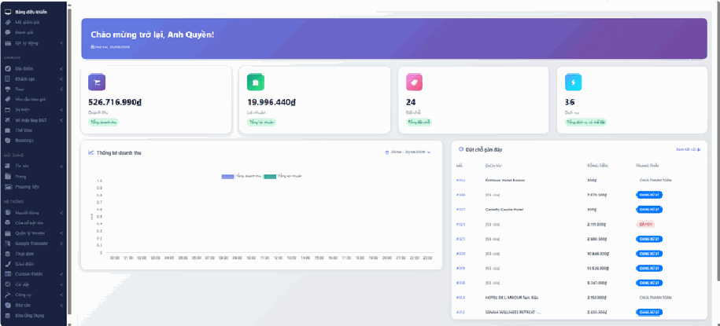
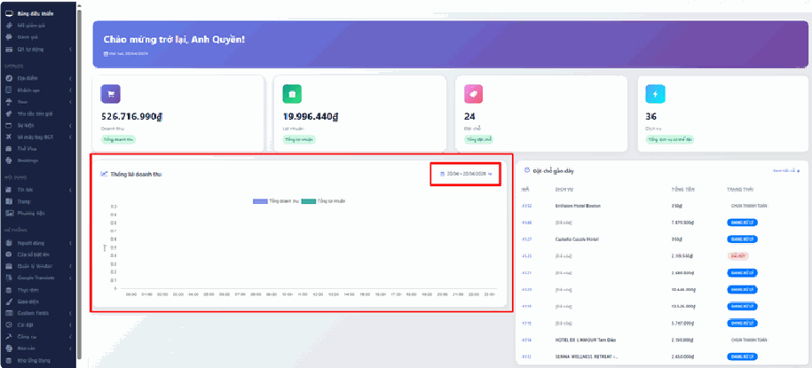
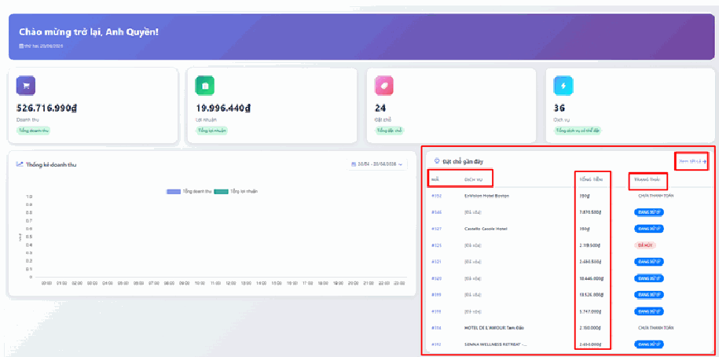

# 1. Bảng điều khiển

## a, Hệ thống chỉ số kinh doanh (Tổng quan)

Các thẻ trên cùng giúp bạn theo dõi nhanh hiệu suất hoạt động của hệ thống:

- Doanh thu: Tổng số tiền thu về từ các đơn hàng dịch vụ.

- Lợi nhuận: Số tiền thực thu sau khi đã trừ các chi phí liên quan.

- Đặt chỗ: Tổng số lượng đơn hàng (Booking) đã phát sinh trên hệ thống.

- Dịch vụ: Tổng số lượng sản phẩm/dịch vụ (Tour, Khách sạn, Vé máy bay...) hiện có thể phục vụ khách hàng.

## b, Thống kê biểu đồ

Khu vực này giúp bạn có cái nhìn trực quan về biến động tài chính theo thời gian:

- Biểu đồ doanh thu & lợi nhuận: So sánh trực quan giữa doanh thu (cột màu tím) và lợi nhuận (cột màu xanh) theo các mốc giờ trong ngày hoặc các ngày trong tháng.

- Bộ lọc thời gian: Bạn có thể tùy chỉnh khoảng thời gian ở góc phải biểu đồ để xem báo cáo theo ngày, tuần hoặc tháng cụ thể.

## c, Quản lý Đặt chỗ gần đây

Danh sách các đơn hàng mới nhất đổ về hệ thống, giúp bạn xử lý kịp thời:

- Mã & Dịch vụ: Theo dõi nhanh mã đơn hàng và tên dịch vụ khách hàng đã đặt (Ví dụ: EnVision Hotel Boston, Castello Casole Hotel).

- Tổng tiền: Giá trị thực tế của từng đơn hàng cụ thể.

- Trạng thái: Nắm bắt nhanh tiến độ của đơn hàng như Chưa thanh toán, Đang xử lý hoặc Đã hủy.

- Xem tất cả: Nhấn vào liên kết ở góc phải để chuyển nhanh sang trang Quản lý Booking chi tiết.

