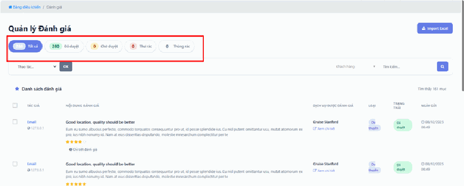
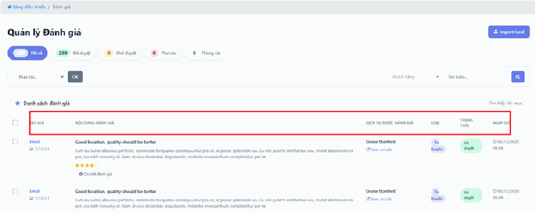
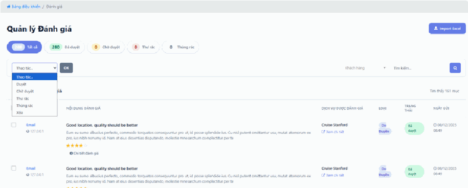
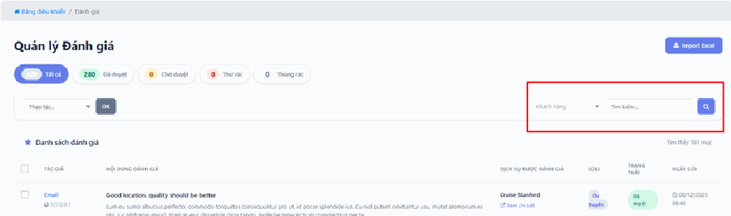
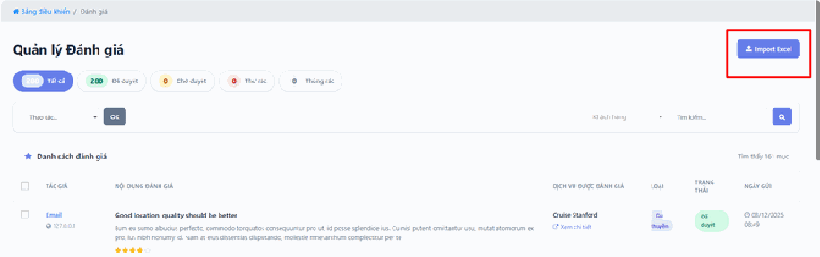

# 1.4. Đánh giá

Đánh giá là những nhận xét và số sao khách để lại sau khi dùng dịch vụ của bạn. Chúng hiển thị công khai trên trang tour, khách sạn, du thuyền… và là thứ **khách mới đọc kỹ nhất trước khi quyết định xuống tiền**.

Vì sao mục này quan trọng? Vì đánh giá không tự động lên website. Khách gửi xong, nhận xét nằm chờ ở đây cho tới khi bạn duyệt. Nếu bạn không vào duyệt, khách viết bài khen nức nở cũng chẳng ai nhìn thấy.

Đây cũng là nơi bạn chặn nội dung rác: quảng cáo bậy, nói xấu, spam link.

> **Đường dẫn:** Menu bên trái > **Đánh giá**

> **Không thấy mục "Đánh giá" trong menu?** Menu hiển thị theo phân quyền. Tài khoản của bạn chưa được cấp quyền quản lý đánh giá — hãy liên hệ quản trị viên của đơn vị bạn.

## a, Phân loại trạng thái đánh giá

Các thẻ ở **trên cùng** giúp bạn lọc và xử lý đánh giá theo tình trạng. Nhấn vào một thẻ là danh sách bên dưới lọc lại ngay:

- **Tất cả** — Toàn bộ đánh giá hiện có trên hệ thống. Trong ảnh minh họa là 280 đánh giá.

- **Đã duyệt** — Những đánh giá hợp lệ **đã được cho phép hiển thị công khai** trên website. Khách vào xem tour sẽ thấy đúng những nhận xét trong nhóm này.

- **Chờ duyệt** — Các đánh giá mới gửi, **cần bạn kiểm tra nội dung trước khi xuất bản**. Đây là nhóm cần bạn hành động. Khách hoàn toàn chưa nhìn thấy chúng.

- **Thư rác & Thùng rác** — Nơi lưu các đánh giá không hợp lệ hoặc đã bị xóa tạm thời. Dữ liệu vẫn còn ở đây, lấy lại được nếu bạn xóa nhầm.

> **Thói quen nên có:** mỗi vài ngày vào đây, nhấn thẳng vào thẻ **"Chờ duyệt"** và xử lý cho sạch. Đánh giá tốt nằm chờ cả tháng là bạn đang tự vứt đi công cụ bán hàng miễn phí — không có gì thuyết phục khách mới bằng lời khen của khách cũ.
>
> **Đừng nhầm "Thư rác" với "Thùng rác":** Thư rác là nội dung hệ thống hoặc bạn cho là quảng cáo/spam. Thùng rác là những gì bạn đã chủ động xóa. Cả hai đều **không hiện trên website**.

## b, Chi tiết danh sách đánh giá

Bảng **Danh sách đánh giá** liệt kê từng nhận xét trên một dòng, với đầy đủ thông tin để bạn quyết định duyệt hay không:

- **Tác giả** — Hiển thị **Email** và **địa chỉ IP** của người gửi.

  *IP là gì?* Là dãy số cho biết đường truyền internet mà người đó dùng, giống như "địa chỉ nhà" của máy tính họ trên mạng. Bạn không cần hiểu sâu, chỉ cần biết một mẹo: **nếu nhiều đánh giá khen ngợi lộ liễu cùng đến từ một IP giống hệt nhau, rất có thể đó là một người tạo nhiều tài khoản để tự khen mình hoặc dìm đối thủ.**

- **Nội dung đánh giá** — Gồm tiêu đề, nhận xét chi tiết và **số sao (1–5 sao)** khách chấm. Nếu nhận xét dài bị cắt bớt, nhấn **"Chi tiết đánh giá"** để đọc toàn văn. Hãy đọc kỹ trước khi duyệt.

- **Dịch vụ được đánh giá** — Tên dịch vụ cụ thể mà khách nhận xét (ví dụ: *Cruise Stanford*, *Thuyền A*), kèm nút **"Xem chi tiết"** dẫn thẳng sang trang dịch vụ đó.

- **Loại** — Phân loại dịch vụ (ví dụ: *Du thuyền*). Giúp bạn biết ngay nhận xét này thuộc mảng kinh doanh nào.

- **Trạng thái** — Cho biết mục đó đã được duyệt hay chưa.

- **Ngày gửi** — Thời gian chính xác khách gửi phản hồi.

> **Duyệt hay không duyệt — quyết định thế nào?**
>
> **Nên duyệt:** mọi nhận xét thật của khách thật, **kể cả nhận xét chê**. Một trang toàn 5 sao hoàn hảo trông rất giả và khách tinh ý sẽ nghi ngờ. Vài đánh giá 3–4 sao góp ý chân thành lại làm cả trang đáng tin hơn hẳn.
>
> **Không nên duyệt:** nội dung chửi bới, quảng cáo dịch vụ khác, chèn link lạ, số điện thoại rao vặt, hoặc nhận xét không liên quan gì đến dịch vụ.
>
> **Với đánh giá chê hợp lệ:** hãy duyệt rồi **xử lý ngoài đời** — gọi cho khách, xin lỗi, khắc phục. Xóa đánh giá chê không làm khách hết bực; họ sẽ đi viết trên Facebook, nơi bạn không xóa được.

## Các thao tác quản trị

### Duyệt / Xóa đánh giá

**Xử lý từng cái một:** Di chuột vào dòng đánh giá, các tùy chọn duyệt hoặc xóa sẽ hiện ra ngay trên dòng đó.

**Thao tác hàng loạt** (làm nhiều cái cùng lúc, thay vì sửa từng cái):

1. **Tích vào ô vuông** ở đầu mỗi đánh giá bạn muốn xử lý. Muốn chọn hết, tích ô vuông trên **dòng tiêu đề** của bảng.
2. Mở menu xổ xuống **"Thao tác..."** và chọn hành động cần làm.
3. Nhấn nút **"OK"**.

> **Lỗi kinh điển:** chọn xong hành động trong menu **"Thao tác..."** rồi bỏ đi luôn, tưởng đã xong. **Không có gì xảy ra cả** cho tới khi bạn nhấn **"OK"**. Nếu làm hàng loạt mà danh sách không thay đổi gì, gần như chắc chắn bạn quên bước 3.
>
> **Cẩn thận:** hành động hàng loạt tác động lên **tất cả các dòng đang được tích**, kể cả những dòng bạn tích từ trước rồi quên. Trước khi nhấn OK, hãy lướt mắt kiểm tra lại.

### Tìm kiếm

Dùng ô tìm kiếm và bộ lọc theo khách hàng để định vị nhanh các phản hồi cụ thể. Rất hữu ích khi có khách gọi điện phàn nàn và bạn cần xem lại chính xác họ đã viết gì.

> **Mẹo:** khi một tour bị nhiều khách chê cùng một điểm (ví dụ: xe đón muộn), hãy dùng ô tìm kiếm để lọc ra hết các nhận xét về tour đó và đọc liền một mạch. Bạn sẽ nhìn ra vấn đề gốc rất nhanh — đây là cách dùng mục Đánh giá như một công cụ cải thiện dịch vụ, không chỉ để duyệt bài.

### Import Excel

Hệ thống hỗ trợ nút **"Import Excel"** ở **góc phải** để bạn đưa hàng loạt đánh giá có sẵn vào hệ thống một cách nhanh chóng.

Tính năng này dùng khi bạn **chuyển từ website cũ sang** và đã có sẵn hàng trăm đánh giá lưu trong file Excel. Thay vì gõ tay từng cái, bạn đưa cả file vào một lần.

> **Cẩn thận:** file Excel phải đúng định dạng hệ thống yêu cầu, nếu không sẽ báo lỗi hoặc dữ liệu vào sai cột. Nếu bạn chưa từng làm việc này, hãy **thử với 2–3 dòng trước** để xem kết quả có đúng không, rồi mới đưa cả file lớn vào. Nếu vẫn không được, hãy liên hệ đơn vị triển khai để xin file mẫu.

## Lưu ý & xử lý sự cố

**Đã bấm duyệt nhưng đánh giá vẫn không hiện trên website.** Nhấn **Ctrl + F5** ở trang tour để tải lại hoàn toàn — trình duyệt hay giữ bản cũ. Nếu vẫn chưa thấy, hãy kiểm tra lại trạng thái của đánh giá đó có thật sự chuyển sang **"Đã duyệt"** chưa.

**Khách báo đã gửi đánh giá nhưng bạn không tìm thấy.** Kiểm tra thẻ **"Thư rác"** — hệ thống có thể đã tự lọc nhầm, nhất là khi nhận xét có chứa link hoặc số điện thoại. Nếu thấy ở đó và nội dung hợp lệ, bạn chuyển nó về trạng thái đã duyệt.

**Xóa nhầm một đánh giá tốt.** Đừng hoảng. Vào thẻ **"Thùng rác"**, đánh giá vẫn nằm ở đó và khôi phục lại được.

**Số lượng đánh giá trên thẻ không khớp với số dòng bạn đếm được.** Danh sách chia thành nhiều trang, bạn chỉ đang nhìn trang đầu. Cuộn xuống cuối bảng để tìm các nút chuyển trang.

**Đánh giá tiếng Việt hiển thị lỗi font (chữ vuông, dấu hỏi).** Thường xảy ra khi dữ liệu được đưa vào qua Import Excel với bảng mã sai. Hãy liên hệ đơn vị triển khai.

**Nhiều đánh giá 1 sao đến dồn dập trong thời gian ngắn, cùng một IP.** Đây có thể là hành vi phá hoại chứ không phải khách thật. Đừng vội duyệt. Hãy xem cột **Tác giả** — nếu email trông ngẫu nhiên và IP trùng nhau, hãy chuyển chúng vào Thư rác và báo đơn vị triển khai.

**Không thấy nút Import Excel.** Nút này có thể bị ẩn theo phân quyền tài khoản. Hãy liên hệ quản trị viên.

## Xem thêm

- [1. Bảng điều khiển](README.md) — màn hình tổng quan của hệ thống.
- [1.1. Mã giảm giá](ma-giam-gia.md) — một cách để cảm ơn những khách đã để lại đánh giá tốt.
