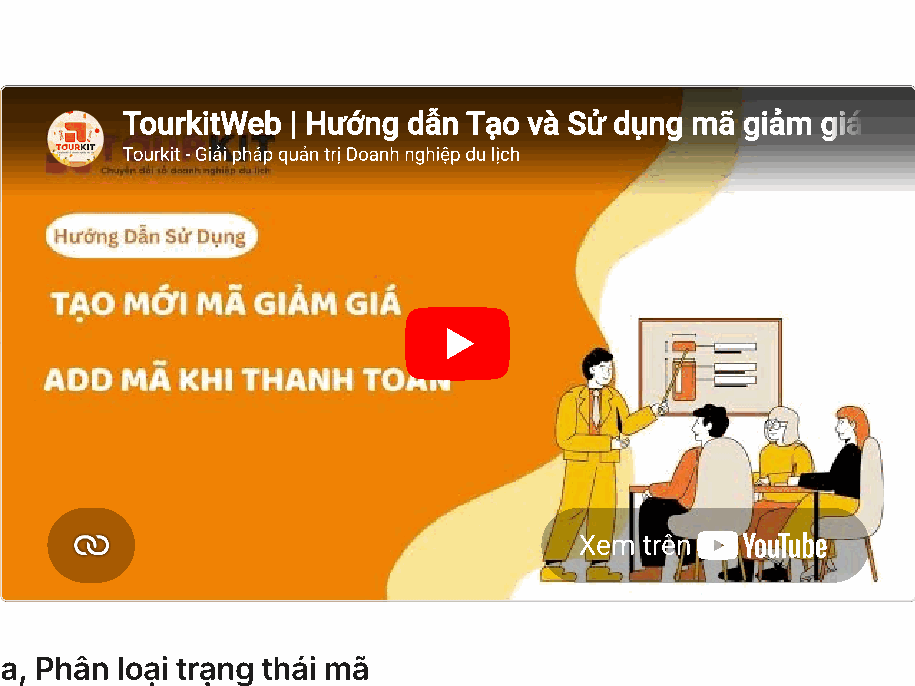
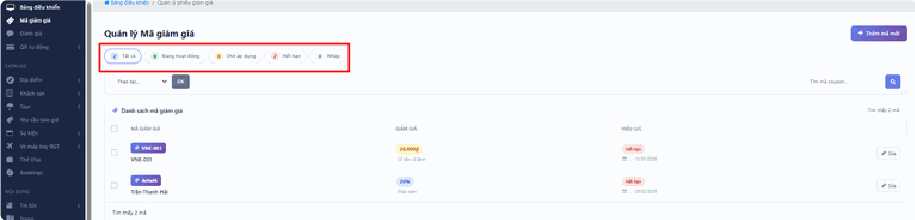
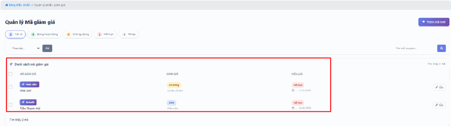
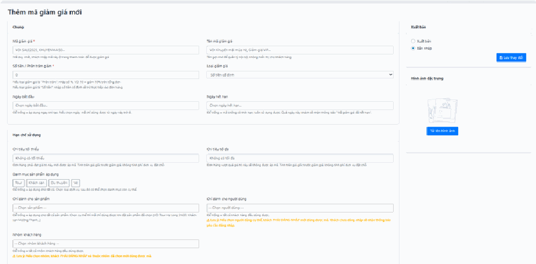
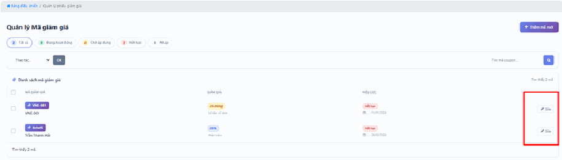
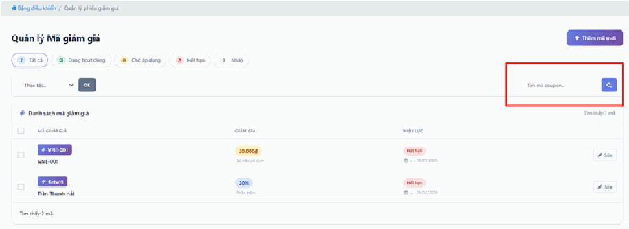

# 1.1. Mã giảm giá

Mã giảm giá là một dãy chữ và số (ví dụ `SALE2025`) mà bạn phát cho khách. Khi đặt dịch vụ, khách gõ mã đó vào ô khuyến mãi lúc thanh toán và được trừ tiền ngay.

Bạn dùng mục này khi muốn **chạy một chương trình khuyến mãi**: giảm giá dịp lễ, tri ân khách cũ, tặng ưu đãi riêng cho một nhóm khách, hoặc đẩy hàng cho một tour đang ế.

Cái hay của mã giảm giá là bạn **kiểm soát được hoàn toàn**: giảm bao nhiêu, áp dụng cho dịch vụ nào, ai được dùng, dùng bao nhiêu lần, từ ngày nào đến ngày nào. Hệ thống tự kiểm tra tất cả những điều kiện đó, bạn không phải nhớ và không phải tính tay.

> **Đường dẫn:** Menu bên trái > **Mã giảm giá**

*📺 Video hướng dẫn: TourkitWeb | Hướng dẫn Tạo và Sử dụng mã giảm giá*

> **Không thấy mục "Mã giảm giá" trong menu?** Menu hiển thị theo phân quyền. Tài khoản của bạn chưa được cấp quyền xem mã giảm giá — hãy liên hệ quản trị viên của đơn vị bạn.

## a, Phân loại trạng thái mã

Khi chạy khuyến mãi lâu năm, bạn sẽ có hàng chục mã cũ mới lẫn lộn. Hệ thống tự chia chúng thành các nhóm để bạn khỏi phải dò từng dòng. Các nhóm này nằm ở **hàng trên cùng** của danh sách, nhấn vào tên nhóm là danh sách bên dưới lọc lại ngay:

- **Tất cả** — Toàn bộ mã bạn đã từng tạo, kể cả mã đã hết hạn từ lâu.

- **Đang hoạt động** — Các mã **đang có hiệu lực ngay lúc này**: còn trong khoảng ngày cho phép và khách gõ vào là được giảm. Đây là nhóm bạn cần để mắt nhất.

- **Chờ áp dụng** — Mã đã tạo xong nhưng **chưa tới ngày bắt đầu**. Ví dụ hôm nay là 10/06 mà bạn đặt mã chạy từ 01/07 thì mã nằm ở nhóm này. Khách gõ vào lúc này sẽ báo lỗi — đó là đúng, không phải hỏng.

- **Hết hạn** — Mã đã qua ngày kết thúc (ví dụ hết hạn vào 13/01/2026 hoặc 26/02/2026). Mã vẫn được lưu để bạn tra cứu lịch sử, nhưng khách không dùng được nữa.

- **Nháp** — Mã bạn đang soạn dở, **chưa công bố**. Khách hoàn toàn không dùng được mã ở trạng thái này dù có biết dãy ký tự.

> **Cẩn thận — lỗi phổ biến nhất:** bạn tạo mã, in lên tờ rơi, phát cho khách… rồi khách gọi điện báo "mã không dùng được". Nguyên nhân gần như luôn là **mã đang ở trạng thái Nháp**, hoặc **chưa đến Ngày bắt đầu**. Trước khi công bố mã ra ngoài, hãy kiểm tra nó có nằm trong nhóm **"Đang hoạt động"** hay không.

## b, Chi tiết danh sách mã

Bảng **Danh sách mã giảm giá** liệt kê từng mã trên một dòng. Các cột chính:

- **Mã giảm giá** — Chính là dãy ký tự khách phải gõ khi thanh toán (ví dụ: `VNE-001`, `4etwl6`). Đây là thứ bạn gửi cho khách.

- **Giảm giá** — Cho biết mã này ưu đãi thế nào. Có hai kiểu:
  - **Số tiền cố định** — trừ thẳng một khoản, ví dụ `20.000đ`. Đơn nào cũng trừ đúng 20.000đ.
  - **Phần trăm** — trừ theo tỷ lệ, ví dụ `20%`. Đơn càng lớn thì khách được giảm càng nhiều.

- **Hiệu lực** — Khoảng thời gian mã sống được: từ ngày nào đến ngày nào.

> **Nên chọn kiểu nào?** Với tour giá trị lớn, hãy cân nhắc kỹ trước khi dùng phần trăm — giảm 20% cho một tour 50 triệu là mất 10 triệu. Nếu vẫn muốn dùng phần trăm, hãy đặt thêm **"Giảm tối đa"** (xem phần dưới) để chặn trần.

## c, Thao tác quản trị

### Thêm mã mới

Nhấn nút **"+ Thêm mã mới"** ở **góc trên bên phải** màn hình. Một trang nhập thông tin sẽ mở ra.

Đừng hoảng khi thấy nhiều ô. Bạn **chỉ bắt buộc điền 2 ô** (những ô có dấu sao đỏ `*`), phần còn lại để trống là được — hệ thống hiểu "không giới hạn".

**Nhóm 1 — Thông tin bắt buộc:**

- **Mã giảm giá** `*` — Dãy ký tự khách sẽ gõ. Gợi ý trong ô ghi sẵn: *VD: SALE2025, KHUYENMAI50...*
  - Hãy dùng **chữ IN HOA và số, không dấu, không khoảng trắng**. Mã `GIAM HE` có dấu cách ở giữa rất dễ khiến khách gõ sai.
  - Đặt mã dễ nhớ, dễ đọc qua điện thoại. `SALE2025` tốt hơn nhiều so với `x7k29a`.
- **Số tiền / Phần trăm giảm** `*` — Con số giảm. Nếu chọn kiểu phần trăm thì gõ `20` nghĩa là 20%. Nếu chọn kiểu số tiền cố định thì gõ `20000` nghĩa là 20.000đ.

**Nhóm 2 — Kiểu giảm giá:**

- **Loại giảm giá** — Chọn một trong hai: **"Số tiền cố định"** hoặc **"Phần trăm (%)"**.
- **Giảm tối đa** — Chỉ có tác dụng khi bạn chọn kiểu phần trăm. Đây là **mức trần**: dù tính ra bao nhiêu cũng không giảm quá số này. Ví dụ đặt giảm 20% nhưng Giảm tối đa là 500.000đ, thì đơn 10 triệu chỉ được giảm 500.000đ chứ không phải 2 triệu. Để trống nghĩa là **"Không giới hạn"** — hãy cân nhắc rất kỹ.

**Nhóm 3 — Thời gian:**

- **Ngày bắt đầu** — Từ ngày này mã mới dùng được. Nhấn vào ô sẽ hiện lịch để bạn chọn, **đừng gõ tay** vì dễ sai định dạng.
- **Ngày hết hạn** — Sau ngày này mã tự động ngừng, bạn không cần làm gì cả.

- **Tên mã giảm giá** — Tên gợi nhớ cho **riêng bạn xem** trong trang quản trị, khách không nhìn thấy. Gợi ý trong ô: *VD: Khuyến mãi mùa hè, Giảm giá VIP...*. Nên điền, vì sau này nhìn danh sách 30 mã bạn sẽ không nhớ nổi `4etwl6` là chương trình gì.

**Nhóm 4 — Điều kiện đơn hàng:**

- **Chi tiêu tối thiểu** — Đơn phải từ số tiền này trở lên mới được dùng mã. Đây là công cụ để **đẩy giá trị đơn hàng lên**: đặt tối thiểu 2 triệu thì khách định mua 1,8 triệu sẽ có xu hướng mua thêm cho đủ. Để trống nghĩa là **"Không có tối thiểu"**.
- **Chi tiêu tối đa** — Đơn vượt quá số này thì không dùng được mã. Ít khi cần. Để trống nghĩa là **"Không có tối đa"**.

**Nhóm 5 — Phạm vi áp dụng (mã dùng được cho cái gì, cho ai):**

- **Danh mục sản phẩm áp dụng** — Chọn loại dịch vụ được giảm (tour, khách sạn, du thuyền…). Nhấn vào tên loại để bật/tắt. Trong mỗi loại còn có phần **"Danh mục con"** để bạn chọn hẹp hơn nữa.
- **Chỉ dành cho sản phẩm** — Chọn đích danh từng dịch vụ cụ thể. Dùng khi bạn chỉ muốn giảm giá cho một tour đang ế. Ô này có dòng chữ mờ *-- Chọn sản phẩm --*.
- **Chỉ dành cho người dùng** — Chọn đích danh từng khách hàng. Dùng khi bạn muốn tặng riêng một khách VIP. Ô này có dòng chữ mờ *-- Chọn người dùng --*.
- **Nhóm khách hàng** — Áp dụng cho cả một nhóm khách. Ô này có dòng chữ mờ *-- Chọn nhóm khách hàng --*.

> **Quan trọng:** để trống các ô ở nhóm này nghĩa là **áp dụng cho tất cả** — mọi dịch vụ, mọi khách. Đây là lựa chọn rộng nhất và cũng tốn kém nhất. Chỉ để trống khi bạn thật sự muốn giảm giá toàn bộ website.

**Nhóm 6 — Giới hạn số lần dùng (phần bảo vệ túi tiền của bạn):**

- **Tổng lượt sử dụng của mã** — Cả chương trình chỉ được dùng bao nhiêu lần. Ví dụ điền `100` thì đến khách thứ 101 sẽ báo mã đã hết lượt. Để trống nghĩa là **"Không giới hạn"**.
- **Số lần dùng cho mỗi khách** — Một khách được dùng mã này mấy lần. Điền `1` nghĩa là mỗi khách chỉ được hưởng đúng một lần.

> **Cẩn thận:** nếu bạn để trống cả hai ô này và mã bị đăng lên một hội nhóm săn khuyến mãi, hàng nghìn người có thể dùng nó cùng lúc và bạn không có cách nào chặn kịp ngoài việc chạy vào xóa mã. **Hãy luôn điền "Tổng lượt sử dụng của mã"** cho các mã công khai.

Điền xong, kéo xuống cuối trang và nhấn nút **"Lưu"**.

> **Lưu ý sống còn:** lưu xong chưa chắc mã đã chạy. Mã phải ở trạng thái công bố (không phải **Nháp**) và phải nằm trong khoảng ngày hiệu lực. Sau khi lưu, hãy quay lại danh sách, nhấn nhóm **"Đang hoạt động"** và xác nhận mã mới của bạn có ở đó.

### Chỉnh sửa mã đã có

Nhấn nút **"Sửa"** tại dòng của mã cần thay đổi. Trang nhập thông tin mở ra y hệt lúc tạo mới, và bạn sửa được mọi thứ: đổi mức giảm, gia hạn thêm ngày, hoặc thu hẹp phạm vi áp dụng.

> **Mẹo tiết kiệm công:** khuyến mãi sắp hết hạn mà bạn muốn kéo dài? **Đừng tạo mã mới** — chỉ cần Sửa mã cũ và đẩy **Ngày hết hạn** ra xa. Cách này giữ nguyên dãy mã khách đã biết, tờ rơi đã in vẫn dùng được.
>
> **Cẩn thận:** sửa mã **không hủy các đơn đã dùng mã trước đó**. Nếu khách đã đặt và được giảm 20%, bạn sửa xuống 10% thì đơn cũ vẫn giữ mức 20%. Điều này là đúng và công bằng — đừng thắc mắc khi thấy con số cũ trong đơn hàng cũ.

### Tìm kiếm mã

Khi danh sách dài, dùng ô **"Tìm mã coupon..."** ở **góc trên bên phải**. Gõ dãy mã hoặc tên chương trình vào rồi nhấn Enter.

> **Tìm mãi không ra dù chắc chắn mã tồn tại?** Hai lý do hay gặp:
> 1. Bạn đang đứng trong một nhóm lọc hẹp (ví dụ đang xem tab **"Đang hoạt động"** trong khi mã đó đã hết hạn). Hãy nhấn về **"Tất cả"** rồi tìm lại.
> 2. Bạn copy mã từ Zalo/email dán vào và bị **dính dấu cách thừa** ở đầu hoặc cuối. Hãy xóa sạch ô rồi gõ tay lại.

### Hành động hàng loạt

Khi cần xử lý nhiều mã cùng lúc (ví dụ dọn dẹp 20 mã cũ hết hạn), bạn không cần mở từng cái:

1. **Tích vào ô vuông** ở đầu mỗi dòng bạn muốn xử lý. Muốn chọn tất cả, tích ô vuông trên **dòng tiêu đề** của bảng.
2. Mở menu xổ xuống **"Thao tác..."** và chọn việc cần làm (xóa, đổi trạng thái…).
3. Nhấn nút xác nhận bên cạnh.

> **Lỗi kinh điển:** chọn xong hành động trong menu rồi bỏ đi luôn, tưởng là xong. **Không có gì xảy ra cả** cho tới khi bạn nhấn nút xác nhận. Nếu làm hàng loạt mà danh sách không đổi gì, gần như chắc chắn bạn quên bước 3.
>
> **Cẩn thận:** hành động xóa hàng loạt tác động lên **tất cả các dòng đang được tích**, kể cả những dòng bạn đã tích từ trước rồi quên mất. Trước khi nhấn xác nhận, hãy lướt mắt kiểm tra lại xem có đúng những dòng bạn định xử lý không.

## Lưu ý & xử lý sự cố

**Khách báo "mã không hợp lệ" nhưng bạn thấy mã vẫn còn hạn.** Hãy kiểm tra lần lượt các điều kiện — chỉ cần trượt một cái là mã bị từ chối:
- Đơn của khách có đạt **Chi tiêu tối thiểu** không?
- Dịch vụ khách đặt có nằm trong **Danh mục sản phẩm áp dụng** không?
- Mã có bị giới hạn **Chỉ dành cho người dùng** / **Nhóm khách hàng** khác không?
- **Tổng lượt sử dụng của mã** đã hết chưa?
- Khách này đã dùng mã quá **Số lần dùng cho mỗi khách** chưa?

**Khách gõ mã bị báo sai dù gõ đúng.** Nhắc khách gõ tay thay vì copy-paste — dán từ tin nhắn thường kéo theo dấu cách ẩn. Ngoài ra nếu khách đang bật **Unikey**, gõ mã có thể bị biến thành chữ có dấu (`SALE` thành `SALÉ`). Bảo khách chuyển bộ gõ về chế độ **E** (tiếng Anh).

**Tạo mã xong nhưng không thấy trong danh sách.** Kiểm tra xem bạn có đang đứng ở tab lọc nào không. Nhấn về **"Tất cả"**. Nếu vẫn không thấy, có thể lúc lưu bị lỗi mà bạn không để ý — hãy tạo lại và lần này chú ý dòng thông báo hiện ra sau khi nhấn Lưu.

**Đặt giảm 20% mà khách được giảm ít hơn.** Bạn đã đặt **"Giảm tối đa"**. Đây là hệ thống làm đúng theo cấu hình của bạn, không phải lỗi.

**Sửa mã xong nhưng trên website vẫn hiện giá cũ.** Nhấn **Ctrl + F5** để tải lại trang hoàn toàn. Nếu vẫn vậy, hãy thử mở website bằng cửa sổ ẩn danh của trình duyệt để xem đúng những gì khách đang thấy.

**Muốn dừng khẩn cấp một mã đang bị lạm dụng.** Cách nhanh nhất: vào **Sửa** mã đó, đổi **Ngày hết hạn** thành ngày hôm qua rồi Lưu. Mã lập tức ngừng hoạt động mà bạn vẫn giữ được toàn bộ lịch sử để đối soát sau này.

## Xem thêm

- [1. Bảng điều khiển](README.md) — theo dõi doanh thu để đo hiệu quả chương trình khuyến mãi.
- [1.2. Quản lý đại lý](quan-ly-dai-ly.md) — nếu bạn muốn ưu đãi cho đối tác, hãy dùng chiết khấu theo hạng đại lý thay vì mã giảm giá.
