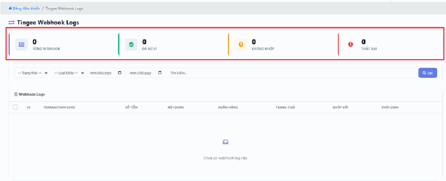
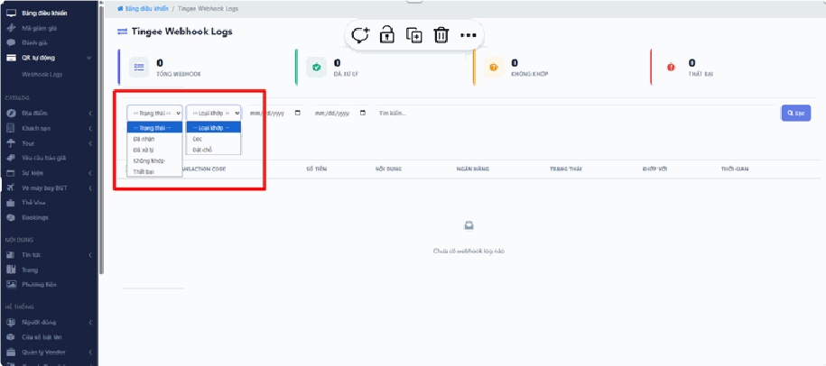
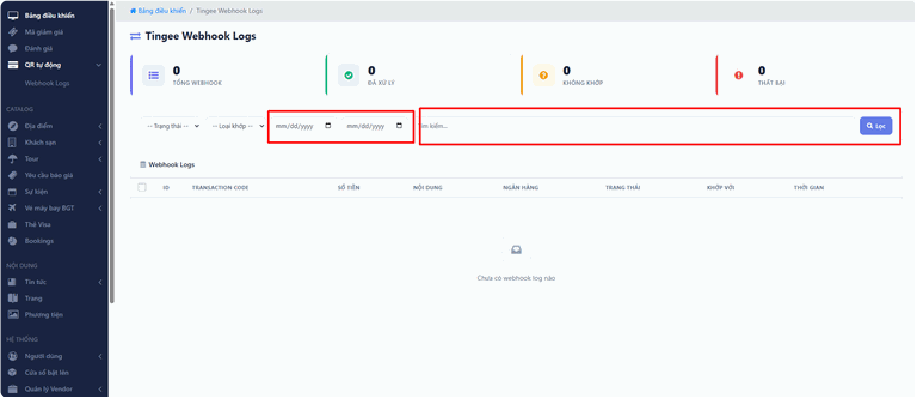
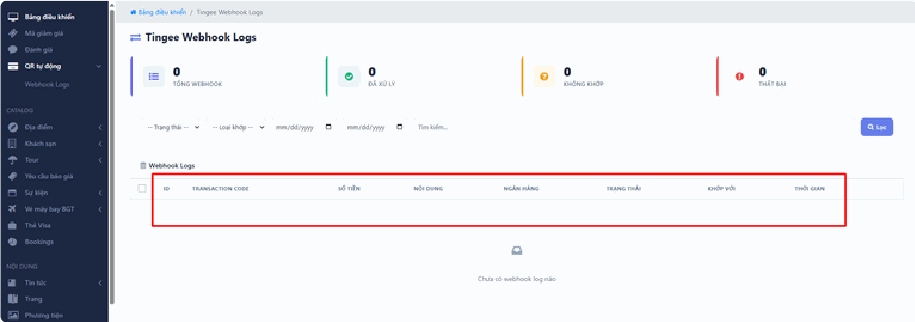

# 1.5. QR tự động

Bình thường, khi khách chuyển khoản thanh toán, bạn phải tự mở app ngân hàng kiểm tra xem tiền về chưa, rồi vào hệ thống bấm xác nhận đơn hàng. Mỗi ngày vài chục đơn là mất rất nhiều thời gian, lại dễ sót.

**QR tự động** giải quyết việc đó. Khách quét mã QR chuyển tiền, ngân hàng báo về hệ thống, hệ thống tự dò xem tiền này khớp với đơn hàng nào và **tự động xác nhận** — bạn không phải làm gì cả.

Màn hình này là **nhật ký** ghi lại toàn bộ quá trình đó. Bạn dùng nó khi cần trả lời một câu hỏi: *"Khách bảo đã chuyển tiền rồi, mà sao đơn vẫn chưa xác nhận?"*

> **Lưu ý:** Tính năng này có thể chưa được bật trên website của bạn. Nếu không thấy mục này trong menu, hãy liên hệ đơn vị triển khai. Menu cũng hiển thị theo phân quyền — nếu đồng nghiệp thấy mà bạn không thấy, tài khoản của bạn chưa được cấp quyền.

> **Một từ bạn sẽ gặp nhiều: "Webhook".** Đừng sợ chữ này. Webhook đơn giản là **tin nhắn tự động ngân hàng gửi sang hệ thống của bạn** mỗi khi có tiền về. Giống như ngân hàng nhắn tin báo biến động số dư cho điện thoại bạn, chỉ khác là nhắn thẳng cho website. Bạn không cần hiểu gì thêm.

## a, Chỉ số theo dõi giao dịch

Các thẻ màu **phía trên** cho biết tình trạng đồng bộ dữ liệu giữa ngân hàng và website:

- **Tổng Webhook** — Tổng số lượt dữ liệu thanh toán ngân hàng đã gửi về hệ thống. Mỗi lần có tiền vào tài khoản là một lượt.

- **Đã xử lý** — Các giao dịch được ghi nhận và **khớp lệnh thành công**. Đây là nhóm đẹp nhất: hệ thống đã tự động tìm ra đúng đơn hàng tương ứng và xác nhận xong. Bạn không cần đụng vào.

- **Không khớp** — Ngân hàng có báo tiền về, **nhưng hệ thống không tìm được đơn hàng nào tương ứng**. Nguyên nhân gần như luôn là **nội dung chuyển khoản sai** — khách gõ tay thay vì quét QR, hoặc gõ nhầm mã đơn. Đây là nhóm **cần bạn xử lý thủ công**: tiền đã về túi bạn thật nhưng đơn của khách vẫn treo.

- **Thất bại** — Các yêu cầu **gặp lỗi trong quá trình truyền tải dữ liệu**. Khác với "Không khớp" ở chỗ: đây là trục trặc kỹ thuật đường truyền, không phải lỗi nội dung chuyển khoản.

> **Đọc bốn số này thế nào?** Chỉ cần nhớ: **"Đã xử lý" là tin vui, "Không khớp" là việc cần làm, "Thất bại" là chuyện cần báo kỹ thuật.**
>
> **Cẩn thận:** nếu con số **"Không khớp"** cứ tăng đều mỗi ngày, nghĩa là đang có tiền khách chuyển vào mà đơn hàng của họ không được xác nhận. Khách sẽ gọi điện phàn nàn. Hãy kiểm tra mục này mỗi ngày.
>
> **Nếu "Thất bại" tăng bất thường:** đây là dấu hiệu kết nối giữa ngân hàng và website đang có trục trặc. Bạn không tự sửa được — hãy **liên hệ ngay đơn vị triển khai**, và trong lúc chờ, hãy tạm quay về cách kiểm tra thủ công bằng app ngân hàng để không bỏ sót đơn nào.

## b, Bộ lọc và Tìm kiếm

Khi cần kiểm tra một giao dịch cụ thể (thường là lúc khách đang gọi điện chờ máy), dùng các công cụ lọc phía dưới:

- **Trạng thái** (đã nhận, đã xử lý, không khớp, thất bại) và **Loại khớp** (đã cọc, đặt chỗ) — Lọc theo kết quả thành công, thất bại hoặc không khớp.

  *"Đã cọc" và "Đặt chỗ" khác gì nhau?* **Đã cọc** là khách chỉ trả trước một phần để giữ chỗ. **Đặt chỗ** là thanh toán cho đơn hàng. Phân biệt được hai loại giúp bạn biết đơn nào còn phải thu thêm tiền.

- **Khoảng thời gian** — Chọn ngày bắt đầu và ngày kết thúc để xem lịch sử giao dịch trong một thời điểm nhất định. Dùng khi khách nói "em chuyển hôm thứ Ba tuần trước".

- **Tìm kiếm** — Nhập mã giao dịch hoặc thông tin liên quan để định vị nhanh.

> **Cách tra nhanh nhất khi khách đang gọi:** hỏi khách **số tiền** và **ngày chuyển**, rồi đặt Khoảng thời gian đúng ngày đó và nhìn cột Số tiền. Cách này nhanh hơn hỏi mã giao dịch, vì khách thường không biết mã giao dịch nằm ở đâu.

## c, Chi tiết Webhook Logs

*"Log" nghĩa là nhật ký.* Bảng này ghi lại đầy đủ thông tin của từng lần thanh toán, giống một cuốn sổ ghi chép tự động không bao giờ quên.

Mỗi dòng gồm:

- **Transaction Code** (Mã giao dịch) — Mã duy nhất do **phía ngân hàng** cấp cho lệnh chuyển tiền đó. Đây là bằng chứng chắc chắn nhất khi cần đối chiếu với ngân hàng.

- **Số tiền & Nội dung** — Số tiền khách đã chuyển và **nội dung chuyển khoản thực tế** họ đã ghi. Cột "Nội dung" cực kỳ quan trọng khi xử lý các giao dịch **"Không khớp"** — nhìn vào đây bạn sẽ hiểu ngay vì sao hệ thống không nhận ra: khách gõ thiếu mã, gõ sai một ký tự, hay ghi linh tinh kiểu "chuyen tien tour".

- **Ngân hàng** — Tên ngân hàng thực hiện giao dịch.

- **Trạng thái & Khớp với** — Kết quả xử lý, và **mã đơn hàng trên website** mà giao dịch này đã được áp vào. Nếu cột "Khớp với" trống trong khi tiền đã về, đó chính là một giao dịch không khớp cần bạn xử lý tay.

- **Thời gian** — Ngày giờ chính xác hệ thống nhận được dữ liệu.

> **Xử lý một giao dịch "Không khớp" thế nào?** Các bước:
> 1. Nhìn cột **Nội dung** và **Số tiền** để đoán xem tiền này của đơn nào.
> 2. Sang trang Quản lý Booking, tìm đơn có số tiền trùng khớp và đang **"Chưa thanh toán"**.
> 3. Gọi cho khách xác nhận đúng là họ đã chuyển.
> 4. Xác nhận thanh toán cho đơn đó bằng tay.
>
> Đừng bỏ qua bước 3. Hai đơn khác nhau hoàn toàn có thể trùng số tiền, và xác nhận nhầm đơn thì bạn giao dịch vụ cho người chưa trả tiền.

## Lưu ý & xử lý sự cố

**Khách khăng khăng đã chuyển tiền nhưng không có dòng nào trong bảng này.** Kiểm tra theo thứ tự:
- **Đợi thêm vài phút.** Chuyển khoản liên ngân hàng đôi khi chậm, nhất là ngoài giờ hành chính hoặc cuối tuần.
- **Khách có chuyển đúng tài khoản của bạn không?** Nếu họ chuyển vào một tài khoản khác không được kết nối với hệ thống, sẽ không có dòng nào hiện ra ở đây. Hãy mở app ngân hàng kiểm tra thủ công.
- **Yêu cầu khách gửi ảnh biên lai có mã giao dịch**, rồi bạn tự kiểm tra lại trong app ngân hàng. Đừng xác nhận đơn chỉ dựa vào ảnh chụp màn hình — thứ đó rất dễ làm giả.

**Tiền về đúng nhưng đơn hàng vẫn "Chưa thanh toán".** Vào đây lọc trạng thái **"Không khớp"** và tìm giao dịch đó. Gần như chắc chắn khách đã **gõ tay nội dung chuyển khoản thay vì quét mã QR**, nên hệ thống không nhận ra đơn nào. Bạn xử lý tay theo hướng dẫn ở trên.

**Làm sao để giảm số giao dịch "Không khớp"?** Nhắc khách **quét mã QR** thay vì tự nhập thông tin chuyển khoản. Mã QR đã điền sẵn đúng số tiền và đúng nội dung, khách không thể gõ sai. Đây là lý do tính năng này tên là "QR tự động". Mỗi lần khách gõ tay là một lần rủi ro.

**Khách chuyển thừa hoặc thiếu tiền so với đơn hàng.** Hệ thống thường không khớp được vì số tiền lệch. Giao dịch sẽ rơi vào nhóm **"Không khớp"** và bạn phải xử lý tay: liên hệ khách để thu thêm phần thiếu, hoặc hoàn lại phần thừa.

**Thấy một giao dịch lạ không thuộc đơn hàng nào.** Có thể ai đó chuyển nhầm vào tài khoản công ty bạn. Đừng vội xử lý — hãy ghi lại **Transaction Code** và báo kế toán.

**Cột "Trạng thái" toàn là "Thất bại".** Đây là sự cố kỹ thuật đường truyền, bạn không tự khắc phục được. **Liên hệ ngay đơn vị triển khai.** Trong thời gian chờ, hãy chuyển sang kiểm tra và xác nhận đơn hàng thủ công qua app ngân hàng để khách không bị treo.

**Bảng trống trơn không có dòng nào.** Nếu website mới bật tính năng này hoặc chưa có khách nào thanh toán bằng QR thì đây là chuyện bình thường. Cũng nên kiểm tra xem bạn có đang đặt **Khoảng thời gian** ở một khoảng không có giao dịch nào không — hãy nới rộng khoảng ngày ra rồi xem lại.

## Xem thêm

- [1. Bảng điều khiển](README.md) — xem nhanh các đơn hàng gần đây và trạng thái thanh toán của chúng.
- [1.2. Quản lý đại lý](quan-ly-dai-ly.md) — với tiền đại lý nạp vào ví, quy trình xác nhận nằm ở mục Lịch sử nạp tiền chứ không phải ở đây.
