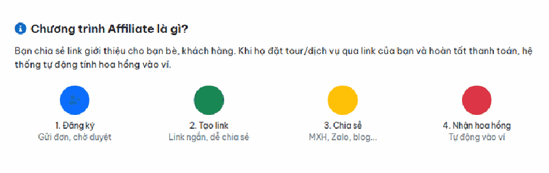
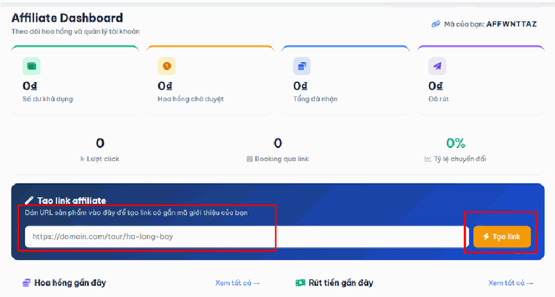
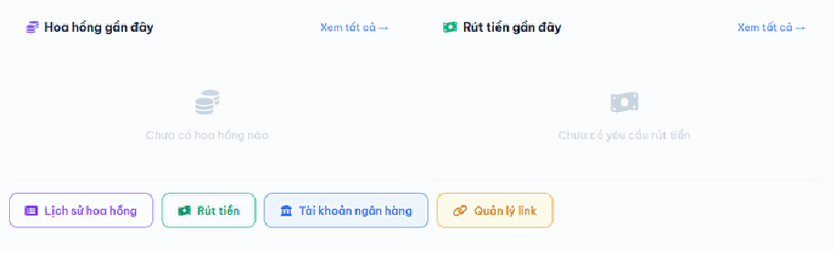
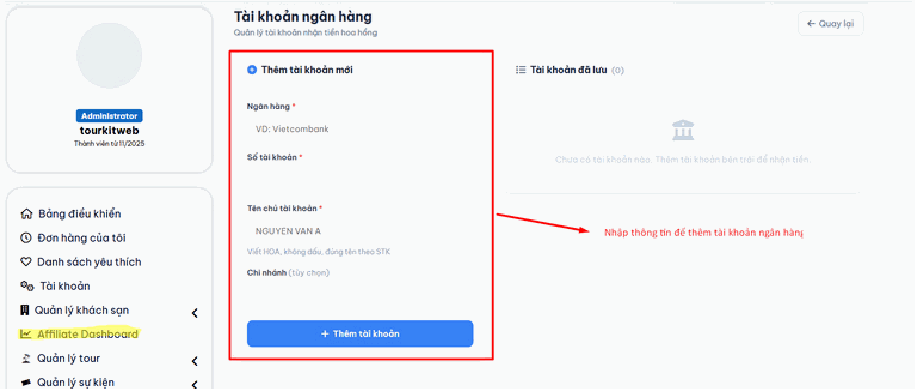
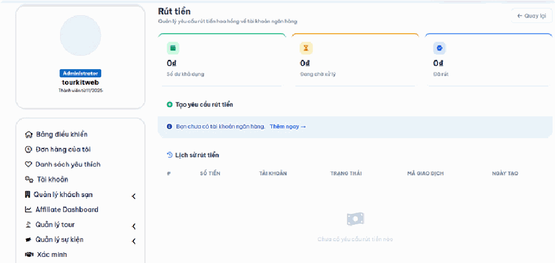
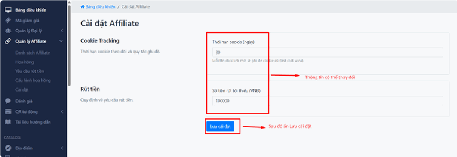
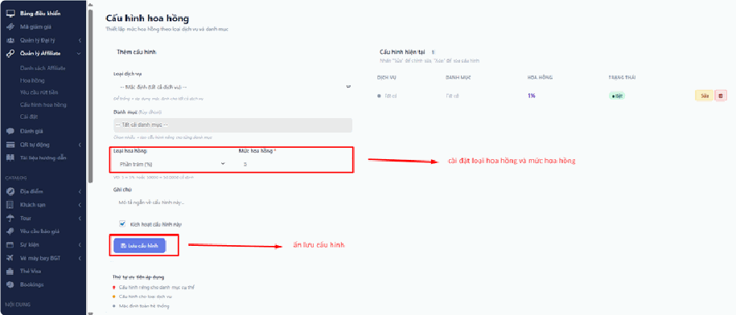

# 1.3. Quản lý Affiliate

## Hướng dẫn sử dụng chương trình Affiliate cho CTV

## a. Đăng ký tham gia

1. Đăng nhập tài khoản người dùng. 2. Vào Tài khoản → Affiliate. 3. Điền lý do tham gia (tùy chọn) → Click Đăng ký ngay. 4. Chờ admin duyệt. Sau khi được duyệt, bạn nhận mã giới thiệu riêng (ví dụ: ). affABCD12

## b. Tạo link giới thiệu

Vào Dashboard → Quản lý link:

1. Dán URL trang tour/khách sạn muốn quảng bá. 2. Click Tạo link → nhận link ngắn dạng /go/abc1234 . 3. Chia sẻ link này lên mạng xã hội, Zalo, blog...

## c. Theo dõi hoa hồng

- Khi khách click link, hệ thống ghi nhận trong 30 ngày.

- Nếu khách đặt và hoàn tất thanh toán trong thời gian đó → hoa hồng được tạo tự động.

- Xem toàn bộ hoa hồng tại Dashboard → Hoa hồng.

Booking chưa thanh toán chưa tính hoa hồng. Bạn không nhận hoa hồng khi tự đặt cho chính mình.

## d. Rút tiền

1. Vào Dashboard → Tài khoản ngân hàng → Thêm tài khoản nhận tiền.

2. Vào Dashboard → Rút tiền → Nhập số tiền (tối thiểu 100.000₫).

3. Gửi yêu cầu → Admin xử lý và chuyển khoản cho bạn.

Tiền đang giữ: Khi gửi yêu cầu rút, số tiền đó bị đóng băng tạm thời, không rút thêm được.

Số dư khả dụng = Tổng ví − Tiền đang giữ. Đây là số tiền bạn thực sự có thể rút.

## Hướng dẫn sử dụng chương trình Affiliate cho QTV

## Bước 1: Thiết lập ban đầu

Thực hiện một lần trước khi chạy chương trình

1a. Cài đặt chung

Vào Admin → Affiliate → Cài đặt

Cài đặt Mặc định Ý nghĩa

Sau khi click link, hệ thống ghi nhận trong bao Thời hạn tracking 30 ngày nhiêu ngày. Khách đặt trong thời gian này → CTV nhận hoa hồng.

CTV phải đạt mức này Số tiền rút tối thiểu 100.000 VND mới được gửi yêu cầu rút tiền.

1b. Cấu hình hoa hồng

Vào Admin → Affiliate → Cấu hình hoa hồng → Thêm mới

Hệ thống áp dụng theo thứ tự ưu tiên:

1. Category cụ thể (vd: Tour miền Bắc) — ưu tiên cao nhất 2. Loại dịch vụ (vd: tất cả Tour) 3. Mặc định chung — áp dụng khi không có cấu hình nào khớp

Loại dịch vụ Danh mục Hoa hồng Ví dụ kết quả

Mặc định tất cả (để trống) (để trống) 5% dịch vụ

Tất cả tour được Tour (để trống) 8% 8%

Riêng tour miền Tour Tour miền Bắc 10% Bắc được 10%

Mỗi booking 50.000 VND (cố Khách sạn (để trống) khách sạn cố định định) 50.000đ

## Bước 2: Duyệt đơn đăng ký CTV

Vào Admin → Affiliate → Danh sách Affiliate

Trạng thái Ý nghĩa

Người dùng vừa đăng ký, chưa được tạo Chờ duyệt link

Đang hoạt động Được phép tạo link và nhận hoa hồng

Từ chối Không được tham gia chương trình

Vi phạm — bị tạm dừng, dữ liệu cũ giữ Tạm khóa nguyên

Thao tác:

- Click Duyệt → CTV được kích hoạt ngay, nhận mã ref riêng.

- Click Từ chối → Nhập lý do → CTV không được tham gia.

- Duyệt/từ chối hàng loạt: tích chọn nhiều dòng → chọn hành động.

## Bước 3: Duyệt hoa hồng

Vào Admin → Affiliate → Hoa hồng

Hoa hồng được tạo tự động khi booking chuyển sang trạng thái Đã thanh toán / Đã xác nhận / Hoàn thành. Admin cần duyệt để tiền vào ví CTV.

Trạng thái Ý nghĩa

Chờ duyệt Chưa cộng tiền vào ví CTV

Đã duyệt Đã cộng tiền vào ví CTV

Không cộng tiền (vd: booking bị hủy, Từ chối gian lận)

Thao tác:

- Duyệt: Tiền hoa hồng cộng ngay vào ví CTV.

- Từ chối: Nhập lý do, tiền không được cộng.

- Duyệt hàng loạt: Tích chọn nhiều dòng → "Duyệt hàng loạt".

- Xử lý ngay: Chạy lại kiểm tra hoa hồng cho các booking chưa xử lý (dùng khi có sự cố).

## Bước 4: Xử lý yêu cầu rút tiền

Vào Admin → Affiliate → Yêu cầu rút tiền

Quy trình xử lý:

1. Xem thông tin ngân hàng CTV (tên NH, số TK, chủ TK, chi nhánh).

2. Chuyển khoản thực tế theo thông tin đó. 3. Quay lại hệ thống → Click Xác nhận đã thanh toán → Nhập mã giao dịch ngân hàng → Lưu.

Nếu từ chối: Click "Từ chối" → Nhập lý do → Tiền tự động trả lại ví CTV.

Trạng thái Ý nghĩa

Đang chờ CTV đã gửi, tiền đang bị đóng băng

Đã thanh toán Đã chuyển khoản và xác nhận

Từ chối Không thực hiện, tiền trả lại ví CTV
