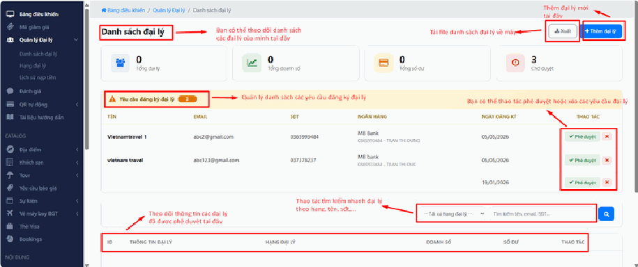
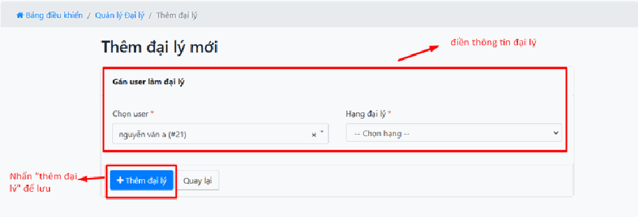
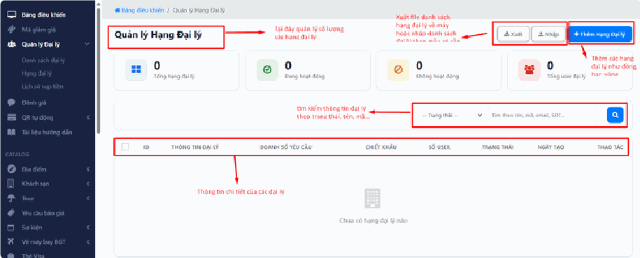
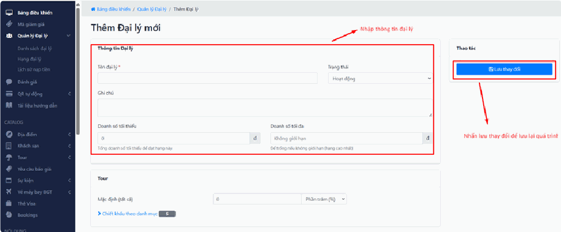
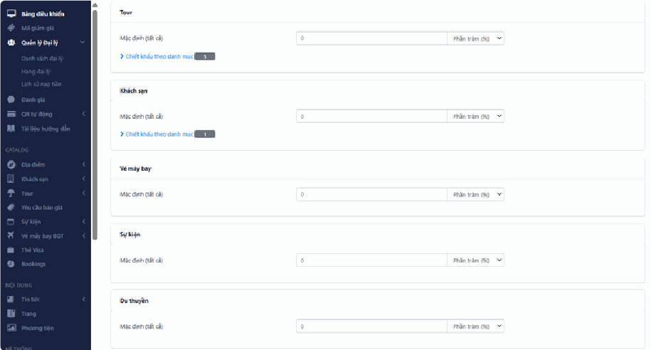
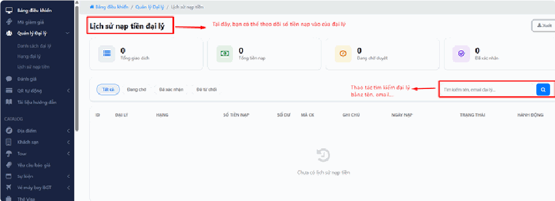

# 1.2. Quản lý đại lý

Đại lý là các đối tác **bán hàng thay cho bạn**: công ty du lịch nhỏ, phòng vé, cộng tác viên chuyên nghiệp. Họ nạp tiền vào tài khoản trên hệ thống của bạn, rồi dùng số tiền đó đặt dịch vụ cho khách của họ với giá đã trừ chiết khấu.

Nói cách khác: thay vì bạn tự đi tìm từng khách lẻ, bạn có một mạng lưới người bán hộ. Đổi lại, họ được mua giá rẻ hơn giá niêm yết.

Mục này là nơi bạn quản lý toàn bộ mạng lưới đó: duyệt ai được vào, cho mỗi người mức chiết khấu bao nhiêu, và xác nhận tiền họ nạp.

> **Đường dẫn:** Menu bên trái > **Các đại lý**
>
> Trong menu này có 2 mục con:
>
> * **Tất cả các đại lý** — xem và quản lý danh sách đại lý.
> * **Thêm đại lý** — tự tay thêm một đại lý mới vào hệ thống.

> **Lưu ý:** Tính năng này có thể chưa được bật trên website của bạn. Nếu không thấy mục này trong menu, hãy liên hệ đơn vị triển khai. Ngoài ra, menu hiển thị theo phân quyền — nếu đồng nghiệp thấy mà bạn không thấy, tài khoản của bạn chưa được cấp quyền.

Công việc quản lý đại lý xoay quanh 3 màn hình, tương ứng 3 phần dưới đây:

1. **Danh sách đại lý** — duyệt đơn xin làm đại lý và theo dõi các đại lý đang hoạt động.
2. **Quản lý hạng đại lý** — thiết lập các cấp bậc (Đồng, Bạc, Vàng…) và mức chiết khấu kèm theo.
3. **Lịch sử nạp tiền** — xác nhận tiền đại lý chuyển vào để cộng vào ví của họ.

> **Nên làm phần nào trước?** Nếu bạn mới bắt đầu, hãy làm **phần 2 (Hạng đại lý) trước tiên**. Lý do: khi duyệt một đại lý mới, bạn phải xếp họ vào một hạng nào đó. Chưa tạo hạng thì chưa xếp được.

***

## Phần 1: Danh sách đại lý

Đây là màn hình chính, nơi bạn dành nhiều thời gian nhất.

### Theo dõi các chỉ số tổng quan

Bốn thẻ trên cùng cho bạn bức tranh nhanh về cả mạng lưới:

* **Tổng đại lý** — Số đại lý **đã được duyệt chính thức** và đang hoạt động. Con số này chưa bao gồm người đang chờ bạn duyệt. Ảnh minh họa đang hiển thị `0` vì hệ thống mẫu chưa duyệt ai.
* **Tổng doanh số** — Tổng số tiền các đại lý đã giao dịch qua hệ thống của bạn. Đây là thước đo mạng lưới của bạn khỏe hay yếu.
* **Tổng số dư** — Tổng số tiền **đang nằm trong ví** của tất cả các đại lý, chưa tiêu. Hiểu đơn giản: đây là tiền họ đã trả cho bạn nhưng chưa dùng hết. Số này càng lớn thì dòng tiền của bạn càng dồi dào.
* **Chờ duyệt** — Số đơn xin làm đại lý **đang đợi bạn xử lý**. Ảnh minh họa đang có 3 yêu cầu. Đây là con số cần bạn hành động — đừng để nó nằm đó nhiều ngày, đối tác chờ lâu sẽ bỏ đi tìm nơi khác.

### Xử lý yêu cầu đăng ký đại lý mới

Ngay dưới các thẻ chỉ số là khu vực **"Yêu cầu đăng ký đại lý"** — bạn nhận ra nó nhờ **nền màu vàng nhạt**. Đây là danh sách những bên đang muốn gia nhập.

**Bước 1 — Xem thông tin để xác minh.** Mỗi yêu cầu hiển thị Tên, Email, Số điện thoại và thông tin ngân hàng (ví dụ: _MB Bank_ của đại lý _Vietnamtravel_). Trước khi bấm duyệt, hãy dành 2 phút:

* **Gọi vào số điện thoại họ ghi.** Số không liên lạc được là dấu hiệu xấu rõ ràng nhất.
* **Nhìn tên chủ tài khoản ngân hàng** xem có khớp với tên người/công ty đăng ký không.
* Email dạng công ty (`@congtyabc.com`) thường đáng tin hơn email cá nhân dùng tên lung tung.

**Bước 2 — Ra quyết định:**

* **Phê duyệt** — nút **màu xanh**. Nhấn vào đây để chấp nhận. Đại lý sẽ được chuyển xuống danh sách chính thức bên dưới và bắt đầu hoạt động được ngay.
* **Từ chối** — nút **màu đỏ có dấu X**. Nhấn nếu thông tin không hợp lệ hoặc bạn không muốn hợp tác.

> **Cẩn thận:** duyệt một đại lý nghĩa là bạn cho họ **mua dịch vụ với giá chiết khấu**. Nếu duyệt nhầm một người không đáng tin, họ có thể lấy giá rẻ của bạn rồi bán phá giá ngoài thị trường, làm hỏng chính giá bán lẻ của bạn. Thà từ chối nhầm còn hơn duyệt nhầm — người bị từ chối oan hoàn toàn có thể đăng ký lại.

### Quản lý danh sách đại lý chính thức

Bảng **dưới cùng** là nơi quản lý các đại lý đã được phê duyệt. Trong ảnh minh họa bảng này đang trống vì chưa duyệt ai.

* **Tìm kiếm / Lọc** — Dùng ô **"Tìm kiếm tên, email, SĐT..."** để tìm nhanh một đối tác. Hoặc lọc theo **"Hạng đại lý"** để xem tất cả các đại lý cùng một cấp bậc — hữu ích khi bạn muốn xem có bao nhiêu người đã lên hạng Vàng.
* **Theo dõi chi tiết** — Mỗi dòng cho biết ID, hạng đại lý (Vàng, Bạc, Đồng…), doanh số riêng và số dư hiện tại của từng bên.

> **Mẹo dùng cột "Số dư":** đại lý có số dư gần cạn sắp phải nạp thêm tiền. Đó là lúc thích hợp để gọi điện chăm sóc và giới thiệu chương trình mới. Ngược lại, đại lý có số dư lớn nằm im nhiều tháng là dấu hiệu họ không bán được hàng — nên hỏi thăm xem có vướng mắc gì.

### Các tác vụ bổ sung (góc trên bên phải)

**Thêm đại lý** — Nhấn nút **màu xanh dương có dấu +** để tự tay thêm một đại lý mà không cần họ gửi yêu cầu đăng ký. Dùng khi bạn đã có sẵn đối tác quen ngoài đời và muốn đưa họ lên hệ thống luôn.

**Xuất dữ liệu** — Nhấn nút có **biểu tượng mũi tên tải xuống** để trích xuất danh sách

đại lý ra file (thường là Excel), phục vụ việc báo cáo hoặc lưu trữ nội bộ.

> **Mẹo:** hãy xuất file này định kỳ mỗi tháng và lưu lại. Đó là bản ghi lịch sử mạng lưới của bạn theo thời gian — rất có ích khi cần nhìn lại ai tăng trưởng, ai đứng im.



***

## Phần 2: Quản lý hạng đại lý

Hạng đại lý là các **cấp bậc** bạn đặt ra, ví dụ Đồng — Bạc — Vàng — Kim Cương. Đại lý bán càng nhiều thì lên hạng càng cao, và hạng càng cao thì chiết khấu càng tốt.

Vì sao cần chia hạng? Vì nó tạo động lực. Một đại lý biết mình chỉ còn thiếu vài triệu doanh số nữa là lên hạng Vàng để hưởng chiết khấu cao hơn sẽ cố gắng đẩy thêm đơn. Bạn không phải thúc giục ai cả — hệ thống hạng tự làm việc đó.

### Tổng quan giao diện Quản lý Hạng Đại lý

Ở màn hình chính của mục này, bạn theo dõi được:

* **Tổng hạng đại lý** — Số cấp bậc bạn đã tạo (ví dụ: Đồng, Bạc, Vàng, Kim Cương là 4 hạng).
* **Đang hoạt động / Không hoạt động** — Hạng nào đang dùng, hạng nào đã tạm ngưng.
* **Tổng user đại lý** — Số đối tác hiện đang thuộc các hạng này.

> **Nên tạo bao nhiêu hạng?** Ba hạng là đủ cho hầu hết doanh nghiệp. Tạo quá nhiều hạng khiến chính bạn rối khi tính chiết khấu, và đại lý cũng không nhớ nổi mình đang ở đâu.

### Cách thêm và thiết lập Hạng Đại lý mới

Nhấn nút **"+ Thêm Hạng Đại lý"**. Hệ thống sẽ yêu cầu nhập các thông tin sau.

#### A. Thông tin cơ bản

* **Tên đại lý** — Đặt tên cho cấp độ này. Ví dụ: _Đại lý Cấp 1_, _Đại lý VIP_, hoặc đơn giản là _Vàng_.
*   **Doanh số tối thiểu & Doanh số tối đa** — Đây là **điều kiện để đại lý đạt được hạng này**. Hai ô này quyết định ai vào hạng nào.

    Ví dụ: hạng Bạc yêu cầu doanh số từ **10.000.000đ** đến **50.000.000đ**. Nghĩa là đại lý bán được trong khoảng đó sẽ được xếp vào hạng Bạc.

    Nếu bạn **để trống "Doanh số tối đa"**, hệ thống hiểu đây là **hạng cao nhất** — không có trần, bán bao nhiêu cũng vẫn ở hạng này.
* **Ghi chú** — Mô tả thêm về đặc quyền của hạng, để đội ngũ quản trị của bạn dễ nắm bắt. Khách và đại lý không nhìn thấy phần này.

> **Cẩn thận — lỗi hay gặp nhất khi chia hạng:** các khoảng doanh số **không được chồng lấn lên nhau**. Nếu hạng Bạc là 10–50 triệu mà hạng Vàng bạn lại đặt 40–100 triệu, thì đại lý có doanh số 45 triệu sẽ rơi vào vùng nhập nhằng. Hãy đặt liền mạch, không hở không đè: Đồng `0 – 10 triệu`, Bạc `10 – 50 triệu`, Vàng `50 triệu – để trống`.

#### B. Thiết lập Chiết khấu (phần quan trọng nhất)

Đây là phần trực tiếp ảnh hưởng tới lợi nhuận của bạn, nên hãy làm chậm và kiểm tra kỹ.

Hệ thống cho phép tùy chỉnh mức hoa hồng/giảm giá cho đại lý **theo từng loại dịch vụ**, vì mỗi loại có biên lợi nhuận khác nhau — chiết khấu 10% cho tour có thể vẫn lãi, nhưng 10% cho vé máy bay là lỗ nặng.

**Các loại dịch vụ có thể đặt chiết khấu riêng:** Tour, Khách sạn, Vé máy bay, Sự kiện, Du thuyền.

**Cơ chế thiết lập:**

* **Mặc định (tất cả)** — Nhập một con số chiết khấu chung áp cho toàn bộ hạng mục đó. Ví dụ: mọi tour đều chiết khấu 8%.
* **Đơn vị** — Bạn chọn một trong hai cách tính:
  * **Phần trăm (%)** — tính trên giá gốc. Dịch vụ càng đắt, đại lý được giảm càng nhiều.
  * **Số tiền cố định (VND)** — trừ một khoản cố định trên mỗi dịch vụ, không phụ thuộc giá.
* **Chiết khấu theo danh mục** — Cho phép bạn chọn **riêng từng tour hoặc khách sạn cụ thể** để đặt mức chiết khấu khác với mức mặc định. Dùng khi có một dịch vụ đặc biệt cần ưu đãi mạnh hơn (hoặc yếu hơn) phần còn lại.

> **Cẩn thận:** trước khi lưu, hãy **lấy máy tính bấm thử một đơn hàng thật**. Giả sử tour giá 5 triệu, chiết khấu 12% là 600 nghìn. Bạn có còn lãi sau khi trừ chi phí vận hành không? Con số chiết khấu gõ vội trong 5 giây sẽ theo bạn suốt hàng trăm đơn hàng sau đó.
>
> **Mẹo:** đừng đặt chênh lệch giữa các hạng quá nhỏ. Nếu hạng Bạc 8% mà hạng Vàng chỉ 8,5%, chẳng ai buồn cố lên hạng. Khoảng cách 2–3% mới đủ tạo động lực.

### Các thao tác quản trị khác

* **Nhập / Xuất** — Dùng để đưa dữ liệu hạng đại lý từ file Excel vào hệ thống, hoặc tải về máy để kiểm tra đối chiếu.
* **Thao tác (cột cuối cùng)** — Sau khi tạo xong, bạn có thể **sửa** (biểu tượng bút chì) hoặc **xóa** các hạng không còn sử dụng.

> **Cẩn thận khi xóa một hạng:** hãy kiểm tra trước xem có đại lý nào đang thuộc hạng đó không (nhìn cột **"Tổng user đại lý"**). Xóa một hạng đang có người sẽ khiến các đại lý đó bị "mồ côi" — không rõ được hưởng chiết khấu nào. Nếu chỉ muốn tạm ngưng, hãy chuyển hạng sang trạng thái **Không hoạt động** thay vì xóa hẳn.

***

## Phần 3: Lịch sử nạp tiền

Đại lý muốn đặt dịch vụ thì phải có tiền trong ví. Họ chuyển khoản cho bạn, rồi báo lên hệ thống. Nhưng **hệ thống không tự biết** tiền đã về tài khoản ngân hàng của bạn hay chưa.

Vì vậy quy trình luôn là: **đại lý báo nạp → bạn mở app ngân hàng kiểm tra tiền thật → bạn bấm xác nhận → ví của họ mới được cộng tiền.**

Màn hình này chính là nơi bạn làm bước xác nhận đó.

### Theo dõi các chỉ số tài chính (các thẻ phía trên)

* **Tổng giao dịch** — Tổng số lệnh nạp tiền đã phát sinh, tính cả thành công, đang chờ duyệt và bị từ chối.
* **Tổng tiền nạp** — Tổng số tiền **thực tế đã được cộng** vào hệ thống. Chỉ tính các lệnh bạn đã xác nhận, nên đây là con số đáng tin để đối chiếu với ngân hàng.
* **Đang chờ duyệt** — Số giao dịch mà đại lý đã báo nạp nhưng **bạn chưa kiểm tra tài khoản ngân hàng để xác nhận**. Đây là con số cần bạn hành động mỗi ngày. Để số này tồn đọng nghĩa là có đại lý đã trả tiền mà chưa bán được hàng — họ sẽ gọi điện phàn nàn.
* **Đã xác nhận** — Số giao dịch nạp tiền đã thành công.

### Bộ lọc và tìm kiếm (thanh công cụ)

Khi số lượng giao dịch lớn, hai công cụ này giúp bạn không phải cuộn mỏi mắt:

* **Bộ lọc trạng thái** — Nhấn nhanh vào các nút **"Tất cả"**, **"Đang chờ"**, **"Đã xác nhận"**, hoặc **"Đã từ chối"** để lọc danh sách.
* **Ô tìm kiếm** — Nhập tên đại lý hoặc email để xem lịch sử nạp tiền của riêng một đối tác. Dùng khi có đại lý gọi điện hỏi "tiền tôi nạp hôm qua đâu rồi?".

> **Thói quen nên có:** mỗi sáng vào đây, nhấn nút **"Đang chờ"**, xử lý hết rồi mới làm việc khác. Mất 5 phút nhưng giữ được uy tín với toàn bộ mạng lưới.

### Quản lý chi tiết bảng giao dịch

Khi có dữ liệu, bảng này hiển thị:

* **Số tiền nạp & Số dư** — Số tiền họ nạp lần này và số dư còn lại trong ví sau khi nạp.
* **Mã CK (Mã chuyển khoản)** — **Đây là thông tin quan trọng nhất trong cả màn hình.** Đó là dãy ký tự đại lý ghi trong nội dung chuyển khoản. Bạn dùng nó để dò trong lịch sử biến động số dư trên app ngân hàng của công ty, xác định đúng lệnh nào là của ai.
* **Ghi chú** — Nội dung đi kèm giao dịch, thường là cú pháp nạp tiền đại lý đã ghi.
* **Trạng thái** — Cho biết lệnh đó Thành công hay Thất bại.
* **Hành động** — Các nút để bạn **Phê duyệt** (xác nhận đã nhận được tiền, ví đại lý được cộng ngay) hoặc **Hủy bỏ** (nếu đại lý báo nạp ảo hoặc ghi sai thông tin).

> **Quy tắc vàng — không bao giờ được phá:** **CHỈ bấm Phê duyệt sau khi đã mở app ngân hàng và nhìn thấy tiền thật về tài khoản.** Đừng bao giờ duyệt chỉ vì đại lý gọi điện nói "em chuyển rồi anh ơi" hay gửi ảnh chụp màn hình. Ảnh chụp màn hình chuyển khoản là thứ dễ làm giả nhất. Bấm Phê duyệt là ví họ có tiền tiêu ngay lập tức — và tiền đó là hàng hóa thật của bạn.
>
> **Đối soát thế nào cho nhanh?** Mở app ngân hàng trên điện thoại, mở màn hình này trên máy tính, để cạnh nhau. Với mỗi dòng **"Đang chờ"**, đối chiếu đủ 3 thứ: **số tiền** khớp, **Mã CK** khớp, **thời gian** khớp. Đủ cả ba mới bấm duyệt.

### Các tác vụ quan trọng khác

**Nút "Xuất" (góc trên phải)** — Xuất toàn bộ lịch sử nạp tiền ra file Excel. Đây là tính năng cần thiết để làm báo cáo tài chính định kỳ hoặc đối soát vớikế toán.

> **Mẹo:** cuối mỗi tháng, xuất file này và gửi cho kế toán. Họ sẽ đối chiếu với sao kê ngân hàng. Nếu hai bên khớp nhau, bạn yên tâm là không có lệnh nạp nào bị duyệt nhầm.

***

## Lưu ý & xử lý sự cố

**Đại lý báo đã chuyển tiền nhưng bạn không tìm thấy trong app ngân hàng.** Chuyển khoản khác ngân hàng đôi khi mất vài phút đến vài giờ, đặc biệt vào cuối tuần hay ngoài giờ hành chính. Hãy đợi và kiểm tra lại. Nếu qua một ngày vẫn không thấy, yêu cầu đại lý gửi **ảnh chụp biên lai có mã giao dịch của ngân hàng** — rồi vẫn phải tự kiểm tra lại tài khoản, đừng duyệt dựa trên ảnh.

**Bạn lỡ tay bấm Phê duyệt nhầm một lệnh nạp ảo.** Ví đại lý đã được cộng tiền. Hãy **liên hệ ngay đơn vị triển khai** để được hỗ trợ xử lý, đồng thời gọi cho đại lý đó để làm rõ. Đừng chần chừ — mỗi phút trôi qua là họ có thể đã dùng số tiền đó đặt dịch vụ.

**Đại lý phàn nàn chiết khấu thấp hơn thỏa thuận.** Kiểm tra theo thứ tự: (1) họ đang ở **hạng** nào — vào Danh sách đại lý xem cột Hạng; (2) hạng đó đặt chiết khấu bao nhiêu cho **loại dịch vụ** họ vừa đặt; (3) dịch vụ cụ thể đó có bị đặt **"Chiết khấu theo danh mục"** riêng đè lên mức mặc định không. Nguyên nhân thường nằm ở bước 3.

**Đại lý đã bán nhiều nhưng vẫn chưa lên hạng.** Xem lại **Doanh số tối thiểu** của hạng cao hơn — có thể họ chưa đạt ngưỡng. Cũng cần kiểm tra xem doanh số có tính cả các đơn đã hủy hay không; đơn hủy thường không được tính.

**Không thấy đơn xin làm đại lý nào dù có người báo đã đăng ký.** Kiểm tra thẻ **"Chờ duyệt"** ở trên cùng. Nếu số là 0 mà họ vẫn khẳng định đã gửi, có thể họ đăng ký chưa xong (thoát giữa chừng) hoặc dùng nhầm form đăng ký tài khoản khách thường. Hãy nhờ họ làm lại và chụp màn hình thông báo thành công.

**Sửa chiết khấu xong nhưng đại lý vẫn thấy giá cũ.** Bảo họ nhấn **Ctrl + F5** để tải lại trang hoàn toàn. Trình duyệt thường giữ bản cũ để hiển thị cho nhanh.

**Bạn không thấy mục Hạng đại lý hoặc Lịch sử nạp tiền.** Các màn hình này nằm trong nhóm chức năng đại lý và hiển thị theo phân quyền cũng như theo cấu hình website. Nếu không thấy, hãy liên hệ quản trị viên hoặc đơn vị triển khai.

## Xem thêm

* [1. Bảng điều khiển](./) — theo dõi doanh thu tổng, bao gồm cả phần do đại lý mang về.
* [1.1. Mã giảm giá](ma-giam-gia.md) — dành cho khách lẻ. Đại lý nên dùng chiết khấu theo hạng, không nên dùng mã giảm giá.
* [1.3. Quản lý Affiliate](quan-ly-affiliate.md) — mô hình cộng tác viên giới thiệu, nhẹ nhàng hơn đại lý.
