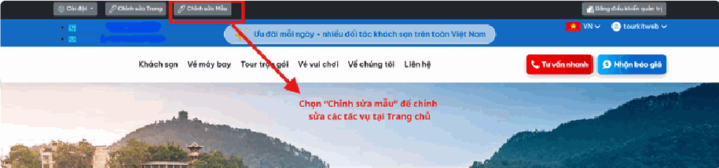
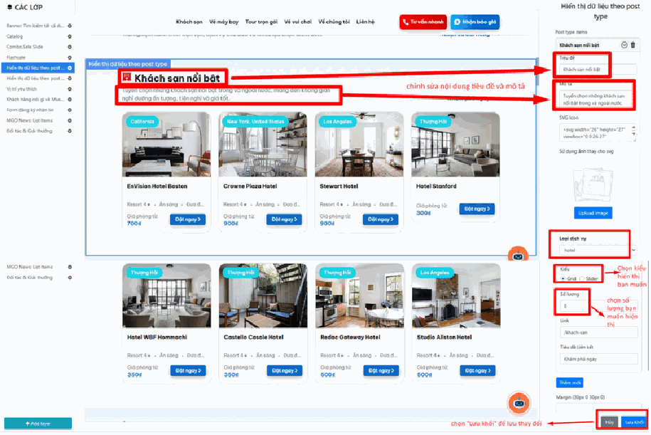

# Chỉnh sửa bố cục "Trang chủ"

Trang chủ là màn hình đầu tiên khách nhìn thấy khi vào website của bạn. Nó được ghép từ nhiều **khối nội dung** xếp chồng lên nhau từ trên xuống — ví dụ: khối banner ảnh lớn, khối "Khách sạn nổi bật", khối "Tour mới nhất", khối tin tức.

Bài này hướng dẫn bạn **tự sắp xếp lại các khối đó** mà không cần biết lập trình: đổi tiêu đề khối, chọn hiển thị tour hay khách sạn, đổi số lượng hiển thị, thêm hoặc bớt khối.

> **Hiểu đơn giản:** hãy tưởng tượng trang chủ như một tờ báo. Mỗi "khối" là một chuyên mục trên tờ báo đó. Bạn được quyền quyết định chuyên mục nào nằm trên, chuyên mục nào nằm dưới, và mỗi chuyên mục đăng bao nhiêu bài.

## Cách vào màn hình chỉnh sửa

Để thực hiện thay đổi hoặc điều chỉnh các nội dung hiển thị trên Trang chủ, bạn cần chọn vào nút **"Chỉnh sửa mẫu"** nằm trên thanh công cụ quản trị ở phía trên cùng của màn hình.

> **Không thấy thanh công cụ này?** Bạn cần **đăng nhập bằng tài khoản quản trị** trước, rồi mới mở trang chủ. Thanh công cụ chỉ hiện với người quản trị, khách vãng lai không nhìn thấy.

## Màn hình chỉnh sửa có gì?

Sau khi vào, màn hình chia làm 2 phần:

- **Cột bên trái** — danh sách các khối đang có trên trang chủ, xếp đúng thứ tự từ trên xuống như khách nhìn thấy.
- **Phần giữa/phải** — bảng thiết lập của khối bạn đang chọn, và khu vực xem trước.

## Chỉnh sửa một khối có sẵn

Tất cả các khối nội dung trên hệ thống đều có thao tác chỉnh sửa tương tự nhau. Ví dụ với khối **"Khách sạn nổi bật"**:

**Bước 1:** Click trực tiếp vào khối nội dung bạn cần sửa — ở cột danh sách bên trái, hoặc bấm thẳng vào khối đó trên màn hình xem trước.

**Bước 2:** Tại bảng **"Hiển thị dữ liệu theo post type"** bên phải, thực hiện chỉnh sửa các thông tin:

- **Tiêu đề & Mô tả** — nhập nội dung văn bản để thay đổi nhãn hiển thị trên trang chủ. Đây chính là dòng chữ lớn khách đọc thấy, ví dụ "Khách sạn nổi bật" hay "Ưu đãi tháng 7".
- **Loại dịch vụ** — chọn nguồn dữ liệu muốn hiển thị (ví dụ: `hotel`, `tour`, `news`...). Đây là chỗ quyết định khối này lấy **tour** ra khoe hay lấy **khách sạn** ra khoe.
- **Kiểu hiển thị** — chọn giữa:
  - **Lưới (Grid)** — các mục xếp thành bảng ô vuông, khách thấy hết cùng lúc, phải cuộn xuống.
  - **Trượt (Slider)** — các mục chạy ngang, khách bấm mũi tên để xem tiếp. Tiết kiệm chiều cao trang.
- **Số lượng** — thiết lập số lượng bài viết/dịch vụ muốn hiển thị trong khối này.

> **Mẹo về số lượng:** đừng để số quá lớn. Đặt 4, 6 hoặc 8 là hợp lý. Nếu đặt 50, trang chủ sẽ dài lê thê và **tải rất chậm**, khách dễ thoát ra trước khi trang hiện xong.

**Bước 3:** Ấn nút **"Lưu Khối"** ở góc dưới cùng bên phải để hoàn tất và áp dụng thay đổi.

## Thêm một khối mới

Bên cạnh đó, khi bạn nhấn nút **"Thêm mới"** (Add layer), các thao tác thiết lập

nội dung cũng hoàn toàn tương tự như khi chỉnh sửa một khối có sẵn.

Nghĩa là bạn chỉ cần: bấm **"Thêm mới"** → chọn loại khối muốn thêm → điền tiêu đề, chọn loại dịch vụ, kiểu hiển thị, số lượng → bấm **"Lưu Khối"**.

## Lưu ý & xử lý sự cố

**Sửa xong nhưng ra ngoài web không thấy đổi:** đây là lỗi phổ biến nhất. Nguyên nhân thường là:

1. Bạn **quên bấm "Lưu Khối"**. Mọi thay đổi chỉ được ghi lại khi bạn bấm nút này.
2. Trình duyệt còn giữ bản cũ trong bộ nhớ tạm. Hãy nhấn tổ hợp phím **Ctrl + F5** để tải lại trang hoàn toàn mới.

**Khối hiện ra nhưng trống trơn, không có gì bên trong:** khối đang trỏ tới loại dịch vụ mà bạn **chưa có dữ liệu nào được xuất bản**. Ví dụ khối "Tour nổi bật" nhưng bạn chưa đăng tour nào, hoặc tour còn ở trạng thái Bản nháp. Hãy vào mục Tour kiểm tra xem đã bấm **"Xuất bản"** chưa.

**Lỡ tay xóa nhầm một khối:** đừng bấm Lưu. Hãy thoát ra và tải lại trang, thay đổi chưa lưu sẽ bị hủy bỏ và khối cũ trở lại.

**Trang chủ bị vỡ, hiển thị lộn xộn:** thường do một khối bị đặt số lượng quá lớn hoặc thiếu ảnh. Hãy thử tạm ẩn/xóa khối vừa sửa gần nhất để xác định khối nào gây lỗi.

> **Lời khuyên quan trọng:** trước khi sửa nhiều thứ cùng lúc, hãy **sửa từng khối một và lưu ngay**. Nếu có sự cố, bạn biết chính xác khối nào gây ra. Sửa 5 khối rồi mới lưu sẽ rất khó tìm lỗi.

*📺 Video hướng dẫn: TourkitWeb | Hướng dẫn tạo trang Chỉnh sửa thông tin*

*📺 Video hướng dẫn: TourkitWeb | Hướng dẫn tạo trang Chỉnh sửa banner, t*
