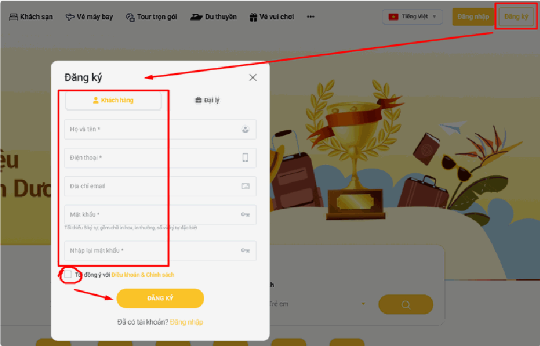
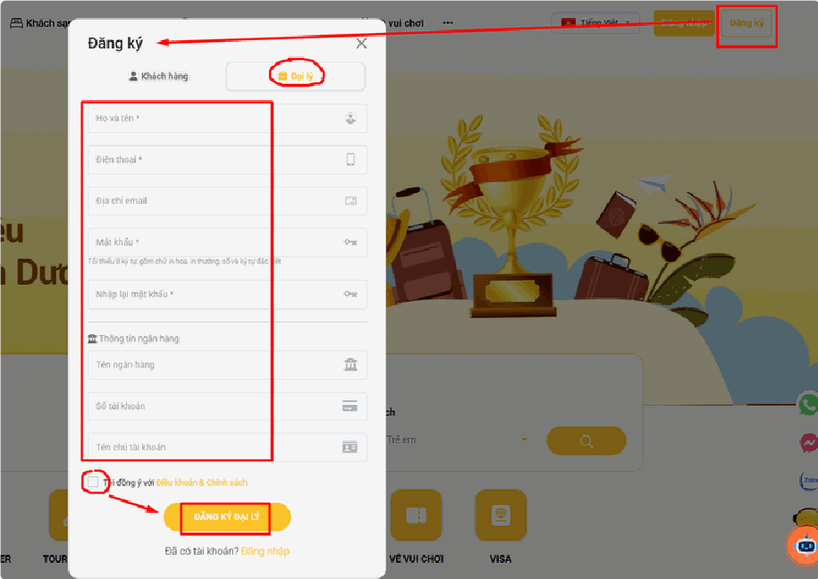

# Hướng dẫn đăng ký tài khoản

Đăng ký là bước tạo tài khoản mới trên website. Bạn chỉ cần làm **một lần duy nhất**, sau đó dùng tài khoản này để đăng nhập mãi về sau.

Hệ thống có **2 loại tài khoản khác nhau**, bạn cần chọn đúng loại ngay từ đầu:

| Loại tài khoản | Dành cho ai | Dùng để làm gì |
|---|---|---|
| **Khách hàng** | Người đi du lịch bình thường | Đặt tour, đặt phòng, theo dõi đơn của mình |
| **Đại lý** | Đơn vị bán tour, cộng tác viên | Bán dịch vụ cho khách và nhận hoa hồng |

> **Chọn nhầm loại thì sao?** Bạn sẽ không có các chức năng bán hàng và hoa hồng. Hãy cân nhắc kỹ trước khi bấm, vì đổi loại tài khoản sau cần nhờ quản trị viên hỗ trợ.

## Chuẩn bị trước khi đăng ký

Để không bị gián đoạn giữa chừng, bạn nên chuẩn bị sẵn:

- **Số điện thoại** đang dùng
- **Địa chỉ email** bạn còn truy cập được (dùng để lấy lại mật khẩu sau này)
- **Một mật khẩu** đủ mạnh — xem yêu cầu ở phần bên dưới
- **Thông tin ngân hàng** — chỉ cần nếu bạn đăng ký làm Đại lý

## a, Đăng ký tài khoản Khách hàng

**Bước 1:** Truy cập vào trang chủ và nhấn nút **"Đăng ký"** ở góc trên cùng bên phải màn hình.

**Bước 2:** Khi bảng thông báo hiện ra, chọn tab **"Khách hàng"** để bắt đầu nhập thông tin cá nhân.

**Bước 3:** Hoàn thiện đầy đủ các thông tin bắt buộc (những ô có **dấu sao đỏ ***) bao gồm:

- **Họ và tên** — nhập tên thật, vì tên này sẽ hiện trên vé và hóa đơn của bạn.
- **Số điện thoại** — nhập số đang dùng, hệ thống sẽ liên hệ qua số này khi có đơn hàng.
- **Địa chỉ email** — không bắt buộc, nhưng **rất nên nhập**. Nếu sau này quên mật khẩu, đây là cách duy nhất để bạn tự lấy lại được.
- **Mật khẩu** và **Nhập lại mật khẩu** — xem yêu cầu mật khẩu ngay bên dưới.

> **Mật khẩu phải đủ 4 điều kiện:** tối thiểu 8 ký tự, có **chữ in HOA**, có **chữ thường**, có **số**, và có **ký tự đặc biệt** (như `@ # ! $`).
>
> Ví dụ mật khẩu hợp lệ: `Hanoi@2024`
>
> **Mẹo cho dễ nhớ:** lấy một câu quen thuộc rồi biến đổi. Ví dụ "tôi yêu Hà Nội" → `ToiYeuHaNoi@1`

**Bước 4:** Tích chọn vào ô **"Tôi đồng ý với Điều khoản & Chính sách"** của hệ thống.

**Bước 5:** Nhấn nút **"ĐĂNG KÝ"** màu vàng để hoàn tất quá trình tạo tài khoản.

## b, Đăng ký tài khoản Đại lý

Tài khoản Đại lý dành cho đơn vị/cá nhân muốn bán dịch vụ và nhận hoa hồng. So với tài khoản Khách hàng, bạn cần khai thêm **thông tin ngân hàng** để hệ thống chuyển tiền hoa hồng cho bạn.

- **Bước 1:** Nhấp vào nút **"Đăng ký"** ở góc trên cùng bên phải của trang web.

- **Bước 2:** Trong cửa sổ đăng ký hiện ra, chọn tab **"Đại lý"** (có biểu tượng **chiếc vali**).

- **Bước 3:** Điền đầy đủ các thông tin cá nhân bắt buộc, bao gồm: Họ và tên, Điện thoại, Địa chỉ email, Mật khẩu và Nhập lại mật khẩu.

> **Lưu ý:** Mật khẩu phải có tối thiểu 8 ký tự, bao gồm chữ in hoa, in thường, số và ký tự đặc biệt.

- **Bước 4:** Cung cấp thêm **Thông tin ngân hàng** để phục vụ giao dịch, gồm: **Tên ngân hàng**, **Số tài khoản** và **Tên chủ tài khoản**.

> **Cẩn thận:** Hãy kiểm tra thật kỹ số tài khoản và tên chủ tài khoản. Nhập sai một chữ số thôi là tiền hoa hồng sẽ không về được tài khoản của bạn. Tên chủ tài khoản phải viết **in hoa không dấu**, đúng như trên thẻ ngân hàng — ví dụ `NGUYEN VAN A`.

- **Bước 5:** Tích chọn vào ô **"Tôi đồng ý với Điều khoản & Chính sách"**.

- **Bước 6:** Nhấn nút **"ĐĂNG KÝ ĐẠI LÝ"** màu vàng phía dưới để gửi yêu cầu đăng ký.

> **Quan trọng:** Tài khoản Đại lý thường **cần được quản trị viên duyệt** trước khi dùng được đầy đủ chức năng. Nếu đăng ký xong mà chưa bán hàng được ngay, đó là chuyện bình thường — bạn hãy chờ hoặc liên hệ đơn vị quản lý để được duyệt sớm.

## Lưu ý & xử lý sự cố

**Bấm ĐĂNG KÝ nhưng không có gì xảy ra:** thường là còn một ô bắt buộc chưa điền, hoặc bạn chưa tích ô đồng ý điều khoản. Hãy cuộn lên xem có dòng chữ đỏ báo lỗi ở ô nào không.

**Báo "Mật khẩu không khớp":** ô "Mật khẩu" và ô "Nhập lại mật khẩu" phải giống nhau **tuyệt đối**. Hãy gõ lại cả hai ô thật chậm.

**Báo "Mật khẩu không đủ mạnh":** bạn còn thiếu một trong 4 điều kiện. Hay gặp nhất là thiếu ký tự đặc biệt — hãy thêm `@` hoặc `!` vào cuối.

**Báo "Email đã tồn tại":** bạn đã từng đăng ký bằng email này rồi. Hãy chuyển sang [đăng nhập](huong-dan-dang-nhap-tai-khoan.md), hoặc dùng chức năng **"Quên mật khẩu?"** nếu không nhớ mật khẩu cũ.

**Gõ mật khẩu bị ra chữ có dấu:** bạn đang bật bộ gõ tiếng Việt (Unikey). Hãy chuyển về chế độ **E** (tiếng Anh) rồi gõ lại.

**Copy-paste bị lỗi:** khi copy email từ chỗ khác dán vào, thường dính thêm dấu cách thừa ở đầu/cuối. Tốt nhất là gõ tay.

## Bước tiếp theo

Đăng ký xong, bạn hãy đọc bài [Hướng dẫn đăng nhập tài khoản](huong-dan-dang-nhap-tai-khoan.md) để vào hệ thống.

*📺 Video hướng dẫn: TourkitWeb | Hướng dẫn Đăng ký Đăng nhập TK Web*
