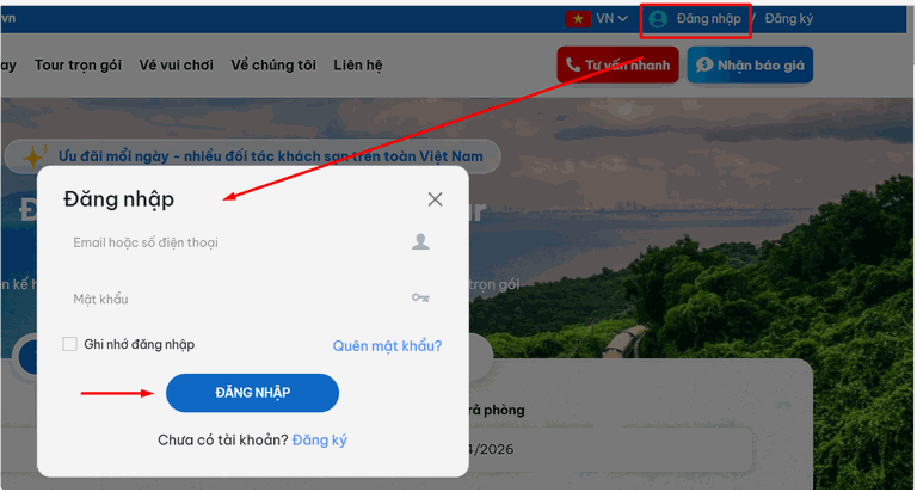

# Hướng dẫn đăng nhập tài khoản

Đăng nhập là bước bắt buộc trước khi bạn làm bất cứ việc gì trên hệ thống: đăng tin, thêm tour, xem đơn hàng. Nếu chưa đăng nhập, bạn chỉ xem được website như một khách vãng lai bình thường.

Toàn bộ quá trình mất khoảng 1 phút. Bạn chỉ cần nhớ 2 thứ: **email (hoặc số điện thoại)** và **mật khẩu** đã dùng khi đăng ký.

> **Chưa có tài khoản?** Bạn hãy làm theo bài [Hướng dẫn đăng ký tài khoản](huong-dan-dang-ky-tai-khoan.md) trước, rồi quay lại trang này.

## Bước 1: Mở form đăng nhập

Mở trình duyệt (Chrome, Cốc Cốc, Edge…) và vào trang chủ website của bạn.

Nhìn lên **góc trên bên phải** màn hình, bạn sẽ thấy nút **"Đăng nhập"**. Nhấn vào nút đó.

Một cửa sổ nhỏ sẽ hiện ra ở **giữa màn hình**. Đây chính là form đăng nhập.

> **Nếu không thấy nút "Đăng nhập":** rất có thể bạn đang đăng nhập sẵn rồi. Khi đó ở góc phải sẽ hiện tên hoặc ảnh đại diện của bạn thay cho nút đăng nhập.
>
> **Nếu bạn dùng điện thoại:** nút có thể nằm ẩn trong biểu tượng ba gạch ngang (☰) ở góc trên. Nhấn vào đó rồi tìm dòng "Đăng nhập".

## Bước 2: Nhập thông tin tài khoản

Trong cửa sổ vừa hiện ra, bạn điền 2 ô:

- **Ô "Email hoặc số điện thoại"** — nhập đúng email hoặc số điện thoại bạn đã dùng lúc đăng ký. Ví dụ: `nguyenvana@gmail.com`
- **Ô "Mật khẩu"** — nhập mật khẩu của bạn. Vì lý do bảo mật, mật khẩu sẽ hiện thành các dấu chấm (••••••) chứ không hiện chữ.

**Những lỗi thường gặp khiến đăng nhập thất bại:**

- **Thừa dấu cách:** khi bạn copy email từ chỗ khác dán vào, thường bị dính thêm một dấu cách ở đầu hoặc cuối. Hãy xóa sạch rồi gõ tay lại cho chắc.
- **Bật nhầm phím Caps Lock:** mật khẩu phân biệt CHỮ HOA và chữ thường. `Abc123` khác hoàn toàn `abc123`. Hãy kiểm tra đèn Caps Lock trên bàn phím.
- **Bật nhầm bộ gõ tiếng Việt:** nếu đang bật Unikey, gõ mật khẩu có thể bị biến thành chữ có dấu. Hãy chuyển về chế độ **E** (tiếng Anh) trước khi gõ mật khẩu.
- **Sai email:** nhiều người có nhiều email và quên mất đã đăng ký bằng email nào.

> **Quên mật khẩu?** Ngay trong cửa sổ đăng nhập có dòng chữ nhỏ **"Quên mật khẩu?"**. Nhấn vào đó, nhập email đã đăng ký, hệ thống sẽ gửi cho bạn một email hướng dẫn đặt lại mật khẩu mới. Nhớ kiểm tra cả hộp thư **Spam / Thư rác** nếu chờ mãi không thấy.

## Bước 3: Tùy chọn ghi nhớ đăng nhập (không bắt buộc)

Bên dưới ô mật khẩu có một ô vuông nhỏ tên **"Ghi nhớ đăng nhập"**. Tích vào ô này thì lần sau mở website bạn không phải gõ lại mật khẩu nữa.

**Nên tích khi:** bạn đang dùng máy tính cá nhân ở nhà hoặc máy riêng tại công ty, không ai khác dùng chung.

**Tuyệt đối KHÔNG tích khi:** bạn đang dùng máy ở tiệm net, máy dùng chung của công ty, hoặc máy của người khác. Nếu tích, người dùng máy sau bạn có thể vào thẳng tài khoản của bạn mà không cần mật khẩu.

## Bước 4: Đăng nhập vào hệ thống

Nhấn nút **"ĐĂNG NHẬP"**.

- **Nếu thông tin đúng:** hệ thống sẽ tự động chuyển bạn vào bên trong — tới trang quản trị (nếu bạn là quản trị viên) hoặc trang cá nhân (nếu bạn là khách hàng thường).
- **Nếu thông tin sai:** một dòng chữ đỏ báo lỗi sẽ hiện lên. Hãy đọc kỹ dòng đó, quay lại Bước 2 và kiểm tra theo danh sách lỗi thường gặp ở trên.

## Sau khi đăng nhập xong thì làm gì?

Nếu bạn là **quản trị viên**, bạn sẽ thấy trang **Bảng điều khiển** — đây là màn hình tổng quan của toàn hệ thống. Từ đây, cột menu bên trái là nơi bạn đi tới mọi chức năng khác.

Bạn có thể đọc tiếp bài [1. Bảng điều khiển](bang-dieu-khien/README.md) để hiểu màn hình này.

## Cách thoát ra (đăng xuất)

Khi làm việc xong, nhất là trên máy dùng chung, bạn nên đăng xuất:

1. Nhấn vào **tên hoặc ảnh đại diện** của bạn ở góc trên bên phải.
2. Chọn dòng **"Đăng xuất"** trong danh sách xổ xuống.

## Xử lý một số tình huống khác

**Đăng nhập vào rồi nhưng bị đá ra ngay:** phiên làm việc đã hết hạn do bạn để máy quá lâu không thao tác. Chỉ cần đăng nhập lại là được.

**Hệ thống hỏi mã xác thực 6 số:** tài khoản của bạn đã bật tính năng bảo mật 2 lớp. Bạn cần mở ứng dụng xác thực trên điện thoại để lấy mã. Xem chi tiết tại bài [4.12. Bảo mật 2 lớp](khoi-he-thong/bao-mat-2-lop.md).

**Báo tài khoản chưa được kích hoạt / chờ duyệt:** tài khoản của bạn cần quản trị viên phê duyệt trước. Hãy liên hệ người quản lý hệ thống của đơn vị bạn.

*📺 Video hướng dẫn: TourkitWeb | Hướng dẫn Đăng ký Đăng nhập TK Web*
