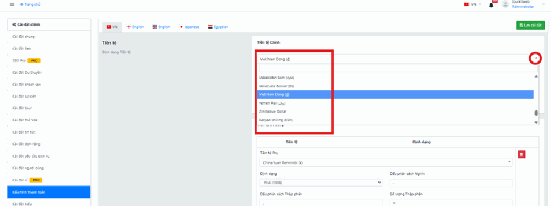
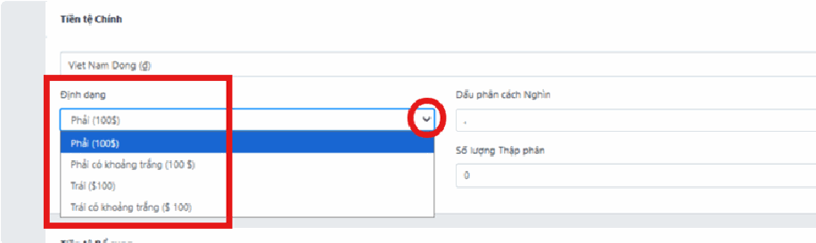
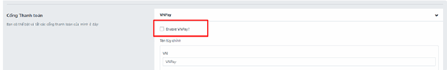
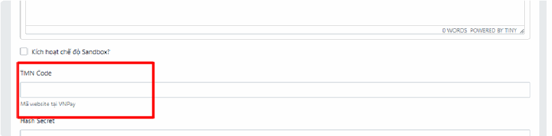

# 4.9. Cài đặt

**Cài đặt** là "bảng điều khiển trung tâm" của website. Đây là nơi bạn khai báo những thông tin nền tảng: tên công ty, logo, email liên hệ, đơn vị tiền tệ, cách khách hàng thanh toán…

Bạn sẽ vào đây **nhiều nhất lúc mới nhận website** (để khai báo lần đầu), sau đó thì rất ít khi phải quay lại — chỉ khi có thay đổi như đổi số điện thoại, thay logo, hoặc thêm một cổng thanh toán mới.

> **Đường dẫn:** Menu bên trái > **Cài đặt**

> **Không thấy mục "Cài đặt" trong menu?** Đây là mục dành cho quản trị viên, cần quyền riêng. Nếu tài khoản của bạn chưa được cấp quyền, mục này sẽ **ẩn hoàn toàn**. Hãy liên hệ quản trị viên của đơn vị bạn.

## "Cài đặt" khác gì "Tích hợp"?

Hai mục này nằm cạnh nhau trong menu và rất nhiều người nhầm lẫn. Phân biệt cực kỳ đơn giản:

|                    | **Cài đặt**                                   | **Tích hợp**                                             |
| ------------------ | --------------------------------------------- | -------------------------------------------------------- |
| Chứa gì?           | Cấu hình **bên trong** website của bạn        | Kết nối **ra ngoài** với dịch vụ của bên thứ ba          |
| Ví dụ              | Tên công ty, logo, tiền tệ, cách hiển thị giá | Nối với CRM, gửi thông báo qua Telegram, kết nối OpenAI  |
| Cần gì để làm?     | Chỉ cần thông tin công ty bạn                 | Thường cần **mã khóa (API Key)** do bên kia cấp          |
| Không làm thì sao? | Website hiển thị sai/thiếu thông tin          | Website vẫn chạy bình thường, chỉ là không có kết nối đó |

**Câu hỏi để tự phân biệt:** _"Việc này có cần một công ty khác cấp mã cho tôi không?"_

* **Không cần** → nó nằm ở **Cài đặt**.
* **Có cần** → nó nằm ở **Tích hợp**.

Xem chi tiết mục Tích hợp tại bài [4.10. Tích hợp](tich-hop.md).

## Trong mục này có gì?

Khi nhấn vào **Cài đặt**, một danh sách các trang cài đặt sẽ xổ ra. **Danh sách này khác nhau tùy website** — vì mỗi phần của hệ thống (Tour, Khách sạn, Xe, Đại lý…) tự đăng ký trang cài đặt riêng của nó. Website bạn bật nhiều tính năng thì danh sách dài, bật ít thì danh sách ngắn.

Dù vậy, luôn có một số mục quen thuộc:

* **"Cài đặt chung"** (General Settings) — **luôn nằm đầu tiên**. Đây là mục quan trọng nhất, chứa tên website, logo, thông tin liên hệ.
* **Cài đặt của từng loại sản phẩm** — ví dụ **Khách sạn**, **Tour**, **Xe**… mỗi loại có cấu hình riêng.
* **Cài đặt vận hành** — ví dụ **Đại lý**, **Nhà cung cấp (Vendor)**, **Tài sản**, **Thẻ Visa**…

> **Mẹo nhận biết bạn đang ở trang nào:** Nhìn lên **thanh địa chỉ trình duyệt**, bạn sẽ thấy đường dẫn dạng `/admin/module/core/settings?group=general`. Chữ sau `group=` chính là tên trang bạn đang mở. Đây là mẹo hữu ích khi bạn cần gửi link chính xác cho người hỗ trợ kỹ thuật.

## Quy tắc chung khi làm việc trong "Cài đặt"

Trang nào trong Cài đặt cũng vận hành theo cùng một quy luật. Nắm 4 điều này là bạn dùng được mọi trang:

**1. Cột trái là danh sách trang, khu giữa là nội dung.** Bạn chọn trang ở cột trái, nội dung cấu hình hiện ra ở giữa.

**2. Nút lưu luôn ở góc trên bên phải, màu xanh lá.** Nút **"Lưu cài đặt"** (biểu tượng đĩa mềm 💾). Sửa xong mà không bấm nút này thì **mọi thay đổi mất sạch** khi bạn rời trang.

**3. Chuyển sang trang cài đặt khác = mất thay đổi chưa lưu.** Lỗi kinh điển: sửa ở trang "Cài đặt chung", chưa lưu, tiện tay bấm sang trang "Khách sạn" xem thử → quay lại thì công sức bay hết. **Sửa xong trang nào, lưu ngay trang đó** rồi mới đi tiếp.

**4. Sửa xong không thấy đổi ngoài website?** Nhấn **Ctrl + F5** để tải lại trang website cho sạch (trình duyệt hay giữ lại bản cũ để chạy nhanh hơn). Chờ khoảng 1 phút rồi thử lại nếu vẫn chưa thấy.

## Cấu hình thanh toán

Đây là phần được hỏi nhiều nhất, gồm 2 việc phải làm **theo đúng thứ tự**:

1. **Tiền tệ** — khai báo website bán hàng bằng đồng tiền gì, hiển thị con số ra sao.
2. **Cổng thanh toán** — bật cách khách trả tiền (VNPay, chuyển khoản…).

> **Làm cái nào trước?** **Tiền tệ trước, cổng thanh toán sau.** Vì nếu tiền tệ sai, khách bấm thanh toán sẽ ra số tiền sai — cực kỳ nguy hiểm.

## a, Tiền tệ

## Thiết lập Tiền tệ Chính

Đây là đồng tiền gốc mà hệ thống của bạn dùng để tính toán mọi mức giá. **Toàn bộ giá bạn nhập cho tour, phòng, xe… đều được hiểu là nhập bằng đồng tiền này.** Doanh nghiệp tại Việt Nam gần như luôn chọn **VNĐ**.

> **Cẩn thận:** Đây là thiết lập bạn nên làm **một lần duy nhất khi mới nhận website** và không đổi nữa. Nếu đã nhập giá cho hàng trăm tour bằng VNĐ rồi mới đổi tiền tệ chính sang USD, hệ thống **không tự quy đổi** — con số `2.000.000` bạn nhập cho tour sẽ bị hiểu thành 2 triệu **đô la**. Hậu quả rất nghiêm trọng.

* **Tiền tệ Chính:** Chọn đồng tiền mặc định từ danh sách thả xuống. Với doanh nghiệp Việt Nam, chọn **Viet Nam Dong (đ)**.

* **Định dạng:** Chọn vị trí hiển thị ký hiệu tiền tệ — ký hiệu `đ` / `$` / `¥` nằm **bên trái** hay **bên phải** con số.
  * Chọn **Phải** → hiển thị `1.000.000 đ` (đúng thói quen người Việt).
  * Chọn **Trái** → hiển thị `$100` (đúng thói quen quốc tế với USD).

*   **Dấu phân cách Nghìn:** Ký tự dùng để tách hàng nghìn cho dễ đọc. Ở Việt Nam dùng **dấu chấm** `.` → hiển thị `1.000.000`.

    > **Vì sao quan trọng:** không có dấu phân cách, khách nhìn `1000000` rất dễ đếm nhầm số 0 và tưởng giá đắt gấp 10 lần rồi thoát trang.
* **Dấu phân cách Thập phân:** Ký tự tách phần lẻ sau dấu phẩy. Ở Việt Nam dùng **dấu phẩy** `,`.
* **Số lượng Thập phân:** Số chữ số hiển thị sau dấu phẩy.
  * Với **VNĐ**: để **`0`** — vì tiền Việt không dùng số lẻ. Nếu để `2`, giá sẽ hiện thành `1.000.000,00 đ` trông rất kỳ cục.
  * Với **USD**: để **`2`** — vì đô la có xu, ví dụ `$100.50`.

> **Mẹo kiểm tra ngay:** Sau khi lưu, mở một trang tour bất kỳ ngoài website. Giá phải hiện đúng kiểu `1.500.000 đ`. Nếu ra `1,500,000.00đ` hoặc `1500000 đ` thì bạn quay lại chỉnh 3 ô: định dạng, dấu phân cách, số thập phân.

## Cấu hình Tiền tệ Bổ sung (Nếu có)

Phần này **chỉ cần làm nếu bạn có khách nước ngoài**. Website chỉ bán cho khách Việt thì bỏ qua hoàn toàn.

Nếu website của bạn hỗ trợ nhiều ngôn ngữ và đa tiền tệ, bạn có thể thêm các đồng tiền khác tại đây. Khi đó khách nước ngoài truy cập sẽ thấy giá bằng tiền của họ.

* **Tiền tệ Phụ:** Chọn đồng tiền muốn bổ sung, ví dụ **United States Dollar ($)** hoặc **China Yuan Renminbi (¥)**.
*   **Định dạng & Dấu phân cách:** Thiết lập tương tự như tiền tệ chính.

    > **Lưu ý:** Đối với USD, phần **Số lượng Thập phân** nên để là **`2`**, để hiển thị đúng kiểu `$100.50`.
*   **Tỷ giá:** Điền giá trị quy đổi từ **1 đơn vị tiền phụ** sang **tiền chính**.

    **Cách hiểu tỷ giá cho dễ:** Hệ thống lấy **tiền tệ chính (VNĐ) làm chuẩn**. Bạn tự hỏi: _"1 đồng tiền này đổi được bao nhiêu tiền Việt?"_ — ra bao nhiêu thì điền số đó.

    * USD: điền `26500` — nghĩa là **1 $ = 26.500 đ**
    * Nhân dân tệ: điền `3800` — nghĩa là **1 ¥ = 3.800 đ**

    > **Cẩn thận với lỗi điền ngược:** Nhiều người điền `0.0000377` (tức 1 đ = bao nhiêu $) thay vì `26500`. Điền ngược sẽ khiến tour 5 triệu đồng hiện ra giá vài xu cho khách nước ngoài. **Luôn kiểm tra: con số phải LỚN nếu tiền phụ có giá trị cao hơn VNĐ.**

💡 **Mẹo nhỏ:** Tỷ giá ngoại tệ thường biến động theo thị trường. Bạn nên kiểm tra và cập nhật thủ công mục **Tỷ giá** này định kỳ (ví dụ mỗi đầu tháng) để đảm bảo giá hiển thị cho khách nước ngoài không bị lệch quá nhiều so với thực tế. Hệ thống **không tự cập nhật tỷ giá** giúp bạn.

## Hoàn tất cài đặt

* Sau khi điều chỉnh xong các thông số, bạn nhớ nhấn nút **\[💾 Lưu cài đặt]** màu xanh lá cây ở **góc trên cùng bên phải** để hệ thống đồng bộ dữ liệu lên website.

> Không bấm nút này thì mọi thứ bạn vừa gõ sẽ biến mất khi bạn rời khỏi trang. Sau khi bấm, hãy chờ trang tải xong và xem có dòng thông báo thành công hiện ra không.

## b, Cổng thanh toán

**Cổng thanh toán là gì?** Là dịch vụ trung gian giúp khách trả tiền online ngay trên website (bằng thẻ ngân hàng, ví điện tử, QR…) thay vì phải chuyển khoản thủ công rồi chụp màn hình gửi cho bạn.

> **Trước khi làm phần này, bạn cần có gì?** Bạn phải **ký hợp đồng với đơn vị cổng thanh toán trước** (VNPay, ngân hàng…). Sau khi ký, họ sẽ cấp cho bạn một bộ **mã kết nối**. Không có bộ mã này thì chưa làm được bước dưới. Đây là việc giấy tờ giữa bạn và họ, không phải việc trên website.

Dưới đây hướng dẫn với **VNPay** làm ví dụ. Các cổng khác làm y hệt, chỉ khác tên các ô mã.

## Bước 1: Kích hoạt cổng thanh toán (Enable)

* Tại giao diện đầu tiên, bạn tích chọn vào ô vuông **Enable VNPay?** nằm ngay dưới thanh tiêu đề **VNPay**.
* Việc tích chọn này sẽ chính thức **bật phương thức thanh toán VNPay lên website**, để khách hàng có thể nhìn thấy và lựa chọn khi mua tour.

> **Hiểu đúng ô "Enable":** Tích vào đây giống như bật công tắc đèn. Tích = khách nhìn thấy VNPay ở trang thanh toán. Bỏ tích = VNPay biến mất khỏi trang thanh toán (nhưng cấu hình vẫn còn nguyên, bật lại lúc nào cũng được, không phải nhập lại mã).

## Bước 2: Nhập mã định danh kết nối (TMN Code)

* Bạn cuộn xuống phần cấu hình chi tiết bên dưới.
* Tại ô **TMN Code** (Mã website tại VNPay), bạn **sao chép (copy)** chuỗi mã ký tự do phía ngân hàng hoặc đối tác VNPay cung cấp sau khi ký hợp đồng thành công, và **dán (paste)** vào ô trống này.

> **Mã này là gì?** Nó giống như **số tài khoản của website bạn** bên phía VNPay. Khi khách trả tiền, VNPay nhìn vào mã này để biết tiền phải chảy về túi ai. Điền sai một ký tự là giao dịch báo lỗi ngay.
>
> **Lỗi hay gặp khi dán mã:**
>
> * **Dính dấu cách thừa** ở đầu hoặc cuối khi copy từ email/Zalo → giao dịch báo lỗi mà nhìn bằng mắt thì mã trông vẫn đúng. Hãy bấm vào cuối ô, nhấn phím **End** rồi **Backspace** vài lần để chắc chắn không thừa khoảng trắng.
> * **Copy thiếu ký tự** do quét chuột không hết → nên nhấn đúp/kéo chọn cẩn thận, hoặc dùng **Ctrl + A** trong ô nguồn.
> * **Nhầm mã của môi trường thử nghiệm (sandbox) với mã chạy thật (production)** → VNPay thường cấp 2 bộ mã. Hỏi lại họ cho chắc bộ nào là chạy thật.

⚠ **Lưu ý quan trọng:** Sau khi tích chọn **Enable** và điền xong mã **TMN Code**, bạn nhớ cuộn lên hoặc tìm nút **\[Lưu cài đặt]** màu xanh lá cây của hệ thống để lưu lại toàn bộ thay đổi nhé!

⚠ **Tương tự, đối với các cổng thanh toán còn lại**, bạn cũng chỉ cần tích chọn **Enable** để bật phương thức đó lên website và nhập các mã cấu hình tương ứng do bên cổng thanh toán cung cấp.

## Bước 3: Bắt buộc phải thử thật trước khi bán

Đừng bao giờ tin là "cấu hình xong tức là chạy được". Hãy tự mình đóng vai khách hàng:

1. Mở website bằng cửa sổ ẩn danh của trình duyệt (để không bị nhầm với tài khoản admin).
2. Đặt thử một tour rẻ tiền nhất, hoặc tạo tạm một sản phẩm giá vài nghìn đồng.
3. Bấm thanh toán qua cổng vừa cấu hình, trả tiền thật.
4. Kiểm tra: khách có được chuyển sang trang của VNPay không? Trả xong có quay về website không? Đơn hàng trong trang quản trị có chuyển sang **đã thanh toán** không? Tiền có về tài khoản không?

Cả 4 điều đều đúng thì mới yên tâm mở bán. Vài nghìn đồng thử nghiệm rẻ hơn rất nhiều so với việc mất một đơn hàng thật.

## Lưu ý & xử lý sự cố

**Bấm Lưu nhưng quay lại thấy vẫn như cũ.** Có thể bạn đã bấm nút Lưu trước khi ô nhập kịp ghi nhận, hoặc phiên đăng nhập đã hết hạn. Hãy tải lại trang (**Ctrl + F5**), đăng nhập lại nếu bị hỏi, rồi làm lại và **chờ thấy thông báo thành công** mới rời trang.

**Sửa xong nhưng ngoài website vẫn hiện thông tin cũ.** Website lưu tạm dữ liệu để chạy nhanh hơn. Nhấn **Ctrl + F5** trên trang ngoài, chờ khoảng 1 phút rồi thử lại. Vẫn không được thì liên hệ đơn vị triển khai.

**Không tìm thấy trang cài đặt cần tìm.** Danh sách trang cài đặt phụ thuộc vào những tính năng đang bật trên website bạn. Nếu website bạn không dùng Khách sạn thì sẽ không có trang cài đặt Khách sạn — đây là bình thường, không phải lỗi.

**Khách báo bấm thanh toán bị lỗi.** Kiểm tra theo thứ tự: ô **Enable** còn tích không → mã kết nối có dính khoảng trắng thừa không → hợp đồng với cổng thanh toán còn hiệu lực không → có phải bạn đang dùng nhầm mã thử nghiệm không.

**Giá hiển thị sai định dạng, thừa/thiếu số 0.** Quay lại mục **Tiền tệ**, kiểm tra 3 ô: Dấu phân cách Nghìn, Dấu phân cách Thập phân, và Số lượng Thập phân (với VNĐ phải là `0`).

**Muốn thay đổi nhưng sợ hỏng.** Trước khi sửa một mục quan trọng, hãy **chụp màn hình lại cấu hình cũ**. Nếu sai, bạn có cái để khôi phục về đúng như trước.

## Xem thêm

* [4.10. Tích hợp](tich-hop.md) — kết nối với các dịch vụ bên ngoài
* [4.8. Custom Fields](custom-fields.md) — tự thêm ô nhập thông tin riêng
* [4.11. Công cụ](cong-cu.md) — ngôn ngữ, dịch thuật, nhật ký hệ thống
