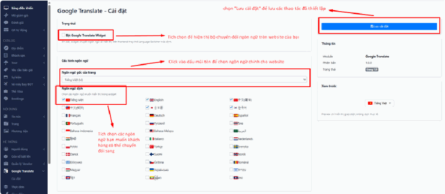
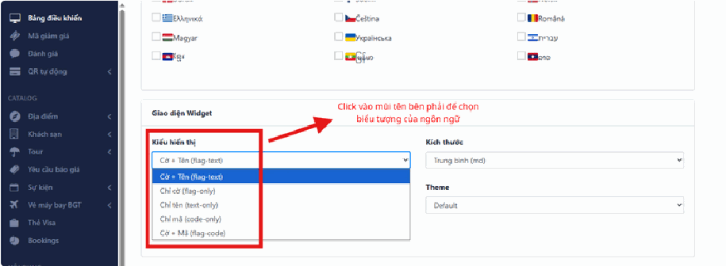
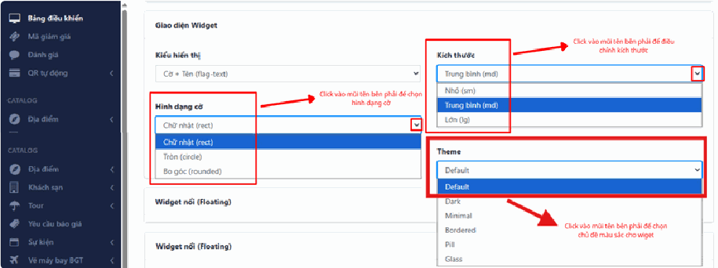
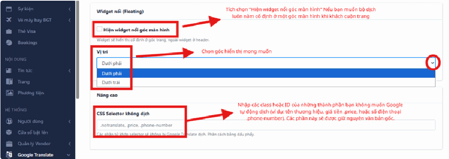
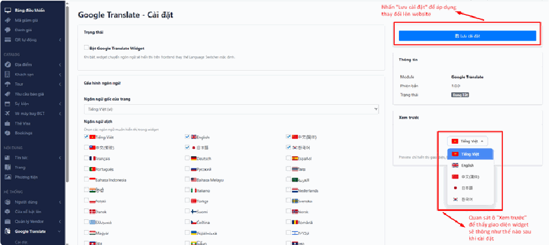

# 4.5. Google Translate

**Google Translate** gắn lên website của bạn một **nút đổi ngôn ngữ** — thường là hình lá cờ các nước. Khách nước ngoài vào web, bấm vào cờ của họ, cả trang lập tức đổi sang tiếng của họ.

Vì sao nên có? Bạn bán tour Việt Nam, khách Hàn – Nhật – Âu Mỹ vào xem nhưng không đọc được tiếng Việt, họ thoát ngay. Có nút này, ít nhất họ hiểu được bạn đang bán gì.

Cái hay là bạn **không phải dịch gì cả**. Google dịch tự động, miễn phí, ngay lập tức, cho hàng trăm thứ tiếng.

Nhưng phải nói thật ngay từ đầu:

> **Google dịch bằng máy, không phải người dịch.** Nghĩa là bản dịch **hiểu được nhưng không hay**, đôi khi buồn cười, thỉnh thoảng sai nghĩa hẳn. Tên riêng tiếng Việt rất hay bị dịch bậy — "Vịnh Hạ Long" có thể thành thứ gì đó khó đỡ.
>
> Đây là giải pháp **"có còn hơn không"**, rất tốt cho khởi đầu. Nếu bạn thật sự nghiêm túc với thị trường nước ngoài, hãy thuê người dịch cho các trang quan trọng. Đừng dùng cái này rồi yên tâm là website đã có tiếng Anh chuẩn.

> **Đường dẫn:** Menu bên trái > **Hệ thống** > **Google Translate**

> **Lưu ý:** Tính năng này có thể chưa được bật trên website của bạn. Nếu không thấy mục này trong menu, hãy liên hệ đơn vị triển khai.

## a, Kích hoạt và Thiết lập ngôn ngữ

Đây là phần bắt buộc. Ba việc cần làm, theo đúng thứ tự:

**Bật tính năng.** Tích chọn vào ô **"Bật Google Translate Widget"**. Đây là công tắc tổng — **không tích ô này thì mọi thiết lập bên dưới đều vô nghĩa**, website sẽ không hiện gì cả. Đây là lỗi phổ biến nhất: người ta ngồi chỉnh màu, chỉnh cờ rất kỹ, lưu lại, rồi ra web không thấy đâu chỉ vì quên tích ô này.

**Ngôn ngữ gốc.** Tại mục **"Ngôn ngữ gốc của trang"**, chọn ngôn ngữ **chính mà website của bạn đang viết** — với hầu hết mọi người là **Tiếng Việt**.

> **Đây là chỗ rất hay bị chọn sai, nên nói rõ:** Ô này hỏi *"website của bạn đang viết bằng tiếng gì?"* chứ **không phải** *"bạn muốn dịch sang tiếng gì?"*. Nếu web bạn viết tiếng Việt mà bạn chọn English ở đây, Google sẽ tưởng nội dung của bạn là tiếng Anh và cố dịch "tiếng Anh" đó sang các tiếng khác — kết quả là bản dịch loạn xạ, không ai đọc nổi.

**Ngôn ngữ dịch.** Tích chọn các ngôn ngữ bạn muốn khách chuyển đổi sang (English, Japanese, Korean…).

> **Mẹo — đừng tham:** Nhiều người tích hết vài chục thứ tiếng cho "chuyên nghiệp". Kết quả là nút đổi ngôn ngữ hiện ra một danh sách dài dằng dặc, khách phải cuộn mãi mới tìm thấy cờ của mình, và trên điện thoại thì nó chiếm gần hết màn hình.
>
> Hãy chọn đúng **3 đến 5 thứ tiếng** ứng với nguồn khách thật sự của bạn. Nhìn vào sổ khách của bạn năm ngoái: khách đến từ đâu nhiều nhất? Chọn đúng những nước đó. Với hầu hết công ty du lịch Việt Nam, **English + Korean + Japanese + Chinese** là quá đủ.

## b, Tùy chỉnh giao diện Widget

**"Widget"** ở đây chỉ đơn giản là **cái nút đổi ngôn ngữ** hiện trên web. Phần này để bạn chỉnh cho nó nhìn hợp với thiết kế web của bạn, không bị lạc lõng.

Đây là phần **làm đẹp, không bắt buộc**. Nếu bạn đang vội, cứ để mặc định — nó vẫn chạy tốt. Quay lại chỉnh sau cũng được.

**Kiểu hiển thị** — chọn nút sẽ hiện ra dạng nào:

- **Chỉ cờ** — gọn nhất, nhìn là hiểu ngay, không tốn chỗ.
- **Chỉ tên** — hiện chữ "English", "Tiếng Việt"…
- **Cờ + Tên** — vừa cờ vừa chữ, rõ ràng nhất nhưng tốn diện tích nhất.

> **Mẹo:** Nếu bạn chọn nhiều thứ tiếng, hãy dùng **Chỉ cờ** cho gọn. Nếu chỉ có 2-3 thứ tiếng, **Cờ + Tên** rõ ràng hơn và khách không phải đoán.

**Kích thước & Hình dạng** — điều chỉnh kích thước (Trung bình, Nhỏ…) và hình dạng cờ (Chữ nhật, Tròn).

> **Cẩn thận:** Đừng chọn kích thước quá **Nhỏ**. Bạn ngồi trước màn hình máy tính lớn thấy vẫn rõ, nhưng khách xem bằng điện thoại sẽ không bấm trúng bằng ngón tay. Nút quá nhỏ = khách không dùng được = coi như không có.

**Theme** — chọn chủ đề màu sắc cho widget. Hãy chọn tông **tương phản với nền web của bạn**: web nền sáng thì chọn widget tối, web nền tối thì chọn widget sáng. Cùng tông thì nút bị chìm, khách nhìn không ra.

## c, Cấu hình Widget nổi (Floating) và Thiết lập nâng cao (CSS

## Selector)

### Widget nổi — nút luôn bám theo màn hình

**"Nổi" (Floating)** nghĩa là nút **dính cố định vào một góc màn hình** và luôn ở đó, kể cả khi khách cuộn xuống cuối trang.

Vì sao nên bật? Vì nếu nút chỉ nằm ở đầu trang, khách đã cuộn xuống giữa bài mới nhận ra mình không đọc được thì phải cuộn ngược lên đầu để tìm nút. Nhiều người sẽ không làm vậy, họ thoát luôn. Nút nổi thì lúc nào cũng trong tầm với.

Cách bật:

- Tích chọn **"Hiện widget nổi góc màn hình"**.
- **Vị trí** — chọn góc hiển thị: Dưới phải, Dưới trái, Trên phải…

> **Cẩn thận:** Góc **dưới phải** là chỗ đông đúc nhất — thường đã có sẵn nút chat Zalo/Messenger, nút gọi điện, nút lên đầu trang… Đặt thêm vào đó thì các nút chồng lên nhau, che nhau, khách bấm nhầm.
>
> **Cách kiểm tra:** Chọn vị trí xong, lưu lại, rồi mở website của bạn ra **bằng điện thoại**, cuộn thử từ đầu tới cuối trang. Nếu thấy nút bị che hoặc che mất cái gì đó, hãy quay vào đổi sang góc khác. Máy tính màn hình rộng nên không phát hiện ra được — phải thử bằng điện thoại.

### CSS Selector không dịch — giữ nguyên những gì không nên dịch

Nghe rất kỹ thuật, nhưng ý tưởng thì đơn giản: **có những thứ trên web KHÔNG NÊN để Google dịch.**

Ví dụ rất thật:

- **Tên thương hiệu của bạn** — công ty "Ánh Dương Travel" bị dịch thành "Sunshine Travel" thì khách nước ngoài tìm bạn trên Google bằng cái tên nào?
- **Giá tiền** — Google có thể làm hỏng định dạng số, `1.500.000đ` biến thành thứ gì đó khó hiểu, khách tưởng giá khác hẳn.
- **Số điện thoại** — bị chèn thêm dấu, thêm khoảng trắng, khách gọi không được.

Ô này là nơi bạn **chỉ đích danh những phần cần bỏ qua**. Bạn nhập các class hoặc ID của những thành phần không muốn Google tự động dịch — ví dụ `.price` cho giá tiền, `.phone-number` cho số điện thoại. Các phần này sẽ được giữ nguyên văn bản gốc.

> **Nói thẳng:** Đây là phần **duy nhất trong bài cần kiến thức kỹ thuật**. Những cái tên như `.price` không phải bạn tự nghĩ ra mà đúng — chúng phải khớp chính xác với cách website của bạn được xây dựng. Gõ đại vào thì không có tác dụng gì (may) hoặc làm hỏng hiển thị (rủi).
>
> **Nếu bạn không rành, hãy để trống ô này.** Website vẫn chạy bình thường. Khi nào bạn thấy giá tiền hoặc tên công ty bị dịch sai, hãy **chụp màn hình chỗ đó gửi cho đơn vị triển khai** — họ điền giúp bạn trong 2 phút. Đó là cách đúng, không phải là bạn kém.

## d, Kiểm tra và Lưu

**Xem trước.** Quan sát ô **"Xem trước"** ở **cột bên phải** để thấy widget sẽ trông như thế nào sau khi cài đặt.

Đây là tính năng rất đáng dùng: bạn thấy ngay kết quả mà **chưa cần lưu**, chưa ảnh hưởng gì tới khách đang xem web. Hãy chỉnh — nhìn ô xem trước — chỉnh tiếp, cho tới khi ưng mắt rồi mới lưu.

**Lưu cài đặt.** Sau khi hoàn tất, nhấn nút **"Lưu cài đặt"** màu xanh ở **góc trên bên phải** để áp dụng thay đổi lên website.

> **Ô xem trước không phải là website thật.** Nó chỉ cho bạn thấy cái nút trông ra sao, chứ không cho thấy nút đó nằm ở đâu và có che gì không. **Sau khi lưu, hãy mở website thật ra kiểm tra** — bằng cả máy tính lẫn điện thoại.

## Lưu ý & xử lý sự cố

**Đã lưu rồi nhưng ngoài website không thấy nút đâu.**
Kiểm tra lần lượt, theo mức độ thường gặp:

1. **Quên tích ô "Bật Google Translate Widget"** — nguyên nhân số 1. Quay lại phần a, tích ô đó và lưu lại.
2. **Chưa nhấn "Lưu cài đặt"** — chỉnh xong mà không lưu thì không có gì thay đổi.
3. **Trình duyệt giữ bản cũ** — nhấn **Ctrl + F5** trên trang web để tải lại sạch.
4. **Nút bị chìm vào nền** — chọn Theme khác cho tương phản hơn, hoặc tăng kích thước lên.

**Bản dịch sai be bét, có chỗ buồn cười.**
Đây là **giới hạn của máy dịch, không phải lỗi hệ thống của bạn**, và bạn không sửa được từ phía này. Nếu chỉ một vài chỗ quan trọng bị sai (tên công ty, giá tiền), hãy dùng phần **CSS Selector không dịch** để loại chúng ra — nhờ đơn vị triển khai điền giúp.

**Tên công ty tôi bị dịch sang tiếng Anh.**
Đúng như dự đoán ở phần c. Chụp màn hình chỗ bị dịch sai và gửi cho đơn vị triển khai, họ sẽ thêm vào danh sách không dịch.

**Nút đè lên nút chat Zalo/Messenger.**
Vào phần widget nổi, đổi sang **góc khác**. Nhớ kiểm tra lại bằng điện thoại chứ không chỉ trên máy tính.

**Bố cục web bị vỡ sau khi dịch.**
Chuyện này bình thường: tiếng Đức hay tiếng Nga dài hơn tiếng Việt nhiều, chữ tràn ra khỏi khung. Nếu nghiêm trọng, cách xử lý thực tế nhất là **bỏ bớt ngôn ngữ đó** ra khỏi danh sách.

**Website tải chậm hẳn sau khi bật.**
Widget cần tải thêm dữ liệu từ Google nên có chậm hơn một chút — đây là cái giá phải trả. Nếu chậm rõ rệt, hãy giảm bớt số ngôn ngữ đã chọn.

## Xem thêm

- [4. Khối HỆ THỐNG](README.md)
- [4.7. Giao diện](giao-dien.md)
