# 4.1. Người dùng

**Người dùng** là tất cả những ai có tài khoản trên website của bạn. Không chỉ nhân viên công ty bạn, mà cả:

- **Nhân viên của bạn** — người đăng tour, người trực đơn hàng, kế toán.
- **Khách hàng** — người tự đăng ký tài khoản trên web để đặt tour, đặt phòng.
- **Vendor (nhà cung cấp)** — đối tác bán dịch vụ trên website của bạn.

Đây là mục bạn vào khi: có nhân viên mới cần cấp tài khoản, nhân viên nghỉ việc cần khóa tài khoản, ai đó quên mật khẩu, hoặc bạn muốn giới hạn nhân viên nào được xem cái gì.

> **Đường dẫn:** Menu bên trái > **Hệ thống** > **Người dùng**

> **Con số màu vàng bên cạnh chữ "Người dùng" là gì?** Đó **không phải** tổng số người dùng. Đó là **số yêu cầu xác minh đang chờ bạn duyệt** — tức là số việc đang chờ bạn xử lý. Số này về 0 nghĩa là bạn đã duyệt hết. Xem mục [Yêu cầu xác minh](#yeu-cau-xac-minh) ở cuối bài.

## Trong mục này có gì?

Nhấn vào **Người dùng** ở menu bên trái, danh sách sẽ xổ xuống các mục con sau:

- **Tất cả người dùng** — danh sách toàn bộ tài khoản. Nơi bạn thêm người, sửa thông tin, đổi mật khẩu hộ, khóa tài khoản.
- **Nhóm khách hàng** — gom khách thành từng nhóm để dễ quản lý (ví dụ: Khách VIP, Khách đoàn, Đối tác).
- **Quản lý vai trò** — nơi quyết định **ai được làm gì**. Quan trọng nhất và cũng dễ gây rắc rối nhất. Đọc kỹ phần này.
- **Người đăng ký** — danh sách email khách để lại để nhận tin khuyến mãi.
- **Yêu cầu xác minh** — hàng chờ các tài khoản gửi giấy tờ lên xin được xác minh, chờ bạn duyệt. *(Mục này chỉ hiện khi tính năng xác minh đang được bật.)*

---

## Tất cả người dùng

Vào đây bạn sẽ thấy một bảng danh sách: mỗi dòng là một người.

## a, Tìm kiếm người dùng

Khi danh sách còn 20 người thì bạn nhìn mắt thường cũng thấy. Nhưng khi có vài nghìn khách đăng ký, cuộn tay tìm là bất khả thi. Bộ lọc sinh ra để giải quyết chuyện đó.

Bạn có 3 cách lọc, và **dùng kết hợp được cả 3 cùng lúc**:

- **Tìm theo tên** — gõ tên vào ô **"Tìm kiếm theo tên"** ở góc trên bên phải. Không cần gõ đủ họ tên, gõ một phần cũng ra (gõ `hùng` sẽ ra cả "Nguyễn Văn Hùng").
- **Lọc theo vai trò** — chọn trong danh sách xổ xuống: Administrator, Vendor, Customer, Admin… Dùng khi bạn muốn xem "danh sách toàn bộ nhân viên quản trị" hoặc "danh sách toàn bộ đối tác".
- **Lọc theo nhóm** — xem những người thuộc một nhóm khách hàng cụ thể (ví dụ chỉ xem nhóm Khách VIP).

Chọn xong tiêu chí, nhấn nút **"Tìm Kiếm Người Dùng"** màu xanh. **Danh sách sẽ không tự đổi nếu bạn chưa nhấn nút này** — đây là lỗi rất nhiều người mắc: chọn xong rồi ngồi thắc mắc sao không thấy gì thay đổi.

> **Mẹo:** Muốn quay lại xem toàn bộ danh sách? Xóa trắng ô tìm kiếm, đưa các ô lọc về mặc định rồi nhấn tìm lại. Hoặc đơn giản nhất: nhấn lại vào mục **"Tất Cả Người Dùng"** trong menu bên trái.

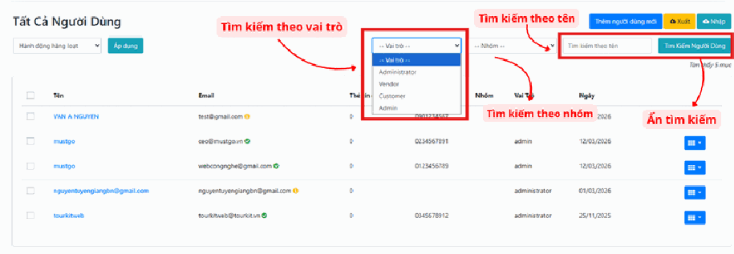

## b, Hành động hàng loạt

**Hành động hàng loạt** nghĩa là: xử lý nhiều tài khoản cùng lúc thay vì mở từng người ra sửa. Ví dụ bạn cần xóa 30 tài khoản rác đăng ký spam — làm hàng loạt mất 1 phút, làm thủ công mất nửa tiếng.

Cách làm gồm 3 bước, **thiếu bước nào cũng không chạy**:

- **Bước 1: Chọn người.** Tích vào ô vuông nhỏ ở **cột đầu tiên bên trái** của từng dòng bạn muốn xử lý. Nếu muốn chọn tất cả, tích vào ô vuông **trên cùng** (ở dòng tiêu đề bảng) — nó sẽ tự tích hết các dòng đang hiển thị.

- **Bước 2: Chọn việc cần làm.** Ở ô **"Hành động hàng loạt"** (góc trên bên trái), chọn thao tác: Xóa, thay đổi trạng thái…

- **Bước 3: Nhấn nút "Áp dụng"** ngay bên cạnh. **Đây là bước hay bị quên nhất.** Chọn xong ở Bước 2 mà không nhấn "Áp dụng" thì tuyệt đối không có gì xảy ra.

> **Cẩn thận:** Ô tích "chọn tất cả" chỉ chọn những người **đang hiện trên trang này**, không phải toàn bộ hệ thống. Nếu danh sách chia thành nhiều trang, bạn phải làm lần lượt từng trang.
>
> **Cẩn thận hơn nữa:** Hành động **"Xóa"** áp dụng cho nhiều người là thao tác không có nút hoàn tác dễ dàng. Trước khi nhấn "Áp dụng" với lệnh Xóa, hãy nhìn lại một lượt xem mình có lỡ tích nhầm tài khoản quản trị viên hay khách hàng thật không.

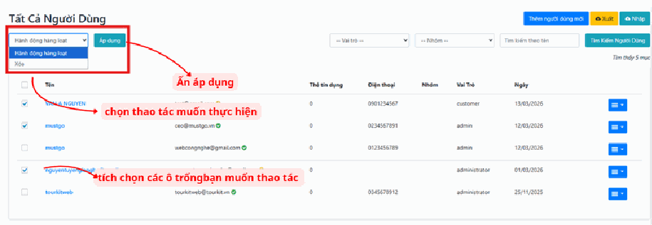

## c, Thêm người dùng mới

Dùng khi công ty có nhân viên mới, hoặc bạn cần tạo tài khoản hộ cho một khách/đối tác.

- Nhấn nút màu xanh dương **"Thêm người dùng mới"** ở góc trên cùng bên phải.

- Một biểu mẫu hiện ra để bạn điền các thông tin cơ bản: **Tên**, **Email**, **Số điện thoại**, và quan trọng nhất là **Vai trò** (phân quyền) cho người đó.

**Những điểm cần chú ý khi điền:**

- **Email phải là email thật và chưa ai dùng.** Hệ thống dùng email làm "chứng minh thư" của tài khoản — mỗi email chỉ tạo được một tài khoản. Nếu báo lỗi email đã tồn tại, nghĩa là người này đã có tài khoản rồi, bạn chỉ cần đi tìm và sửa vai trò cho họ thay vì tạo mới.
- **Đừng copy-paste email từ Zalo/Excel rồi dán thẳng.** Rất hay bị dính dấu cách thừa ở đầu hoặc cuối, khiến tài khoản không đăng nhập được mà bạn nhìn bằng mắt không phát hiện ra. An toàn nhất là gõ tay.
- **Vai trò — nghĩ kỹ trước khi chọn.** Đây là thứ quyết định người này thấy được gì trong hệ thống. Đọc phần [Quản lý vai trò](#quan-ly-vai-tro) bên dưới trước khi chọn. Nguyên tắc vàng: **cấp đúng đủ dùng, không cấp thừa**.
- **Mật khẩu:** sau khi tạo xong, bạn nhớ báo mật khẩu cho người đó và dặn họ tự đổi lại ngay lần đăng nhập đầu tiên.

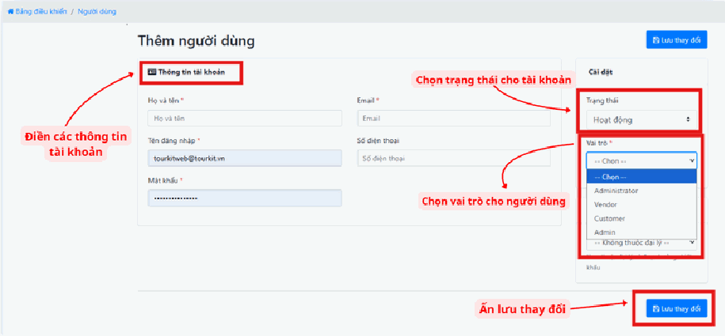

## d, Xuất và Nhập dữ liệu (Excel)

Hai nút này nằm ở góc phải màn hình, cạnh nút thêm mới. Chúng giải quyết bài toán: bạn có sẵn danh sách hàng trăm người trong file Excel, không lẽ ngồi gõ tay từng người.

**Nút "Xuất" (màu vàng)** — hệ thống trích toàn bộ danh sách người dùng hiện có ra một file Excel tải về máy bạn. Dùng khi: cần làm báo cáo, cần gửi danh sách cho sếp, hoặc muốn **sao lưu dự phòng** trước khi làm một thao tác nguy hiểm nào đó.

> **Mẹo cực hữu ích:** Trước khi làm bất cứ thao tác hàng loạt nào có chữ "Xóa", hãy bấm **"Xuất"** một lần để có bản Excel dự phòng. Lỡ có sai, bạn vẫn còn dữ liệu để nhập lại.

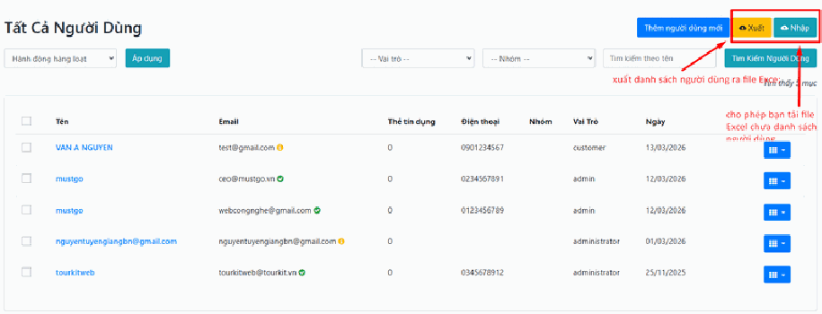

**Nút "Nhập" (màu xanh lá)** — cho phép bạn tải lên một file Excel chứa danh sách người dùng số lượng lớn, thay vì thêm thủ công từng người.

Cách làm an toàn:

1. Bấm **"Xuất"** trước để lấy một file Excel mẫu — file này có sẵn đúng các cột mà hệ thống cần.
2. Mở file đó ra, **giữ nguyên dòng tiêu đề (dòng đầu tiên)**, xóa dữ liệu cũ đi và điền danh sách mới của bạn vào theo đúng cột.
3. Lưu lại rồi bấm **"Nhập"** và chọn file đó lên.

> **Lưu ý:** Không tự thêm cột, không đổi tên cột, không xóa dòng tiêu đề. Hệ thống đọc file theo đúng tên cột — sai một chữ là báo lỗi hoặc nhập vào sai chỗ. Nếu nhập lần đầu, hãy thử với **3-5 dòng trước**, kiểm tra kết quả đúng rồi mới nhập cả nghìn dòng.

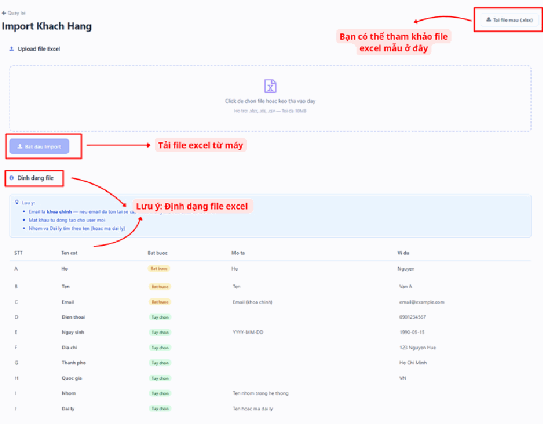

## e, Thao tác chỉnh sửa tài khoản người dùng

Tại mỗi dòng người dùng, nhấn vào biểu tượng menu màu xanh (**hình 9 ô vuông**) ở **cuối dòng** để hiện các tùy chọn.

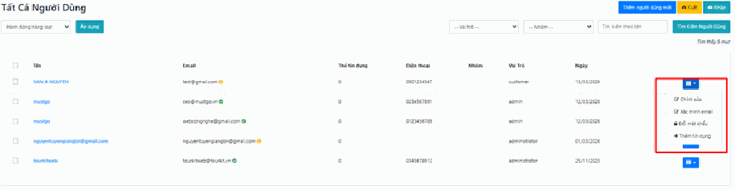

Các tùy chọn trong menu 9 ô vuông đó gồm:

**Chỉnh sửa** — thay đổi thông tin cá nhân, số điện thoại, hoặc **vai trò** của người dùng đó. Đây là chỗ bạn vào khi nhân viên được thăng chức (cần thêm quyền) hoặc chuyển bộ phận (cần đổi quyền).

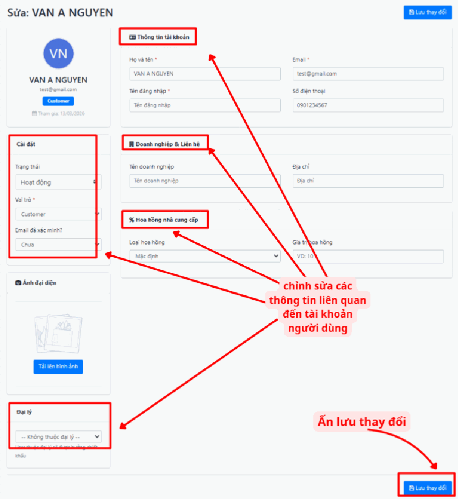

**Xác minh email** — "xác minh" nghĩa là chứng minh email đó có thật và người đó thật sự sở hữu nó (giống như bạn phải bấm vào link trong mail để kích hoạt tài khoản). Cách nhận biết và xử lý:

- **Quan sát biểu tượng ngay cạnh Email:**
  - **Dấu tích xanh** = email đã được xác minh, yên tâm.
  - **Dấu chấm than màu vàng** = chưa xác minh.
- **Bạn có 2 cách xử lý** khi thấy dấu chấm than vàng:
  - Nhấn **"Xác minh email"** trong menu để **xác nhận thủ công** — dùng khi bạn chắc chắn đó là email thật (ví dụ nhân viên ngồi ngay cạnh bạn).
  - **Gửi yêu cầu xác thực** về email của người dùng — hệ thống gửi mail cho họ, họ tự bấm xác nhận. Cách này an toàn hơn.

> **Nếu người dùng báo không nhận được mail xác thực:** bảo họ kiểm tra hộp thư **Spam / Thư rác** trước đã — mail tự động rất hay bị lọc vào đó. Nếu thật sự không có, khả năng cao là email điền sai chính tả.

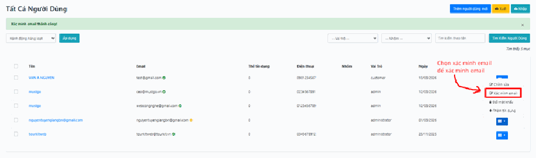

**Đổi mật khẩu** — cũng mở menu 9 ô màu xanh rồi chọn **"Đổi mật khẩu"**. Dùng khi người dùng quên mật khẩu và không tự lấy lại được, hoặc khi bạn cần tăng bảo mật (ví dụ nghi ngờ tài khoản bị lộ).

> **Lưu ý:** Bạn đặt mật khẩu mới ở đây thì mật khẩu cũ của họ **mất hiệu lực ngay lập tức**. Nhớ báo mật khẩu mới cho họ, nếu không họ sẽ gọi điện hỏi tại sao không đăng nhập được. Nên dặn họ tự đổi lại ngay sau khi vào được.

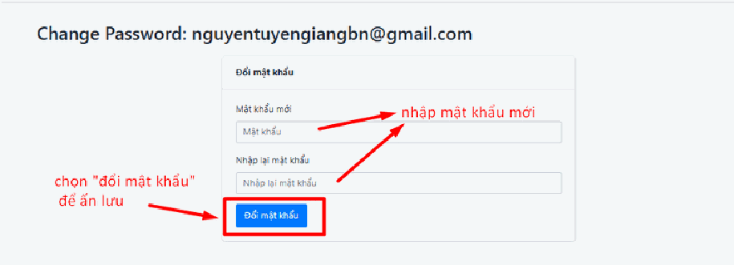

**Thêm tín dụng** — cũng mở menu 9 ô màu xanh rồi chọn **"Thêm tín dụng"**. Dùng để cập nhật số dư hoặc hạn mức cho tài khoản, hiển thị ở cột **"Thẻ tín dụng"** trong bảng danh sách.

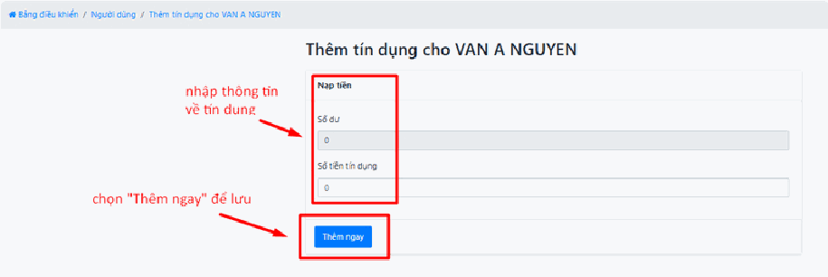

---

## Nhóm khách hàng

**Nhóm khách hàng** là cách bạn gom nhiều người thành một nhóm để quản lý cho gọn: Khách VIP, Khách đoàn, Đối tác lữ hành, Khách Outbound…

Lợi ích thực tế: thay vì nhớ trong đầu "chị Lan, anh Hùng, công ty ABC là khách VIP", bạn gắn họ vào nhóm **Khách hàng VIP**. Sau này chỉ cần lọc theo nhóm là ra ngay cả danh sách.

Các thao tác **"Tìm kiếm"** và **"Hành động hàng loạt"** ở đây làm giống hệt như đã hướng dẫn ở phần Tất cả người dùng phía trên.

## Thêm nhóm khách hàng mới

**Bước 1: Mở form thêm mới.**

Nhấn nút màu xanh dương **"Thêm nhóm mới"** ở góc trên cùng bên phải màn hình.

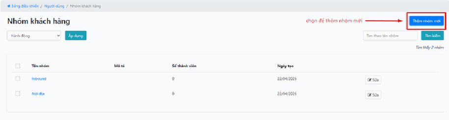

**Bước 2: Nhập thông tin nhóm.**

Sau khi nhấn nút, một cửa sổ (hoặc một trang mới) hiện ra để bạn điền:

- **Tên nhóm** — tên gọi để bạn nhận ra nhóm này. Ví dụ: `Khách hàng VIP`, `Đối tác tiềm năng`, `Khách Outbound`. Hãy đặt tên mà **6 tháng sau bạn đọc lại vẫn hiểu** — tránh đặt kiểu `Nhóm 1`, `Nhóm test`.
- **Mô tả** — viết tóm tắt đặc điểm của nhóm. Ví dụ: *"Khách đã đặt từ 3 tour trở lên, được giảm 10%"*. Phần này để bạn và đồng nghiệp nhớ tiêu chí, tránh mỗi người hiểu một kiểu.

**Bước 3: Lưu thông tin.**

Nhấn nút **"Lưu"** (hoặc **"Xác nhận"**) để hoàn tất việc tạo nhóm.

> **Sau khi tạo nhóm xong thì làm gì?** Nhóm mới tạo là nhóm rỗng, chưa có ai trong đó. Muốn đưa người vào nhóm, bạn quay lại **Tất cả người dùng**, mở người đó ra bằng chức năng **Chỉnh sửa** và gán nhóm cho họ.

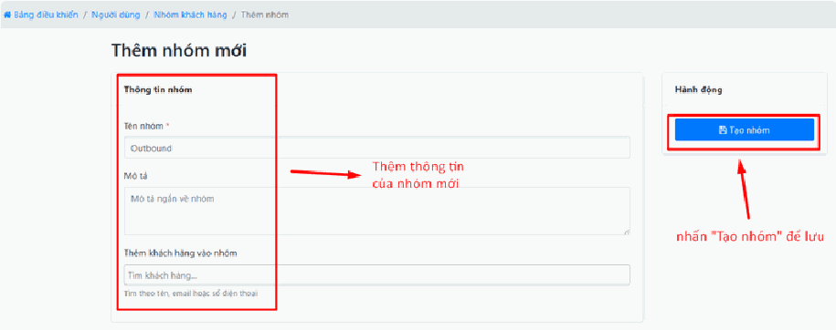

---

## Quản lý vai trò

**Đây là phần quan trọng nhất của cả bài. Hãy đọc chậm.**

**Vai trò (Role) = một bộ quyền hạn.** Nó quyết định người mang vai trò đó **nhìn thấy gì** và **làm được gì** trong hệ thống.

Hình dung như chìa khóa trong một khách sạn:

- **Chìa của khách** — chỉ mở được đúng phòng của họ.
- **Chìa của nhân viên buồng phòng** — mở được các phòng để dọn, nhưng không mở được két sắt hay phòng kế toán.
- **Chìa vạn năng của giám đốc** — mở được mọi cửa.

Vai trò trên hệ thống chính là những "chìa khóa" đó. Bạn **không cấp quyền cho từng người**, mà bạn **cấp vai trò cho người**, còn vai trò thì đã chứa sẵn bộ quyền.

Lợi ích: công ty có 20 nhân viên kinh doanh, bạn chỉ cần thiết lập vai trò "Kinh doanh" **một lần**, rồi gán cho cả 20 người. Sau này muốn cho cả 20 người thêm quyền gì, bạn sửa **một chỗ** — không phải mở 20 tài khoản ra sửa.

**Các vai trò thường có sẵn trên hệ thống:**

- **Administrator** — quản trị viên cao nhất, làm được mọi thứ. Chỉ nên có 1-2 người.
- **Admin** — quản trị viên, quyền hạn hẹp hơn tùy cấu hình.
- **Vendor** — nhà cung cấp/đối tác, chỉ quản lý được dịch vụ của chính họ.
- **Customer** — khách hàng thường, chỉ xem được đơn hàng của mình.

### Màn hình quản lý vai trò có gì?

Tại màn hình này, bạn theo dõi tổng quan các vai trò đã được thiết lập, gồm các cột:

- **ID** — mã số của vai trò trên hệ thống. Bạn không cần quan tâm, đây là số máy tự sinh.
- **Tên** — tên hiển thị của vai trò (Administrator, Vendor, Customer, Admin…).
- **Mã** — mã định dạng nội bộ dùng cho hệ thống. Bạn cũng không cần quan tâm.
- **Ngày** — thời gian vai trò này được tạo ra.

Thao tác **"Hành động hàng loạt"** và **"Chỉnh sửa"** làm tương tự các phần trước.

> **Cẩn thận nghiêm túc:** **Đừng xóa vai trò** khi vẫn còn người đang mang vai trò đó. Hậu quả: những người đó đăng nhập vào sẽ không thấy gì, hoặc bị chặn ở mọi cửa, và bạn sẽ nhận một loạt cuộc gọi báo "em không vào được". Muốn xóa một vai trò, hãy **chuyển hết người sang vai trò khác trước**, rồi mới xóa.

## a, Thêm vai trò mới

Bạn cần thêm vai trò mới khi các vai trò có sẵn không khớp với thực tế công ty. Ví dụ bạn muốn có vai trò **"Kế toán"** — chỉ được xem đơn hàng và doanh thu, không được sửa tour, không được đụng vào tài khoản người khác.

- Nhấn nút màu xanh dương **"Thêm vai trò mới"** ở góc trên bên phải.

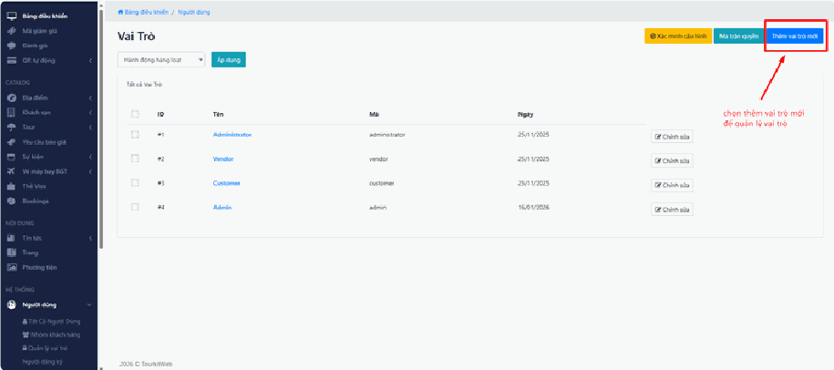

- Bạn cần nhập **tên vai trò** và thiết lập các **quyền hạn cụ thể** cho vai trò mới này: được xem, được sửa, hay được xóa những mục nào.

> **Mẹo đặt tên:** Đặt theo **chức danh thực tế** trong công ty bạn: `Kế toán`, `Nhân viên kinh doanh`, `Trưởng phòng Tour`, `Cộng tác viên`. Tránh đặt `Vai trò 2`, `Test`, `Nhân viên mới` — vài tháng sau không ai nhớ nổi vai trò đó cho ai.

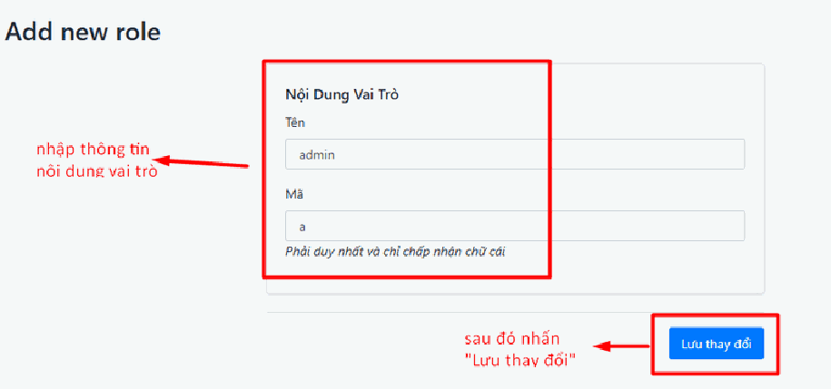

## b, Xác minh cấu hình

Nút **"Xác minh cấu hình"** (màu vàng) dùng để quản lý **Trường dữ liệu tùy chỉnh** — hiểu đơn giản là các **ô thông tin thêm** mà bạn tự nghĩ ra, hệ thống không có sẵn.

Tác dụng: bạn thiết lập thêm các yêu cầu thông tin riêng biệt cho từng đối tượng người dùng. Ví dụ với đối tác lữ hành, bạn muốn họ phải nộp thêm **Giấy phép kinh doanh lữ hành** thì thêm một trường ở đây.

> **Lưu ý:** Đây là phần cấu hình nâng cao. Nếu bạn chưa có nhu cầu rõ ràng, cứ để nguyên mặc định — không thiết lập gì ở đây thì hệ thống vẫn chạy bình thường.

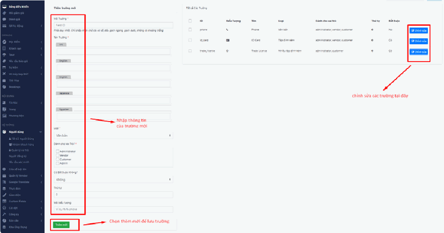

## c, Cách thiết lập quyền hạn

Đây là tính năng quan trọng để quản lý bảo mật thông tin — **nơi bạn quyết định ai được chạm vào cái gì**.

- Nhấn nút **"Ma trận quyền"** (màu xanh lá cây).

- Hệ thống hiển thị một **bảng lưới**: cột là các vai trò, dòng là các hành động cụ thể. Cách đọc bảng này: bạn dò theo dòng (hành động) và cột (vai trò), ô giao nhau chính là câu trả lời cho câu hỏi *"Vai trò này có được làm việc kia không?"*

- **Cấp quyền:** tích chọn vào ô vuông tương ứng để cho phép vai trò đó thực hiện hành động (ô sẽ hiện **dấu tích xanh**).

- **Chặn quyền:** để **trống** ô vuông nếu muốn vai trò đó không được truy cập hoặc thao tác.

**Hậu quả khi cấp nhầm quyền — đọc kỹ phần này:**

- **Cấp thừa quyền** là rủi ro lớn nhất, và nguy hiểm ở chỗ nó **không báo lỗi gì cả** nên bạn không biết mình đã sai. Ví dụ lỡ tay tích ô cho phép nhân viên thời vụ được **xóa** tour: một ngày nào đó bạn mất sạch dữ liệu tour mà không hiểu vì sao. Hoặc cho nhân viên kinh doanh quyền xem **Người dùng**: họ tải được toàn bộ danh sách khách hàng của bạn ra file Excel và mang đi.
- **Cấp thiếu quyền** thì ít nguy hiểm hơn, dấu hiệu rất rõ: nhân viên báo "em không thấy mục đó trong menu" hoặc bấm vào thì báo không có quyền truy cập. Chỉ cần vào tích thêm ô là xong.

> **Nguyên tắc an toàn — hãy nhớ 3 điều này:**
>
> 1. **Cấp đúng đủ dùng.** Người ta cần làm việc gì thì cấp đúng quyền cho việc đó. Đừng cấp "cho chắc ăn" hay "cho tiện sau này".
> 2. **Quyền Xóa là quyền nguy hiểm nhất.** Sửa sai còn sửa lại được, xóa mất thì rất khó lấy lại. Chỉ cấp quyền xóa cho người bạn thật sự tin tưởng.
> 3. **Đừng tự sửa quyền của chính vai trò mình đang dùng.** Nếu bạn đang là Administrator mà lỡ tay bỏ tích quyền quản lý vai trò của chính mình, bạn sẽ **tự khóa mình ra ngoài** và không tự sửa lại được — phải nhờ đơn vị kỹ thuật can thiệp.
>
> **Mẹo kiểm tra:** Sau khi sửa ma trận quyền, hãy nhờ chính nhân viên đó **đăng xuất rồi đăng nhập lại** và thử làm việc của họ. Đây là cách duy nhất chắc chắn để biết bạn cấp đúng hay chưa.

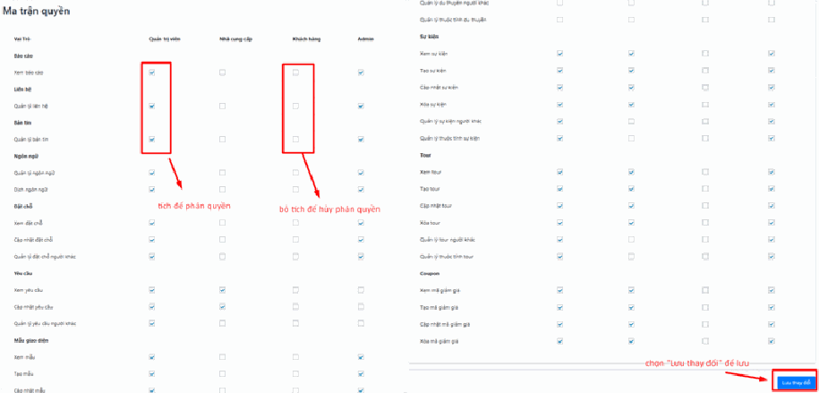

---

## Người đăng ký

**Người đăng ký** (Subscriber) là những người đã điền email vào ô **"Đăng ký nhận tin"** trên website của bạn — thường nằm ở cuối trang. Họ chưa chắc đã là khách hàng, họ mới chỉ quan tâm và muốn nhận tin khuyến mãi.

Đây là **tài sản marketing** của bạn: danh sách người sẵn sàng đọc email khuyến mãi từ bạn.

Các thao tác **"Hành động hàng loạt"** và **"Tìm kiếm"** làm tương tự như các phần trước.

## a, Thêm người đăng ký mới

Dùng khi bạn có email khách thu được ngoài đời (tại hội chợ du lịch, qua Zalo, danh thiếp…) và muốn đưa vào danh sách.

Sử dụng biểu mẫu ở **cột bên trái** để thêm thủ công:

- **Email** — nhập địa chỉ email của người đăng ký. Đây là ô quan trọng nhất, sai là mất liên lạc.
- **Điện thoại** — nhập số điện thoại liên lạc.
- **Tên & Họ** — điền đầy đủ thông tin định danh, để sau này gửi mail còn xưng hô đúng tên.
- **Xác nhận** — nhấn nút **"Thêm mới"** màu xanh dương để lưu vào hệ thống. Thành công thì hệ thống hiện thông báo **"Người đăng ký đã được cập nhật"**.

> **Lưu ý:** Nếu bấm "Thêm mới" mà **không thấy thông báo nào**, nghĩa là chưa lưu được. Hãy kiểm tra lại ô Email — thường là do email sai định dạng (thiếu dấu `@`, thừa dấu cách do copy-paste) hoặc email này đã có trong danh sách rồi.

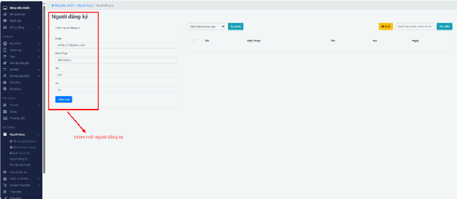

## b, Xuất dữ liệu (Excel)

Nhấn nút **"Xuất"** (màu vàng) để tải danh sách người đăng ký về máy tính dưới định dạng file Excel.

Dùng khi bạn muốn mang danh sách này sang một công cụ gửi email hàng loạt, hoặc chỉ đơn giản là sao lưu để yên tâm.

> **Cẩn thận:** File Excel này chứa **thông tin cá nhân của khách hàng**. Đừng gửi lung tung qua Zalo/Facebook, đừng để trên máy dùng chung. Đây vừa là chuyện đạo đức kinh doanh, vừa là chuyện pháp lý về bảo vệ dữ liệu cá nhân.

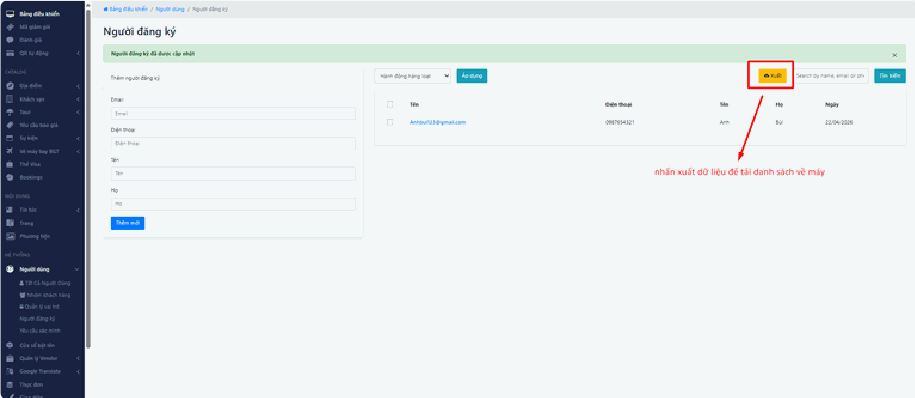

---

## Yêu cầu xác minh

**Xác minh** ở đây nghĩa là: một người dùng (thường là **Vendor** — nhà cung cấp muốn bán dịch vụ trên website của bạn) gửi giấy tờ chứng minh họ là đơn vị có thật, và **chờ bạn duyệt**.

Đây chính là nơi tạo ra **con số màu vàng** bên cạnh chữ "Người dùng" trong menu. Con số đó = **số yêu cầu đang chờ bạn xử lý**. Thấy số đó khác 0 nghĩa là có người đang chờ bạn, nên vào xem.

Hệ thống cho phép bạn lọc nhanh danh sách yêu cầu theo trạng thái:

- **Tất cả xác minh** — hiển thị toàn bộ lịch sử các yêu cầu, cả cũ lẫn mới.
- **Đang chờ** — các yêu cầu mới gửi, **cần được phê duyệt**. Đây là mục bạn nên vào đầu tiên, nó chính là danh sách việc cần làm của bạn.
- **Đã phê duyệt** — các tài khoản đã xác minh thành công. Chỉ để tra cứu lại.

> **Nên duyệt sớm:** Người gửi yêu cầu đang chờ bạn để bắt đầu bán hàng. Để hàng chờ tồn đọng nhiều ngày là bạn đang làm chậm việc kinh doanh của chính mình.
>
> **Nhưng đừng duyệt bừa:** Duyệt nghĩa là bạn xác nhận đơn vị này có thật và đủ điều kiện. Hãy mở giấy tờ họ gửi ra xem thật sự, đừng bấm duyệt hàng loạt cho nhanh — vì sau khi được duyệt, họ sẽ đăng dịch vụ lên website mang tên bạn.

> **Lưu ý:** Mục **"Yêu cầu xác minh"** chỉ hiện trong menu khi tính năng xác minh đang được bật. Nếu bạn không thấy mục này, có nghĩa website của bạn đã tắt tính năng xác minh — không phải lỗi. Muốn bật, hãy liên hệ đơn vị triển khai.

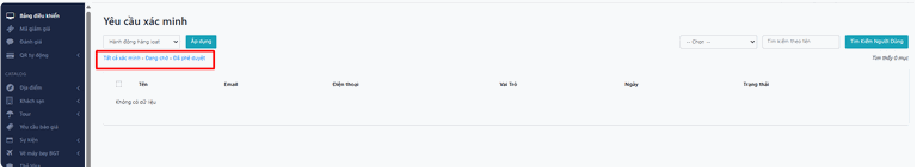

---

## Lưu ý & xử lý sự cố

**Nhân viên báo "em đăng nhập được nhưng không thấy mục X trong menu".**
Đây không phải lỗi. Vai trò của họ chưa được cấp quyền xem mục đó. Vào **Quản lý vai trò > Ma trận quyền**, tìm dòng tương ứng và tích thêm ô cho vai trò của họ. Sau đó bảo họ **đăng xuất và đăng nhập lại** thì mới thấy.

**Tạo người dùng mới nhưng báo lỗi email đã tồn tại.**
Email này đã có tài khoản trên hệ thống rồi. Đừng cố tạo mới — hãy vào **Tất cả người dùng**, gõ email đó vào ô tìm kiếm để tìm ra tài khoản cũ, rồi sửa vai trò cho họ.

**Người dùng nói không đăng nhập được dù mật khẩu đúng.**
Kiểm tra theo thứ tự này:

1. Họ có bật nhầm **Caps Lock** không (mật khẩu phân biệt chữ HOA/thường).
2. Họ có bật **Unikey** khiến mật khẩu gõ ra thành chữ có dấu không — cần chuyển về chế độ **E**.
3. Họ có copy-paste email/mật khẩu và bị **dính dấu cách thừa** không.
4. Nếu vẫn không được, dùng chức năng **"Đổi mật khẩu"** trong menu 9 ô để cấp mật khẩu mới cho họ.

**Tôi lỡ xóa nhầm người dùng.**
Đây là lý do tại sao nên bấm **"Xuất"** ra Excel trước mỗi lần làm hàng loạt. Nếu có file Excel, bạn dùng nút **"Nhập"** để đưa lại. Nếu không có, hãy liên hệ đơn vị triển khai ngay — càng sớm càng dễ khôi phục.

**Tôi sửa quyền rồi nhưng nhân viên vẫn kêu không vào được.**
Hệ thống ghi nhớ quyền của một người từ lúc họ đăng nhập. Sửa quyền xong, họ phải **đăng xuất rồi đăng nhập lại** thì quyền mới có hiệu lực. Bảo họ làm vậy trước khi bạn nghĩ hệ thống bị lỗi.

**Con số vàng cạnh chữ "Người dùng" không giảm dù tôi đã duyệt.**
Hãy tải lại trang bằng **Ctrl + F5**. Con số này chỉ cập nhật lại khi trang được nạp mới.

## Xem thêm

- [4. Khối HỆ THỐNG](README.md)
- [4.3. Quản lý Vendor](quan-ly-vendor.md)
- [Hướng dẫn đăng nhập tài khoản](../huong-dan-dang-nhap-tai-khoan.md)
