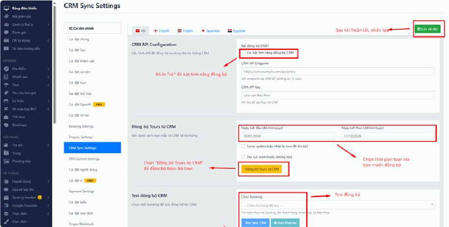
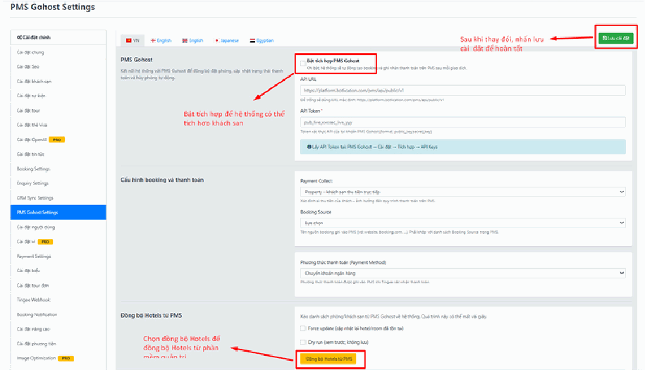
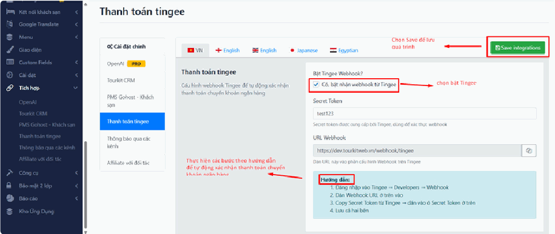
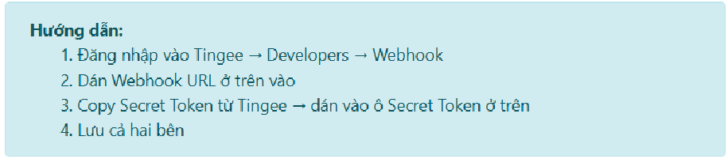
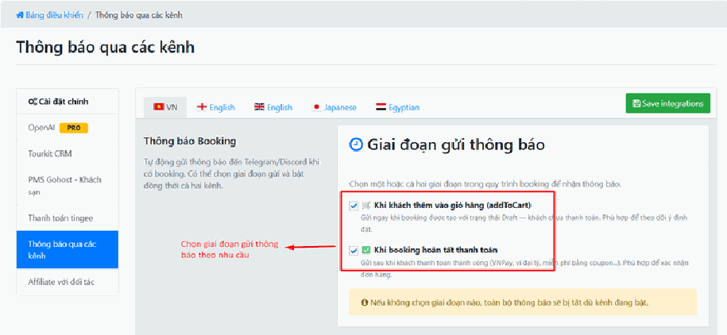
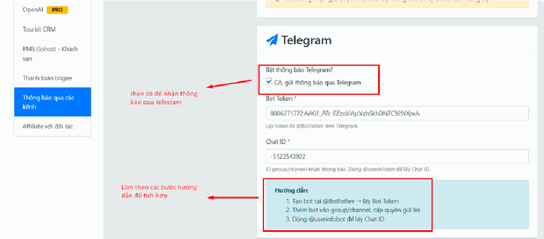
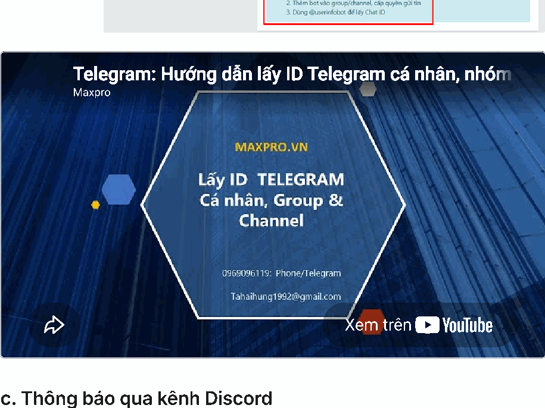
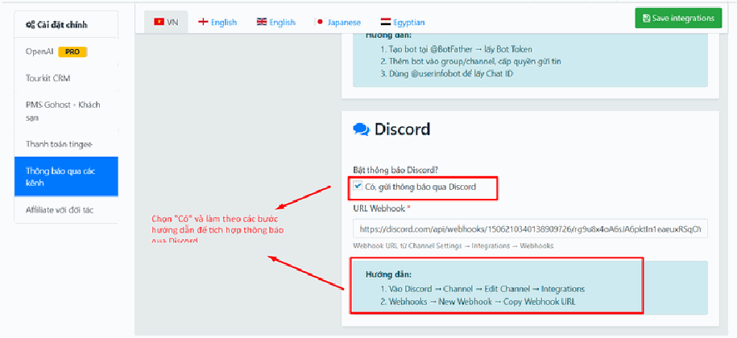
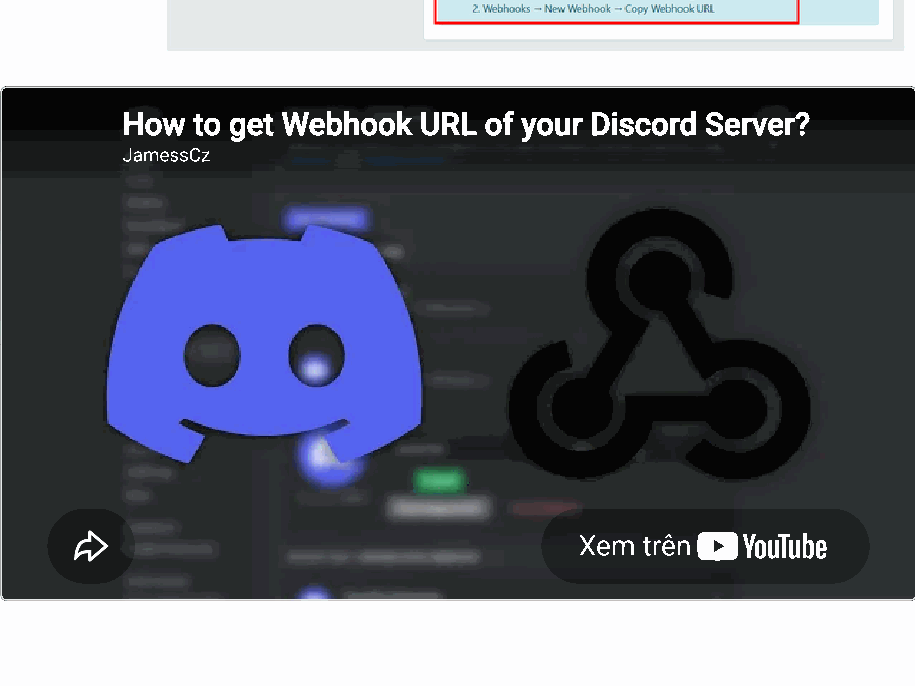
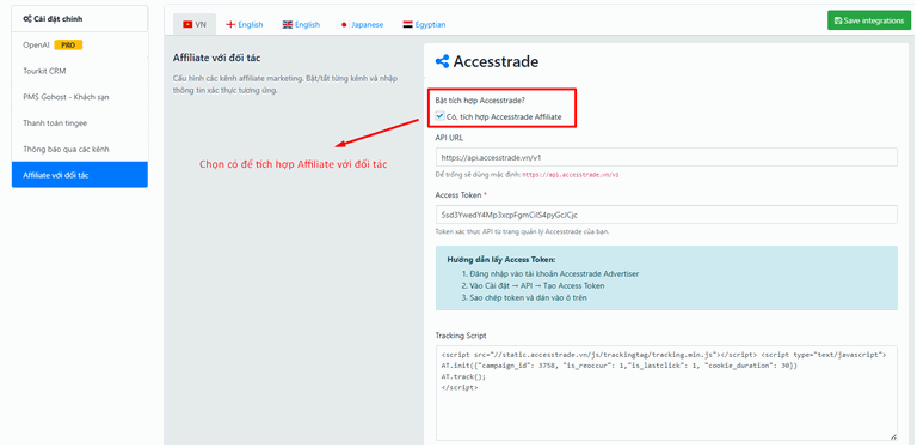

# 4.10. Tích hợp

**Tích hợp** là nơi bạn nối website của mình với **các dịch vụ của công ty khác**. Website không sống một mình: bạn có thể muốn đơn hàng tự chảy về phần mềm CRM, muốn nhận thông báo qua Telegram mỗi khi có khách đặt tour, muốn phần mềm quản lý khách sạn tự đẩy giá phòng sang website.

Mỗi kết nối như vậy gọi là một **tích hợp**. Tất cả nằm gọn trong mục này.

> **Đường dẫn:** Menu bên trái > **Tích hợp**

> **Không thấy mục "Tích hợp" trong menu?** Mục này cần quyền quản trị. Nếu tài khoản của bạn chưa được cấp quyền, mục này sẽ ẩn hoàn toàn. Hãy liên hệ quản trị viên của đơn vị bạn.

## "Tích hợp" khác gì "Cài đặt"?

Đây là chỗ nhầm lẫn phổ biến nhất, vì hai mục nằm sát nhau trong menu và trông giống hệt nhau. Cách phân biệt:

| | **Cài đặt** | **Tích hợp** |
|---|---|---|
| Nói về | **Bên trong** website của bạn | **Kết nối ra ngoài** với công ty khác |
| Ví dụ | Tên công ty, logo, tiền tệ, cổng thanh toán | CRM, Telegram, PMS khách sạn, OpenAI |
| Bạn cần chuẩn bị gì? | Chỉ cần thông tin của chính bạn | **Mã khóa (API Key) do bên kia cấp** |
| Bỏ qua thì sao? | Website hiển thị thiếu/sai thông tin | Website vẫn chạy bình thường, chỉ là không có kết nối đó |

**Mẹo tự phân biệt trong 3 giây:** *"Việc này có cần một công ty KHÁC cấp mã cho tôi không?"*
- **Không** → nằm ở [Cài đặt](cai-dat.md).
- **Có** → nằm ở **Tích hợp** (trang này).

> **Điều cần biết trước:** Mọi tích hợp đều là **tùy chọn**. Bạn không bắt buộc phải bật cái nào. Website vẫn bán hàng bình thường mà không cần một tích hợp nào cả. Chỉ bật khi bạn thật sự đang dùng dịch vụ đó.

## Trong mục này có gì?

Khi nhấn vào **Tích hợp**, danh sách các kết nối sẽ xổ ra ở cột bên trái. Bài này hướng dẫn 6 kết nối:

- **Open AI** — kết nối trí tuệ nhân tạo để hỗ trợ soạn nội dung.
- **Tourkit CRM** — đẩy đơn hàng từ website về phần mềm chăm sóc khách hàng, và kéo tour từ CRM về website.
- **PMS Gohost - Khách sạn** — nối với phần mềm quản lý khách sạn để đồng bộ phòng và giá.
- **Thanh toán Tingee** — tự động ghi nhận khi tiền về tài khoản.
- **Thông báo qua các kênh Telegram / Discord** — nhận tin nhắn báo có khách đặt tour.
- **Affiliate với đối tác** — ghi nhận đơn hàng do đối tác giới thiệu (Accesstrade).

> **Lưu ý:** Danh sách trên website của bạn có thể **ít hơn** danh sách này. Mỗi tích hợp chỉ hiện ra khi tính năng tương ứng đã được bật cho website của bạn. Nếu bạn cần một kết nối mà không thấy trong menu, hãy liên hệ đơn vị triển khai.

## Cách làm việc chung với mọi tích hợp

Dù là kết nối nào, quy trình cũng chỉ có 4 bước giống nhau:

1. **Xin mã từ bên đối tác.** Đây là việc bên ngoài website — bạn liên hệ nhà cung cấp dịch vụ để họ cấp cho bạn API Key / Access Key / Token.
2. **Bật công tắc** — tích vào ô **"Enable"** hoặc ô "Bật…" ở đầu trang.
3. **Dán mã vào các ô tương ứng.**
4. **Nhấn nút [Lưu cài đặt]** màu xanh lá ở **góc trên cùng bên phải**.

> **Cẩn thận với các mã khóa (API Key):** Chúng giống như **chìa khóa nhà**. Ai có mã đó có thể truy cập dữ liệu của bạn. Vì vậy:
> - **Không** đăng mã lên nhóm chat công khai, Facebook, hay diễn đàn.
> - **Không** chụp màn hình có chứa mã rồi gửi lung tung.
> - Nếu lỡ lộ, hãy liên hệ nhà cung cấp để họ **cấp mã mới** và hủy mã cũ.

> **Lỗi số 1 khi dán mã:** dính **dấu cách thừa** ở đầu hoặc cuối khi copy từ email/Zalo. Mắt thường không thấy, nhưng hệ thống báo sai mã. Mẹo: dán xong, bấm vào cuối ô, nhấn phím **End** rồi **Backspace** vài lần cho chắc.

## Open AI

**OpenAI** là công ty tạo ra ChatGPT. Khi kết nối, hệ thống có thể dùng trí tuệ nhân tạo để hỗ trợ bạn trong công việc — ví dụ gợi ý viết mô tả tour.

> **Bạn cần chuẩn bị:** một **API Key** từ tài khoản OpenAI của doanh nghiệp bạn. Đây là dịch vụ **có tính phí theo mức sử dụng** — bạn trả tiền trực tiếp cho OpenAI, không phải cho website.

Cách làm giống hệt các tích hợp khác: bật công tắc, dán API Key vào ô, nhấn **[Lưu cài đặt]**.

> **Lưu ý:** Tính năng này có thể chưa được bật trên website của bạn. Nếu không thấy mục này trong menu, hãy liên hệ đơn vị triển khai.

## Tourkit CRM

**CRM là gì?** Là phần mềm chăm sóc khách hàng — nơi bộ phận kinh doanh lưu danh sách khách, gọi điện, theo dõi ai đang quan tâm tour nào.

**Vì sao cần nối với website?** Vì nếu không nối, mỗi khi có khách đặt tour, nhân viên phải **tự tay gõ lại** thông tin từ website sang CRM. Vừa mất thời gian, vừa dễ sai, vừa hay quên. Nối rồi thì đơn hàng **tự chảy sang CRM ngay lập tức**.

Mục này có **3 phần** làm 3 việc khác nhau — đừng lẫn lộn:
- **Phần a** — thiết lập kết nối (làm 1 lần).
- **Phần b** — kéo tour từ CRM về website.
- **Phần c** — kiểm tra thử xem kết nối có chạy không.

## a, Đồng bộ đơn hàng/ request booking từ Website về hệ thống CRM

Mục này dùng để thiết lập kết nối kỹ thuật giữa website/hệ thống của bạn và hệ thống CRM.

- **Bật đồng bộ CRM?:** Tích chọn vào ô để **Có, bật tính năng đồng bộ CRM** — thao tác này kích hoạt toàn bộ tính năng kết nối. Nếu bỏ tích, mọi hoạt động đồng bộ sẽ tạm dừng (cấu hình vẫn còn nguyên, không mất, bật lại lúc nào cũng được).

- **CRM API Endpoint:** Nhập đường dẫn (link API) được cung cấp từ phía hệ thống CRM của bạn. Đây giống như **địa chỉ nhà** của CRM — website cần biết phải gửi dữ liệu đi đâu.

  > **Lưu ý:** Không điền dấu gạch chéo `/` ở cuối đường dẫn.
  > - ✅ Đúng: `https://crm.example.com/api/phieu`
  > - ❌ Sai: `https://crm.example.com/api/phieu/`
  >
  > Nghe có vẻ vặt vãnh nhưng chỉ thừa một dấu gạch chéo là **toàn bộ đồng bộ ngừng chạy** mà không có báo lỗi rõ ràng.

- **CRM API Key:** Nhập mã khóa bảo mật (API Key) do bên CRM cung cấp để xác thực quyền truy cập dữ liệu. Đây là **chìa khóa** để CRM tin rằng dữ liệu đúng là từ website của bạn gửi sang.

- **Lưu cấu hình:** Nhấp nút **[Lưu cài đặt]** màu xanh lá ở góc trên cùng bên phải để hoàn tất thiết lập.

> **Không có 2 thông tin trên?** Endpoint và API Key đều **do bên cung cấp CRM cấp cho bạn**, website không tự tạo ra được. Hãy liên hệ đơn vị vận hành CRM để xin.

## b, Đồng bộ Tours từ CRM về hệ thống (Đồng bộ Tours từ CRM)

Mục này hỗ trợ bạn chủ động **kéo các chương trình Tour mẫu đã có sẵn trên CRM về** lưu trữ và hiển thị trên hệ thống website hiện tại.

Nói dễ hiểu: phần **a** ở trên là **đẩy đơn hàng đi** (website → CRM). Phần **b** này là **kéo tour về** (CRM → website). Hai chiều ngược nhau.

- **Ngày bắt đầu / Ngày kết thúc (dd/mm/yyyy):** Chọn khoảng thời gian để giới hạn dữ liệu tour muốn kéo về. Hệ thống sẽ chỉ quét các tour được tạo hoặc cập nhật trong khoảng thời gian này.
  > **Mẹo:** Lần đầu làm, hãy chọn khoảng thời gian **ngắn thôi** (ví dụ 1 tuần gần nhất) để kéo về vài tour xem có ổn không. Chọn cả năm ngay lần đầu, nếu dữ liệu sai thì bạn phải dọn dẹp hàng trăm tour lỗi.

- **Force update (cập nhật lại tour đã tồn tại):**
  - **Tích chọn:** Nếu muốn **ghi đè**, cập nhật thông tin mới nhất từ CRM cho các tour đã từng đồng bộ về hệ thống trước đó.
  - **Bỏ tích:** Hệ thống sẽ bỏ qua và **chỉ tải về các tour mới hoàn toàn**.

  > **Cẩn thận:** Nếu bạn đã **sửa nội dung tour trên website** (viết lại mô tả cho hay hơn, thêm ảnh đẹp) mà bây giờ tích **Force update**, thì bản từ CRM sẽ **đè lên và xóa mất công sức chỉnh sửa của bạn**. Chỉ tích ô này khi bạn chắc chắn muốn lấy bản CRM làm chuẩn.

- **Dry run (xem trước, không lưu):** Tích chọn nếu bạn chỉ muốn **chạy thử nghiệm** để kiểm tra xem dữ liệu có lỗi gì không mà **không muốn lưu** trực tiếp vào cơ sở dữ liệu.

  > **Mẹo an toàn — hãy luôn làm theo thứ tự này:**
  > 1. Lần 1: **tích Dry run** → bấm chạy → xem kết quả báo về.
  > 2. Kết quả trông đúng → **bỏ tích Dry run** → chạy lại để lưu thật.
  >
  > Dry run giống như "chạy thử không tải" — an toàn tuyệt đối, không làm hỏng gì cả. Không có lý do gì để bỏ qua bước này.

- **Thực hiện:** Nhấp nút màu vàng **[Đồng bộ Tours từ CRM]** để bắt đầu quá trình quét dữ liệu.

  > **Trong lúc chạy, đừng đóng trang hay bấm nút nhiều lần.** Bấm nhiều lần có thể khiến hệ thống chạy chồng chéo. Hãy kiên nhẫn chờ trang báo kết quả.

## c, Kiểm tra thử nghiệm đồng bộ (Test đồng bộ CRM)

Tính năng này giúp bạn kiểm tra xem **luồng dữ liệu đẩy từ hệ thống lên CRM** có hoạt động mượt mà và chính xác hay không đối với **một đơn hàng cụ thể**.

Đây là công cụ bạn dùng khi **nghi ngờ kết nối có vấn đề** — thay vì ngồi đoán, bạn thử ngay với một đơn hàng thật và xem hệ thống báo gì.

- **Chọn Booking:** Nhấp vào ô tìm kiếm và nhập **mã booking, tên khách hàng, email hoặc số điện thoại** để chọn một đơn hàng thực tế cần test.

- **Xem Payload:** Nhấp nút **[Xem Payload]** (màu xanh cyan) để kiểm tra cấu trúc dữ liệu thô (JSON) mà hệ thống **sẽ gửi đi**, trước khi thực hiện đẩy sang CRM.
  > **"Payload" là gì?** Là **gói dữ liệu** mà website chuẩn bị gửi sang CRM. Bấm nút này, bạn sẽ thấy một đoạn chữ dày đặc ngoặc nhọn — **đây là chuyện bình thường**, nó dành cho người kỹ thuật đọc. Bạn không cần hiểu nội dung. Việc của bạn: nếu gặp lỗi, hãy **chụp màn hình đoạn này gửi cho bộ phận hỗ trợ** — họ sẽ chẩn đoán được ngay. Nút này **không gửi gì đi cả**, chỉ xem thôi, bấm thoải mái không sợ hỏng.

- **Test Sync CRM:** Nhấp nút **[Test Sync CRM]** (màu xanh dương) để **tiến hành gửi thử** dữ liệu của đơn hàng đó lên CRM và kiểm tra kết quả trả về của hệ thống kết nối.
  > **Lưu ý:** Nút này **gửi thật** sang CRM. Sau khi bấm, hãy vào CRM kiểm tra xem đơn hàng đó đã xuất hiện chưa. Xuất hiện = kết nối hoạt động tốt.

## PMS Gohost - Khách sạn

**PMS là gì?** Là phần mềm quản lý khách sạn (Property Management System) — nơi lễ tân làm việc hằng ngày: nhận phòng, trả phòng, xem phòng nào trống.

**Vì sao cần nối?** Vì nếu không nối, bạn sẽ có **hai nơi lưu số phòng trống**: một trên PMS, một trên website. Hai bên lệch nhau là dẫn tới thảm họa **bán trùng phòng (overbooking)** — khách đến nơi thì hết phòng. Nối rồi thì PMS là nguồn duy nhất, website chỉ việc lấy về.

## a, Kết nối PMS Gohost

Trước khi đồng bộ dữ liệu, vui lòng **nhập đầy đủ thông tin kết nối PMS Gohost** trong phần cài đặt hệ thống.

Sau khi cấu hình thành công, hệ thống sẽ có thể lấy dữ liệu từ PMS Gohost để đồng bộ về website.

> Các thông tin kết nối này do **bên Gohost cấp cho bạn**. Nếu chưa có, hãy liên hệ nhà cung cấp PMS.

## b, Cấu hình Booking và Thanh toán

Phần này giúp định nghĩa **cách xử lý dòng tiền và nguồn dữ liệu** khi đổ về hệ thống PMS. Nói cách khác: khi đơn hàng từ website chảy sang PMS, PMS cần biết ghi nhận nó như thế nào.

- **Payment Collect:** Chọn hình thức thu tiền khách hàng, để làm cơ sở xử lý quy trình thanh toán trên PMS.

- **Booking Source (Nguồn đặt phòng):** Chọn tên nguồn ghi nhận đơn hàng khi đổ vào PMS (ví dụ: từ website, booking.com, agoda...). Đây là cách để sau này bạn biết **đơn nào đến từ đâu** khi xem báo cáo trên PMS.

- **Lưu ý:** Tên nguồn được chọn phải **khớp chính xác** với danh sách Booking Source đã thiết lập sẵn bên hệ thống PMS của bạn.

  > **Vì sao phải khớp chính xác?** PMS chỉ chấp nhận đúng những cái tên nó đã biết. Nếu bên PMS ghi là `Website` mà bạn chọn `Web site`, PMS sẽ **từ chối đơn hàng** và bạn sẽ thấy đơn không sang được. Hãy mở PMS ra, đọc đúng từng chữ, rồi chọn cho khớp.

- **Phương thức thanh toán (Payment Method):** Chọn phương thức thanh toán tương ứng được ghi nhận vào PMS khi cổng thanh toán (ví dụ: Tingee) xác nhận giao dịch thành công.

## c, Đồng bộ Hotels từ PMS về hệ thống

Tính năng này giúp bạn chủ động kéo toàn bộ danh sách phòng/khách sạn từ PMS Gohost về lưu trữ và hiển thị trực tiếp trên hệ thống hiện tại. Quá trình này thường diễn ra rất nhanh (chỉ mất vài giây).

- **Force update (cập nhật lại hotel/room đã tồn tại):**
  - **Tích chọn:** Nếu muốn cập nhật lại toàn bộ thông tin mới nhất cho các khách sạn/phòng đã từng được đồng bộ trước đó.

- **Bỏ tích:** Hệ thống chỉ tải về những khách sạn hoặc phòng **mới được thêm** trên PMS.

  > **Cẩn thận:** Giống như phần CRM ở trên — nếu bạn đã bỏ công viết mô tả hay, chọn ảnh đẹp cho phòng trên website, thì **Force update có thể ghi đè** lên công sức đó bằng dữ liệu thô từ PMS. Cân nhắc kỹ trước khi tích.

- **Dry run (xem trước, không lưu):** Tích chọn nếu bạn muốn hệ thống chạy thử nghiệm để kiểm tra tính ổn định của dữ liệu mà **không lưu đè** vào cơ sở dữ liệu thật.

  > **Mẹo:** Vẫn nguyên tắc cũ — **lần đầu luôn chạy Dry run trước**, xem kết quả ổn rồi mới bỏ tích và chạy thật.

- **Thực hiện:** Nhấp nút **[Đồng bộ Hotels từ PMS]** màu vàng để bắt đầu quá trình kéo dữ liệu.

Hệ thống sẽ tự động:

- Lấy danh sách phòng từ PMS Gohost.

- Tạo mới các phòng chưa tồn tại trên website.

- Cập nhật thông tin các phòng đã được đồng bộ trước đó.

- Hệ thống có thể lấy: **Giá phòng**. **Số lượng phòng còn trống**. **Trạng thái mở bán** — từ PMS Gohost.

Sau khi hoàn tất, danh sách phòng sẽ xuất hiện trong phần **quản lý phòng** của website.

### Việc bạn phải làm tiếp sau khi đồng bộ xong

Đây là điều nhiều người bỏ sót. PMS chỉ gửi sang **dữ liệu khô** — tên phòng, giá, số lượng. Nó **không có** phần "làm cho khách muốn đặt". Vì vậy sau khi đồng bộ, phòng trên website sẽ trông trơ trọi, thiếu hấp dẫn.

Vui lòng kiểm tra và cập nhật thêm các thông tin cần thiết như:

- **Hình ảnh phòng.**

- **Nội dung mô tả.**

- **Tiện nghi.**

- **Thứ tự hiển thị.**

- **Trạng thái hiển thị.**

**Lưu ý:** Một số nội dung marketing và hình ảnh thường cần được **bổ sung thủ công** trên website để tối ưu trải nghiệm khách hàng.

> **Nói thẳng:** một phòng không có ảnh thì gần như **không ai đặt**. Đừng đồng bộ xong rồi để đó và thắc mắc vì sao không có đơn. Hãy dành thời gian bổ sung ảnh và mô tả cho từng phòng.

## Thanh toán Tingee

**Tingee** là dịch vụ giúp website **tự động biết khi nào tiền về tài khoản ngân hàng** của bạn.

**Vì sao hữu ích?** Bình thường khi khách chuyển khoản, bạn phải mở app ngân hàng kiểm tra, thấy tiền về thì vào trang quản trị bấm xác nhận đơn hàng bằng tay. Ban đêm hoặc cuối tuần thì khách phải chờ. Có Tingee, ngân hàng báo tiền về là **website tự xác nhận đơn ngay**, 24/7, không cần ai trực.

## 1. Kích hoạt kết nối

- **Bật Tingee Webhook?:** Tích chọn ô để **Có, bật nhận webhook từ Tingee** — hệ thống bắt đầu tự động nhận dữ liệu thông báo biến động số dư.

> **"Webhook" là gì?** Nghe rất kỹ thuật nhưng ý nghĩa rất đơn giản: nó giống như **chuông cửa**. Khi có tiền về tài khoản, Tingee "bấm chuông" báo cho website biết ngay lập tức. Website nghe chuông thì xác nhận đơn hàng. Không có webhook, website phải tự đi hỏi liên tục "có tiền chưa? có tiền chưa?" — chậm và tốn tài nguyên.

## 2. Các bước liên kết cấu hình

Thực hiện **liên kết 2 chiều** giữa hệ thống của bạn và Tingee theo các bước sau:

> **"2 chiều" nghĩa là:** bạn phải làm việc ở **cả hai nơi**, không chỉ trên website.
> - Trên **website**: dán mã của Tingee vào.
> - Trên **trang quản trị của Tingee**: khai báo địa chỉ website của bạn để họ biết bấm chuông ở đâu.
>
> Chỉ làm một bên là **không chạy**. Đây là lý do phổ biến nhất khiến Tingee "cấu hình xong mà không hoạt động".

> **Kiểm tra sau khi cấu hình:** Hãy tự chuyển khoản một số tiền nhỏ (ví dụ 2.000đ) theo đúng cú pháp của một đơn hàng thử. Nếu đơn hàng tự chuyển sang trạng thái đã thanh toán trong vòng vài chục giây, nghĩa là chạy tốt.

## Thông báo qua các kênh Telegram / Discord

Đây là tích hợp **dễ làm nhất và hữu ích nhất** cho hầu hết doanh nghiệp — bạn nên bật nó.

**Nó làm gì?** Mỗi khi có khách đặt tour hoặc thanh toán, **điện thoại bạn kêu tin nhắn ngay**, kèm thông tin đơn hàng. Bạn không cần ngồi canh trang quản trị, không cần chờ nhân viên báo. Đơn về là biết liền, gọi tư vấn ngay khi khách còn đang quan tâm.

**Telegram hay Discord?** Cả hai đều miễn phí và làm cùng một việc. Ở Việt Nam, **Telegram phổ biến hơn nhiều** — hãy chọn Telegram nếu bạn không có lý do đặc biệt. Bạn cũng có thể bật cả hai.

## a. Chọn thời điểm nhận thông báo

Bạn có thể chọn một hoặc cả hai thời điểm sau:

🛒 **Khi khách thêm vào giỏ hàng:** Thông báo được gửi ngay khi khách tạo booking hoặc thêm dịch vụ vào giỏ hàng.

Phù hợp khi bạn muốn:

- Theo dõi khách hàng đang quan tâm đến sản phẩm.

- Chủ động liên hệ tư vấn sớm.

- Theo dõi lượng booking phát sinh trong ngày.

**Lưu ý:** Ở giai đoạn này khách **chưa thanh toán**, đơn hàng có thể bị hủy hoặc không hoàn tất.

✅ **Khi khách thanh toán thành công:** Thông báo được gửi khi booking đã **hoàn tất thanh toán** thành công.

Phù hợp khi bạn muốn:

- Xác nhận đơn hàng đã được thanh toán.

- Theo dõi doanh thu thực tế.

- Chỉ nhận các đơn hàng hoàn tất.

**Nếu không chọn thời điểm nào, hệ thống sẽ không gửi thông báo dù Telegram hoặc Discord đã được bật.**

> **Đây chính là lỗi phổ biến nhất của mục này:** cấu hình Telegram đúng hết, bật công tắc rồi, nhưng **quên tích thời điểm** → im lặng hoàn toàn, không có tin nhắn nào, và bạn tưởng cấu hình sai. Hãy kiểm tra lại phần này đầu tiên khi không nhận được thông báo.

> **Nên chọn cái nào?**
> - **Website ít đơn (dưới ~20 đơn/ngày):** tích cả hai. Bạn nắm được cả khách đang quan tâm lẫn khách đã trả tiền, có cơ hội gọi tư vấn kịp thời.
> - **Website nhiều đơn:** chỉ tích **"Khi khách thanh toán thành công"**. Nếu tích cả hai, điện thoại bạn sẽ kêu liên tục cả ngày và bạn sẽ tắt thông báo — thành ra vô ích.

## b. Thông báo qua kênh Telegram

Để hệ thống gửi được tin cho bạn, cần 2 thứ:

1. **Bot Token** — bạn tạo một "con bot" trên Telegram, nó chính là cái miệng để hệ thống nói chuyện.
2. **Chat ID** — mã số của người hoặc nhóm sẽ nhận tin. Giống như số nhà để bưu tá biết giao thư đi đâu.

*📺 Video hướng dẫn: Telegram: Hướng dẫn lấy ID Telegram cá nhân, nhóm*

Maxpro

> **Mẹo rất đáng làm:** Thay vì gửi thông báo về Telegram cá nhân của bạn, hãy **tạo một nhóm** trên Telegram, thêm các nhân viên kinh doanh vào, rồi lấy **ID của nhóm đó**. Như vậy cả đội cùng thấy đơn hàng, ai rảnh thì nhận tư vấn. Khi bạn nghỉ phép, công việc vẫn chạy.
>
> **Cẩn thận:** ID của **nhóm** thường là **số âm** (có dấu trừ ở đầu, ví dụ `-1001234567890`). Đừng tưởng nhầm là lỗi mà tự ý xóa dấu trừ đi — xóa là **sai ngay**, phải giữ nguyên cả dấu trừ.

**Không nhận được tin nhắn Telegram? Kiểm tra theo thứ tự:**
1. Đã tích **thời điểm nhận thông báo** ở phần a chưa? (nguyên nhân số 1)
2. Bot Token có dán đủ không, có dính khoảng trắng thừa không?
3. **Bạn đã nhắn tin cho bot trước chưa?** Telegram không cho bot nhắn cho bạn nếu bạn chưa từng bấm **"Start"** với nó. Hãy mở bot lên và bấm Start.
4. Nếu gửi vào nhóm: **bot đã được thêm vào nhóm chưa?** Bot không ở trong nhóm thì không nhắn vào nhóm được.

## c. Thông báo qua kênh Discord

Discord đơn giản hơn Telegram: bạn **không cần tạo bot**, chỉ cần lấy một đường dẫn gọi là **Webhook URL** từ máy chủ Discord của mình rồi dán vào.

*📺 Video hướng dẫn: How to get Webhook URL of your Discord Server?*

JamessCz

> **Cẩn thận với Webhook URL:** đường dẫn này chính là **chìa khóa**. Ai có nó đều có thể gửi tin nhắn vào kênh Discord của bạn. Đừng đăng nó lên nơi công khai. Nếu lỡ lộ, vào Discord xóa webhook cũ và tạo cái mới, rồi dán lại vào website.

## Affiliate với đối tác

**Affiliate là gì?** Là hình thức **tiếp thị liên kết**: đối tác giới thiệu khách sang website của bạn, khách mua hàng thì đối tác được hưởng hoa hồng.

**Vấn đề cần giải quyết:** làm sao biết chính xác đơn hàng nào là do đối tác giới thiệu, để trả hoa hồng đúng? Tích hợp này giải quyết việc đó — hệ thống **tự ghi nhận và báo về cho Accesstrade**.

## Hướng dẫn kết nối Accesstrade

Để website có thể ghi nhận và đồng bộ đơn hàng với Accesstrade, vui lòng cung cấp các thông tin sau **từ tài khoản Accesstrade của doanh nghiệp**.

> **Cần có trước:** Bạn phải là **Advertiser (nhà quảng cáo)** đã đăng ký trên Accesstrade. Chưa có tài khoản thì phải làm bước đó trước, đây là việc giữa bạn và Accesstrade.

## Bước 1: Đăng nhập Accesstrade

Đăng nhập vào tài khoản **Advertiser** trên hệ thống Accesstrade.

## Bước 2: Lấy Access Key

1. Truy cập phần **quản lý API hoặc Tracking** theo hướng dẫn của Accesstrade.
2. Tìm thông tin **Access Key**.
3. Sao chép Access Key và dán vào ô **Access Key** trong phần cài đặt website.

## Bước 3: Lấy Tracking Script

1. Trong tài liệu hoặc phần cài đặt **Tracking** của Accesstrade, tìm **đoạn mã theo dõi (Tracking Script)**.
2. **Sao chép toàn bộ** đoạn mã được Accesstrade cung cấp.
3. Dán vào ô **Tracking Script** trong phần cài đặt website.

> **"Sao chép toàn bộ" nghĩa là:** lấy từ ký tự đầu tiên đến ký tự cuối cùng, **kể cả các dấu ngoặc `<` `>` ở hai đầu**. Đoạn mã trông rối mắt và bạn không cần hiểu nó — chỉ cần copy đủ. Thiếu một ký tự là không chạy.
>
> **Mẹo copy cho đủ:** bấm chuột vào bên trong ô chứa đoạn mã, nhấn **Ctrl + A** (chọn tất cả) rồi **Ctrl + C** (sao chép). Cách này chắc chắn hơn kéo chuột.

## Bước 4: Lưu cấu hình

Sau khi nhập đầy đủ thông tin:

- **Access Key**

- **Tracking Script**

Nhấn **Lưu cấu hình** để hoàn tất kết nối.

## Lưu ý

- Mỗi tài khoản hoặc chiến dịch có thể sử dụng **Access Key khác nhau**.

- Vui lòng **sao chép chính xác** thông tin được Accesstrade cung cấp.

- Nếu không tìm thấy Access Key hoặc Tracking Script, vui lòng **liên hệ nhân viên hỗ trợ của Accesstrade** để được hướng dẫn.

## Lưu ý & xử lý sự cố chung

**Bật xong nhưng "không thấy gì xảy ra".** Với hầu hết tích hợp, đây là thứ tự kiểm tra:
1. Ô **Enable / Bật…** còn tích không?
2. Đã bấm **[Lưu cài đặt]** chưa, có thấy thông báo thành công không?
3. Các mã có dính **khoảng trắng thừa** không?
4. Với Telegram/Discord: đã tích **thời điểm nhận thông báo** chưa?
5. Với Tingee/Accesstrade: đã khai báo **phía bên kia** chưa? (kết nối 2 chiều)

**Báo lỗi xác thực / sai key.** Gần như luôn là do mã dán sai, thiếu ký tự, hoặc mã đã bị bên kia hủy. Hãy xin lại mã mới từ nhà cung cấp.

**Trước khi gọi hỗ trợ, hãy chuẩn bị:** tên tích hợp đang gặp vấn đề, **ảnh chụp màn hình dòng báo lỗi** (đầy đủ, đừng cắt), và mô tả bạn đã làm gì trước khi lỗi xảy ra. Có 3 thứ này, việc xử lý sẽ nhanh hơn rất nhiều.

> **Nguyên tắc an toàn nhất khi làm tích hợp:** làm **từng cái một**. Bật một tích hợp → kiểm tra chạy tốt → mới sang cái tiếp theo. Bật cả 5 cái cùng lúc rồi có lỗi, bạn sẽ không biết cái nào gây ra.

## Xem thêm

- [4.9. Cài đặt](cai-dat.md) — cấu hình bên trong website (tiền tệ, cổng thanh toán)
- [4.13. Báo cáo](bao-cao.md) — xem đơn hàng và doanh thu
- [4.11. Công cụ](cong-cu.md) — nhật ký hệ thống, nơi xem lại lỗi đã xảy ra
