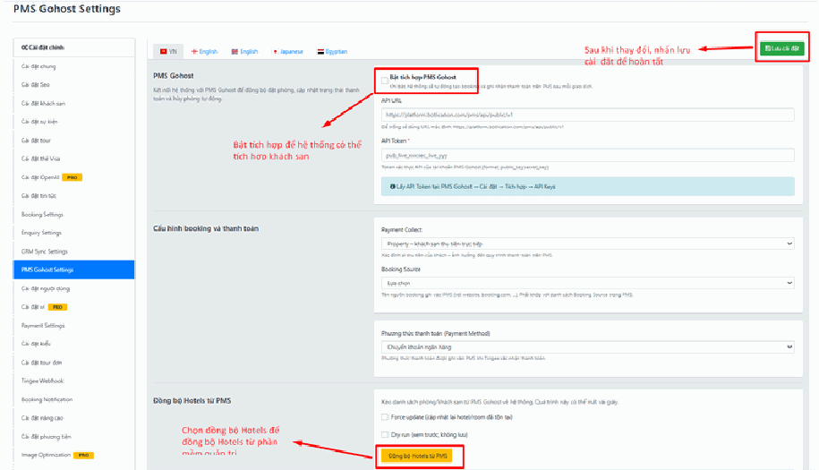

# 4.10.2. PMS Gohost — Khách sạn

**PMS là gì?** Là phần mềm quản lý khách sạn (Property Management System) — nơi lễ tân làm việc hằng ngày: nhận phòng, trả phòng, xem phòng nào trống.

**Vì sao cần nối?** Vì nếu không nối, bạn sẽ có **hai nơi lưu số phòng trống**: một trên PMS, một trên website. Hai bên lệch nhau là dẫn tới thảm họa **bán trùng phòng (overbooking)** — khách đến nơi thì hết phòng. Nối rồi thì PMS là nguồn duy nhất, website chỉ việc lấy về.

## a, Kết nối PMS Gohost

Trước khi đồng bộ dữ liệu, vui lòng **nhập đầy đủ thông tin kết nối PMS Gohost** trong phần cài đặt hệ thống.

Sau khi cấu hình thành công, hệ thống sẽ có thể lấy dữ liệu từ PMS Gohost để đồng bộ về website.

> Các thông tin kết nối này do **bên Gohost cấp cho bạn**. Nếu chưa có, hãy liên hệ nhà cung cấp PMS.

## b, Cấu hình Booking và Thanh toán

Phần này giúp định nghĩa **cách xử lý dòng tiền và nguồn dữ liệu** khi đổ về hệ thống PMS. Nói cách khác: khi đơn hàng từ website chảy sang PMS, PMS cần biết ghi nhận nó như thế nào.

* **Payment Collect:** Chọn hình thức thu tiền khách hàng, để làm cơ sở xử lý quy trình thanh toán trên PMS.
* **Booking Source (Nguồn đặt phòng):** Chọn tên nguồn ghi nhận đơn hàng khi đổ vào PMS (ví dụ: từ website, booking.com, agoda...). Đây là cách để sau này bạn biết **đơn nào đến từ đâu** khi xem báo cáo trên PMS.
*   **Lưu ý:** Tên nguồn được chọn phải **khớp chính xác** với danh sách Booking Source đã thiết lập sẵn bên hệ thống PMS của bạn.

    > **Vì sao phải khớp chính xác?** PMS chỉ chấp nhận đúng những cái tên nó đã biết. Nếu bên PMS ghi là `Website` mà bạn chọn `Web site`, PMS sẽ **từ chối đơn hàng** và bạn sẽ thấy đơn không sang được. Hãy mở PMS ra, đọc đúng từng chữ, rồi chọn cho khớp.
* **Phương thức thanh toán (Payment Method):** Chọn phương thức thanh toán tương ứng được ghi nhận vào PMS khi cổng thanh toán (ví dụ: Tingee) xác nhận giao dịch thành công.

## c, Đồng bộ Hotels từ PMS về hệ thống

Tính năng này giúp bạn chủ động kéo toàn bộ danh sách phòng/khách sạn từ PMS Gohost về lưu trữ và hiển thị trực tiếp trên hệ thống hiện tại. Quá trình này thường diễn ra rất nhanh (chỉ mất vài giây).

* **Force update (cập nhật lại hotel/room đã tồn tại):**
  * **Tích chọn:** Nếu muốn cập nhật lại toàn bộ thông tin mới nhất cho các khách sạn/phòng đã từng được đồng bộ trước đó.
*   **Bỏ tích:** Hệ thống chỉ tải về những khách sạn hoặc phòng **mới được thêm** trên PMS.

    > **Cẩn thận:** Nếu bạn đã bỏ công viết mô tả hay, chọn ảnh đẹp cho phòng trên website, thì **Force update có thể ghi đè** lên công sức đó bằng dữ liệu thô từ PMS. Cân nhắc kỹ trước khi tích.
*   **Dry run (xem trước, không lưu):** Tích chọn nếu bạn muốn hệ thống chạy thử nghiệm để kiểm tra tính ổn định của dữ liệu mà **không lưu đè** vào cơ sở dữ liệu thật.

    > **Mẹo:** Vẫn nguyên tắc cũ — **lần đầu luôn chạy Dry run trước**, xem kết quả ổn rồi mới bỏ tích và chạy thật.
* **Thực hiện:** Nhấp nút **\[Đồng bộ Hotels từ PMS]** màu vàng để bắt đầu quá trình kéo dữ liệu.

Hệ thống sẽ tự động:

* Lấy danh sách phòng từ PMS Gohost.
* Tạo mới các phòng chưa tồn tại trên website.
* Cập nhật thông tin các phòng đã được đồng bộ trước đó.
* Hệ thống có thể lấy: **Giá phòng**. **Số lượng phòng còn trống**. **Trạng thái mở bán** — từ PMS Gohost.

Sau khi hoàn tất, danh sách phòng sẽ xuất hiện trong phần **quản lý phòng** của website.

### Việc bạn phải làm tiếp sau khi đồng bộ xong

Đây là điều nhiều người bỏ sót. PMS chỉ gửi sang **dữ liệu khô** — tên phòng, giá, số lượng. Nó **không có** phần "làm cho khách muốn đặt". Vì vậy sau khi đồng bộ, phòng trên website sẽ trông trơ trọi, thiếu hấp dẫn.

Vui lòng kiểm tra và cập nhật thêm các thông tin cần thiết như:

* **Hình ảnh phòng.**
* **Nội dung mô tả.**
* **Tiện nghi.**
* **Thứ tự hiển thị.**
* **Trạng thái hiển thị.**

**Lưu ý:** Một số nội dung marketing và hình ảnh thường cần được **bổ sung thủ công** trên website để tối ưu trải nghiệm khách hàng.

> **Nói thẳng:** một phòng không có ảnh thì gần như **không ai đặt**. Đừng đồng bộ xong rồi để đó và thắc mắc vì sao không có đơn. Hãy dành thời gian bổ sung ảnh và mô tả cho từng phòng.
