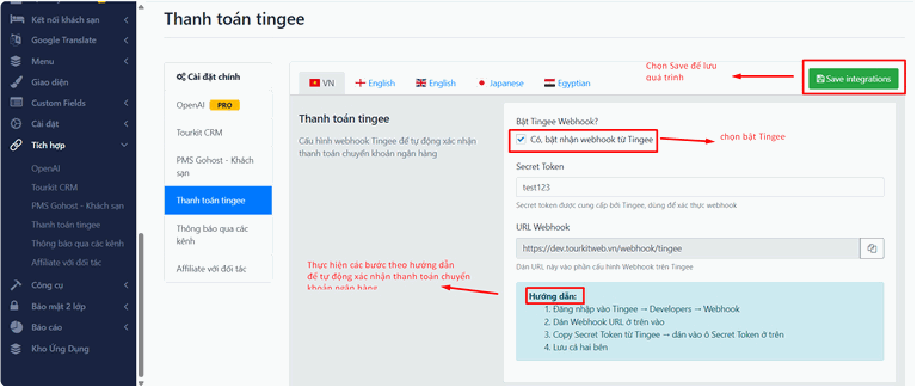

# 4.10.3. Thanh toán Tingee

**Tingee** là dịch vụ giúp website **tự động biết khi nào tiền về tài khoản ngân hàng** của bạn.

**Vì sao hữu ích?** Bình thường khi khách chuyển khoản, bạn phải mở app ngân hàng kiểm tra, thấy tiền về thì vào trang quản trị bấm xác nhận đơn hàng bằng tay. Ban đêm hoặc cuối tuần thì khách phải chờ. Có Tingee, ngân hàng báo tiền về là **website tự xác nhận đơn ngay**, 24/7, không cần ai trực.

## 1. Kích hoạt kết nối

* **Bật Tingee Webhook?:** Tích chọn ô để **Có, bật nhận webhook từ Tingee** — hệ thống bắt đầu tự động nhận dữ liệu thông báo biến động số dư.

> **"Webhook" là gì?** Nghe rất kỹ thuật nhưng ý nghĩa rất đơn giản: nó giống như **chuông cửa**. Khi có tiền về tài khoản, Tingee "bấm chuông" báo cho website biết ngay lập tức. Website nghe chuông thì xác nhận đơn hàng. Không có webhook, website phải tự đi hỏi liên tục "có tiền chưa? có tiền chưa?" — chậm và tốn tài nguyên.

## 2. Các bước liên kết cấu hình

Thực hiện **liên kết 2 chiều** giữa hệ thống của bạn và Tingee theo các bước sau:

> **"2 chiều" nghĩa là:** bạn phải làm việc ở **cả hai nơi**, không chỉ trên website.
>
> * Trên **website**: dán mã của Tingee vào.
> * Trên **trang quản trị của Tingee**: khai báo địa chỉ website của bạn để họ biết bấm chuông ở đâu.
>
> Chỉ làm một bên là **không chạy**. Đây là lý do phổ biến nhất khiến Tingee "cấu hình xong mà không hoạt động".

> **Kiểm tra sau khi cấu hình:** Hãy tự chuyển khoản một số tiền nhỏ (ví dụ 2.000đ) theo đúng cú pháp của một đơn hàng thử. Nếu đơn hàng tự chuyển sang trạng thái đã thanh toán trong vòng vài chục giây, nghĩa là chạy tốt.
