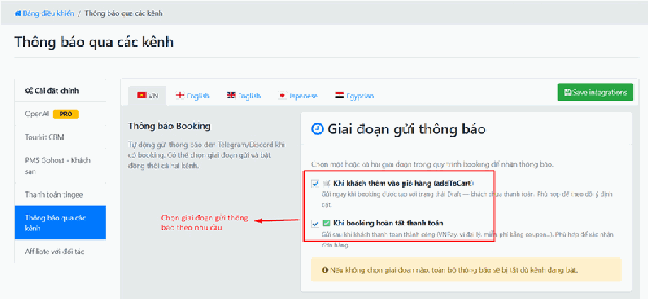
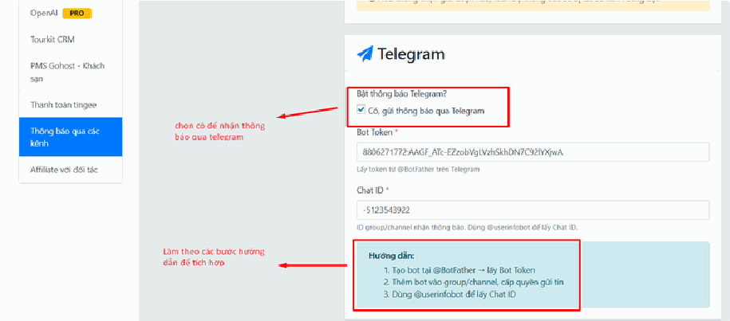
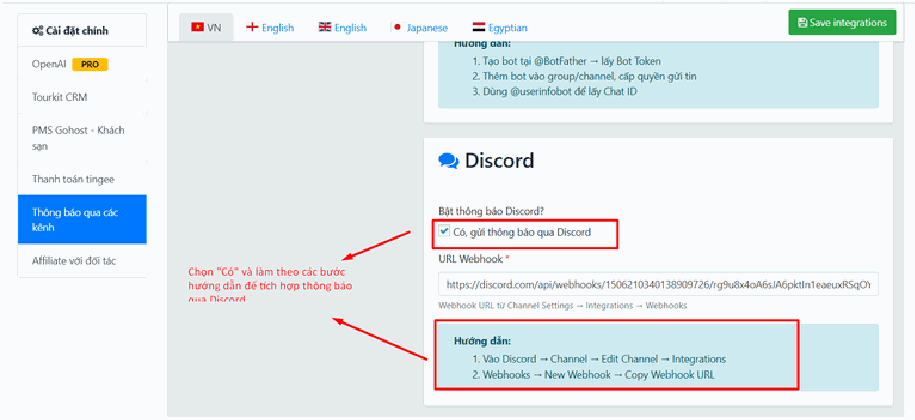

# 4.10.4. Thông báo qua Telegram / Discord

Đây là tích hợp **dễ làm nhất và hữu ích nhất** cho hầu hết doanh nghiệp — bạn nên bật nó.

**Nó làm gì?** Mỗi khi có khách đặt tour hoặc thanh toán, **điện thoại bạn kêu tin nhắn ngay**, kèm thông tin đơn hàng. Bạn không cần ngồi canh trang quản trị, không cần chờ nhân viên báo. Đơn về là biết liền, gọi tư vấn ngay khi khách còn đang quan tâm.

**Telegram hay Discord?** Cả hai đều miễn phí và làm cùng một việc. Ở Việt Nam, **Telegram phổ biến hơn nhiều** — hãy chọn Telegram nếu bạn không có lý do đặc biệt. Bạn cũng có thể bật cả hai.

## a. Chọn thời điểm nhận thông báo

Bạn có thể chọn một hoặc cả hai thời điểm sau:

🛒 **Khi khách thêm vào giỏ hàng:** Thông báo được gửi ngay khi khách tạo booking hoặc thêm dịch vụ vào giỏ hàng.

Phù hợp khi bạn muốn:

* Theo dõi khách hàng đang quan tâm đến sản phẩm.
* Chủ động liên hệ tư vấn sớm.
* Theo dõi lượng booking phát sinh trong ngày.

**Lưu ý:** Ở giai đoạn này khách **chưa thanh toán**, đơn hàng có thể bị hủy hoặc không hoàn tất.

✅ **Khi khách thanh toán thành công:** Thông báo được gửi khi booking đã **hoàn tất thanh toán** thành công.

Phù hợp khi bạn muốn:

* Xác nhận đơn hàng đã được thanh toán.
* Theo dõi doanh thu thực tế.
* Chỉ nhận các đơn hàng hoàn tất.

**Nếu không chọn thời điểm nào, hệ thống sẽ không gửi thông báo dù Telegram hoặc Discord đã được bật.**

> **Đây chính là lỗi phổ biến nhất của mục này:** cấu hình Telegram đúng hết, bật công tắc rồi, nhưng **quên tích thời điểm** → im lặng hoàn toàn, không có tin nhắn nào, và bạn tưởng cấu hình sai. Hãy kiểm tra lại phần này đầu tiên khi không nhận được thông báo.

> **Nên chọn cái nào?**
>
> * **Website ít đơn (dưới \~20 đơn/ngày):** tích cả hai. Bạn nắm được cả khách đang quan tâm lẫn khách đã trả tiền, có cơ hội gọi tư vấn kịp thời.
> * **Website nhiều đơn:** chỉ tích **"Khi khách thanh toán thành công"**. Nếu tích cả hai, điện thoại bạn sẽ kêu liên tục cả ngày và bạn sẽ tắt thông báo — thành ra vô ích.

## b. Thông báo qua kênh Telegram

Để hệ thống gửi được tin cho bạn, cần 2 thứ:

1. **Bot Token** — bạn tạo một "con bot" trên Telegram, nó chính là cái miệng để hệ thống nói chuyện.
2. **Chat ID** — mã số của người hoặc nhóm sẽ nhận tin. Giống như số nhà để bưu tá biết giao thư đi đâu.

> **Mẹo rất đáng làm:** Thay vì gửi thông báo về Telegram cá nhân của bạn, hãy **tạo một nhóm** trên Telegram, thêm các nhân viên kinh doanh vào, rồi lấy **ID của nhóm đó**. Như vậy cả đội cùng thấy đơn hàng, ai rảnh thì nhận tư vấn. Khi bạn nghỉ phép, công việc vẫn chạy.
>
> **Cẩn thận:** ID của **nhóm** thường là **số âm** (có dấu trừ ở đầu, ví dụ `-1001234567890`). Đừng tưởng nhầm là lỗi mà tự ý xóa dấu trừ đi — xóa là **sai ngay**, phải giữ nguyên cả dấu trừ.

**Không nhận được tin nhắn Telegram? Kiểm tra theo thứ tự:**

1. Đã tích **thời điểm nhận thông báo** ở phần a chưa? (nguyên nhân số 1)
2. Bot Token có dán đủ không, có dính khoảng trắng thừa không?
3. **Bạn đã nhắn tin cho bot trước chưa?** Telegram không cho bot nhắn cho bạn nếu bạn chưa từng bấm **"Start"** với nó. Hãy mở bot lên và bấm Start.
4. Nếu gửi vào nhóm: **bot đã được thêm vào nhóm chưa?** Bot không ở trong nhóm thì không nhắn vào nhóm được.

## c. Thông báo qua kênh Discord

Discord đơn giản hơn Telegram: bạn **không cần tạo bot**, chỉ cần lấy một đường dẫn gọi là **Webhook URL** từ máy chủ Discord của mình rồi dán vào.

> **Cẩn thận với Webhook URL:** đường dẫn này chính là **chìa khóa**. Ai có nó đều có thể gửi tin nhắn vào kênh Discord của bạn. Đừng đăng nó lên nơi công khai. Nếu lỡ lộ, vào Discord xóa webhook cũ và tạo cái mới, rồi dán lại vào website.
