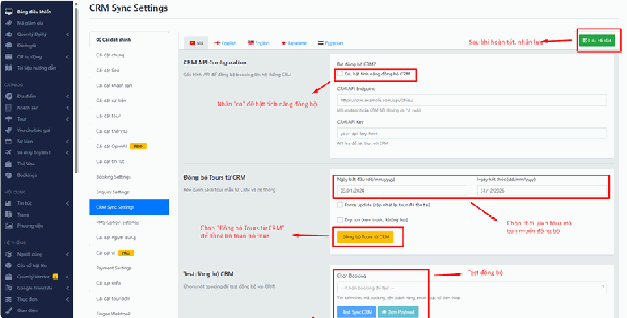

# 4.10.1. Tourkit CRM

**CRM là gì?** Là phần mềm chăm sóc khách hàng — nơi bộ phận kinh doanh lưu danh sách khách, gọi điện, theo dõi ai đang quan tâm tour nào.

**Vì sao cần nối với website?** Vì nếu không nối, mỗi khi có khách đặt tour, nhân viên phải **tự tay gõ lại** thông tin từ website sang CRM. Vừa mất thời gian, vừa dễ sai, vừa hay quên. Nối rồi thì đơn hàng **tự chảy sang CRM ngay lập tức**.

Mục này có **3 phần** làm 3 việc khác nhau — đừng lẫn lộn:

* **Phần a** — thiết lập kết nối (làm 1 lần).
* **Phần b** — kéo tour từ CRM về website.
* **Phần c** — kiểm tra thử xem kết nối có chạy không.

## a, Đồng bộ đơn hàng/ request booking từ Website về hệ thống CRM

Mục này dùng để thiết lập kết nối kỹ thuật giữa website/hệ thống của bạn và hệ thống CRM.

* **Bật đồng bộ CRM?:** Tích chọn vào ô để **Có, bật tính năng đồng bộ CRM** — thao tác này kích hoạt toàn bộ tính năng kết nối. Nếu bỏ tích, mọi hoạt động đồng bộ sẽ tạm dừng (cấu hình vẫn còn nguyên, không mất, bật lại lúc nào cũng được).
*   **CRM API Endpoint:** Nhập đường dẫn (link API) được cung cấp từ phía hệ thống CRM của bạn. Đây giống như **địa chỉ nhà** của CRM — website cần biết phải gửi dữ liệu đi đâu.

    > **Lưu ý:** Không điền dấu gạch chéo `/` ở cuối đường dẫn.
    >
    > * ✅ Đúng: `https://crm.example.com/api/phieu`
    > * ❌ Sai: `https://crm.example.com/api/phieu/`
    >
    > Nghe có vẻ vặt vãnh nhưng chỉ thừa một dấu gạch chéo là **toàn bộ đồng bộ ngừng chạy** mà không có báo lỗi rõ ràng.
* **CRM API Key:** Nhập mã khóa bảo mật (API Key) do bên CRM cung cấp để xác thực quyền truy cập dữ liệu. Đây là **chìa khóa** để CRM tin rằng dữ liệu đúng là từ website của bạn gửi sang.
* **Lưu cấu hình:** Nhấp nút **\[Lưu cài đặt]** màu xanh lá ở góc trên cùng bên phải để hoàn tất thiết lập.

> **Không có 2 thông tin trên?** Endpoint và API Key đều **do bên cung cấp CRM cấp cho bạn**, website không tự tạo ra được. Hãy liên hệ đơn vị vận hành CRM để xin.

## b, Đồng bộ Tours từ CRM về hệ thống (Đồng bộ Tours từ CRM)

Mục này **kéo các chương trình Tour mẫu đã có sẵn trên CRM về** website.

Nói dễ hiểu: phần **a** ở trên là **đẩy đơn hàng đi** (website → CRM). Phần **b** này là **kéo tour về** (CRM → website). Hai chiều ngược nhau.

> ### Hệ thống tự cập nhật mỗi đêm
>
> **Đúng 0 giờ hàng ngày, website tự động kéo lịch khởi hành mới nhất từ CRM về.** Bạn không phải bấm gì, không phải nhớ ngày nào, không phải cắt cử ai ngồi canh.
>
> Mỗi đêm hệ thống tự làm:
>
> * Chuyến khởi hành mới xuất hiện trên CRM → tự thêm vào website.
> * Số chỗ còn trống thay đổi → tự cập nhật lại.
>
> Nút bấm ở màn hình này chỉ dùng cho **lần chạy đầu tiên**, hoặc khi bạn **muốn có ngay** mà không đợi tới đêm.

### Bước 1: Chạy thử để chắc chắn kết nối thông

Tích ô **Dry run (xem trước, không lưu)** rồi bấm nút vàng **\[Đồng bộ Tours từ CRM]**.

Đây là chạy thử không tải — hệ thống chỉ đọc dữ liệu về rồi báo kết quả, **không lưu gì cả**, không thể làm hỏng gì.

* **Thấy bảng kết quả hiện ra** → kết nối tốt, sang bước 2.
* **Báo lỗi kết nối** → Endpoint hoặc API Key ở phần **a** chưa đúng. Xem lại, hoặc liên hệ đơn vị vận hành CRM.

### Bước 2: Bấm đồng bộ thật

**Bỏ tích Dry run**, bấm lại nút vàng **\[Đồng bộ Tours từ CRM]**.

> **Đang chạy thì đừng đóng trang hay bấm nút nhiều lần.** Bấm nhiều lần khiến hệ thống chạy chồng chéo. Kiên nhẫn chờ trang báo kết quả.

### Bước 3: Bổ sung thông tin rồi xuất bản

**Toàn bộ tour kéo về đều ở trạng thái Nháp** — khách chưa nhìn thấy. Đây là chủ ý, vì CRM chỉ có phần dữ liệu bán hàng, thiếu hẳn phần nội dung để khách xem và quyết định đặt.

Vào **Tour → Tất cả Tour**, lọc cột **Kênh = CRM**, mở từng tour và bổ sung:

* **Ảnh** — ảnh đại diện và bộ ảnh giới thiệu. CRM không có ảnh, tour không ảnh thì gần như không ai bấm vào.
* **Lịch trình từng ngày** — ngày 1 đi đâu, ăn gì, nghỉ ở đâu. Đây là thứ khách đọc kỹ nhất trước khi xuống tiền.
* **Mô tả tour** — vài dòng giới thiệu điểm hấp dẫn.

Xong thì chuyển tour sang **Công khai**.

> **Đây là việc bạn chỉ làm một lần cho mỗi tour.** Sau khi tour đã công khai, bạn không cần quay lại màn hình đồng bộ nữa — mỗi đêm hệ thống tự cập nhật lịch khởi hành và số chỗ cho tour đó. Phần nội dung bạn đã viết **không bị ghi đè**.

## c, Kiểm tra thử nghiệm đồng bộ (Test đồng bộ CRM)

Tính năng này giúp bạn kiểm tra xem **luồng dữ liệu đẩy từ hệ thống lên CRM** có hoạt động mượt mà và chính xác hay không đối với **một đơn hàng cụ thể**.

Đây là công cụ bạn dùng khi **nghi ngờ kết nối có vấn đề** — thay vì ngồi đoán, bạn thử ngay với một đơn hàng thật và xem hệ thống báo gì.

* **Chọn Booking:** Nhấp vào ô tìm kiếm và nhập **mã booking, tên khách hàng, email hoặc số điện thoại** để chọn một đơn hàng thực tế cần test.
*   **Xem Payload:** Nhấp nút **\[Xem Payload]** (màu xanh cyan) để kiểm tra cấu trúc dữ liệu thô (JSON) mà hệ thống **sẽ gửi đi**, trước khi thực hiện đẩy sang CRM.

    > **"Payload" là gì?** Là **gói dữ liệu** mà website chuẩn bị gửi sang CRM. Bấm nút này, bạn sẽ thấy một đoạn chữ dày đặc ngoặc nhọn — **đây là chuyện bình thường**, nó dành cho người kỹ thuật đọc. Bạn không cần hiểu nội dung. Việc của bạn: nếu gặp lỗi, hãy **chụp màn hình đoạn này gửi cho bộ phận hỗ trợ** — họ sẽ chẩn đoán được ngay. Nút này **không gửi gì đi cả**, chỉ xem thôi, bấm thoải mái không sợ hỏng.
*   **Test Sync CRM:** Nhấp nút **\[Test Sync CRM]** (màu xanh dương) để **tiến hành gửi thử** dữ liệu của đơn hàng đó lên CRM và kiểm tra kết quả trả về của hệ thống kết nối.

    > **Lưu ý:** Nút này **gửi thật** sang CRM. Sau khi bấm, hãy vào CRM kiểm tra xem đơn hàng đó đã xuất hiện chưa. Xuất hiện = kết nối hoạt động tốt.
