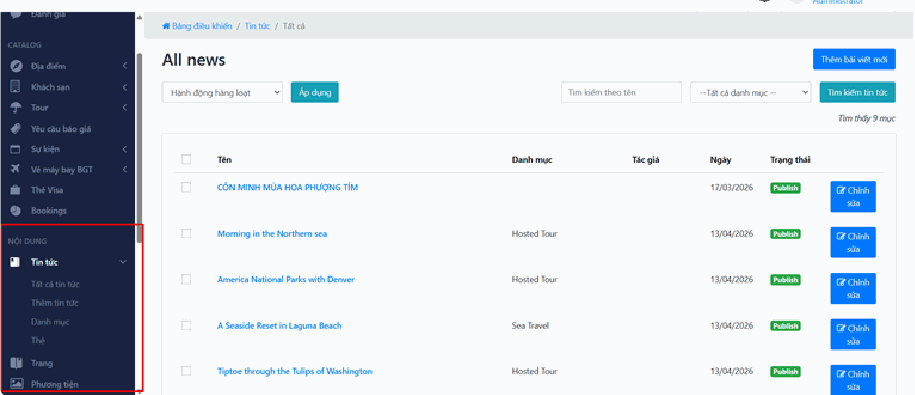

# 2. Khối NỘI DUNG

Mục “Nội dung” là khu vực giúp bạn quản lý toàn bộ thông tin hiển thị trên website. Đây là nơi bạn thực hiện các thao tác liên quan đến việc tạo mới, chỉnh sửa và cập nhật nội dung phục vụ khách hàng.

Trong mục này, hệ thống cung cấp các nhóm chức năng chính sau:

- Tin tức: Quản lý các bài viết như blog, bài SEO, tin tức du lịch

- Trang: Quản lý các trang tĩnh trên website như Giới thiệu, Liên hệ, Chính sách

- Phương tiện: Quản lý hình ảnh và file được sử dụng trên website

