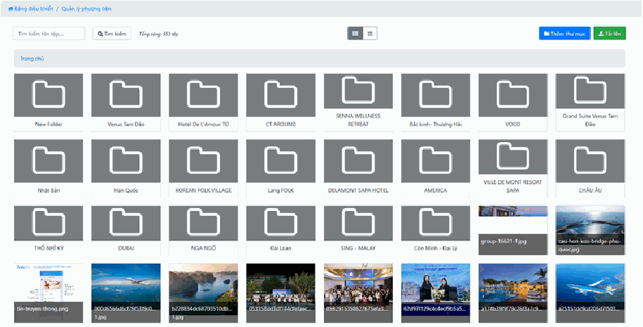
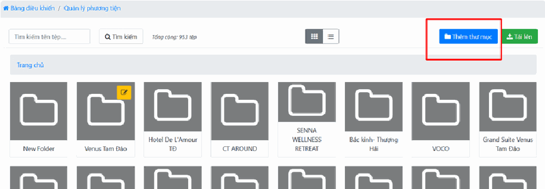
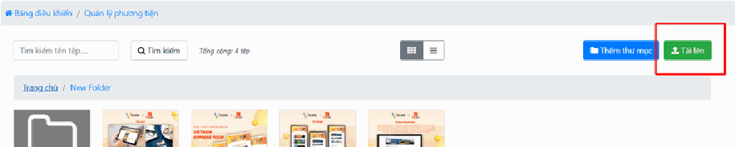
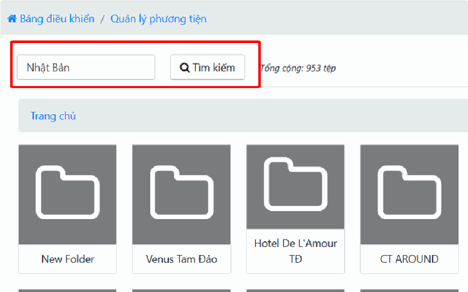
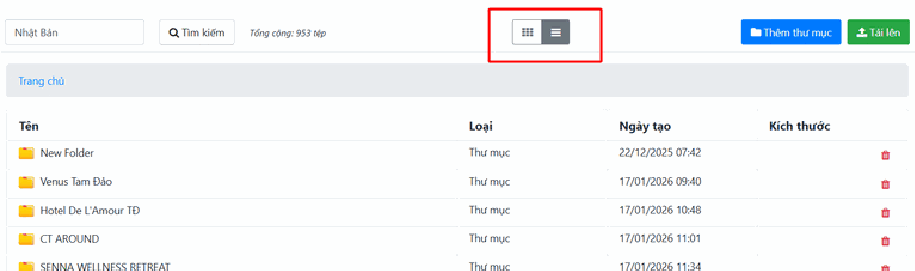

# 2.3. Phương tiện

> **Đọc dòng này trước để khỏi hiểu nhầm:** "Phương tiện" ở đây **KHÔNG phải** ô tô, máy bay hay tàu thuyền. Đây là bản dịch của chữ **"Media"** trong tiếng Anh, nghĩa là **kho ảnh và tệp tin** của website.
>
> Nếu bạn muốn quản lý xe cộ để cho thuê, đó là mục khác trong khối Sản phẩm — không phải mục này.

**Phương tiện** là **kho chứa toàn bộ hình ảnh và tệp tin** bạn đã tải lên website. Hãy hình dung nó giống thư mục "Hình ảnh" trên máy tính của bạn, nhưng nằm trên website và mọi người trong công ty đều dùng chung.

**Vì sao có mục này?** Vì mọi ảnh trên website đều phải được cất ở đâu đó. Khi bạn tải một ảnh lên cho bài viết, ảnh đó tự động vào kho này. Lần sau cần dùng lại ảnh đó cho một tour khác, bạn **chỉ việc lấy ra dùng, không phải tải lại từ máy tính** — vừa nhanh, vừa không làm website phình to vì lưu trùng ảnh.

Bạn sẽ vào đây khi: cần tải một loạt ảnh mới lên trước khi viết bài, cần tìm lại một ảnh cũ, hoặc cần dọn dẹp những ảnh không còn dùng.

> **Đường dẫn:** Menu bên trái > **Nội dung** > **Phương tiện**

> **Nếu bạn không thấy mục này trong menu:** tài khoản của bạn chưa được cấp quyền tải ảnh lên hệ thống. Hãy liên hệ quản trị viên của đơn vị bạn.

## a, Quản lý tệp tin và thư mục

Giao diện này giúp bạn lưu trữ dữ liệu một cách khoa học theo từng chủ đề hoặc điểm đến.

- **Thư mục:** Các biểu tượng hình kẹp tài liệu màu xám đại diện cho các thư mục (ví dụ: Nhật Bản, Hàn Quốc, Dubai...). Bạn có thể **nhấn đúp chuột** vào để xem các ảnh bên trong. Thư mục ở đây hoạt động y hệt thư mục trên máy tính: là những cái "hộp" để bạn xếp ảnh vào cho gọn.

- **Tệp tin:** Các hình ảnh riêng lẻ được hiển thị ở phía dưới. Bạn có thể xem trước nội dung và tên tệp ngay tại đây.

- **Thêm thư mục:** Nhấn nút **Thêm thư mục** màu xanh dương ở góc phải để tạo không gian lưu trữ mới. Việc chia thư mục giúp bạn tìm kiếm ảnh nhanh hơn khi làm bài viết hoặc thiết kế tour.

**Vài chi tiết khác trên màn hình:**

- **Thanh đường dẫn (breadcrumb)** ở phía trên bắt đầu bằng chữ **"Home"** (Trang chủ của kho ảnh). Khi bạn nhấn đúp vào các thư mục để đi sâu vào trong, thanh này sẽ dài ra: `Home > Nhật Bản > Tokyo`. **Muốn quay ra ngoài, nhấn vào tên thư mục cấp trên trên thanh này** — đừng dùng nút Back của trình duyệt, dễ bị nhảy ra khỏi màn hình.
- **Tổng số tệp** được hiển thị ở phía trên, ví dụ *"Tổng: 248 tệp"*.
- Mỗi màn hình hiển thị **32 tệp**. Nếu kho ảnh của bạn nhiều hơn, hãy dùng nút **"Trước"** / **"Sau"** ở cuối danh sách để lật trang.
- Nếu thư mục trống, hệ thống hiện dòng chữ báo **không tìm thấy tệp nào**.

> **Mẹo đặt tên thư mục:** Hãy đặt tên theo thứ bạn hay tìm nhất — tên điểm đến (`Đà Nẵng`, `Nhật Bản`), tên khách sạn, hoặc tên tour. Đừng đặt kiểu `Ảnh mới`, `Ảnh 1`, `abc` — 3 tháng sau chính bạn cũng không nhớ trong đó có gì.

## b, Tải dữ liệu lên hệ thống

Để đưa hình ảnh từ máy tính hoặc điện thoại, bạn thực hiện theo các bước sau:

- **Bước 1 (Tạo nơi lưu trữ):** Nhấn nút **Thêm thư mục** màu xanh dương ở góc trên bên phải. Nhập tên thư mục mới (ví dụ: tên tour hoặc tên khách sạn) để phân loại ảnh ngay từ đầu.

> **Đây là bước quan trọng nhất mà mọi người hay bỏ qua.** Nếu bạn cứ tải hết ảnh vào chung một chỗ, sau vài tháng kho ảnh sẽ có hàng nghìn tệp lộn xộn tên kiểu `IMG_2847.jpg`, và việc tìm lại một tấm ảnh sẽ mất 10 phút thay vì 10 giây. **Tạo thư mục trước, tải ảnh sau** — chỉ mất thêm 20 giây.

- **Bước 2 (Truy cập thư mục):** Tìm đến thư mục vừa tạo trong danh sách và **nhấn đúp chuột** để vào bên trong thư mục đó.

  > Hãy nhìn thanh đường dẫn phía trên để chắc chắn bạn **đang đứng bên trong đúng thư mục** trước khi tải ảnh. Ảnh sẽ được lưu vào đúng chỗ bạn đang đứng.

- **Bước 3 (Tải ảnh):** Nhấn nút **Tải lên** màu xanh lá cây ở góc trên bên phải màn hình.

- **Bước 4 (Hoàn tất):** Chọn các tệp hình ảnh cần dùng từ thiết bị của bạn, nhấn mở (**Open**) và **chờ hệ thống tải dữ liệu lên hoàn toàn**.

  > **Bạn có thể chọn nhiều ảnh cùng lúc:** trong cửa sổ chọn tệp, giữ phím **Ctrl** rồi bấm từng ảnh, hoặc nhấn **Ctrl + A** để chọn hết tất cả ảnh trong thư mục.
  >
  > **Đừng đóng tab hay bấm nút gì khác trong lúc ảnh đang tải.** Nếu tải 20 ảnh nặng, việc này có thể mất vài phút tùy tốc độ mạng. Hãy chờ đến khi tất cả ảnh hiện ra trong danh sách rồi mới làm việc tiếp.

### Ảnh của bạn cần đạt yêu cầu gì?

Hệ thống có một số giới hạn để bảo vệ tốc độ website:

- **Định dạng được chấp nhận:** `.jpg`, `.jpeg`, `.png`, `.gif`, `.bmp`, `.webp` và tệp `.docx`.
- **Dung lượng tối đa:** khoảng **20 MB** cho mỗi tệp.
- **Kích thước tối đa:** khoảng **6000 x 6000 điểm ảnh** (pixel).

> **Con số này có thể khác trên website của bạn** — quản trị viên có quyền chỉnh lại giới hạn trong phần cài đặt hệ thống. Nếu bạn thường xuyên bị chặn khi tải ảnh, hãy hỏi quản trị viên xem giới hạn hiện tại là bao nhiêu.

> **Ảnh chụp từ iPhone không tải lên được?** Ảnh iPhone đời mới thường ở định dạng `.heic` — hệ thống **không nhận** định dạng này. Bạn cần đổi sang `.jpg` trước. Cách đơn giản nhất: vào **Cài đặt > Camera > Định dạng** trên iPhone và chọn **"Tương thích nhất"** thay vì "Hiệu suất cao". Từ đó về sau ảnh chụp ra sẽ là `.jpg` dùng được ngay.

> **Mẹo tiết kiệm dung lượng và tăng tốc website:** Ảnh gốc từ máy ảnh hoặc điện thoại thường nặng 5–10 MB, trong khi website chỉ cần ảnh khoảng **200–500 KB** là đã đẹp rồi. Ảnh càng nặng, khách mở website càng lâu — và khách chờ quá 3 giây thường sẽ thoát ra. Bạn có thể dùng các công cụ nén ảnh miễn phí trên mạng (tìm Google với từ khóa "nén ảnh online") trước khi tải lên.

## c, Tìm kiếm và Thay đổi hiển thị

Khi số lượng hình ảnh quá lớn, bạn có thể sử dụng các công cụ hỗ trợ:

- **Tìm kiếm:** Nhập tên tệp vào ô **Tìm kiếm tên tệp...** và nhấn nút **Tìm kiếm** (biểu tượng kính lúp). Bạn cũng có thể chỉ cần nhấn phím **Enter** sau khi gõ xong.

> **Lưu ý về cách tìm:** Hệ thống tìm theo **tên tệp**, chứ không tìm theo nội dung trong ảnh. Nghĩa là nếu ảnh của bạn tên `IMG_2847.jpg`, dù nó chụp cảnh biển Đà Nẵng thì gõ `đà nẵng` cũng **không ra kết quả**.
>
> **Vì vậy:** hãy tập thói quen **đổi tên ảnh trên máy tính trước khi tải lên** — đặt tên có nghĩa như `bien-my-khe-da-nang.jpg` thay vì để tên máy ảnh tự đặt. Sau này tìm lại sẽ cực nhanh.

- **Chế độ hiển thị:** Ở giữa thanh công cụ phía trên có hai biểu tượng nhỏ, cho phép bạn đổi cách nhìn danh sách ảnh:

  - **Dạng lưới** (biểu tượng các ô vuông): Hiển thị ảnh dưới dạng các ô vuông có hình xem trước (như trong hình). **Dùng khi bạn cần nhìn ảnh để chọn** — ví dụ đang tìm ảnh đẹp nhất cho bài viết.

  - **Dạng danh sách** (biểu tượng các gạch ngang): Hiển thị các tệp theo hàng dọc, kèm đầy đủ các cột **Tên**, **Loại**, **Ngày tạo**, **Dung lượng**. **Dùng khi bạn cần dọn dẹp** — ví dụ tìm xem ảnh nào nặng nhất để xóa bớt, hoặc xem ảnh nào tải lên gần đây nhất.

## d, Chọn và xóa ảnh

Khi bạn nhấn chọn một hoặc nhiều ảnh, một thanh công cụ sẽ xuất hiện với các lựa chọn:

- **"N tệp đã chọn"** — cho bạn biết đang chọn bao nhiêu ảnh. Hãy nhìn con số này để kiểm tra lại trước khi làm gì.
- **"Bỏ chọn"** — hủy toàn bộ lựa chọn hiện tại, quay về ban đầu.
- **"Xóa tệp"** — xóa hẳn các ảnh đã chọn khỏi hệ thống.
- **"Dùng tệp"** — nút này xuất hiện khi bạn mở kho ảnh **từ bên trong một bài viết hoặc một tour**. Nhấn vào để chèn ảnh đã chọn vào chỗ bạn đang làm việc.

> **Cẩn thận tối đa với nút "Xóa tệp".** Ảnh đã xóa ở đây **không có thùng rác để lấy lại**.
>
> Nguy hiểm hơn: nếu ảnh đó **đang được dùng ở một bài viết hay một tour nào đó**, xóa ảnh sẽ làm chỗ đó **hiện ra một ô trống hoặc biểu tượng ảnh vỡ** trên website — mà bạn sẽ không biết cho đến khi khách hàng phàn nàn.
>
> **Nguyên tắc an toàn:** chỉ xóa những ảnh bạn **chắc chắn 100%** là mình vừa tải nhầm lên vài phút trước. Với ảnh cũ, dù trông có vẻ thừa, hãy cứ để đó — ảnh chiếm rất ít chỗ so với rủi ro làm hỏng bài viết.

## Lưu ý & xử lý sự cố

**Tải ảnh lên bị báo lỗi "File type invalid" (Loại tệp không hợp lệ).**
Ảnh của bạn sai định dạng. Hệ thống chỉ nhận `.jpg`, `.jpeg`, `.png`, `.gif`, `.bmp`, `.webp` và `.docx`. Nếu ảnh là `.heic` (từ iPhone), `.tif`, `.psd` hay `.svg`, bạn cần đổi sang `.jpg` trước khi tải lên.

**Ảnh tải lên quay mãi rồi báo lỗi.**
Thường do 3 nguyên nhân:
1. **Ảnh quá nặng** — vượt giới hạn khoảng 20 MB. Hãy nén ảnh nhỏ lại.
2. **Ảnh có kích thước quá lớn** — vượt 6000 x 6000 điểm ảnh. Hay gặp với ảnh panorama hoặc ảnh scan độ phân giải cao.
3. **Mạng yếu** — nếu bạn đang tải 30 ảnh cùng lúc qua wifi chập chờn. Hãy thử tải từng nhóm 5–10 ảnh một.

**Tải ảnh lên rồi mà không thấy đâu.**
Rất có thể ảnh đã vào **một thư mục khác** với thư mục bạn đang đứng. Hãy nhìn thanh đường dẫn phía trên (bắt đầu bằng **"Home"**) để biết mình đang ở đâu, và bấm về **"Home"** để xem toàn bộ kho.

Cũng có thể bạn **đang bật một ô tìm kiếm** từ lần trước. Hãy xóa sạch ô tìm kiếm và tìm lại.

**Tìm mãi không ra một tấm ảnh chắc chắn đã tải lên.**
Nhớ rằng hệ thống chỉ tìm theo **tên tệp**. Nếu bạn không nhớ tên, hãy chuyển sang **chế độ danh sách**, sắp xếp theo **Ngày tạo** để tìm ảnh mới tải gần đây nhất. Hoặc mở lần lượt các thư mục ra xem bằng chế độ lưới.

**Ảnh trên website bị hiện ô trống / biểu tượng ảnh vỡ.**
Nhiều khả năng ảnh đó đã bị ai đó **xóa khỏi kho Phương tiện**. Hãy tải lại ảnh đó lên và vào bài viết/tour tương ứng chọn lại ảnh mới.

**Ảnh hiện trên web bị mờ hoặc bị vỡ hạt.**
Ảnh gốc của bạn quá nhỏ. Ví dụ ảnh chỉ rộng 400 điểm ảnh mà website cần hiển thị ở khổ rộng 1200 điểm ảnh — hệ thống buộc phải phóng to lên và ảnh sẽ mờ. Hãy dùng ảnh gốc có chiều rộng tối thiểu **1200 điểm ảnh** cho ảnh lớn.

**Website mở rất chậm sau khi tải nhiều ảnh.**
Ảnh của bạn quá nặng. Hãy nén ảnh xuống khoảng 200–500 KB mỗi tấm trước khi tải lên. Ngoài ra, quản trị viên có thể bật tính năng **tải ảnh chậm (lazy load)** trong phần cài đặt hệ thống — tính năng này chỉ tải ảnh khi khách cuộn xuống đến chỗ đó, giúp trang mở nhanh hơn hẳn.

## Xem thêm

- [2. Khối NỘI DUNG](README.md) — tổng quan cả khối
- [2.1. Tin tức](tin-tuc.md) — dùng ảnh từ kho này cho bài viết
- [2.2. Trang](trang.md) — dùng ảnh từ kho này cho trang tĩnh
