# 2.1. Tin tức

Trong mục “Tin tức”, bạn sẽ thấy các chức năng:

- Tất cả tin tức: Hiển thị danh sách toàn bộ bài viết hiện có

- Thêm tin tức: Tạo bài viết mới

- Danh mục: Quản lý các nhóm phân loại bài viết

- Thẻ: Tạo và quản lý từ khóa (tag) cho bài viết

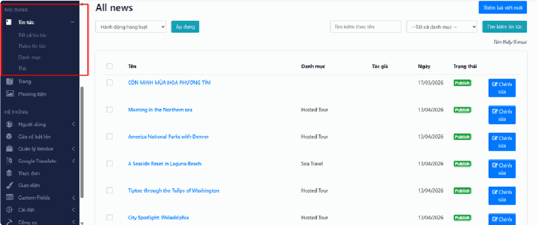

## Tất cả tin tức

## a, Khu vực danh sách bài viết

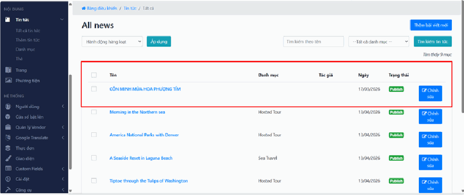

Ở giữa màn hình là bảng hiển thị danh sách các bài viết với các thông tin:

- Tên: Tiêu đề bài viết

- Danh mục: Bài viết thuộc nhóm nào

- Tác giả: Người tạo bài

- Ngày: Ngày đăng bài

- Trạng thái: Tình trạng bài viết (đã xuất bản hoặc chưa)

## b, Nút thêm bài viết mới

Góc trên bên phải có nút “Thêm bài viết mới” Dùng để tạo nhanh một bài viết mới

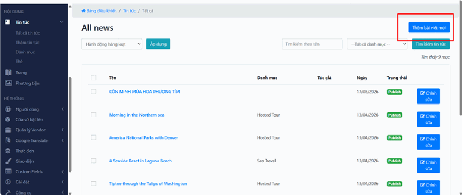

## c, Tìm kiếm và lọc bài viết

Bạn có thể:

- Tìm bài viết theo tên

- Lọc theo danh mục

- Nhấn “Tìm kiếm tin tức” để hiển thị kết quả

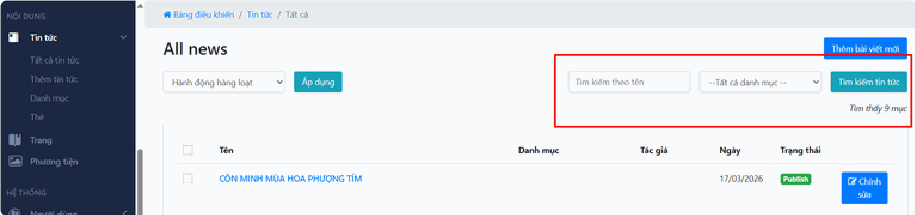

## d, Hành động hàng loạt

- Chọn nhiều bài viết bằng ô tick bên trái

- Chọn hành động (ví dụ: xóa, chỉnh sửa…)

- Nhấn “Áp dụng” để thực hiện cùng lúc

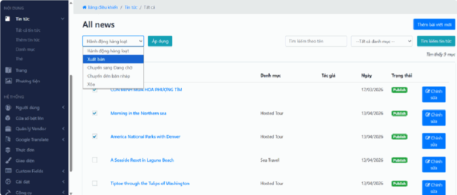

## e, Chỉnh sửa bài viết

Mỗi bài viết đều có nút “Chỉnh sửa” ở bên phải

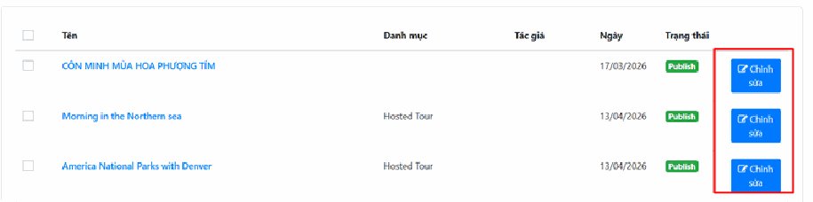

Dùng để:

- Sửa nội dung

- Cập nhật thông tin

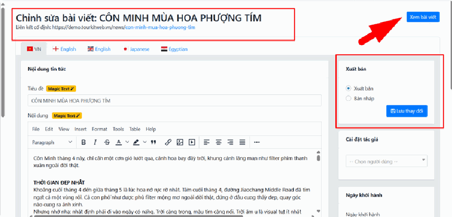

**Bước 1:** Tại màn hình chỉnh sửa:

- Tiêu đề: Sửa trực tiếp tên bài viết trong ô tiêu đề

- Nội dung: Sửa nội dung trong khung soạn thảo phía dưới Có thể thêm, xóa hoặc chỉnh sửa text, hình ảnh tùy ý

**Bước 2:** Trong mục “Xuất bản” bên phải:

- Chọn “Xuất bản” nếu muốn hiển thị bài viết lên website

- Chọn “Bản nháp” nếu chỉ muốn lưu lại mà chưa hiển thị

**Bước 3:** Sau khi chỉnh sửa xong, kiểm tra lại nội dung trước khi lưu và nhấn nút “Lưu thay đổi” ở bên phải màn hình. Hệ thống sẽ cập nhật nội dung mới của bài viết.

**Bước 4:** Nhấn nút “Xem bài viết” ở góc trên bên phải màn hình. Hệ thống sẽ mở trang hiển thị thực tế của bài viết trên website.

## f, Trạng thái bài viết

- “Publish”: Bài viết đã hiển thị trên website

- Các trạng thái khác (nếu có): Bài chưa xuất bản hoặc đang chỉnh sửa

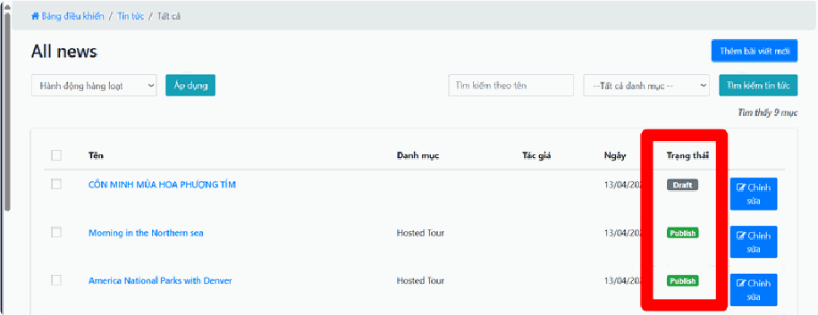

## Thêm tin tức

## Bước 1: Nhập thông tin tiêu đề và nội dung

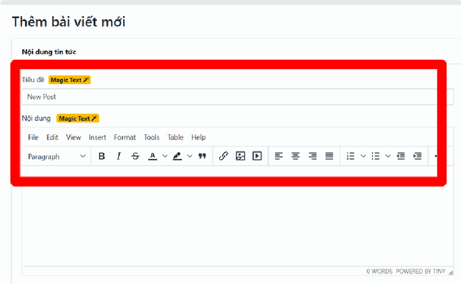

- Tiêu đề: Tại ô trống bên dưới dòng Tiêu đề, bạn nhập tên của bài viết. Đây là thành phần bắt buộc.

- Nội dung: Tại khung soạn thảo lớn phía dưới, bạn nhập nội dung chi tiết của bài viết. Bạn có thể sử dụng thanh công cụ để định dạng văn bản (in đậm, căn lề, chèn liên kết) giúp bài viết dễ đọc hơn.

## Bước 2: Tải hình ảnh minh họa

- Tại mục Bộ sưu tập ảnh, nhấn vào nút Chọn hình ảnh.

- Tải các tệp ảnh từ máy tính lên để làm phong phú nội dung bài viết.

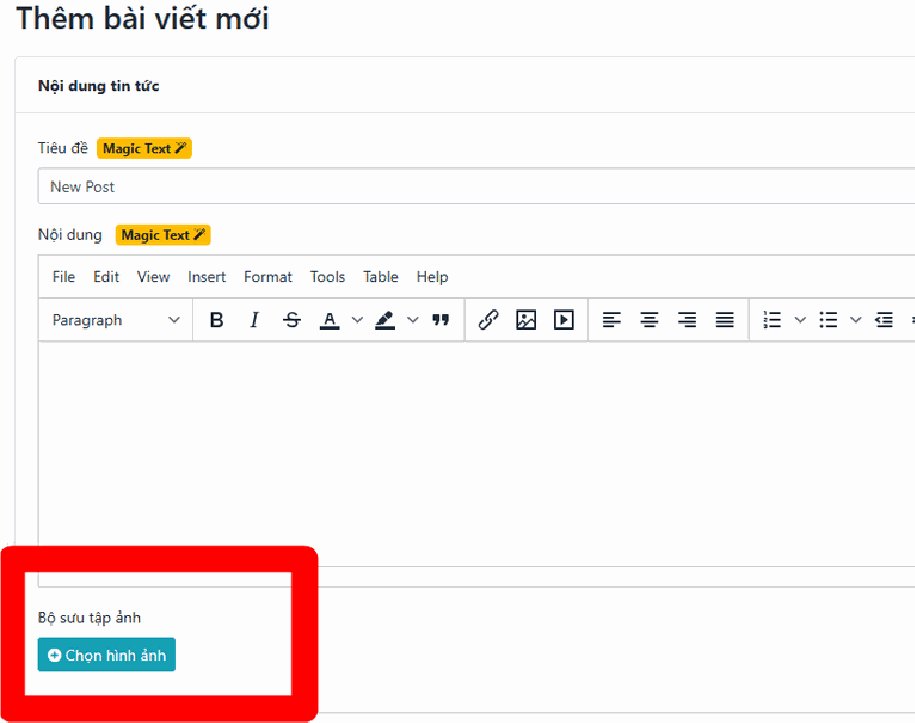

## Bước 3: Phân loại danh mục và từ khóa

- Danh mục: Tại cột bên phải, chọn nhóm chủ đề phù hợp cho bài viết trong danh sách thả xuống.

- Thẻ (Tag): Nhập các từ khóa liên quan trực tiếp đến nội dung vào ô Thẻ để hỗ trợ việc tìm kiếm bài viết sau này.

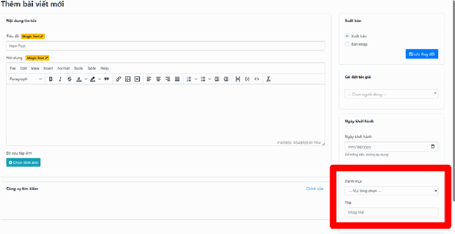

## Bước 4: Thiết lập tác giả và ngày tháng

- Cài đặt tác giả: Chọn tên người đăng bài từ danh sách có sẵn.

- Ngày khởi hành: Nếu bài viết có liên quan đến mốc thời gian cụ thể, hãy chọn ngày trong bảng lịch. Nếu không cần thiết, bạn có thể để trống mục này.

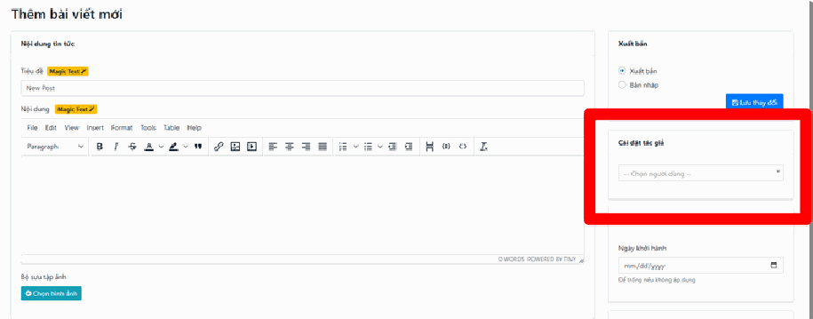

## Bước 5: Cài đặt ảnh đại diện và tối ưu tìm kiếm

- Ảnh đại diện: Tải lên một hình ảnh đại diện tại khung cuối cùng bên phải. Đây là hình ảnh đầu tiên người dùng nhìn thấy trước khi bấm vào đọc bài.

- Công cụ tìm kiếm: Nhấn vào Chỉnh sửa ở phía dưới cùng nếu bạn muốn thay đổi cách tiêu đề và đường dẫn hiển thị trên các bộ máy tìm kiếm như Google.

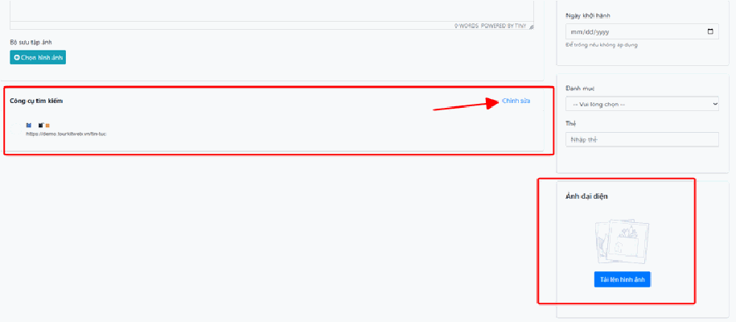

## Bước 6: Lựa chọn trạng thái và Hoàn tất

- Lựa chọn trạng thái: Tại khung Xuất bản, chọn Xuất bản nếu muốn đăng ngay hoặc Bản nháp nếu muốn lưu lại để sửa sau.

- Hoàn tất: Nhấn nút Lưu thay đổi màu xanh để hệ thống lưu lại toàn bộ dữ liệu bài viết.

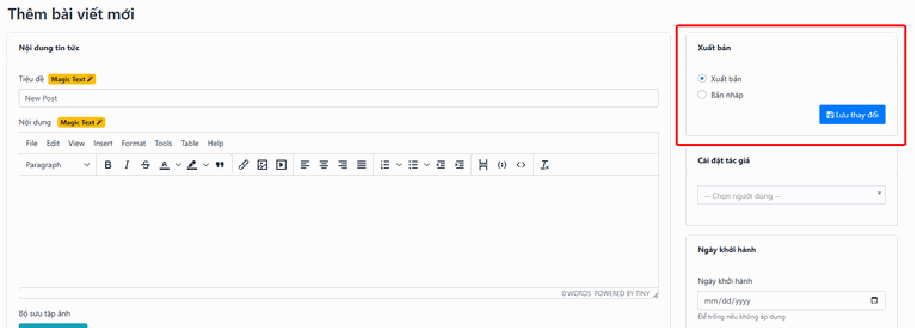

*📺 Video hướng dẫn: TourkitWeb | Hướng dẫn thao tác tạo mới 1 tin tức*

## Danh mục

## a, Cách thêm danh mục mới

Để tạo một danh mục mới, bạn thực hiện theo các bước tại cột bên trái:

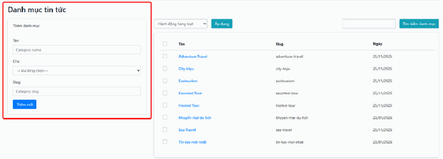

- Bước 1 (Tên): Nhập tên danh mục muốn tạo vào ô "Category name" (ví dụ: Tin tức lữ hành).

- Bước 2 (Cha): Nếu danh mục này thuộc về một nhóm lớn hơn, bạn chọn danh mục cấp trên trong thực đơn thả xuống. Nếu đây là danh mục chính, hãy để mặc định.

- Bước 3 (Slug): Nhập chuỗi ký tự không dấu và nối nhau bằng dấu gạch ngang vào ô "Category slug" (ví dụ: tin-tuc-lu-hanh). Đây là phần sẽ hiển thị trên đường dẫn của trang web.

- **Bước 4:** Nhấn nút "Thêm mới" màu xanh để hoàn tất.

## b, Cách tìm kiếm danh mục

Nếu danh sách có quá nhiều mục, bạn có thể tìm nhanh bằng cách:

- Nhập tên danh mục cần tìm vào ô trống ở góc trên bên phải.

- Nhấn nút "Tìm kiếm danh mục" để hệ thống lọc kết quả.

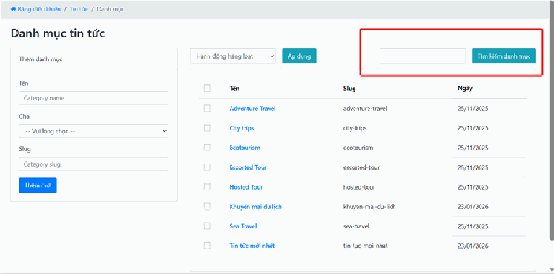

## c, Cách quản lý và chỉnh sửa danh sách

Bảng bên phải liệt kê tất cả các danh mục đang có trên hệ thống:

- Xem thông tin: Bạn có thể theo dõi tên, đường dẫn (slug) và ngày khởi tạo của từng danh mục.

- Chỉnh sửa hoặc Xóa: Khi đưa con trỏ chuột vào tên một danh mục cụ thể (như "Adventure Travel"), các tùy chọn chỉnh sửa hoặc xóa thường sẽ xuất hiện để bạn thao tác.

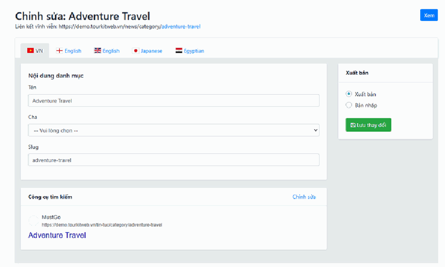

## d, Thao tác hàng loạt (Xử lý nhiều mục cùng lúc)

Trong trường hợp bạn muốn xóa hoặc thay đổi trạng thái của nhiều danh mục cùng một lúc:

- **Bước 1:** Đánh dấu tích vào các ô vuông nhỏ ở cột ngoài cùng bên trái của những danh mục cần xử lý.

- **Bước 2:** Chọn hành động mong muốn trong thực đơn Hành động hàng loạt ở phía trên.

- **Bước 3:** Nhấn nút Áp dụng bên cạnh để thực hiện lệnh cho tất cả các mục đã chọn.

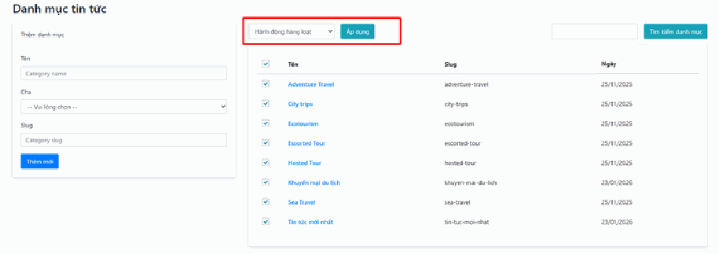

## Thẻ

Các thao tác tại phần Thẻ tin tức bao gồm thêm mới, tìm kiếm và quản lý hàng loạt được thực hiện hoàn toàn tương tự như các bước tại mục "Danh mục tin tức" đã hướng dẫn ở trên.

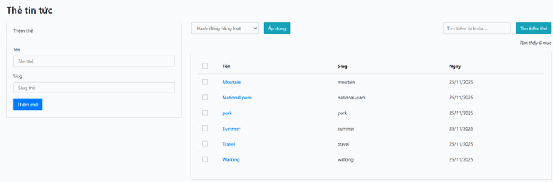
