# 2.1. Tin tức

**Tin tức** là nơi bạn viết và quản lý các bài viết trên website: tin du lịch, blog chia sẻ kinh nghiệm, bài giới thiệu điểm đến, thông báo khuyến mãi.

Đây là mục bạn dùng nhiều nhất nếu muốn khách hàng **tìm thấy bạn trên Google**. Mỗi bài viết hay là một "cần câu" kéo khách về website mà bạn không phải trả tiền quảng cáo.

Bài tin tức khác với **Trang** ở chỗ: bài tin tức có **ngày đăng**, có **tác giả**, thuộc một **danh mục**, và được gắn **thẻ từ khóa**. Nhờ vậy hệ thống tự động xếp bài của bạn thành danh sách để khách xem lần lượt.

> **Đường dẫn:** Menu bên trái > **Nội dung** > **Tin tức**

> **Huy hiệu số màu vàng cạnh chữ "Tin tức":** Nếu bạn thấy một con số màu vàng ngay bên cạnh chữ "Tin tức" trong menu, đó là **số bài đang chờ duyệt** — bài đã soạn xong nhưng chưa đăng lên website. Hãy vào kiểm tra và quyết định cho đăng hay không. Không có bài chờ thì huy hiệu không hiện.

### Trong mục này có gì?

Nhấn vào **"Tin tức"** ở menu bên trái, một danh sách nhỏ sẽ xổ ra với 4 mục con:

* **Tất cả tin tức** — bảng liệt kê toàn bộ bài viết đang có. Đây là nơi bạn tìm bài cũ để sửa, hoặc xem bài nào đã đăng, bài nào còn nháp.
* **Thêm tin tức** — mở màn hình trắng để viết một bài mới.
* **Danh mục** — các nhóm chủ đề để xếp bài viết vào. Ví dụ: "Cẩm nang du lịch", "Khuyến mãi", "Tin công ty". Nếu không phân nhóm, khách phải cuộn qua hàng trăm bài mới tìm được thứ họ cần.
* **Thẻ** — từ khóa gắn kèm bài viết. Ví dụ bài về Đà Nẵng có thể gắn thẻ `da-nang`, `mien-trung`, `bien`. Khách bấm vào một thẻ sẽ thấy mọi bài cùng chủ đề đó.

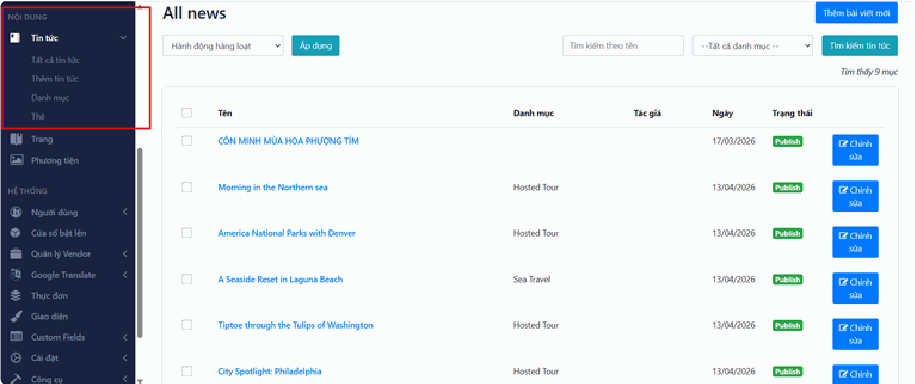

> **Nếu bạn không thấy đủ 4 mục này:** tài khoản của bạn có thể chỉ được cấp quyền xem, chưa được quyền tạo bài. Hãy liên hệ quản trị viên.

***

## Tất cả tin tức

Đây là màn hình bạn sẽ mở đầu tiên mỗi khi muốn tìm, sửa hoặc kiểm tra một bài viết đã có.

### a, Khu vực danh sách bài viết

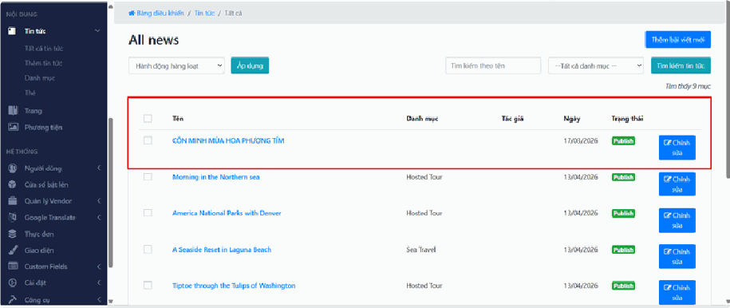

Ở giữa màn hình là một bảng lớn, mỗi dòng là một bài viết. Bảng có các cột sau:

* **Tên** — tiêu đề bài viết. Đây cũng là **đường link**: nhấn thẳng vào tiêu đề là mở được màn hình chỉnh sửa bài đó, không cần đi vòng.
* **Danh mục** — bài này đang nằm ở nhóm chủ đề nào.
* **Tác giả** — người đứng tên bài viết. Nếu tài khoản của người đó đã bị xóa khỏi hệ thống, cột này sẽ hiện dòng chữ báo tác giả đã bị xóa. Bài viết vẫn còn nguyên, chỉ mất tên người viết thôi.
* **Ngày** — ngày bài viết được cập nhật gần nhất.
* **Trạng thái** — bài này đã đăng lên web hay chưa. Xem phần **f** bên dưới để hiểu từng trạng thái.

Ở phía trên bảng, hệ thống báo cho bạn **tổng số bài viết đang có**. Danh sách hiển thị **20 bài mỗi trang** — nếu bạn có nhiều hơn, hãy cuộn xuống cuối bảng và bấm sang trang tiếp theo.

> **Nếu bảng trống trơn và hiện chữ "Không có dữ liệu":** hoặc bạn thật sự chưa có bài nào, hoặc bạn đang bật một bộ lọc/tìm kiếm nào đó mà không có bài nào khớp. Hãy xóa sạch ô tìm kiếm và bấm tìm lại.

### b, Nút thêm bài viết mới

Ở **góc trên bên phải** màn hình có một nút màu xanh: **"Thêm bài viết mới"**. Nhấn vào đó là hệ thống mở ngay màn hình soạn bài trắng để bạn bắt đầu viết.

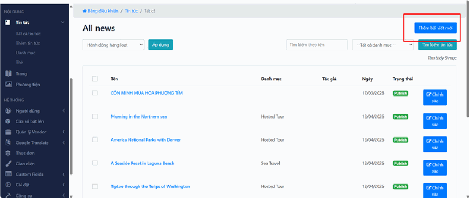

Nút này làm đúng một việc giống hệt mục **"Thêm tin tức"** ở menu bên trái. Bạn dùng cái nào tiện hơn cũng được.

### c, Tìm kiếm và lọc bài viết

Khi bạn đã có vài chục bài, việc cuộn tay tìm bài sẽ rất mất thời gian. Hãy dùng thanh công cụ phía trên bảng:

* **Ô "Tìm kiếm theo tên"** — gõ một vài chữ có trong tiêu đề bài viết. Bạn **không cần gõ đủ và đúng cả tiêu đề**, chỉ cần một đoạn là được. Ví dụ gõ `Đà Nẵng` sẽ ra mọi bài có chữ "Đà Nẵng" trong tiêu đề.
* **Ô chọn danh mục** — bấm vào để xổ danh sách các nhóm chủ đề. Chọn một nhóm thì bảng chỉ hiện bài thuộc nhóm đó. Muốn xem lại tất cả thì chọn dòng **"Tất cả danh mục"**.
* Sau khi điền/chọn xong, **bắt buộc nhấn nút "Tìm kiếm tin tức"** thì bảng mới cập nhật. Chỉ gõ chữ vào ô mà không bấm nút thì không có gì xảy ra.

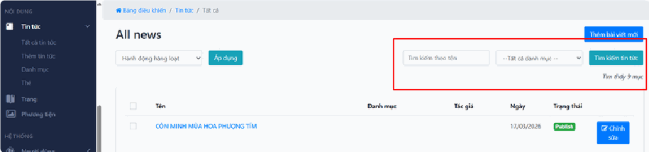

> **Mẹo:** Bạn có thể dùng cả hai cùng lúc — ví dụ tìm chữ `khuyến mãi` **trong** danh mục "Tin công ty".

> **Tìm mãi không ra bài mình chắc chắn đã viết?** Hai nguyên nhân hay gặp: (1) bạn copy chữ từ nơi khác dán vào ô tìm kiếm và bị dính **dấu cách thừa** ở đầu — hãy xóa hết rồi gõ tay lại; (2) bạn đang kẹt ở một danh mục — hãy chọn lại **"Tất cả danh mục"**.

### d, Hành động hàng loạt

"Hành động hàng loạt" nghĩa là **xử lý nhiều bài cùng một lúc** thay vì mở từng bài ra sửa. Rất tiện khi bạn cần đăng 10 bài nháp cùng lúc, hoặc dọn dẹp bài cũ.

Cách làm gồm 3 bước, **thiếu bước nào cũng không chạy**:

1. **Chọn bài** — đánh dấu tích vào ô vuông nhỏ ở **cột ngoài cùng bên trái** của từng bài cần xử lý. Muốn chọn hết cả trang, hãy tích vào ô vuông trên **dòng tiêu đề của bảng**.
2. **Chọn việc cần làm** — bấm vào ô xổ xuống **"Hành động hàng loạt"** ở phía trên bảng và chọn một trong các lệnh:
   * **"Xuất bản"** — đăng các bài đã chọn lên website cho khách xem.
   * **"Chuyển sang Chờ duyệt"** — đưa bài về trạng thái chờ, chưa hiện ra ngoài, chờ người có thẩm quyền duyệt.
   * **"Chuyển sang Bản nháp"** — gỡ bài khỏi website, đưa về dạng nháp để sửa tiếp.
   * **"Xóa"** — xóa hẳn các bài đã chọn.
3. **Nhấn nút "Áp dụng"** ngay bên cạnh. Đây là bước hay bị quên nhất — chọn xong mà không bấm "Áp dụng" thì **không có gì xảy ra cả**.

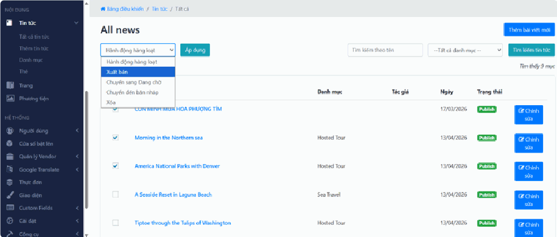

> **Cẩn thận với lệnh "Xóa":** hệ thống sẽ hỏi lại một câu xác nhận đại ý _"Bạn có muốn xóa không?"_. Hãy đọc kỹ và **đếm lại xem mình đã tích đúng mấy bài chưa** trước khi đồng ý. Bài đã xóa ở đây **không có thùng rác để lấy lại**. Nếu chỉ muốn tạm gỡ bài khỏi website, hãy dùng **"Chuyển sang Bản nháp"** thay vì xóa — an toàn hơn nhiều, và lúc nào cần đăng lại cũng được.

### e, Chỉnh sửa bài viết

Mỗi dòng trong bảng đều có nút **"Chỉnh sửa"** ở phía bên phải.

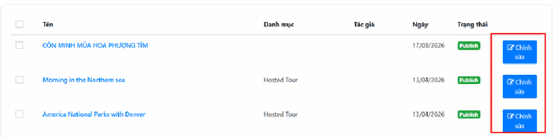

Nhấn vào đó (hoặc nhấn thẳng vào tiêu đề bài viết) để mở màn hình sửa bài. Tại đây bạn có thể sửa chữ, thay ảnh, đổi danh mục, đổi trạng thái đăng/nháp.

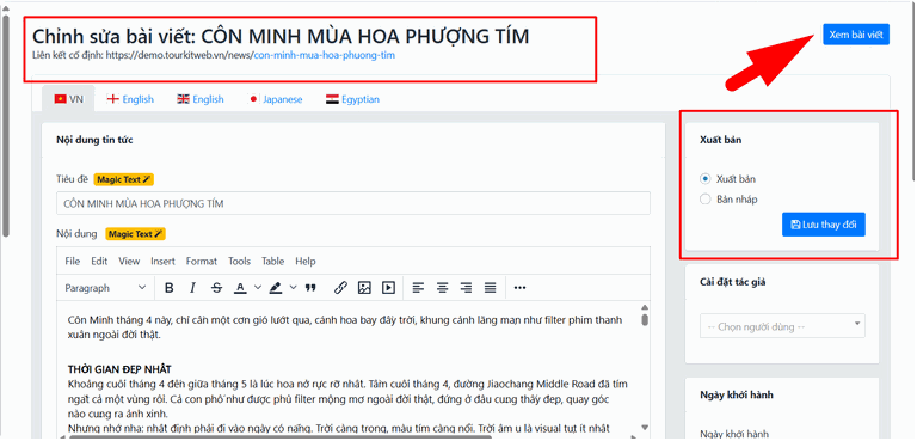

**Bước 1: Sửa nội dung ở khu vực chính (bên trái, phần rộng nhất)**

* **Tiêu đề** — ô trên cùng. Sửa trực tiếp tên bài viết ở đây.
* **Nội dung** — khung soạn thảo lớn phía dưới. Bạn gõ, xóa, chèn ảnh, chèn liên kết ở đây giống như dùng Word. Thanh công cụ phía trên khung cho phép in đậm, in nghiêng, tạo danh sách gạch đầu dòng, căn lề.
* **Đường dẫn (Permalink)** — ngay dưới tiêu đề có một dòng chữ nhỏ hiện địa chỉ của bài trên web, ví dụ `.../kinh-nghiem-di-da-nang`. Nhấn vào đó nếu muốn sửa.

> **Cẩn thận khi sửa đường dẫn của bài đã đăng lâu:** nếu đã có người chia sẻ link bài này lên Facebook/Zalo, đổi đường dẫn sẽ làm những link cũ đó **không mở được nữa**. Với bài mới viết thì sửa thoải mái.

**Bước 2: Chọn trạng thái ở khung "Xuất bản" (cột bên phải)**

Trong khung **"Xuất bản"** có hai lựa chọn hình tròn:

* **"Xuất bản"** — đăng bài lên website, khách vào xem được ngay.
* **"Bản nháp"** — chỉ lưu lại trong trang quản trị, **khách không nhìn thấy gì cả**.

**Bước 3: Lưu lại**

Đọc soát lại một lượt, rồi nhấn nút **"Lưu thay đổi"** màu xanh trong khung "Xuất bản" ở cột bên phải.

> **Lưu ý quan trọng:** Chọn "Xuất bản" thôi là **chưa đủ**. Bạn bắt buộc phải nhấn **"Lưu thay đổi"** thì hệ thống mới ghi nhận. Rất nhiều người bấm chọn "Xuất bản" rồi đóng tab luôn, sau đó thắc mắc sao web không thấy bài.

**Bước 4: Kiểm tra thành quả**

Nhấn nút **"Xem bài viết"** ở góc trên bên phải. Hệ thống sẽ mở bài viết đúng như khách hàng nhìn thấy trên website. Hãy nhìn qua xem ảnh có bị vỡ không, chữ có bị dính liền không.

### f, Trạng thái bài viết

Cột **"Trạng thái"** trong bảng cho biết bài viết của bạn đang ở tình trạng nào. Có 3 trạng thái:

| Trạng thái                | Nghĩa là gì                                                                                                                                                        |
| ------------------------- | ------------------------------------------------------------------------------------------------------------------------------------------------------------------ |
| **"Publish"** (Xuất bản)  | Bài đã đăng, khách vào website xem được bình thường.                                                                                                               |
| **"Draft"** (Bản nháp)    | Bài mới lưu tạm, **khách không thấy**. Bạn viết dở, để mai viết tiếp thì để trạng thái này.                                                                        |
| **"Pending"** (Chờ duyệt) | Bài đã soạn xong nhưng **chưa được đăng**, đang chờ người có thẩm quyền xem lại và cho phép. Đây chính là con số hiện trong **huy hiệu vàng** cạnh menu "Tin tức". |

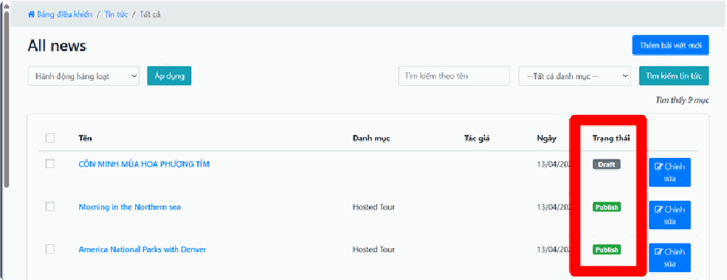

> **Muốn duyệt một bài đang chờ?** Có 2 cách. Cách nhanh: tích chọn bài đó trong bảng, chọn hành động hàng loạt **"Xuất bản"**, nhấn **"Áp dụng"**. Cách kỹ hơn: mở bài ra đọc lại nội dung, rồi chọn **"Xuất bản"** trong khung bên phải và nhấn **"Lưu thay đổi"**.

***

## Thêm tin tức

Đây là màn hình bạn viết một bài mới từ đầu. Nghe có vẻ nhiều bước, nhưng thật ra chỉ có **2 thứ bắt buộc**: **tiêu đề** và **nội dung**. Những thứ còn lại (ảnh, danh mục, thẻ, SEO) là để bài viết đẹp và dễ tìm hơn — bạn có thể bổ sung sau.

> **Đường dẫn:** Menu bên trái > **Nội dung** > **Tin tức** > **Thêm tin tức**

> **Muốn bài lên Google?** Các bước dưới đây giúp bạn đăng được bài. Để bài được Google xếp hạng cao, hãy đọc tiếp phần [**Đăng bài chuẩn SEO**](#dang-bai-chuan-seo) ngay sau mục này — nên đọc **trước khi** bắt đầu viết, vì có vài việc phải làm đúng ngay từ lần lưu đầu tiên.

### Bước 1: Nhập thông tin tiêu đề và nội dung

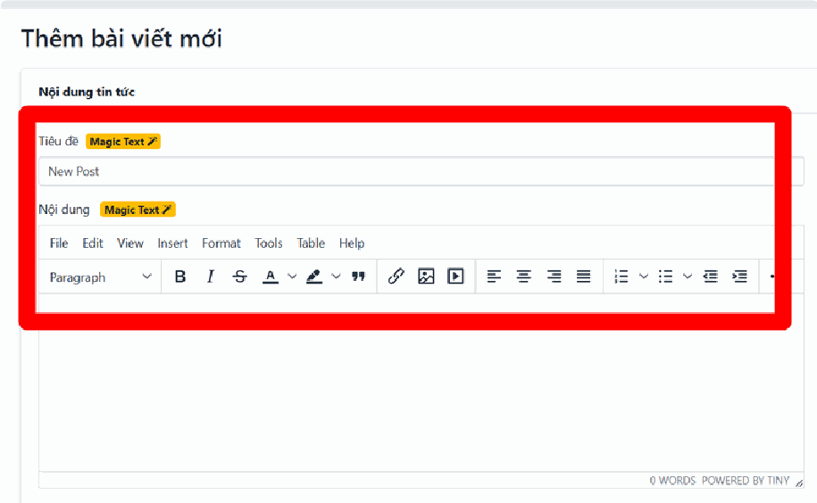

*   **Tiêu đề** — ô trống bên dưới dòng "Tiêu đề". Nhập tên bài viết. **Đây là mục bắt buộc**, không có tiêu đề thì hệ thống không cho lưu.

    > **Mẹo viết tiêu đề tốt:** Hãy viết đúng cái mà khách sẽ gõ lên Google. Tiêu đề _"Kinh nghiệm du lịch Đà Nẵng 3 ngày 2 đêm"_ kéo khách tốt hơn nhiều so với _"Chuyến đi đáng nhớ"_. Độ dài lý tưởng khoảng 8–15 chữ.
*   **Nội dung** — khung soạn thảo lớn phía dưới. Đây là chỗ bạn viết bài. Dùng thanh công cụ phía trên để in đậm, căn lề, chèn liên kết, chèn ảnh vào giữa bài cho dễ đọc. Góc dưới bên phải khung có dòng **"… WORDS"** cho biết bài đang dài bao nhiêu chữ — nên viết dài cỡ nào xem [Đăng bài chuẩn SEO](#dang-bai-chuan-seo), Bước 4 mục g.

    > **Nếu bạn soạn sẵn bài trong Word rồi copy sang:** Word hay mang theo đủ thứ định dạng ẩn làm bài viết hiển thị lộn xộn trên web. Cách an toàn: dán bằng tổ hợp phím **Ctrl + Shift + V** (dán không kèm định dạng), rồi tự in đậm lại những chỗ cần thiết. Chỉ mất thêm 1 phút nhưng bài sẽ sạch sẽ.

### Bước 2: Tải hình ảnh minh họa

* Tại mục **Bộ sưu tập ảnh**, nhấn vào nút **Chọn hình ảnh**.
* Tải các tệp ảnh từ máy tính lên để làm phong phú nội dung bài viết.

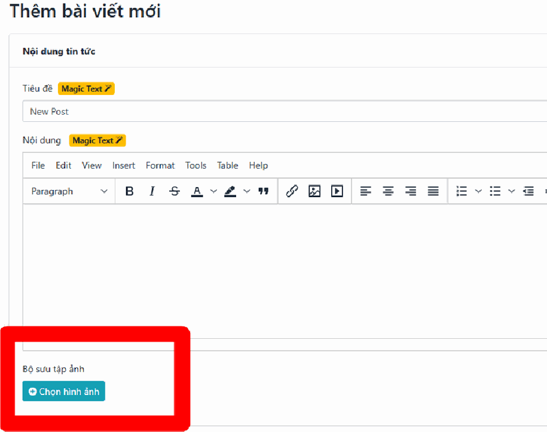

Cửa sổ hiện ra chính là **kho ảnh** của website (xem bài [2.3. Phương tiện](phuong-tien.md)). Bạn có thể chọn ảnh đã có sẵn trong kho, hoặc tải ảnh mới từ máy tính lên.

> **Ảnh nên chuẩn bị thế nào:** Định dạng `.jpg` hoặc `.png`, hệ thống nhận tối đa 20 MB mỗi ảnh — nhưng **hệ thống không tự thu nhỏ ảnh**, ảnh nặng bao nhiêu khách tải bấy nhiêu. Ảnh trong bài nên **rộng 1200 px, dưới 300 KB**; ảnh đại diện bài **1200 × 630 px, dưới 200 KB**. Bảng đầy đủ và cách nén ảnh xem [Kích thước ảnh chuẩn](../kich-thuoc-anh.md).

### Bước 3: Phân loại danh mục và từ khóa

* **Danh mục** — tại cột bên phải, bấm vào ô xổ xuống và chọn nhóm chủ đề phù hợp cho bài viết.
* **Thẻ (Tag)** — nhập các từ khóa liên quan trực tiếp đến nội dung vào ô **Thẻ**. Gõ xong mỗi từ, nhấn phím **Enter** để từ đó biến thành một "chip" nhỏ. Muốn bỏ thì bấm dấu **x** trên chip.

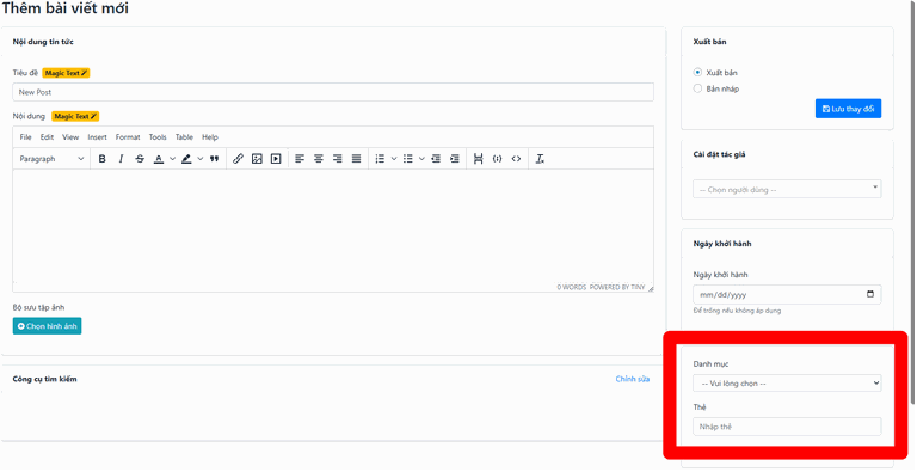

> **Tại sao phải chọn danh mục?** Vì nó quyết định bài viết của bạn xuất hiện ở đâu trên website. Nếu ô danh mục còn để nguyên dòng **"-- Vui lòng chọn --"**, bài của bạn sẽ "mồ côi", khách rất khó tìm thấy. Nếu chưa có danh mục nào phù hợp, hãy sang mục **Danh mục** tạo trước (xem phần bên dưới), rồi quay lại đây chọn.

> **Mẹo về thẻ:** Đừng gắn quá nhiều. 3–5 thẻ đúng trọng tâm là đủ. Gắn 20 thẻ lung tung không giúp bài lên Google, chỉ làm rối website.

* **Địa điểm liên quan** — khung ngay bên dưới, ở cột bên phải. Bấm vào ô, gõ vài chữ để tìm (ví dụ `Đà Nẵng`) rồi chọn. Bài nói về nhiều nơi (_"Đà Nẵng – Hội An – Huế 5 ngày"_) thì chọn **hết các nơi đó**; muốn bỏ một nơi thì bấm dấu **x** cạnh tên.

> **Tại sao nên chọn địa điểm?** Trang tổng hợp của địa điểm trên website (ví dụ `tenmien.com/location/da-nang`) có khối **"Bài viết về Đà Nẵng"** — bài nào gắn Đà Nẵng sẽ tự hiện ở đó, ngay cạnh tour và khách sạn Đà Nẵng. Khách đang xem tour đọc thêm được kinh nghiệm, còn Google thấy trang địa điểm có nội dung phong phú nên xếp cao hơn. **Không chọn thì bài không hiện ở trang địa điểm nào.**
>
> Chọn **càng cụ thể càng tốt**: bài về Hội An thì chọn **Hội An**, đừng chọn **Việt Nam**. Bài gắn Hội An tự hiện cả ở trang của địa điểm cha (Đà Nẵng, Việt Nam). Xem thêm [3.1. Địa điểm](../khoi-san-pham/dia-diem.md#trang-cua-dia-diem-tren-website-vu-khi-seo).

> 📷 *[Cần chụp màn hình: khung "Địa điểm liên quan" ở cột phải màn viết bài, đã chọn 2 địa điểm]*

### Bước 4: Thiết lập tác giả và ngày tháng

* **Cài đặt tác giả** — bấm vào ô và chọn tên người đăng bài. Bạn có thể gõ vài chữ để tìm nhanh trong danh sách người dùng.
* **Ngày khởi hành** — chỉ dùng khi bài viết gắn với một mốc thời gian cụ thể (ví dụ bài giới thiệu một tour có ngày đi cố định). **Nếu không cần, cứ để trống** — hệ thống ghi rõ _"Để trống nếu không áp dụng"_.

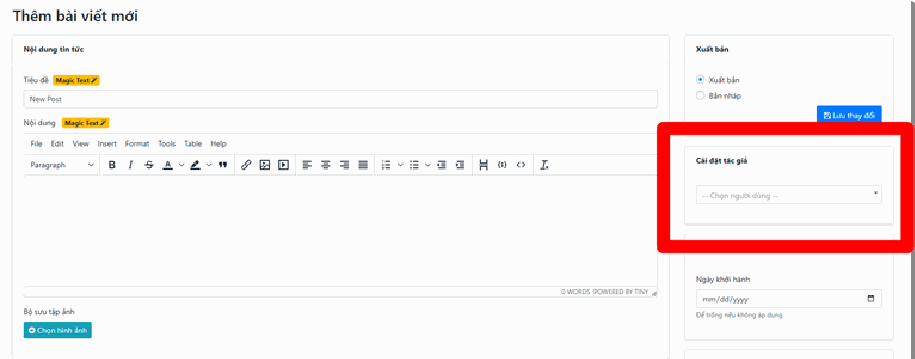

### Bước 5: Cài đặt ảnh đại diện và tối ưu tìm kiếm

*   **Ảnh đại diện** — tải lên một hình ảnh tại khung cuối cùng bên phải. Đây là **ảnh đầu tiên khách nhìn thấy** trong danh sách bài viết, trước khi họ bấm vào đọc. Cũng chính là ảnh hiện ra khi ai đó chia sẻ link bài này lên Facebook/Zalo.

    > **Đừng bỏ qua ảnh đại diện.** Bài không có ảnh đại diện sẽ hiện một ô trắng trơn hoặc ảnh mặc định trong danh sách — trông rất thiếu chuyên nghiệp và gần như không ai bấm vào. Nên chọn ảnh ngang **1200 × 630 px, dưới 200 KB** — đúng khung ảnh khi chia sẻ lên Facebook/Zalo nên không bị cắt mất phần nào. Xem [Kích thước ảnh chuẩn](../kich-thuoc-anh.md).
*   **Khung SEO** — nằm **ngay dưới khung "Nội dung tin tức"** (cột rộng bên trái). Khung này quyết định **bài viết của bạn hiện ra thế nào khi khách tìm trên Google**. Nhấn nút **"Chỉnh sửa"** ở góc phải khung để mở cửa sổ cài đặt, ở đó bạn có thể sửa:

    * **SEO Title** (Tiêu đề SEO) — dòng chữ xanh khách thấy trên Google. Nên để **50–60 ký tự**, dài hơn sẽ bị Google cắt cụt.
    * **Meta Description** (Mô tả) — đoạn chữ xám ngắn bên dưới tiêu đề trên Google. Nên để **120–155 ký tự**, viết sao cho khách đọc xong muốn bấm vào.
    * **Từ khóa** — các từ khóa chính, ngăn cách nhau bằng dấu phẩy.

    > Phần này **không bắt buộc**. Nếu bỏ trống, hệ thống tự lấy tiêu đề và đoạn đầu bài viết của bạn. Nhưng nếu bạn tự viết, bài sẽ hấp dẫn hơn và có nhiều khách bấm vào hơn. Cách điền từng ô cho chuẩn xem ở phần [**Đăng bài chuẩn SEO**](#dang-bai-chuan-seo) bên dưới.

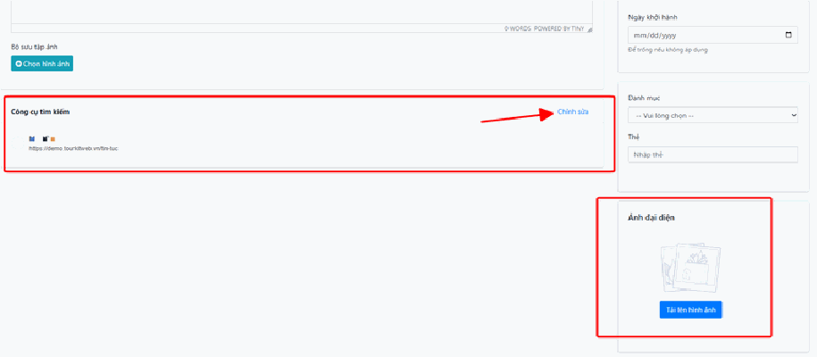

### Bước 6: Lựa chọn trạng thái và Hoàn tất

* **Lựa chọn trạng thái** — tại khung **Xuất bản** ở đầu cột bên phải, chọn **Xuất bản** nếu muốn đăng ngay, hoặc **Bản nháp** nếu muốn lưu lại để hôm khác viết tiếp.
* **Hoàn tất** — nhấn nút **Lưu thay đổi** màu xanh để hệ thống lưu lại toàn bộ dữ liệu bài viết.

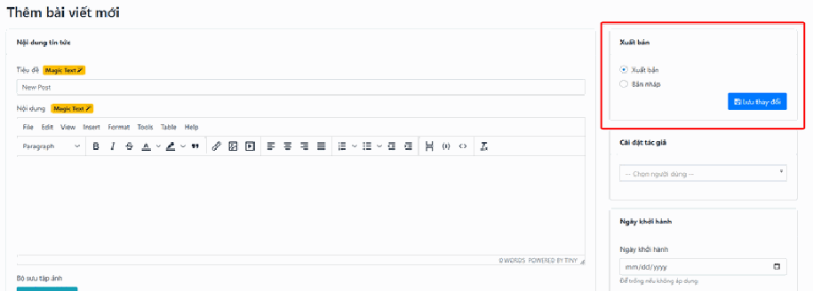

Sau khi lưu thành công, hệ thống sẽ hiện thông báo và bài viết của bạn xuất hiện trong bảng **"Tất cả tin tức"**. Nếu bạn chọn "Xuất bản", hãy nhấn **"Xem bài viết"** ở góc trên bên phải để kiểm tra bài trên website thật.

> **Mẹo cho bài dài:** Đừng viết liền một mạch 2 tiếng rồi mới bấm lưu. Hãy chọn **"Bản nháp"** và bấm **"Lưu thay đổi"** sau mỗi 10–15 phút. Nếu chẳng may mất mạng, máy sập nguồn hay lỡ tay đóng tab, bạn vẫn còn bản đã lưu. Khi viết xong hẳn thì mới chuyển sang **"Xuất bản"** và lưu lần cuối.



***

## Đăng bài chuẩn SEO

**SEO** (tối ưu cho công cụ tìm kiếm) là làm sao để khi khách gõ một câu lên Google — ví dụ _"kinh nghiệm đi Bà Nà Hills"_ — bài của bạn hiện ra ở trang đầu, và khách muốn bấm vào. Google không đọc bài như người: nó dò xem bài nói về chủ đề gì qua **tiêu đề**, **đường dẫn**, **các tiêu đề mục**, **chữ mô tả ảnh**… Phần này hướng dẫn bạn đặt đúng các "tín hiệu" đó vào đúng chỗ.

Bạn không cần làm hết mọi bước mới đăng được bài. Nhưng một bài làm đủ các bước dưới đây có cơ hội lên Google cao hơn hẳn một bài chỉ có tiêu đề và nội dung — và khách đến từ Google là khách **không tốn tiền quảng cáo**.

> **Các bước dưới đây dùng được cho cả Tour, Khách sạn và Trang** — màn hình sửa của các mục đó có cùng một khung SEO như bài tin tức.

### Khung SEO nằm ở đâu?

Trên màn hình viết/sửa bài, cuộn xuống **ngay dưới khung "Nội dung tin tức"** (cột rộng bên trái). Tuỳ website của bạn, bạn sẽ thấy một trong hai kiểu:

| Bạn thấy                                                                                                           | Nghĩa là                                                                                                                       |
| ------------------------------------------------------------------------------------------------------------------ | ------------------------------------------------------------------------------------------------------------------------------ |
| Khung **"SEO Meta"** nhỏ, chỉ ghi Tiêu đề và Mô tả, kèm nút **"Chỉnh sửa"**                                         | Bản cơ bản. Bạn vẫn sửa được Tiêu đề SEO, Mô tả, ảnh chia sẻ — chỉ không có bảng chấm điểm.                                    |
| Khung **"SEO"** có ô **"Focus Keyphrase"**, thanh **"SEO Score"**, ô **"Google Preview"** và danh sách **"SEO Analysis"** | Website đã bật tính năng **SEO Pro**. Hệ thống **tự chấm điểm bài viết theo 13 tiêu chí** ngay trong lúc bạn gõ. |

> **Không thấy bảng chấm điểm?** Tính năng SEO Pro có thể chưa được bật trên website của bạn — hãy liên hệ đơn vị triển khai. Các bước dưới đây vẫn áp dụng y nguyên, chỉ là bạn tự kiểm tra bằng mắt thay vì để máy chấm.

> 📷 *[Cần chụp màn hình: khung SEO bản Pro ngay dưới khung Nội dung tin tức — thấy ô Focus Keyphrase, thanh SEO Score, Google Preview và vài dòng SEO Analysis xanh/cam/đỏ]*

Nhiều nhãn trong khung này còn hiện tiếng Anh. Bảng dịch nhanh:

| Nhãn trên màn hình   | Nghĩa là                                                  |
| -------------------- | --------------------------------------------------------- |
| **Focus Keyphrase**  | Từ khóa chính của bài                                     |
| **SEO Score**        | Điểm SEO của bài                                          |
| **Google Preview**   | Xem trước bài sẽ hiện trên Google thế nào                 |
| **SEO Analysis**     | Danh sách các tiêu chí đã đạt / chưa đạt                  |
| **SEO Title**        | Tiêu đề SEO — dòng chữ xanh to trên Google                |
| **Meta Description** | Mô tả — đoạn chữ xám ngắn bên dưới tiêu đề trên Google    |

### Bước 1: Chọn một từ khóa chính trước khi viết

**Tại sao:** Google xếp hạng bài theo câu khách gõ. Nếu bạn không biết bài mình nhắm vào câu nào, bài sẽ viết lan man và Google cũng không biết xếp bài vào đâu.

* **Mỗi bài chỉ một từ khóa chính.** Ví dụ: `kinh nghiệm du lịch Bà Nà Hills`.
* **Chọn cụ thể, đừng chọn chung chung.** Từ `du lịch` hay `Đà Nẵng` có hàng triệu trang tranh nhau, bài mới gần như không có cửa. Còn `tour Bà Nà Hills 1 ngày từ Đà Nẵng` ít trang tranh hơn — và người gõ câu đó là người **sắp mua**.
* **Cách tìm câu khách hay gõ:** mở Google, gõ vài chữ đầu (ví dụ `bà nà hills`) rồi nhìn các gợi ý Google tự xổ ra, và phần **"Mọi người cũng tìm kiếm"** ở cuối trang kết quả. Đó chính là những câu khách thật đang gõ.
* **Đừng viết 2 bài cùng một từ khóa.** Hai bài sẽ tự tranh nhau, Google không biết chọn bài nào và thường xếp cả hai thấp đi. Đã có bài cũ cùng chủ đề thì hãy **sửa bổ sung bài cũ** thay vì viết bài mới.

Nếu website có SEO Pro, gõ từ khóa này vào ô **"Focus Keyphrase"** ở đầu khung SEO. Gõ có dấu hay không dấu đều được — hệ thống so được cả hai kiểu.

### Bước 2: Đặt tiêu đề bài chứa từ khóa — ngay từ lần lưu đầu tiên

Tiêu đề bài (ô **"Tiêu đề"** trên cùng) được hiện trên website làm **tiêu đề lớn nhất của trang** — người làm web gọi là **H1**. Đây là chỗ Google nhìn đầu tiên để biết bài nói về gì.

* Đưa từ khóa vào tiêu đề, càng gần đầu càng tốt. Ví dụ _"Kinh nghiệm du lịch Bà Nà Hills tự túc: giá vé, lịch trình"_ tốt hơn nhiều so với _"Chuyến đi đáng nhớ của tôi"_.
* Khi mở màn hình thêm bài mới, ô Tiêu đề có thể điền sẵn chữ mẫu `New Post` — nhớ **xoá đi** trước khi gõ.

> **Vì sao phải đặt tiêu đề đúng ngay từ đầu:** **đường dẫn** của bài được tạo tự động từ tiêu đề **ở lần bấm "Lưu thay đổi" đầu tiên** — kể cả khi bạn chỉ lưu nháp. Sau đó bạn sửa tiêu đề bao nhiêu lần, đường dẫn **vẫn giữ nguyên** như cũ. Lưu nháp lần đầu với tiêu đề tạm như `New Post` hay `bài nháp 1` là bài mang luôn đường dẫn `.../new-post` hoặc `.../bai-nhap-1` — vừa xấu vừa không có từ khóa. Lỡ rồi thì sửa tay đường dẫn theo **Bước 3**.

### Bước 3: Rút gọn đường dẫn (slug)

**Đường dẫn** (người làm web gọi là _slug_) là phần cuối địa chỉ bài trên thanh trình duyệt, ví dụ `.../kinh-nghiem-du-lich-ba-na-hills`. Google đọc cả phần này, và khách cũng nhìn thấy nó khi bạn gửi link qua Zalo/Facebook.

Sau lần lưu đầu tiên, ngay dưới dòng tiêu đề ở đầu màn hình sẽ hiện chữ **"Liên kết cố định:"** kèm đường dẫn của bài. **Nhấn vào phần đường dẫn** để sửa, sửa xong bấm **"Lưu thay đổi"**.

* Ngắn gọn, chứa từ khóa, **viết thường, không dấu, các chữ nối nhau bằng dấu gạch ngang**: `kinh-nghiem-du-lich-ba-na-hills`.
* Bỏ bớt chữ thừa như `cua-toi`, `nhung`, `cac`. Nếu bạn định cập nhật bài này hằng năm thì **đừng để năm** trong đường dẫn — năm để ở tiêu đề là đủ, sang năm sửa tiêu đề mà không phải đổi đường dẫn.
* Đường dẫn tự bị thêm đuôi `-1`, `-2`? Nghĩa là đã có bài khác dùng đúng đường dẫn đó, hệ thống thêm số để khỏi trùng. Nên đổi sang một đường dẫn khác hẳn — và kiểm tra xem có phải bạn đang viết trùng chủ đề với bài cũ không (xem Bước 1).

> **Bài đã đăng lâu thì đừng đổi đường dẫn tuỳ tiện.** Google và những người đã chia sẻ link sẽ vào địa chỉ cũ và gặp trang lỗi — bài mất hết thứ hạng đã có. **Hệ thống không tự chuyển địa chỉ cũ sang địa chỉ mới.** Nếu bắt buộc phải đổi và website có SEO Pro, hãy tạo một **chuyển hướng**: Menu bên trái > **SEO** > **Redirects** > nút **"Add Redirect"**. Ô **From URL** điền đường dẫn cũ (bắt đầu bằng dấu `/`), ô **To URL** điền đường dẫn mới, **Redirect Type** chọn **"301 – Permanent"** (chuyển vĩnh viễn), **Status** để **"Active"**, rồi bấm **"Create"**. Không thấy mục **SEO** trong menu nghĩa là tài khoản của bạn chưa được cấp quyền, hoặc tính năng chưa được bật.

### Bước 4: Viết nội dung có bố cục rõ ràng

**Tại sao:** khách đọc trên điện thoại thường lướt chứ không đọc từng chữ. Bài chia mục rõ ràng giữ khách ở lại lâu hơn — và Google cũng dựa vào các tiêu đề mục để hiểu bài.

**a) Đoạn mở đầu có từ khóa.** Trong 2–3 câu đầu tiên, nói thẳng bài này giúp khách điều gì và nhắc từ khóa chính một lần.

**b) Chia bài thành các mục bằng "Heading 2".** Mỗi mục là một ý lớn, ví dụ: _Bà Nà Hills ở đâu? — Giá vé cáp treo — Lịch trình 1 ngày — Ăn gì ở Bà Nà?_ Cách làm:

1. Gõ tên mục trên một dòng riêng.
2. Đặt con trỏ vào dòng đó, bấm vào ô **"Paragraph"** ở **đầu thanh công cụ** của khung soạn thảo.
3. Chọn **"Heading 2"** — dòng chữ sẽ to và đậm lên.

Ý nhỏ bên trong một mục thì chọn **"Heading 3"**. Nên có **ít nhất 2 mục Heading 2** trong một bài.

> **Đừng chọn "Heading 1" trong nội dung.** Tiêu đề bài đã là Heading 1 rồi, mỗi trang chỉ nên có một cái. Cũng đừng dùng Heading chỉ để làm chữ to cho đẹp — muốn nhấn mạnh thì dùng **in đậm**.

> 📷 *[Cần chụp màn hình: ô "Paragraph" ở đầu thanh công cụ khung soạn thảo đang xổ danh sách Heading 1 … Heading 6]*

**c) Nhắc từ khóa vừa đủ, tự nhiên.** Từ khóa nên xuất hiện rải rác khắp bài. Bảng điểm SEO Pro coi là vừa khi từ khóa chiếm khoảng **1–3%** số chữ — ví dụ bài 1.000 chữ, từ khóa dài 3 chữ thì nhắc khoảng **4–10 lần**. Nhồi nhiều hơn thì câu văn đọc rất gượng, và Google coi đó là gian lận.

**d) Gắn link sang các trang khác trên website.** Trong bài có nhắc tới tour, khách sạn hay bài viết nào mà website bạn có, hãy:

1. Bôi đen chữ đó.
2. Bấm nút **chèn liên kết** (hình mắt xích) trên thanh công cụ — cửa sổ **"Insert/Edit Link"** hiện ra.
3. Dán địa chỉ trang đó vào ô **"URL"**, rồi bấm **"Save"**.

Mỗi bài nên có **2–3 link** như vậy. Đây là cách biến người đọc thành người mua: đọc kinh nghiệm đi Bà Nà xong, bấm một cái là sang ngay trang đặt tour Bà Nà.

> **Link đáng gắn nhất là trang theo địa điểm:** `tenmien.com/tour/da-nang` (mọi tour Đà Nẵng) và `tenmien.com/khach-san/da-nang` (mọi khách sạn Đà Nẵng). Đây là hai trang website dựng riêng để lên top Google với cụm _"tour Đà Nẵng"_, _"khách sạn Đà Nẵng"_ — mỗi bài viết trỏ link về là thêm một phiếu bầu cho chúng. Ví dụ câu trong bài: _"Xem ngay các **tour Đà Nẵng** đang mở bán"_, bôi đen chữ **tour Đà Nẵng** rồi gắn link `/tour/da-nang`. Xem [3.1. Địa điểm](../khoi-san-pham/dia-diem.md#trang-cua-dia-diem-tren-website-vu-khi-seo).

**e) Câu ngắn, đoạn ngắn.** Mỗi đoạn 2–4 câu là vừa. Liệt kê giá vé, giờ mở cửa, đồ cần mang… thì dùng danh sách gạch đầu dòng hoặc bảng — khách nhìn một lượt là nắm được.

**f) Viết bằng chữ của bạn.** Đừng copy nguyên bài từ website khác. Google nhận ra nội dung trùng lặp và gần như không bao giờ xếp bản sao lên trên bản gốc — copy về chỉ tốn công đăng.

**g) Bài nên dài bao nhiêu chữ?**

Google **không chấm điểm theo số chữ**. Nó xếp cao bài **trả lời trọn vẹn** câu khách đang hỏi. Bài quá ngắn thường thiếu ý, khách phải đi tìm chỗ khác. Bài dài vì kể lể lan man thì khách đọc mấy dòng đã bỏ đi. Bảng dưới đây là độ dài **vừa đủ** cho từng loại bài trên website du lịch:

| Loại bài                                                         | Ví dụ                                                     | Độ dài nên có         |
| ---------------------------------------------------------------- | --------------------------------------------------------- | --------------------- |
| Tin ngắn, thông báo, khuyến mãi                                  | _"Giảm 30% tour Đà Nẵng hè 2026"_                          | **300 – 600 chữ**     |
| Giới thiệu một điểm đến, một khách sạn, review một trải nghiệm   | _"Review khách sạn Mường Thanh Đà Nẵng"_                   | **800 – 1.500 chữ**   |
| Cẩm nang, kinh nghiệm du lịch đầy đủ — loại bài nhắm lên top Google | _"Kinh nghiệm du lịch Đà Nẵng tự túc từ A đến Z"_        | **1.500 – 2.500 chữ** |

* **Đừng để bài dưới 300 chữ.** Google coi bài quá mỏng là trang ít giá trị và hầu như không xếp hạng. Có ít thông tin thì gộp vào một bài cũ cùng chủ đề, thay vì đăng bài mới.
* **Cách biết nên viết dài bao nhiêu cho một từ khóa cụ thể:** gõ từ khóa đó lên Google, mở 3 bài đứng đầu và xem chúng dài cỡ nào, có những mục gì. Bài của bạn nên **dài tương đương và đủ ý hơn** — thêm thông tin họ thiếu, như giá cập nhật năm nay hay kinh nghiệm thực tế của công ty.
* **Xem bài đang dài bao nhiêu:** nhìn **góc dưới bên phải khung soạn thảo**, dòng chữ nhỏ **"… WORDS"** chính là số chữ của bài. Bộ đếm tính mỗi tiếng là một chữ: _"Đà Nẵng"_ = 2 chữ. Các con số trong bảng trên cũng đếm theo cách này.
* **Bài càng dài càng phải chia mục rõ ràng** (Heading 2, Heading 3 — xem mục b). Một bài 2.000 chữ không có tiêu đề mục nào là một bức tường chữ, khách sẽ bỏ đi ngay.

> **Bảng chấm điểm SEO không kiểm tra độ dài bài.** Bài 200 chữ vẫn có thể được nhãn "Tốt" nếu đủ các tiêu chí khác — bạn tự xem bộ đếm "WORDS" để kiểm tra.

### Bước 5: Ảnh — ảnh đại diện và chữ mô tả ảnh trong bài

Google không "nhìn" được ảnh. Nó chỉ đọc **chữ mô tả đi kèm ảnh** để biết ảnh chụp gì.

* **Ảnh đại diện** (khung **"Hình ảnh đặc trưng"** ở cuối cột bên phải) — **phải có**, cỡ **1200 × 630 px**. Thiếu ảnh này, bài hiện ô trống trong danh sách bài viết và trông rất sơ sài khi chia sẻ lên Facebook/Zalo.
* **Ảnh chèn giữa bài** — bấm nút **chèn ảnh** (hình bức tranh) trên thanh công cụ. Trong cửa sổ **"Insert/Edit Image"**:
  * Ô **"Source"** — bấm biểu tượng bên cạnh ô để chọn ảnh từ kho ảnh của website.
  * Ô **"Image description"** — **mô tả ảnh** bằng một câu ngắn, đúng với những gì có trong ảnh. Ví dụ: `Cầu Vàng Bà Nà Hills lúc bình minh`.
  * Bấm **"Save"** để chèn ảnh vào bài.
* Ít nhất **một ảnh** trong bài nên có mô tả chứa từ khóa chính. Nhưng đừng chép y nguyên từ khóa vào mọi ảnh — mô tả đúng từng ảnh mới có ích.
* **Đặt tên tệp ảnh có nghĩa trước khi tải lên:** đổi `IMG_20260815_0921.jpg` thành `cau-vang-ba-na-hills.jpg`. Tên có dấu cũng được, hệ thống tự chuyển thành không dấu khi tải lên.
* **Ảnh đúng cỡ, càng nhẹ càng tốt:** ảnh chèn trong bài nên **rộng 1200 px, dưới 300 KB**. Hệ thống nhận tệp tới 20 MB nhưng **không tự thu nhỏ ảnh** — ảnh nặng làm trang mở chậm, khách bỏ đi, và Google cũng xếp trang chậm thấp hơn trang nhanh. Ảnh chụp từ điện thoại thường nặng 3–8 MB — hãy đổi cỡ và nén trước khi tải lên, cách làm xem [Kích thước ảnh chuẩn](../kich-thuoc-anh.md).

> 📷 *[Cần chụp màn hình: cửa sổ "Insert/Edit Image" với ô Source đã có ảnh và ô Image description đã điền mô tả]*

### Bước 6: Điền Tiêu đề SEO và Mô tả

Nhấn nút **"Chỉnh sửa"** ở góc phải khung SEO — cửa sổ **"Search Engine Optimization"** hiện ra.

> 📷 *[Cần chụp màn hình: cửa sổ "Search Engine Optimization" đang mở tab "Chung" — thấy ô "Cho phép search engine index?", Focus Keyphrase, SEO Title có bộ đếm …/60, Meta Description có bộ đếm …/155]*

**1. Ô "Cho phép search engine index?"** — để **"Có"**. Chọn **"Không"** là bảo Google **đừng đưa bài này lên kết quả tìm kiếm** (các tab bên dưới cũng ẩn đi). Chỉ chọn "Không" với bài bạn không muốn người lạ tìm thấy, ví dụ trang ưu đãi riêng gửi cho khách cũ.

**2. Tab "Chung":**

* **Focus Keyphrase** (chỉ có ở bản SEO Pro) — chính là ô từ khóa ở Bước 1. Gõ ở đây hay ở khung SEO bên ngoài đều được, hai ô tự đồng bộ.
* **SEO Title** — dòng chữ xanh to trên Google. Nên dài **50–60 ký tự**, có từ khóa, từ khóa càng gần đầu càng tốt. Tiêu đề SEO có thể khác tiêu đề bài: tiêu đề bài viết cho người đang đọc trên website, còn Tiêu đề SEO viết để "câu" người đang lướt Google.
  * Ví dụ (54 ký tự): `Kinh nghiệm du lịch Bà Nà Hills tự túc 2026 từ A đến Z`
* **Meta Description** — đoạn chữ xám dưới tiêu đề trên Google. Nên dài **120–155 ký tự**, có từ khóa, và kết thúc bằng một câu mời bấm. Bỏ trống thì hệ thống tự cắt khoảng 160 ký tự đầu bài — thường bị cụt giữa câu, kém hấp dẫn.
  * Ví dụ (124 ký tự): `Kinh nghiệm du lịch Bà Nà Hills tự túc 2026: giá vé cáp treo, lịch trình 1 ngày, ăn gì, chơi gì. Đọc ngay để đi không bị hớ!`
* **Từ khóa** — Google hiện **không còn dùng** ô này để xếp hạng. Điền vài từ khóa cách nhau bằng dấu phẩy cũng được, bỏ trống cũng không sao — đừng tốn thời gian ở đây.
* **Hình ảnh nổi bật** — ảnh riêng dùng khi bài được chia sẻ lên mạng xã hội. Bỏ trống thì hệ thống dùng ảnh đại diện của bài — đa số trường hợp bỏ trống là được.

> **Đừng tự gõ tên website vào cuối Tiêu đề SEO.** Khi hiện trên Google và trên tab trình duyệt, hệ thống **tự gắn thêm** ` - Tên website` vào cuối. Gõ thêm nữa là tên website bị lặp hai lần. Cũng vì có phần đuôi này mà Google hay cắt bớt chữ cuối — thêm một lý do để đặt từ khóa ở đầu.

**3. Tab "Facebook" và "X / Twitter"** — tiêu đề, mô tả, ảnh riêng khi bài được chia sẻ lên từng mạng. Bỏ trống thì dùng luôn Tiêu đề SEO, Mô tả và ảnh ở tab Chung. Chỉ cần điền khi bạn muốn bài chia sẻ lên Facebook có câu chữ khác với trên Google (ví dụ giọng văn vui hơn, có biểu tượng cảm xúc).

**4. Bấm "Áp dụng"** để đóng cửa sổ.

> **"Áp dụng" chưa phải là lưu.** Nút này chỉ đóng cửa sổ lại. Bạn vẫn phải bấm **"Lưu thay đổi"** ở khung "Xuất bản" bên phải thì những gì vừa điền mới được ghi lại. Đóng tab trước khi bấm "Lưu thay đổi" là mất hết.

> **Sau này đổi tiêu đề bài thì sửa luôn Tiêu đề SEO.** Ô Tiêu đề SEO được điền sẵn bằng tiêu đề bài, nhưng một khi đã lưu thì nó **không tự đổi theo** khi bạn sửa tiêu đề bài. Không sửa thì Google vẫn hiện tiêu đề cũ.

### Bước 7: Đọc bảng chấm điểm (chỉ có ở bản SEO Pro)

Ngay khi bạn gõ, khung SEO tự chấm bài theo 13 tiêu chí trong danh sách **"SEO Analysis"**. Mỗi dòng có một chấm màu: **xanh** = đạt, **cam** = tạm được / cần xem lại, **đỏ** = chưa đạt. Bên dưới mỗi dòng có chữ nhỏ giải thích vì sao.

Góc trên khung hiện nhãn tổng: **"Tốt"** (từ 11/13 tiêu chí trở lên), **"Cần cải thiện"** (7–10 tiêu chí), **"Yếu"** (6 tiêu chí trở xuống). Ô **Google Preview** cho bạn xem trước bài sẽ hiện trên Google thế nào, kèm bộ đếm ký tự Tiêu đề `…/60` và Mô tả `…/155` — số chuyển **xanh** là độ dài vừa đẹp.

| Dòng trong "SEO Analysis"                    | Muốn dòng này xanh thì làm gì                                                                                                                                  |
| -------------------------------------------- | -------------------------------------------------------------------------------------------------------------------------------------------------------------- |
| Keyword xuất hiện trong title                | Có từ khóa trong **SEO Title** (Bước 6)                                                                                                                        |
| Keyword xuất hiện trong URL                  | Có từ khóa trong **đường dẫn** (Bước 3). Bài chưa lưu lần nào sẽ luôn báo đỏ dòng này vì chưa có đường dẫn                                                    |
| Keyword xuất hiện trong meta description     | Có từ khóa trong **Meta Description** (Bước 6)                                                                                                                 |
| Keyword xuất hiện trong H1                   | Có từ khóa trong **tiêu đề bài** (Bước 2)                                                                                                                      |
| Keyword xuất hiện trong nội dung             | Có từ khóa trong **nội dung bài** (Bước 4)                                                                                                                     |
| Mật độ từ khóa                               | Từ khóa chiếm **1–3%** số chữ trong bài (Bước 4c)                                                                                                              |
| Độ dài tiêu đề                               | **SEO Title** dài 50–60 ký tự                                                                                                                                  |
| Độ dài mô tả                                 | **Meta Description** dài 120–155 ký tự                                                                                                                         |
| Có ảnh đại diện                              | Đã chọn **ảnh đại diện** và ảnh mở được bình thường                                                                                                           |
| Alt ảnh chứa keyword                         | Ít nhất một ảnh trong bài có **Image description** chứa từ khóa (Bước 5)                                                                                       |
| Có thẻ H2 trong nội dung                     | Có **ít nhất 2 mục "Heading 2"** trong bài (Bước 4b)                                                                                                           |
| Có Canonical URL                             | **Không cần làm gì** — tự xanh sau lần lưu đầu tiên                                                                                                           |
| Có Open Graph đầy đủ                         | Có Tiêu đề SEO, Mô tả và ảnh (ảnh đại diện là đủ). Đây là thông tin Facebook/Zalo dùng để hiện khung xem trước khi bài được chia sẻ                            |

> **Không cần đạt đủ 13/13.** Nhắm tới nhãn **"Tốt"** là đủ. Bảng điểm chỉ là công cụ nhắc việc của website, không phải điểm thật của Google — một bài viết hay, đúng thứ khách cần vẫn quan trọng hơn mọi con số.

### Bước 8: Đăng bài và việc cần làm sau khi đăng

1. Chọn **"Xuất bản"** → bấm **"Lưu thay đổi"** → bấm **"Xem bài viết"** ở góc trên bên phải. Kiểm tra: tab trình duyệt hiện đúng Tiêu đề SEO, ảnh hiện đủ, các link đã chèn bấm vào được.
2. **Cập nhật sơ đồ website (Sitemap)** — chỉ có ở bản SEO Pro. Sitemap giống một **"danh bạ" liệt kê mọi bài trên website** để Google tìm đến đọc. Danh bạ này **không tự cập nhật** khi bạn đăng bài: vào Menu bên trái > **SEO** > **SEO Settings**, cuộn xuống phần **Sitemap**, bấm nút **"Cập nhật Sitemap"**. Đăng nhiều bài trong ngày thì chỉ cần bấm một lần sau cùng. Không bấm thì Google vẫn tìm ra bài qua các link trên website, chỉ là chậm hơn.
3. **Chia sẻ bài** lên fanpage, nhóm Zalo của công ty — vừa mang khách về ngay trong lúc chờ Google, vừa để bạn kiểm tra khung xem trước (ảnh, tiêu đề) có đẹp không.
4. **Kiên nhẫn.** Google thường mất từ **vài ngày đến vài tuần** mới đưa một bài mới lên kết quả tìm kiếm. Muốn biết Google đã ghi nhận bài chưa, gõ lên Google: `site:tenmiencuaban.com Bà Nà Hills` (thay bằng tên miền và từ khóa của bạn) — ra bài là Google đã biết đến nó.

### Danh sách kiểm tra nhanh trước khi bấm "Xuất bản"

* [ ] Đã chọn **một** từ khóa chính (và gõ vào ô Focus Keyphrase nếu có)
* [ ] Tiêu đề bài có từ khóa, không còn chữ mẫu `New Post`
* [ ] Đường dẫn ngắn, không dấu, có từ khóa
* [ ] Đoạn mở đầu có nhắc từ khóa
* [ ] Bài đủ dài theo loại bài (tối thiểu 300 chữ; cẩm nang 1.500 chữ trở lên) — xem bộ đếm "WORDS" góc dưới khung soạn thảo
* [ ] Có ít nhất 2 mục "Heading 2", không dùng "Heading 1" trong nội dung
* [ ] Có 2–3 link sang tour / khách sạn / bài viết khác trên website
* [ ] Có ảnh đại diện; ảnh trong bài có Image description
* [ ] SEO Title 50–60 ký tự, Meta Description 120–155 ký tự, cả hai đều có từ khóa
* [ ] Ô "Cho phép search engine index?" đang là **"Có"**
* [ ] Đã chọn Danh mục và **Địa điểm liên quan** cho bài
* [ ] Có link tới trang `/tour/<địa điểm>` hoặc `/khach-san/<địa điểm>` liên quan
* [ ] Ảnh đại diện 1200 × 630 px, ảnh trong bài rộng 1200 px, mỗi ảnh vài trăm KB
* [ ] Đã bấm **"Lưu thay đổi"**

### Lỗi hay gặp khi làm SEO

**Bảng điểm báo đỏ "Keyword xuất hiện trong URL" và "Có Canonical URL" dù đã làm đúng hết.** Bài chưa được lưu lần nào nên chưa có đường dẫn. Bấm **"Lưu thay đổi"** một lần (để "Bản nháp" cũng được) là hai dòng này hết đỏ. Nếu dòng "URL" vẫn đỏ, nghĩa là đường dẫn đang không chứa từ khóa — xem Bước 2 và Bước 3.

**Không thấy ô Focus Keyphrase, không thấy bảng điểm, không thấy mục SEO trong menu.** Website chưa bật tính năng SEO Pro, hoặc tài khoản của bạn chưa được cấp quyền quản lý SEO. Hãy liên hệ quản trị viên hoặc đơn vị triển khai. Trong lúc chờ, bạn vẫn điền được Tiêu đề SEO và Mô tả qua nút **"Chỉnh sửa"** ở khung "SEO Meta".

**Chia sẻ link lên Facebook vẫn hiện ảnh hoặc tiêu đề cũ.** Facebook ghi nhớ khung xem trước từ lần đầu tiên có người chia sẻ link đó. Mở công cụ **Sharing Debugger** của Facebook (`developers.facebook.com/tools/debug`), dán link bài, bấm **"Scrape Again"** để Facebook đọc lại bài.

**Google hiện tiêu đề hoặc mô tả khác với cái tôi đã điền.** Google đôi khi tự viết lại cho khớp với câu khách gõ — đây là chuyện bình thường, không phải lỗi website. Tiêu đề SEO và Mô tả càng sát nội dung bài thì Google càng ít tự sửa.

**Đăng cả tuần mà tìm trên Google vẫn không thấy bài.** Kiểm tra lần lượt: (1) bài đang ở trạng thái **"Xuất bản"**; (2) ô **"Cho phép search engine index?"** đang là **"Có"**; (3) đã bấm **"Cập nhật Sitemap"** (nếu website có SEO Pro). Đúng cả ba thì chỉ là Google chưa ghé tới — hãy chờ thêm, và tiếp tục chia sẻ bài để có người đọc.

***

## Danh mục

**Danh mục** là các nhóm chủ đề để xếp bài viết vào cho gọn. Nếu không phân nhóm, khách phải cuộn qua hàng trăm bài lộn xộn mới tìm được thứ họ quan tâm — và phần lớn sẽ bỏ đi giữa chừng.

Ví dụ một website du lịch thường có các danh mục: _Cẩm nang du lịch_, _Điểm đến_, _Khuyến mãi_, _Tin công ty_.

> **Đường dẫn:** Menu bên trái > **Nội dung** > **Tin tức** > **Danh mục**

Màn hình này chia làm hai nửa: **cột bên trái** là ô để thêm danh mục mới, **bảng bên phải** là danh sách các danh mục đang có.

### a, Cách thêm danh mục mới

Để tạo một danh mục mới, bạn thực hiện theo các bước tại cột bên trái:

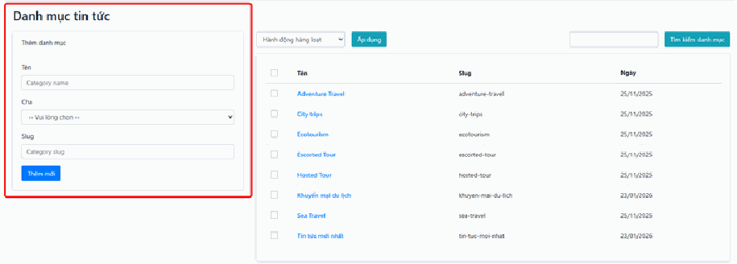

* **Bước 1 (Tên):** Nhập tên danh mục muốn tạo vào ô **"Category name"** (Tên danh mục) — ví dụ: `Tin tức lữ hành`. Tên này chính là thứ khách hàng nhìn thấy trên website, nên hãy viết có dấu, viết hoa chữ đầu cho đẹp.
* **Bước 2 (Cha):** Ô **"Parent"** (Danh mục cha) dùng khi bạn muốn tạo danh mục con nằm bên trong một danh mục lớn hơn. Ví dụ danh mục _"Đà Nẵng"_ có thể nằm trong danh mục cha là _"Điểm đến"_. Nếu đây là một danh mục chính đứng độc lập, cứ **để nguyên dòng mặc định "-- Vui lòng chọn --"**.
*   **Bước 3 (Slug):** Nhập chuỗi ký tự vào ô **"Category slug"** — ví dụ: `tin-tuc-lu-hanh`. Đây là **đường dẫn hiển thị trên thanh địa chỉ trình duyệt**. Quy tắc bắt buộc: **viết thường, không dấu, không dấu cách — các từ nối nhau bằng dấu gạch ngang**.

    > **Không biết viết slug thế nào thì cứ để trống** — hệ thống sẽ tự tạo giúp bạn từ tên danh mục. Đây là cách an toàn nhất.
    >
    > **Cẩn thận:** Nếu bạn gõ tay và lỡ để dấu tiếng Việt hoặc dấu cách (ví dụ `tin tức lữ hành`), đường dẫn trên web sẽ hiện thành một chuỗi ký tự lạ mắt rất xấu.
* **Bước 4:** Nhấn nút **"Thêm mới"** màu xanh để hoàn tất. Danh mục vừa tạo sẽ xuất hiện ngay trong bảng bên phải.

### b, Cách tìm kiếm danh mục

Nếu danh sách có quá nhiều mục, bạn có thể tìm nhanh bằng cách:

* Nhập tên danh mục cần tìm vào ô trống ở góc trên bên phải.
* Nhấn nút **"Tìm kiếm danh mục"** để hệ thống lọc kết quả.

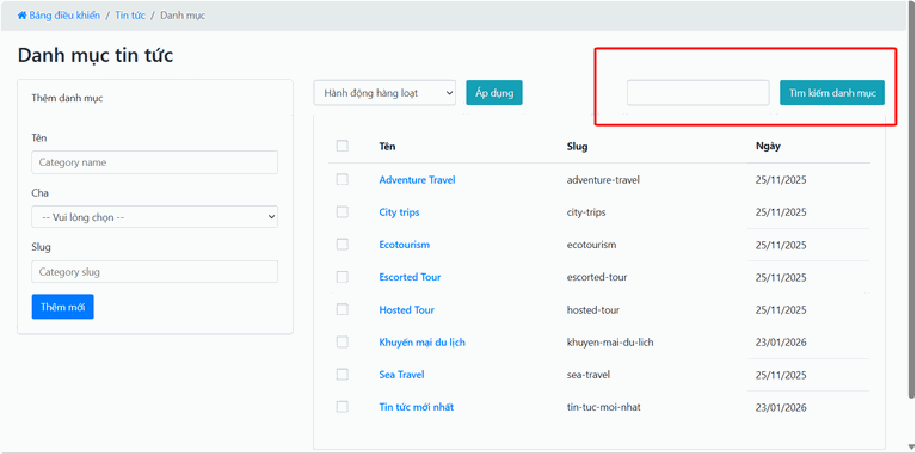

> Giống như ở phần tìm bài viết: gõ chữ vào ô thôi là chưa đủ, **phải bấm nút tìm kiếm** thì bảng mới cập nhật.

### c, Cách quản lý và chỉnh sửa danh sách

Bảng bên phải liệt kê tất cả các danh mục đang có trên hệ thống:

* **Xem thông tin:** Bạn có thể theo dõi **tên**, **đường dẫn (slug)** và **ngày khởi tạo** của từng danh mục. Những danh mục con sẽ có một dấu gạch ngang `-` phía trước tên để bạn dễ nhận ra nó đang nằm trong danh mục cha nào.
* **Chỉnh sửa hoặc Xóa:** Khi đưa con trỏ chuột vào tên một danh mục cụ thể (như "Adventure Travel"), các tùy chọn chỉnh sửa hoặc xóa thường sẽ xuất hiện để bạn thao tác. Bạn cũng có thể nhấn thẳng vào tên danh mục để mở màn hình chỉnh sửa đầy đủ — ở đó có thêm khung **"Xuất bản"** (chọn hiện/ẩn danh mục) và phần cài đặt SEO riêng cho danh mục.

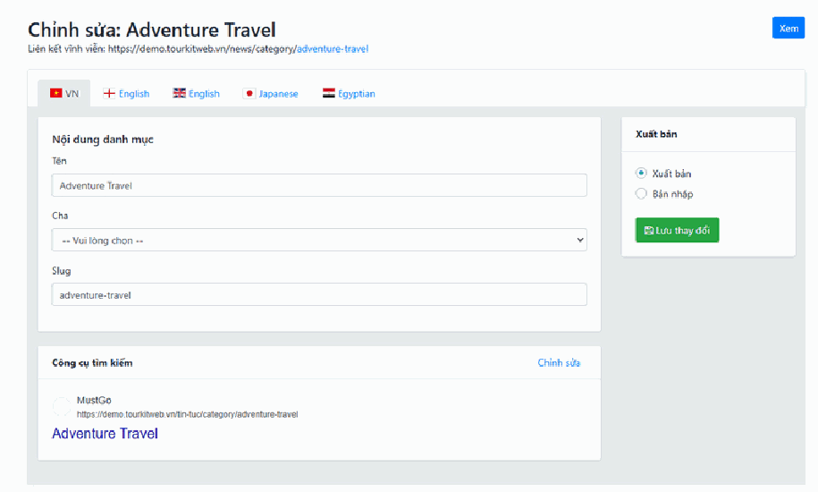

### d, Thao tác hàng loạt (Xử lý nhiều mục cùng lúc)

Trong trường hợp bạn muốn xóa nhiều danh mục cùng một lúc:

* **Bước 1:** Đánh dấu tích vào các ô vuông nhỏ ở cột ngoài cùng bên trái của những danh mục cần xử lý.
* **Bước 2:** Chọn hành động mong muốn trong thực đơn **Hành động hàng loạt** ở phía trên.
* **Bước 3:** Nhấn nút **Áp dụng** bên cạnh để thực hiện lệnh cho tất cả các mục đã chọn.

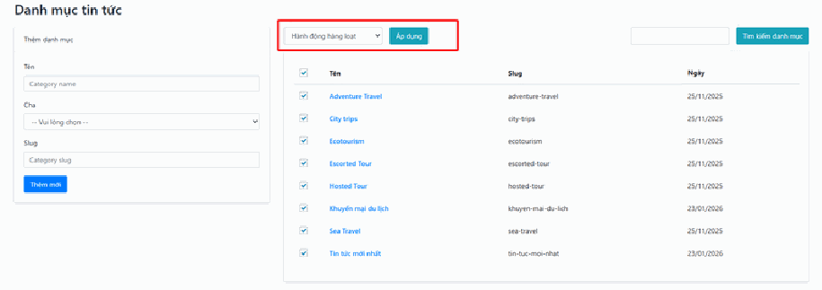

> **Cẩn thận:** Xóa một danh mục là việc ảnh hưởng rộng hơn bạn tưởng. Những bài viết đang thuộc danh mục đó sẽ **mất chỗ đứng trên website** — khách đang xem danh mục này sẽ gặp trang trống. Trước khi xóa, hãy sang **"Tất cả tin tức"**, lọc theo danh mục đó xem còn bài nào không, và chuyển các bài sang danh mục khác trước.

***

## Thẻ

**Thẻ** (tag) là các từ khóa nhỏ gắn kèm bài viết, giúp gom những bài cùng chủ đề lại với nhau. Khách bấm vào một thẻ sẽ thấy toàn bộ bài viết có gắn thẻ đó.

**Thẻ khác Danh mục ở đâu?** Một bài viết chỉ thuộc **một danh mục**, nhưng có thể gắn **nhiều thẻ**. Danh mục giống như "ngăn tủ" — mỗi bài nằm trong đúng một ngăn. Thẻ giống như "nhãn dán" — dán bao nhiêu cái cũng được.

Ví dụ: bài _"Kinh nghiệm đi Đà Nẵng 3 ngày"_ nằm trong danh mục **Cẩm nang du lịch**, và được gắn các thẻ `da-nang`, `mien-trung`, `du-lich-bien`, `3-ngay-2-dem`.

> **Đường dẫn:** Menu bên trái > **Nội dung** > **Tin tức** > **Thẻ**

Các thao tác tại phần Thẻ tin tức bao gồm **thêm mới**, **tìm kiếm** và **quản lý hàng loạt** được thực hiện hoàn toàn tương tự như các bước tại mục **"Danh mục"** đã hướng dẫn ở trên: cột bên trái là ô **"Tag name"** (Tên thẻ) và **"Tag Slug"** (đường dẫn của thẻ), bảng bên phải là danh sách các thẻ đang có.

Khác biệt duy nhất: thẻ **không có danh mục cha** — mọi thẻ đều ngang hàng nhau.

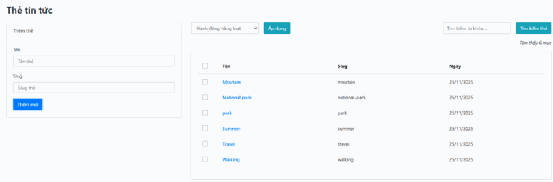

> **Mẹo:** Bạn không nhất thiết phải vào đây để tạo thẻ. Khi đang viết bài, gõ thẳng từ khóa vào ô **"Thẻ"** ở cột bên phải rồi nhấn **Enter**, hệ thống sẽ tự tạo thẻ mới cho bạn. Màn hình này chủ yếu dùng để **dọn dẹp** — xóa các thẻ gõ sai chính tả hoặc trùng lặp.

***

### Lưu ý & xử lý sự cố

**Bấm "Lưu thay đổi" nhưng không thấy gì xảy ra, trang nhảy lên đầu.** Thường là do bạn **chưa nhập Tiêu đề** — đây là trường bắt buộc. Hãy cuộn lên đầu trang, tìm ô có viền đỏ hoặc dòng chữ báo lỗi màu đỏ, điền vào rồi lưu lại.

**Đã bấm "Xuất bản" và "Lưu thay đổi" mà khách vẫn không thấy bài trên web.** Hãy kiểm tra theo thứ tự:

1. Mở lại bài đó, nhìn khung **"Xuất bản"** bên phải xem có đang chọn đúng **"Xuất bản"** không (không phải "Bản nháp").
2. Nhấn **Ctrl + F5** trên trang web để buộc trình duyệt tải lại bản mới nhất.
3. Kiểm tra bài đã được chọn **danh mục** chưa — bài không có danh mục sẽ không hiện trong các danh sách trên web.

**Ảnh tải lên bị báo lỗi hoặc quay mãi không xong.** Ảnh của bạn có thể quá nặng (giới hạn khoảng **20 MB** mỗi tệp) hoặc sai định dạng. Hệ thống chỉ nhận các loại ảnh thông dụng: `.jpg`, `.jpeg`, `.png`, `.gif`, `.bmp`, `.webp`. Nếu ảnh là `.heic` (ảnh chụp từ iPhone) hoặc `.tif`, bạn cần đổi sang `.jpg` trước.

**Lỡ xóa nhầm bài viết.** Bài tin tức đã xóa **không có thùng rác để khôi phục**. Hãy liên hệ ngay đơn vị triển khai — nếu họ có bản sao lưu gần nhất thì còn cứu được. Để tránh tình huống này, hãy tập thói quen dùng **"Chuyển sang Bản nháp"** thay cho "Xóa" mỗi khi chỉ muốn tạm gỡ bài xuống.

**Chọn xong hành động hàng loạt nhưng không có gì thay đổi.** Bạn quên nhấn nút **"Áp dụng"**. Hoặc bạn chưa tích chọn bài nào ở cột bên trái. Hãy làm lại đủ 3 bước: tích chọn → chọn lệnh → bấm "Áp dụng".

**Gõ chữ vào ô tìm kiếm nhưng danh sách không đổi.** Ô tìm kiếm ở đây không tự động lọc theo từng chữ bạn gõ. Bạn phải nhấn nút **"Tìm kiếm tin tức"** (hoặc nhấn phím **Enter**) thì bảng mới cập nhật.

### Xem thêm

* [2. Khối NỘI DUNG](./) — tổng quan cả khối
* [2.2. Trang](trang.md) — dùng cho nội dung tĩnh như Giới thiệu, Liên hệ
* [2.3. Phương tiện](phuong-tien.md) — kho ảnh dùng chung cho bài viết
* [3.1. Địa điểm](../khoi-san-pham/dia-diem.md) — trang địa điểm nơi bài viết được hiện ra
* [Kích thước ảnh chuẩn](../kich-thuoc-anh.md)
