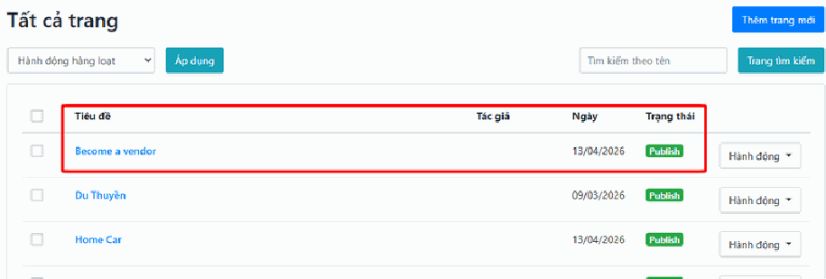
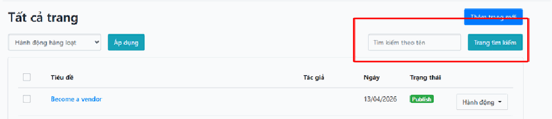
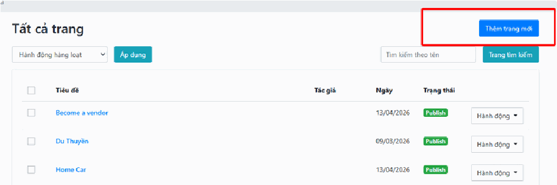
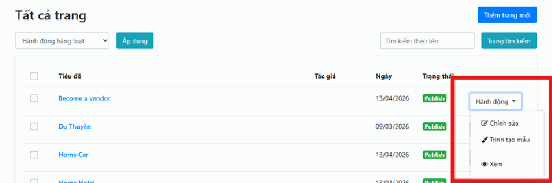
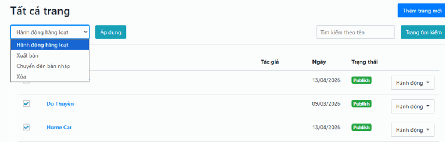
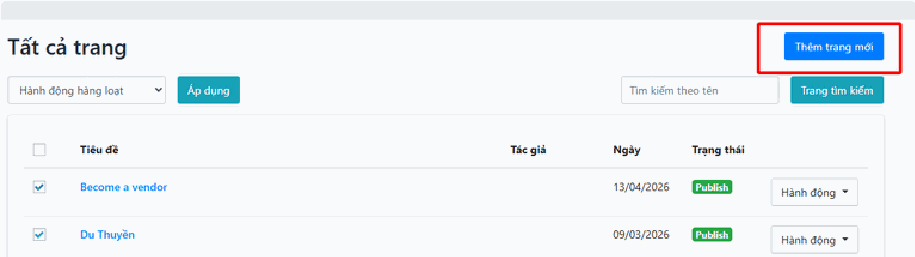
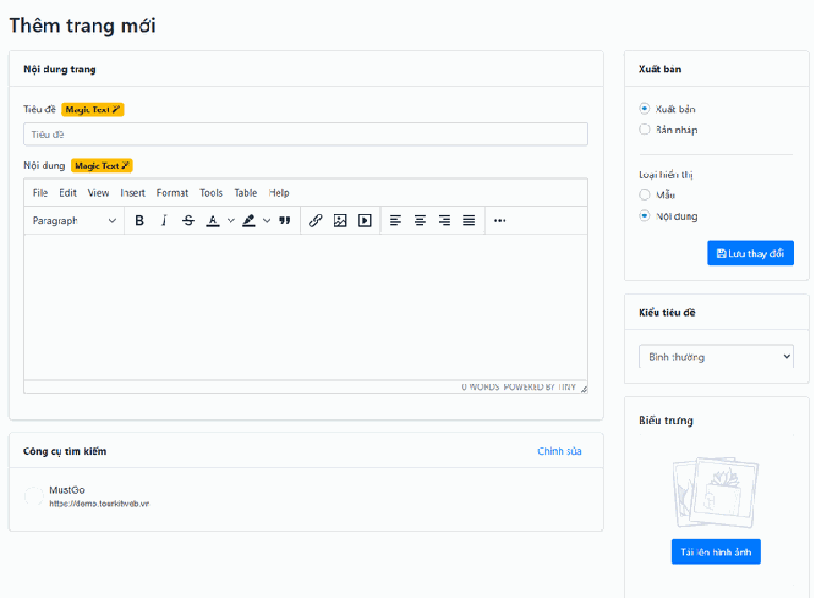

# 2.2. Trang

**Trang** là nơi bạn quản lý những nội dung **đứng độc lập, ít thay đổi** trên website — thứ mà khách hàng bấm vào từ menu trên đầu hoặc từ chân trang.

Ví dụ quen thuộc nhất: trang **"Giới thiệu"**, **"Liên hệ"**, **"Điều khoản sử dụng"**, **"Chính sách bảo mật"**, **"Chính sách hoàn hủy"**, **"Câu hỏi thường gặp"**. Thậm chí **Trang chủ** của website bạn cũng là một Trang.

> **Đường dẫn:** Menu bên trái > **Nội dung** > **Trang**

**Trang khác Tin tức thế nào?**

| | **Trang** | **Tin tức** |
| --- | --- | --- |
| Có ngày tháng, tác giả hiển thị? | Không quan trọng | Có, rất quan trọng |
| Có danh mục, thẻ? | Không | Có |
| Sang năm còn dùng được? | Còn, gần như không đổi | Thường đã cũ, có bài mới thay |
| Khách vào từ đâu? | Menu, chân trang | Danh sách bài viết, Google |

Nếu bạn đang phân vân nên viết ở đâu, hãy tự hỏi: *"Nội dung này để đó 2 năm nữa còn đúng không?"* Nếu **có** → dùng **Trang**. Nếu **không** → dùng [Tin tức](tin-tuc.md).

> **Nếu bạn không thấy mục "Trang" trong menu:** tài khoản của bạn chưa được cấp quyền xem mục này. Hãy liên hệ quản trị viên của đơn vị bạn.

## a, Quản lý danh sách trang

Mục này giúp bạn bao quát toàn bộ các trang hiện có trên hệ thống (như Trang chủ, Giới thiệu, Liên hệ).

- **Xem thông tin:** Bạn có thể kiểm tra tiêu đề, ngày tạo và trạng thái hiển thị (nút **"Publish"** màu xanh nghĩa là trang đang hoạt động).

Bảng liệt kê các trang gồm những cột sau:

- **Tiêu đề** — tên trang. Nhấn thẳng vào đây là mở được màn hình chỉnh sửa. Trang nào đang được dùng làm **trang chủ** của website sẽ có một **nhãn "Homepage"** nhỏ gắn ngay cạnh tiêu đề.
- **Tác giả** — người tạo trang.
- **Ngày** — ngày trang được tạo hoặc cập nhật.
- **Trạng thái** — trang đã hiện ra ngoài hay chưa:
  - **"Publish"** (Xuất bản) — khách vào website xem được bình thường.
  - **"Draft"** (Bản nháp) — chỉ mình bạn thấy trong trang quản trị, **khách không nhìn thấy**.

Danh sách hiển thị **20 trang mỗi trang màn hình** và được **sắp xếp theo tên từ A đến Z** (không phải theo ngày như bên Tin tức). Nếu có nhiều hơn, hãy cuộn xuống cuối bảng để bấm sang trang tiếp.

> **Cẩn thận với trang có nhãn "Homepage":** đó là trang chủ website của bạn. Nếu bạn chuyển nó về "Bản nháp" hoặc xóa nó đi, **trang chủ website sẽ hỏng và khách vào sẽ gặp trang lỗi**. Chỉ sửa nội dung bên trong, đừng đụng vào trạng thái của nó.

- **Tìm kiếm:** Nhập tên trang vào ô **Tìm kiếm theo tên** và nhấn nút **Trang tìm kiếm** để lọc nhanh các trang cần tìm.

Bạn không cần gõ đúng nguyên tiêu đề, chỉ cần vài chữ có trong tên trang là được. Ví dụ gõ `liên hệ` sẽ ra trang "Liên hệ với chúng tôi".

> Nhớ **bấm nút tìm kiếm** sau khi gõ — chỉ gõ chữ vào ô thì bảng không tự lọc.

- **Thêm trang mới:** Nhấn nút màu xanh ở góc trên bên phải để bắt đầu tạo một trang hoàn toàn mới.

## b, Các thao tác chỉnh sửa chi tiết

Khi nhấn vào nút **Hành động** ở bên phải mỗi trang, bạn sẽ có các lựa chọn sau:

**1. Chỉnh sửa**

- Dùng để thay đổi các thông tin cơ bản như **tiêu đề** và **nội dung văn bản**.
- Phù hợp khi bạn cần cập nhật thông tin chữ viết nhanh chóng — ví dụ sửa số điện thoại ở trang Liên hệ, cập nhật lại đoạn giới thiệu công ty.
- Đây là lựa chọn bạn dùng **90% thời gian**.

**2. Trình tạo mẫu** (Template Builder)

- Đây là công cụ **thiết kế bố cục chuyên sâu**, hoạt động theo kiểu kéo-thả các khối.
- Dùng để thay đổi bố cục, sắp xếp các khối hình ảnh, danh sách tour, biểu mẫu hoặc các thành phần đồ họa của trang.
- Đây là công cụ dùng để dựng những trang trình bày đẹp như Trang chủ.

  > **Cẩn thận:** Khi bạn mở "Trình tạo mẫu" cho một trang, hệ thống sẽ **chuyển trang đó sang chế độ hiển thị theo bố cục thiết kế** thay vì hiển thị đoạn văn bản bạn đã gõ ở phần "Chỉnh sửa". Nghĩa là nội dung chữ bạn viết trước đó có thể **không còn hiện ra trên web nữa**, dù nó vẫn được lưu nguyên trong hệ thống.
  >
  > Nếu bạn chỉ muốn sửa vài chữ, **đừng vào Trình tạo mẫu** — hãy dùng "Chỉnh sửa". Nếu lỡ vào và trang bị lệch, hãy liên hệ đơn vị triển khai, đừng cố tự sửa.

**3. Xem**

- Mở trang trên trình duyệt để kiểm tra giao diện thực tế.
- Giúp bạn đảm bảo mọi thứ đã hiển thị đúng ý trước khi công khai cho khách hàng.
- **Luôn bấm "Xem" sau mỗi lần sửa.** Đây là cách duy nhất biết chắc khách hàng đang nhìn thấy đúng thứ bạn muốn.

## c, Xử lý hàng loạt

Tương tự như các mục trước, xử lý hàng loạt được sử dụng khi bạn muốn thao tác với nhiều trang cùng một lúc để tiết kiệm thời gian:

- **Chọn trang:** Đánh dấu tích vào các ô vuông ở cột ngoài cùng bên trái của những trang cần xử lý. Muốn chọn hết cả trang màn hình, tích vào ô vuông trên dòng tiêu đề của bảng.
- **Chọn hành động:** Tại thực đơn **Hành động hàng loạt**, chọn lệnh bạn muốn thực hiện:
  - **"Xuất bản"** — đăng các trang đã chọn lên website.
  - **"Chuyển sang Bản nháp"** — gỡ các trang đã chọn khỏi website, khách không xem được nữa.
  - **"Xóa"** — xóa hẳn các trang đã chọn.
- **Thực thi:** Nhấn nút **Áp dụng** để hệ thống xử lý tất cả các mục đã chọn. **Không bấm nút này thì không có gì xảy ra** — đây là bước hay bị quên nhất.

> **Lưu ý:** Khác với Tin tức, mục Trang **không có trạng thái "Chờ duyệt"**. Một trang chỉ có 2 khả năng: đã đăng, hoặc đang là bản nháp.

> **Cẩn thận:** Khi chọn "Xóa", hệ thống sẽ hỏi lại một câu xác nhận. Hãy **đếm kỹ xem mình đã tích đúng mấy trang** trước khi đồng ý — trang đã xóa **không có thùng rác để lấy lại**. Đặc biệt: đừng bao giờ tích chọn trang có nhãn **"Homepage"**.
>
> Nếu chỉ muốn tạm ẩn một trang, hãy dùng **"Chuyển sang Bản nháp"** thay vì xóa. Lúc nào cần thì đăng lại được ngay.

## d, Thêm trang mới

- Nhấn nút **Thêm trang mới** màu xanh ở góc trên cùng bên phải.

- Hệ thống sẽ chuyển bạn đến giao diện soạn thảo. Tại đây, các bước nhập tiêu đề, nội dung và cài đặt ảnh đại diện thực hiện tương tự như phần **"Thêm bài viết mới"**.

**Cụ thể màn hình này có gì:**

**Khu vực chính (bên trái, phần rộng):**

- **Tiêu đề** — tên trang. **Bắt buộc phải điền**, không có thì hệ thống không cho lưu. Ví dụ: `Giới thiệu về chúng tôi`.
- **Nội dung** — khung soạn thảo lớn. Gõ chữ, chèn ảnh, chèn liên kết giống như dùng Word.
- **Đường dẫn (Permalink)** — dòng chữ nhỏ ngay dưới tiêu đề, hiện địa chỉ của trang trên web. Nhấn vào để sửa nếu cần. Nếu để trống, hệ thống tự tạo giúp bạn từ tiêu đề.
- **Cài đặt tìm kiếm (SEO)** — quyết định trang này hiện ra thế nào khi khách tìm trên Google. Không bắt buộc; nếu bỏ trống thì Google tự lấy tiêu đề và đoạn đầu nội dung.

**Cột bên phải:**

- **Khung "Xuất bản"** — chứa 2 lựa chọn quan trọng:
  - **Trạng thái:** chọn **"Xuất bản"** để đăng lên web, hoặc **"Bản nháp"** để lưu tạm mà khách chưa thấy.
  - **Kiểu hiển thị:** chọn **"Template"** (Mẫu) nếu trang này được dựng bằng Trình tạo mẫu, hoặc **"Content"** (Nội dung) nếu trang chỉ đơn giản là đoạn văn bản bạn vừa gõ. **Với trang thông thường như Giới thiệu, Liên hệ, hãy để "Content".**
  - Nút **"Lưu thay đổi"** màu xanh — nhấn để lưu tất cả.
- **Kiểu đầu trang (Header Style)** — chọn cách phần đầu website hiển thị trên trang này: **"Normal"** (bình thường, có nền) hoặc **"Transparent"** (trong suốt, ảnh lớn xuyên qua phía sau). Nếu không rõ, cứ để **"Normal"**.
- **Logo** — cho phép dùng một logo riêng chỉ cho trang này. Hầu như không cần dùng, cứ để trống.
- **Ảnh đại diện** — ảnh minh họa cho trang. Đây cũng là ảnh hiện ra khi có người chia sẻ link trang này lên Facebook/Zalo.

> **Lưu ý quan trọng:** Tạo xong một trang, khách **chưa tự tìm thấy nó đâu**. Trang mới không tự động xuất hiện trong menu website. Bạn cần vào phần cài đặt Menu của hệ thống để gắn trang này vào thanh menu trên đầu hoặc chân trang. Nếu chưa biết làm, hãy liên hệ đơn vị triển khai.

## Lưu ý & xử lý sự cố

**Bấm "Lưu thay đổi" nhưng trang nhảy lên đầu và không lưu.**
Bạn chưa nhập **Tiêu đề** — đây là trường bắt buộc. Cuộn lên đầu, tìm ô có viền đỏ hoặc dòng chữ đỏ báo lỗi, điền vào rồi lưu lại.

**Đã lưu và chọn "Xuất bản" mà vào web không thấy trang.**
Kiểm tra lần lượt:
1. Mở lại trang, xem khung **"Xuất bản"** có đang chọn đúng **"Xuất bản"** không.
2. Nhấn **Ctrl + F5** trên website để buộc trình duyệt tải lại bản mới nhất.
3. Kiểm tra xem trang đã được **gắn vào menu** chưa — nếu chưa, trang vẫn tồn tại nhưng khách không có đường nào bấm vào. Bạn phải mở nó bằng đường dẫn trực tiếp.

**Sửa nội dung xong, bấm "Xem", nhưng trang trên web vẫn y như cũ.**
Rất có thể trang này đang ở **kiểu hiển thị "Template"** — tức là nó hiện theo bố cục dựng bằng Trình tạo mẫu, chứ không hiện đoạn văn bản bạn vừa gõ. Muốn sửa nội dung hiện ra, bạn phải sửa trong **Trình tạo mẫu**, hoặc đổi kiểu hiển thị sang **"Content"** (nhưng làm vậy bố cục thiết kế sẽ mất). Nếu không chắc, hãy liên hệ đơn vị triển khai.

**Lỡ chuyển trang chủ về "Bản nháp", giờ website báo lỗi.**
Bình tĩnh, dữ liệu không mất. Vào lại **Nội dung > Trang**, tìm trang có nhãn **"Homepage"**, mở ra, chọn lại **"Xuất bản"** và nhấn **"Lưu thay đổi"**. Website sẽ trở lại bình thường.

**Lỡ xóa nhầm một trang.**
Trang đã xóa **không khôi phục lại được từ giao diện**. Hãy liên hệ ngay đơn vị triển khai — nếu có bản sao lưu gần nhất thì còn lấy lại được.

## Xem thêm

- [2. Khối NỘI DUNG](README.md) — tổng quan cả khối
- [2.1. Tin tức](tin-tuc.md) — dùng cho bài viết có ngày tháng, danh mục
- [2.3. Phương tiện](phuong-tien.md) — kho ảnh dùng cho các trang
