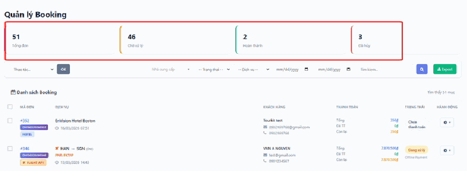
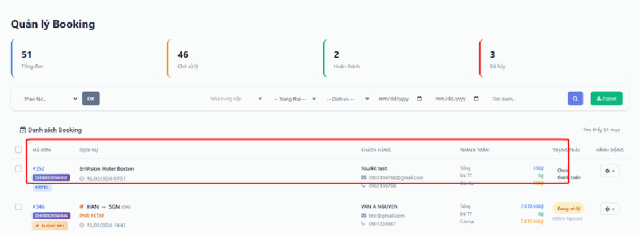
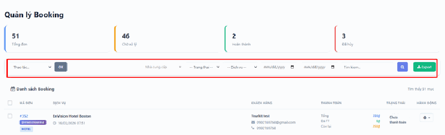

# 3.8. Booking

Mục **Quản lý đơn hàng** (Booking) là **trung tâm điều hành** của cả website.

Mọi thứ khách đặt — phòng khách sạn, tour, vé máy bay, vé sự kiện — đều tự động chảy về đây, gom chung vào một danh sách. Bạn không phải mở từng module để xem có ai đặt gì không: chỉ cần mở mục này là biết hôm nay bán được bao nhiêu, ai đã trả tiền, ai còn nợ, đơn nào cần xử lý gấp.

Nếu mỗi ngày bạn chỉ có thời gian mở đúng một màn hình, hãy mở màn hình này.

> **Đường dẫn:** Menu bên trái > **Quản lý đơn hàng**

Đây là một mục **đứng riêng, không có menu con**. Nhấn vào là vào thẳng danh sách đơn hàng.

> **Nếu bạn không thấy mục này trong menu:** tài khoản của bạn chưa được cấp quyền xem đơn hàng — hãy liên hệ quản trị viên của đơn vị bạn.

## a. Chỉ số thống kê nhanh

Các **thẻ màu ở phía trên cùng** cho bạn bức tranh toàn cảnh chỉ trong 3 giây, không cần đọc bảng:

- **Tổng đơn** — tổng số đơn hàng đã phát sinh.
- **Chờ xử lý** — **con số cần nhìn đầu tiên mỗi sáng**. Đây là các đơn mới, khách đang chờ bạn xác nhận. Con số này càng để lâu, khách càng dễ hủy và đi đặt chỗ khác.
- **Hoàn thành & Đã hủy** — kết quả kinh doanh cuối cùng: bao nhiêu đơn đã đi trót lọt, bao nhiêu đơn bị mất.

> **Mẹo:** Nếu số **"Đã hủy"** tăng bất thường trong vài ngày, hãy xem lại: có phải đơn bị hủy do bạn phản hồi quá chậm không? Con số này thường là lời cảnh báo sớm.

## b. Thông tin chi tiết đơn hàng

Bảng **Danh sách Booking** phía dưới chứa mọi dữ liệu bạn cần để xử lý một đơn:

- **Mã đơn & Dịch vụ** — cho biết khách đặt loại hình gì (*Hotel*, *Flight API*, tour…) và thời gian sử dụng dịch vụ. Mã đơn là thứ bạn nên đọc cho khách khi gọi điện xác nhận.
- **Khách hàng** — tên, email và số điện thoại để liên hệ.
- **Thanh toán** — 3 con số quan trọng nhất: **Tổng tiền**, số **Đã thanh toán**, và số **Còn lại** cần thu. Hãy nhìn cột **"Còn lại"** trước khi cho khách sử dụng dịch vụ.
- **Trạng thái** — gồm 2 loại thông tin: tiến độ thanh toán (*Chưa thanh toán*, *Offline Payment*…) và tình trạng đơn (*Đang xử lý*, *Đã hủy*).

> **Lưu ý về "Offline Payment":** nghĩa là khách chọn **trả tiền ngoài website** — chuyển khoản tay, hoặc trả tiền mặt tại văn phòng. Hệ thống **không tự biết** khách đã trả hay chưa. Bạn phải tự kiểm tra tài khoản ngân hàng rồi vào đây cập nhật trạng thái. Nếu quên, sổ sách của bạn sẽ lệch với thực tế.

## c. Công cụ quản lý và xuất dữ liệu

Khi đơn nhiều lên, bạn sẽ cần 3 công cụ này:

**Bộ lọc chuyên sâu**

Tìm nhanh đơn hàng theo: **Nhà cung cấp** (đối tác bán dịch vụ trên website của bạn), **Trạng thái**, **Loại dịch vụ**, **Khoảng ngày**, hoặc **Tên / Số điện thoại khách hàng**.

Vài cách lọc dùng được ngay:

- Lọc trạng thái **"Chờ xử lý"** → ra đúng danh sách việc cần làm hôm nay.
- Lọc theo **khoảng ngày** của tháng trước → phục vụ chốt sổ cuối tháng.
- Gõ **số điện thoại khách** vào ô tìm kiếm → khi khách gọi tới hỏi về đơn của họ.

**Hành động hàng loạt**

Làm hàng loạt nghĩa là xử lý nhiều đơn cùng lúc thay vì sửa từng cái. Tích chọn các đơn cần xử lý, chọn hành động, rồi **nhấn nút "Áp dụng"**.

> **Cẩn thận:** Chọn hành động xong mà **quên nhấn "Áp dụng"** thì không có gì xảy ra cả. Đây là lỗi phổ biến nhất ở màn hình này.

**Xuất dữ liệu (Export)**

Nhấn nút **"Export"** (màu xanh lá) để tải danh sách đơn hàng về máy tính dưới dạng file bảng tính, mở được bằng Excel. Dùng khi bạn cần làm báo cáo doanh thu, đối soát với đối tác, hoặc gửi số liệu cho kế toán.

> **Mẹo quan trọng:** Hãy **lọc trước rồi mới Export**. Nếu bạn bấm Export khi đang xem toàn bộ danh sách, file tải về sẽ chứa tất cả đơn từ trước tới nay và bạn phải ngồi lọc lại trong Excel. Lọc đúng tháng cần báo cáo rồi mới Export sẽ tiết kiệm cho bạn rất nhiều thời gian.

## Lưu ý & xử lý sự cố

**Khách báo đã đặt nhưng bạn không thấy đơn:**

- Kiểm tra xem bạn có đang bật **bộ lọc** nào không (lọc theo trạng thái, theo ngày, theo loại dịch vụ). Bộ lọc còn sót lại từ lần xem trước là nguyên nhân phổ biến nhất. Hãy xóa hết bộ lọc để xem toàn bộ danh sách.
- Tải lại trang bằng **Ctrl + F5** (giữ phím Ctrl rồi bấm F5).
- Với vé máy bay: đơn dang dở chưa thanh toán sẽ **tự hủy** sau một khoảng thời gian đã cài đặt. Xem thêm ở bài [3.6. Vé máy bay BGT](ve-may-bay-bgt.md).

**Số tiền "Đã thanh toán" không khớp với ngân hàng:** với các đơn **Offline Payment**, hệ thống không tự cập nhật được. Bạn phải đối chiếu sao kê ngân hàng rồi cập nhật tay vào đơn.

**Bấm Export nhưng không thấy file đâu:** file đã tải về máy rồi. Hãy mở thư mục **Downloads** (Tải xuống) trên máy tính của bạn, hoặc nhìn xuống **góc dưới bên trái** trình duyệt — file vừa tải thường hiện ở đó.

**Lỡ hủy nhầm một đơn:** hãy liên hệ khách ngay để xác nhận lại, và báo quản trị viên của đơn vị bạn. Đừng tự tạo đơn mới trùng lặp, vì sẽ làm sai lệch số liệu thống kê.

## Xem thêm

- [3.2. Khách sạn](khach-san.md) — nơi khai báo phòng và giá tạo ra các đơn khách sạn.
- [3.3. Tour](tour.md) — nơi khai báo tour tạo ra các đơn tour.
- [3.6. Vé máy bay BGT](ve-may-bay-bgt.md) — nơi cấu hình bán vé máy bay.
- [4.13. Báo cáo](../khoi-he-thong/bao-cao.md) — thống kê chuyên sâu hơn về doanh thu.
