# 3.1. Địa điểm

Mục **Địa điểm** là nơi bạn khai báo "bản đồ" cho toàn bộ website: có những quốc gia nào, tỉnh thành nào, khu vực nào. Nghe qua thì đơn giản, nhưng đây là phần nền móng — nếu chưa khai báo "Đà Nẵng" ở đây thì khi thêm tour bạn sẽ không tìm thấy "Đà Nẵng" để chọn.

Đây cũng là thứ giúp khách hàng lọc tìm nhanh. Khách vào website, bấm "Đà Nẵng" là ra ngay các tour và khách sạn ở Đà Nẵng, thay vì phải cuộn qua hàng trăm sản phẩm.

> **Đường dẫn:** Menu bên trái > **Địa điểm** (biểu tượng la bàn)



## Trong mục này có gì?

Khi nhấn vào **Địa điểm** ở menu bên trái, bạn sẽ thấy 3 mục con:

* **Tất cả vị trí** — danh sách các quốc gia, tỉnh, thành phố (ví dụ: Việt Nam, Nhật Bản, Hà Nội, Tokyo). Đây là nơi bạn làm việc nhiều nhất.
* **Tất cả danh mục** — phân loại địa điểm theo đặc tính (ví dụ: Du lịch biển, Du lịch vùng cao, Khu nghỉ dưỡng tâm linh). Dùng khi bạn muốn gom nhiều địa điểm cùng kiểu vào một nhóm.
* **Địa chỉ cụ thể** — lưu các địa chỉ chi tiết dùng đi dùng lại (ví dụ: điểm đón khách, văn phòng). Khác với "vị trí" là vùng lớn, "địa chỉ" là một điểm chính xác trên bản đồ.

> **Lưu ý:** Nếu bạn không thấy mục **Địa điểm** trong menu, tài khoản của bạn chưa được cấp quyền xem phần này — hãy liên hệ quản trị viên.

## Tất cả vị trí

Đây là màn hình chính. Nó chia làm hai phần rõ rệt: **cột bên trái** là khung để thêm địa điểm mới, **phần bên phải** là bảng danh sách các địa điểm đã có.

## a, Khu vực thêm mới địa điểm

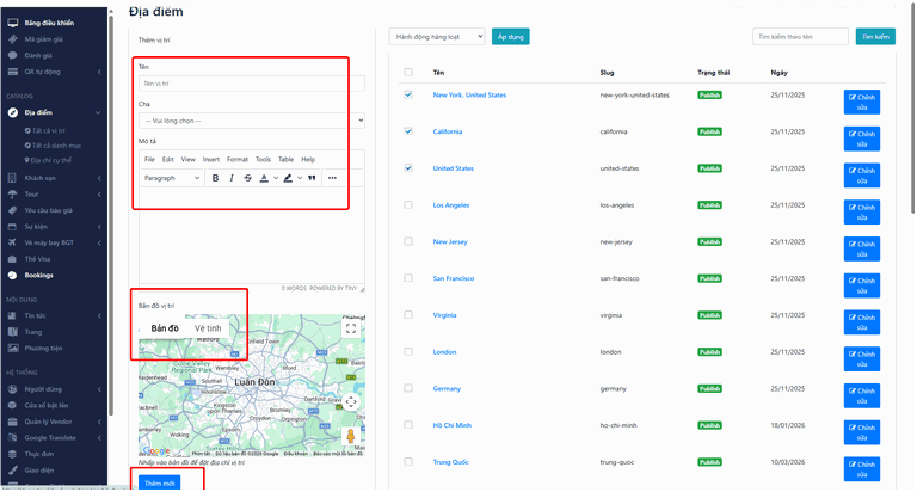

Bạn làm ở **cột bên trái**, mục **"Thêm vị trí"**.

### Bước 1: Điền thông tin cơ bản

*   **Ô "Tên"** — nhập tên quốc gia, tỉnh hoặc thành phố. Ví dụ: `Hà Nội`, `Nhật Bản`, `Đà Nẵng`.

    > **Mẹo:** Hãy gõ tên đúng chính tả và có dấu tiếng Việt như bạn muốn khách nhìn thấy trên website. Tên này sẽ hiện ra y hệt ở ngoài trang web.
*   **Ô "Cha"** — đây là ô hay gây bối rối nhất, nhưng thật ra rất dễ hiểu. "Cha" nghĩa là **địa điểm lớn hơn bao trùm nó**.

    * Nếu bạn đang thêm một **thành phố** thuộc một quốc gia đã có sẵn, hãy chọn quốc gia đó. Ví dụ: thêm "New York" thì chọn Cha là "United States"; thêm "Hà Nội" thì chọn Cha là "Việt Nam".
    * Nếu bạn đang thêm một **quốc gia mới**, hãy **để trống** ô này.

    > **Vì sao cần làm đúng?** Vì nhờ quan hệ cha–con này mà khách bấm vào "Việt Nam" trên website sẽ thấy được cả tour ở Hà Nội, Đà Nẵng, Hội An. Nếu bạn để trống Cha cho mọi thứ, các thành phố sẽ nằm rời rạc và khách khó tìm.
* **Ô "Mô tả"** — viết vài dòng giới thiệu về địa điểm: có gì hay, mùa nào đẹp, món gì ngon. Phần này hiện ra cho khách đọc nên hãy viết tự nhiên như bạn đang tư vấn cho khách. Không bắt buộc, có thể bổ sung sau.

### Bước 2: Ghim vị trí trên bản đồ

Bên dưới ô mô tả có một **khung bản đồ**.

* Nhấp chuột trực tiếp vào đúng chỗ trên bản đồ để ghim một điểm đánh dấu.
* Điểm ghim này chính là thứ khách nhìn thấy khi họ xem bản đồ trên website, giúp họ biết địa điểm nằm ở đâu.

> **Không bắt buộc phải chính xác tuyệt đối.** Với một tỉnh hay thành phố, bạn chỉ cần ghim vào giữa khu trung tâm là đủ. Bản đồ ở đây để khách hình dung khu vực, không phải để dẫn đường từng mét.

### Bước 3: Lưu lại

Nhấn nút **"Thêm mới"** màu xanh ở **dưới cùng bên trái**.

Sau khi lưu, địa điểm mới sẽ xuất hiện ngay trong bảng danh sách bên phải. Nếu bạn không thấy nó, hãy tải lại trang (nhấn **F5**) và tìm lại.

## b, Khu vực tìm kiếm địa điểm

Khi danh sách địa điểm đã dài tới vài chục dòng, việc cuộn tay tìm sẽ rất mất thời gian. Hãy dùng ô tìm kiếm.

1. Nhìn lên **góc trên bên phải** của bảng danh sách, bạn sẽ thấy ô **"Tìm kiếm theo tên"**.
2. Gõ tên thành phố hoặc quốc gia bạn cần tìm.
3. Nhấn nút **"Tìm kiếm"**.

Hệ thống sẽ chỉ hiển thị những dòng khớp với từ khóa của bạn.

> **Nếu tìm mà không ra kết quả nào:** hãy kiểm tra hai thứ. Thứ nhất, ô tìm kiếm có bị dính dấu cách thừa ở đầu/cuối không (hay gặp khi bạn copy-paste từ chỗ khác). Thứ hai, bạn gõ có dấu hay không dấu — nếu địa điểm được lưu là "Hà Nội" mà bạn gõ "Ha Noi" thì có thể không ra. Hãy thử gõ một phần ngắn như "Hà" xem sao.

Muốn xem lại toàn bộ danh sách, chỉ cần xóa trống ô tìm kiếm rồi nhấn **"Tìm kiếm"** lần nữa.

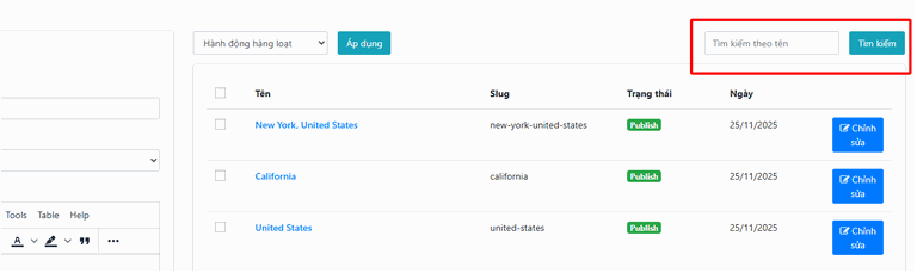

## c, Khu vực quản lý và hành động hàng loạt

### Sửa từng địa điểm một

Tìm đến dòng của địa điểm cần sửa, nhấn nút **"Chỉnh sửa"** màu xanh ở dòng đó. Màn hình sẽ mở ra đúng các ô như lúc thêm mới (Tên, Cha, Mô tả, bản đồ) và bạn sửa gì tùy ý, rồi lưu lại.

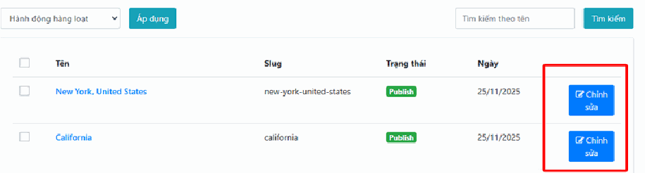

### Làm hàng loạt (xử lý nhiều mục cùng lúc)

"Hành động hàng loạt" nghĩa là thay vì xóa từng địa điểm một, bạn tích chọn 10 cái rồi xóa cả 10 trong một lần bấm.

Làm theo 3 bước:

1. **Chọn:** tích vào các **ô vuông nhỏ ở cột đầu tiên** bên trái của những dòng bạn muốn xử lý. Muốn chọn hết các dòng đang hiện trên trang, hãy tích vào ô vuông nằm trên thanh tiêu đề bảng.
2. **Chọn lệnh:** mở thực đơn thả xuống **"Hành động hàng loạt"** và chọn việc cần làm (thường là **"Xóa"**).
3. **Thực thi:** nhấn nút **"Áp dụng"** ngay bên cạnh.

> **Đây là lỗi số một mà mọi người hay mắc:** chọn xong lệnh trong thực đơn rồi tưởng là xong, quay đi làm việc khác. Không phải. **Bắt buộc phải nhấn "Áp dụng"** thì hệ thống mới thực hiện. Nếu bạn thấy chọn Xóa rồi mà chẳng có gì xảy ra, chính là vì chưa bấm "Áp dụng".

> **Cẩn thận:** Trước khi bấm "Áp dụng" với lệnh Xóa, hãy nhìn lại một lượt xem mình đã tích đúng những dòng cần xóa chưa. Xóa nhầm một địa điểm đang được nhiều tour sử dụng sẽ ảnh hưởng tới các tour đó.

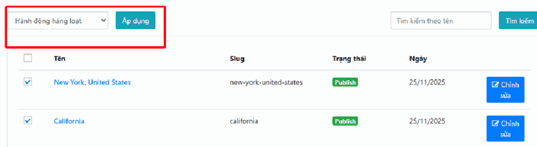

## Tất cả danh mục

Danh mục địa điểm giúp bạn gom các địa điểm cùng kiểu vào một nhóm. Ví dụ bạn tạo nhóm "Du lịch biển" rồi gán Nha Trang, Đà Nẵng, Phú Quốc vào đó — khách chỉ cần bấm một cái là thấy hết các điểm biển.

## a, Thêm danh mục vị trí mới

Bạn làm ở **cột bên trái**:

### Bước 1: Nhập tên

Trong **ô "Tên"**, gõ tên loại hình bạn muốn quản lý. Ví dụ: `Du lịch biển`, `Du lịch vùng cao`, `Khu nghỉ dưỡng tâm linh`.

### Bước 2: Lớp biểu tượng (không bắt buộc)

**Ô "Lớp biểu tượng"** dùng để gắn một hình icon nhỏ minh họa cho danh mục (ví dụ hình cái ô cho nhóm du lịch biển).

Đây là ô cần **mã kỹ thuật** chứ không phải chữ thường. Nếu bạn không rành phần này, **cứ để trống** — danh mục vẫn hoạt động bình thường, chỉ là không có hình icon đi kèm. Muốn có icon đẹp, hãy nhờ đơn vị triển khai điền giúp.

### Bước 3: Lưu lại

Nhấn nút **"Thêm mới"** màu xanh.

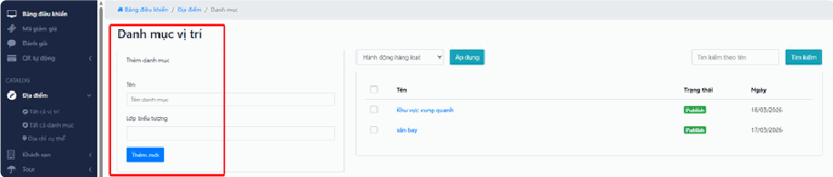

## b, Quản lý danh sách danh mục

Bảng bên phải cho bạn thấy toàn bộ danh mục đã tạo, gồm: tên danh mục, trạng thái hiển thị (**"Publish"** nghĩa là đã đăng cho khách xem được) và ngày tạo.

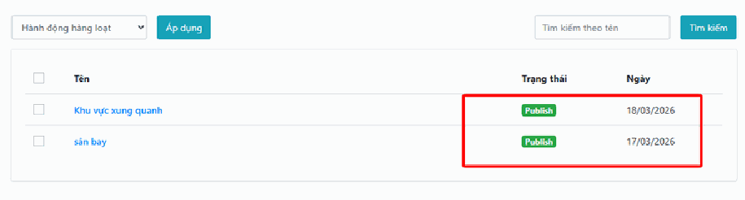

Muốn sửa một danh mục, hãy đưa con trỏ chuột vào tên của nó — các lựa chọn thao tác sẽ hiện ra để bạn chỉnh sửa.

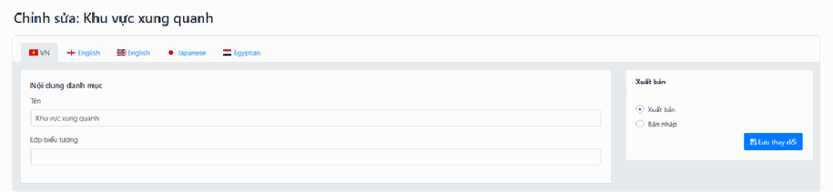

## c, Tìm kiếm và Thao tác hàng loạt

Khu vực **phía trên bên phải** hoạt động y hệt như bên "Tất cả vị trí":

**Tìm kiếm:** gõ tên danh mục vào ô **"Tìm kiếm theo tên"** rồi nhấn nút **"Tìm kiếm"**.

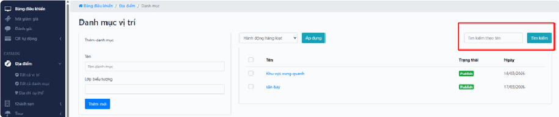

**Hành động hàng loạt:** tích chọn các dòng cần xử lý ở cột đầu tiên → chọn lệnh (ví dụ **"Xóa"**) trong thực đơn thả xuống → nhấn **"Áp dụng"**. Đừng quên bước "Áp dụng" cuối cùng.

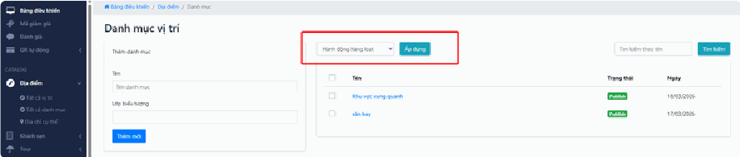

## Địa chỉ cụ thể

Khác với "vị trí" là một vùng rộng (cả thành phố Nha Trang), **địa chỉ cụ thể** là một điểm chính xác — ví dụ nơi xe đón khách, địa chỉ nhà hàng ăn trưa trong lịch trình. Bạn khai báo một lần ở đây rồi dùng lại nhiều lần cho nhiều tour, khỏi phải gõ lại mỗi lần.

## a, Tìm kiếm địa chỉ

1. Nhìn lên **góc trên bên phải**, tìm ô **"Tìm kiếm địa chỉ..."**.
2. Gõ tên hoặc từ khóa của địa chỉ cần tìm.
3. Nhấn nút **"Tìm kiếm"** để lọc danh sách.

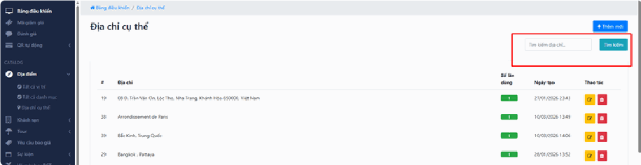

## b, Thêm địa chỉ mới

Nhấn nút **"Thêm mới"** — nút màu xanh dương có biểu tượng dấu cộng, nằm ở **góc trên bên phải màn hình**. Một giao diện nhập liệu sẽ mở ra để bạn khai báo địa chỉ mới.

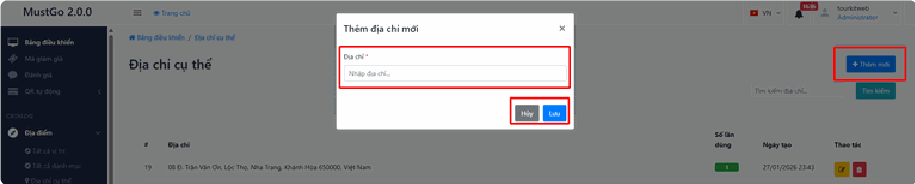

## c, Theo dõi và thao tác

Bảng danh sách hiển thị các cột sau:

* **Địa chỉ** — tên hoặc địa chỉ chi tiết đã lưu (ví dụ: Nha Trang, Paris, Bắc Kinh).
*   **Số lần dùng** — cho biết địa chỉ này đang được bao nhiêu tour hoặc bài viết sử dụng.

    > **Cột này rất hữu ích trước khi xóa.** Nếu một địa chỉ có số lần dùng là 0, xóa đi hoàn toàn an toàn. Nếu nó đang được 15 tour dùng, hãy cân nhắc kỹ — xóa sẽ ảnh hưởng tới cả 15 tour đó.
* **Thao tác** — có hai biểu tượng:
  * **Bút chì (màu vàng)** — nhấn để chỉnh sửa thông tin địa chỉ.
  * **Thùng rác (màu đỏ)** — nhấn để xóa địa chỉ khỏi hệ thống.

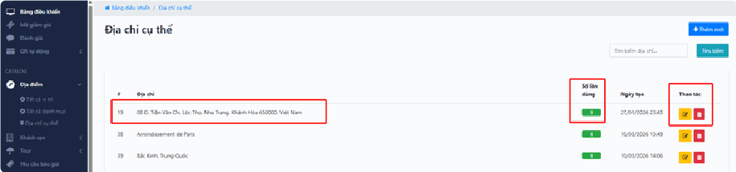

## Lưu ý & xử lý sự cố

**Thêm địa điểm xong nhưng khi tạo tour không tìm thấy nó trong danh sách chọn:** hãy tải lại trang tạo tour bằng **Ctrl + F5**. Màn hình tạo tour thường đã tải sẵn danh sách địa điểm từ lúc bạn mở nó, nên địa điểm vừa tạo chưa kịp xuất hiện.

**Gõ tên địa điểm bị mất dấu hoặc sai chính tả:** kiểm tra bộ gõ tiếng Việt (Unikey) đang bật hay tắt. Nếu tên đã lưu sai, bạn vẫn sửa được bất cứ lúc nào bằng nút **"Chỉnh sửa"** — không cần xóa đi tạo lại.

**Tạo nhầm một địa điểm là "con" của quốc gia sai:** vào **"Chỉnh sửa"** địa điểm đó, chọn lại đúng giá trị trong ô **"Cha"** rồi lưu. Các tour đã gán vẫn giữ nguyên, không mất gì.

**Ngoài website vẫn hiện địa điểm cũ sau khi sửa:** trình duyệt đang giữ bản cũ. Nhấn **Ctrl + F5** trên trang web để tải lại sạch.

**Không thấy mục "Địa chỉ cụ thể":** mục này phụ thuộc quyền và cấu hình. Hãy liên hệ quản trị viên hoặc đơn vị triển khai.

## Xem thêm

* [3. Khối SẢN PHẨM](./)
* [3.2. Khách sạn](khach-san.md)
* [3.3. Tour](tour.md)
