# 3.1. Địa điểm

Mục **Địa điểm** là nơi bạn khai báo "bản đồ" cho toàn bộ website: có những quốc gia nào, tỉnh thành nào, khu vực nào. Nghe qua thì đơn giản, nhưng đây là phần nền móng — nếu chưa khai báo "Đà Nẵng" ở đây thì khi thêm tour bạn sẽ không tìm thấy "Đà Nẵng" để chọn.

Đây cũng là thứ giúp khách hàng lọc tìm nhanh. Khách vào website, bấm "Đà Nẵng" là ra ngay các tour và khách sạn ở Đà Nẵng, thay vì phải cuộn qua hàng trăm sản phẩm.

> **Đường dẫn:** Menu bên trái > **Địa điểm** (biểu tượng la bàn)



## Trong mục này có gì?

Khi nhấn vào **Địa điểm** ở menu bên trái, bạn sẽ thấy 3 mục con:

* **Tất cả vị trí** — danh sách các quốc gia, tỉnh, thành phố (ví dụ: Việt Nam, Nhật Bản, Hà Nội, Tokyo). Đây là nơi bạn làm việc nhiều nhất.
* **Tất cả danh mục** — phân loại địa điểm theo đặc tính (ví dụ: Du lịch biển, Du lịch vùng cao, Khu nghỉ dưỡng tâm linh). Dùng khi bạn muốn gom nhiều địa điểm cùng kiểu vào một nhóm.
* **Địa chỉ cụ thể** — lưu các địa chỉ chi tiết dùng đi dùng lại (ví dụ: điểm đón khách, văn phòng). Khác với "vị trí" là vùng lớn, "địa chỉ" là một điểm chính xác trên bản đồ.

> **Lưu ý:** Nếu bạn không thấy mục **Địa điểm** trong menu, tài khoản của bạn chưa được cấp quyền xem phần này — hãy liên hệ quản trị viên.

## Tất cả vị trí

Đây là màn hình chính. Nó chia làm hai phần rõ rệt: **cột bên trái** là khung để thêm địa điểm mới, **phần bên phải** là bảng danh sách các địa điểm đã có.

## a, Khu vực thêm mới địa điểm

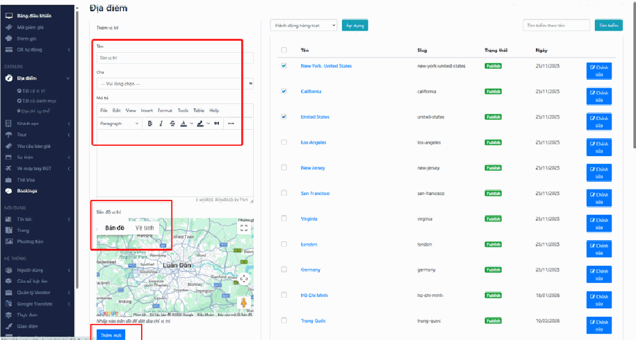

Bạn làm ở **cột bên trái**, mục **"Thêm vị trí"**.

### Bước 1: Điền thông tin cơ bản

*   **Ô "Tên"** — nhập tên quốc gia, tỉnh hoặc thành phố. Ví dụ: `Hà Nội`, `Nhật Bản`, `Đà Nẵng`.

    > **Mẹo:** Hãy gõ tên đúng chính tả và có dấu tiếng Việt như bạn muốn khách nhìn thấy trên website. Tên này sẽ hiện ra y hệt ở ngoài trang web.
*   **Ô "Cha"** — đây là ô hay gây bối rối nhất, nhưng thật ra rất dễ hiểu. "Cha" nghĩa là **địa điểm lớn hơn bao trùm nó**.

    * Nếu bạn đang thêm một **thành phố** thuộc một quốc gia đã có sẵn, hãy chọn quốc gia đó. Ví dụ: thêm "New York" thì chọn Cha là "United States"; thêm "Hà Nội" thì chọn Cha là "Việt Nam".
    * Nếu bạn đang thêm một **quốc gia mới**, hãy **để trống** ô này.

    > **Vì sao cần làm đúng?** Vì nhờ quan hệ cha–con này mà khách bấm vào "Việt Nam" trên website sẽ thấy được cả tour ở Hà Nội, Đà Nẵng, Hội An. Nếu bạn để trống Cha cho mọi thứ, các thành phố sẽ nằm rời rạc và khách khó tìm.
* **Ô "Mô tả"** — viết vài dòng giới thiệu về địa điểm: có gì hay, mùa nào đẹp, món gì ngon. Phần này hiện ra cho khách đọc nên hãy viết tự nhiên như bạn đang tư vấn cho khách. Không bắt buộc, có thể bổ sung sau.

### Bước 2: Ghim vị trí trên bản đồ

Bên dưới ô mô tả có một **khung bản đồ**.

* Nhấp chuột trực tiếp vào đúng chỗ trên bản đồ để ghim một điểm đánh dấu.
* Điểm ghim này chính là thứ khách nhìn thấy khi họ xem bản đồ trên website, giúp họ biết địa điểm nằm ở đâu.

> **Không bắt buộc phải chính xác tuyệt đối.** Với một tỉnh hay thành phố, bạn chỉ cần ghim vào giữa khu trung tâm là đủ. Bản đồ ở đây để khách hình dung khu vực, không phải để dẫn đường từng mét.

### Bước 3: Lưu lại

Nhấn nút **"Thêm mới"** màu xanh ở **dưới cùng bên trái**.

Sau khi lưu, địa điểm mới sẽ xuất hiện ngay trong bảng danh sách bên phải. Nếu bạn không thấy nó, hãy tải lại trang (nhấn **F5**) và tìm lại.

## b, Khu vực tìm kiếm địa điểm

Khi danh sách địa điểm đã dài tới vài chục dòng, việc cuộn tay tìm sẽ rất mất thời gian. Hãy dùng ô tìm kiếm.

1. Nhìn lên **góc trên bên phải** của bảng danh sách, bạn sẽ thấy ô **"Tìm kiếm theo tên"**.
2. Gõ tên thành phố hoặc quốc gia bạn cần tìm.
3. Nhấn nút **"Tìm kiếm"**.

Hệ thống sẽ chỉ hiển thị những dòng khớp với từ khóa của bạn.

> **Nếu tìm mà không ra kết quả nào:** hãy kiểm tra hai thứ. Thứ nhất, ô tìm kiếm có bị dính dấu cách thừa ở đầu/cuối không (hay gặp khi bạn copy-paste từ chỗ khác). Thứ hai, bạn gõ có dấu hay không dấu — nếu địa điểm được lưu là "Hà Nội" mà bạn gõ "Ha Noi" thì có thể không ra. Hãy thử gõ một phần ngắn như "Hà" xem sao.

Muốn xem lại toàn bộ danh sách, chỉ cần xóa trống ô tìm kiếm rồi nhấn **"Tìm kiếm"** lần nữa.

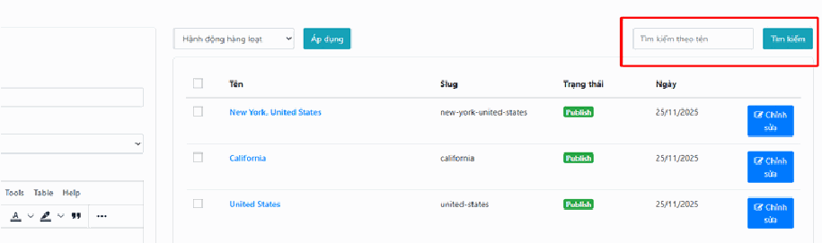

## c, Khu vực quản lý và hành động hàng loạt

### Sửa từng địa điểm một

Tìm đến dòng của địa điểm cần sửa, nhấn nút **"Chỉnh sửa"** màu xanh ở dòng đó. Màn hình sẽ mở ra đúng các ô như lúc thêm mới (Tên, Cha, Mô tả, bản đồ) và bạn sửa gì tùy ý, rồi lưu lại.

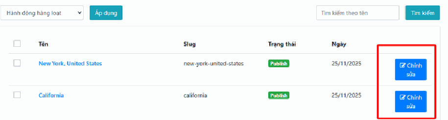

### Làm hàng loạt (xử lý nhiều mục cùng lúc)

"Hành động hàng loạt" nghĩa là thay vì xóa từng địa điểm một, bạn tích chọn 10 cái rồi xóa cả 10 trong một lần bấm.

Làm theo 3 bước:

1. **Chọn:** tích vào các **ô vuông nhỏ ở cột đầu tiên** bên trái của những dòng bạn muốn xử lý. Muốn chọn hết các dòng đang hiện trên trang, hãy tích vào ô vuông nằm trên thanh tiêu đề bảng.
2. **Chọn lệnh:** mở thực đơn thả xuống **"Hành động hàng loạt"** và chọn việc cần làm (thường là **"Xóa"**).
3. **Thực thi:** nhấn nút **"Áp dụng"** ngay bên cạnh.

> **Đây là lỗi số một mà mọi người hay mắc:** chọn xong lệnh trong thực đơn rồi tưởng là xong, quay đi làm việc khác. Không phải. **Bắt buộc phải nhấn "Áp dụng"** thì hệ thống mới thực hiện. Nếu bạn thấy chọn Xóa rồi mà chẳng có gì xảy ra, chính là vì chưa bấm "Áp dụng".

> **Cẩn thận:** Trước khi bấm "Áp dụng" với lệnh Xóa, hãy nhìn lại một lượt xem mình đã tích đúng những dòng cần xóa chưa. Xóa nhầm một địa điểm đang được nhiều tour sử dụng sẽ ảnh hưởng tới các tour đó.

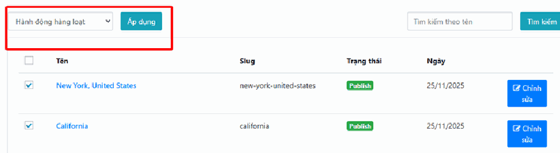

## Tất cả danh mục

Danh mục địa điểm giúp bạn gom các địa điểm cùng kiểu vào một nhóm. Ví dụ bạn tạo nhóm "Du lịch biển" rồi gán Nha Trang, Đà Nẵng, Phú Quốc vào đó — khách chỉ cần bấm một cái là thấy hết các điểm biển.

## a, Thêm danh mục vị trí mới

Bạn làm ở **cột bên trái**:

### Bước 1: Nhập tên

Trong **ô "Tên"**, gõ tên loại hình bạn muốn quản lý. Ví dụ: `Du lịch biển`, `Du lịch vùng cao`, `Khu nghỉ dưỡng tâm linh`.

### Bước 2: Lớp biểu tượng (không bắt buộc)

**Ô "Lớp biểu tượng"** dùng để gắn một hình icon nhỏ minh họa cho danh mục (ví dụ hình cái ô cho nhóm du lịch biển).

Đây là ô cần **mã kỹ thuật** chứ không phải chữ thường. Nếu bạn không rành phần này, **cứ để trống** — danh mục vẫn hoạt động bình thường, chỉ là không có hình icon đi kèm. Muốn có icon đẹp, hãy nhờ đơn vị triển khai điền giúp.

### Bước 3: Lưu lại

Nhấn nút **"Thêm mới"** màu xanh.

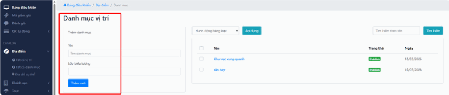

## b, Quản lý danh sách danh mục

Bảng bên phải cho bạn thấy toàn bộ danh mục đã tạo, gồm: tên danh mục, trạng thái hiển thị (**"Publish"** nghĩa là đã đăng cho khách xem được) và ngày tạo.

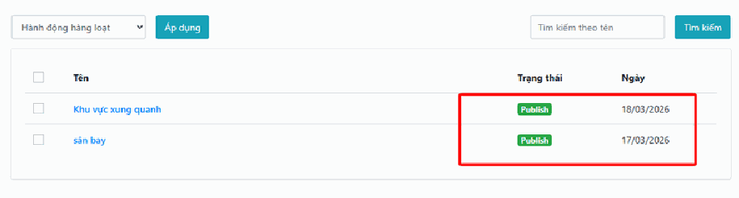

Muốn sửa một danh mục, hãy đưa con trỏ chuột vào tên của nó — các lựa chọn thao tác sẽ hiện ra để bạn chỉnh sửa.

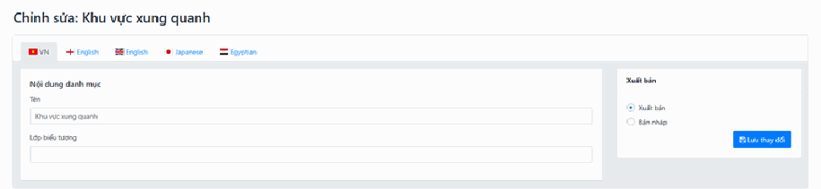

## c, Tìm kiếm và Thao tác hàng loạt

Khu vực **phía trên bên phải** hoạt động y hệt như bên "Tất cả vị trí":

**Tìm kiếm:** gõ tên danh mục vào ô **"Tìm kiếm theo tên"** rồi nhấn nút **"Tìm kiếm"**.

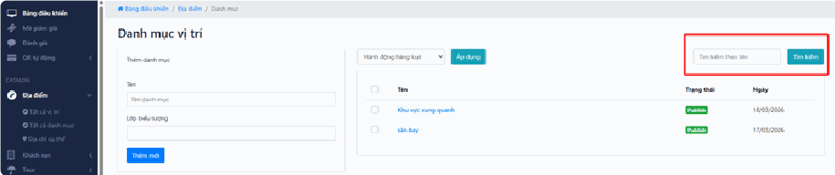

**Hành động hàng loạt:** tích chọn các dòng cần xử lý ở cột đầu tiên → chọn lệnh (ví dụ **"Xóa"**) trong thực đơn thả xuống → nhấn **"Áp dụng"**. Đừng quên bước "Áp dụng" cuối cùng.

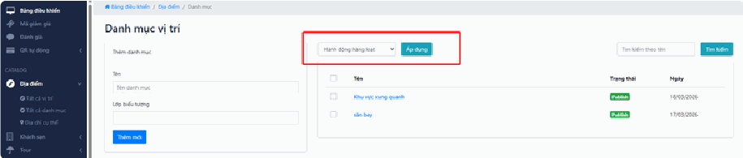

## Địa chỉ cụ thể

Khác với "vị trí" là một vùng rộng (cả thành phố Nha Trang), **địa chỉ cụ thể** là một điểm chính xác — ví dụ nơi xe đón khách, địa chỉ nhà hàng ăn trưa trong lịch trình. Bạn khai báo một lần ở đây rồi dùng lại nhiều lần cho nhiều tour, khỏi phải gõ lại mỗi lần.

## a, Tìm kiếm địa chỉ

1. Nhìn lên **góc trên bên phải**, tìm ô **"Tìm kiếm địa chỉ..."**.
2. Gõ tên hoặc từ khóa của địa chỉ cần tìm.
3. Nhấn nút **"Tìm kiếm"** để lọc danh sách.

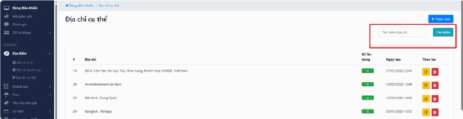

## b, Thêm địa chỉ mới

Nhấn nút **"Thêm mới"** — nút màu xanh dương có biểu tượng dấu cộng, nằm ở **góc trên bên phải màn hình**. Một giao diện nhập liệu sẽ mở ra để bạn khai báo địa chỉ mới.

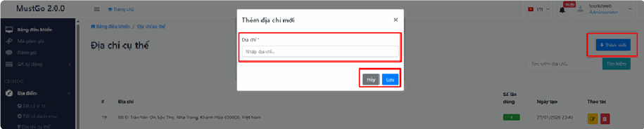

## c, Theo dõi và thao tác

Bảng danh sách hiển thị các cột sau:

* **Địa chỉ** — tên hoặc địa chỉ chi tiết đã lưu (ví dụ: Nha Trang, Paris, Bắc Kinh).
*   **Số lần dùng** — cho biết địa chỉ này đang được bao nhiêu tour hoặc bài viết sử dụng.

    > **Cột này rất hữu ích trước khi xóa.** Nếu một địa chỉ có số lần dùng là 0, xóa đi hoàn toàn an toàn. Nếu nó đang được 15 tour dùng, hãy cân nhắc kỹ — xóa sẽ ảnh hưởng tới cả 15 tour đó.
* **Thao tác** — có hai biểu tượng:
  * **Bút chì (màu vàng)** — nhấn để chỉnh sửa thông tin địa chỉ.
  * **Thùng rác (màu đỏ)** — nhấn để xóa địa chỉ khỏi hệ thống.

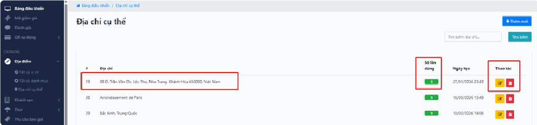

## Trang của địa điểm trên website — vũ khí SEO

Mỗi địa điểm bạn tạo **tự sinh ra 3 trang** trên website. Đây không phải chuyện kỹ thuật cho vui: mỗi trang được làm ra để **đón đúng một kiểu câu khách gõ lên Google**.

| Trang                     | Ví dụ địa chỉ                 | Khách gõ gì lên Google thì trang này đón | Trang hiện gì                                                                                     |
| ------------------------- | ----------------------------- | ----------------------------------------- | ------------------------------------------------------------------------------------------------- |
| **Trang tour theo địa điểm**      | `tenmien.com/tour/da-nang`        | _"tour Đà Nẵng"_, _"tour đi Đà Nẵng"_      | Toàn bộ tour đi tới Đà Nẵng (và các nơi nằm trong Đà Nẵng)                                         |
| **Trang khách sạn theo địa điểm** | `tenmien.com/khach-san/da-nang`   | _"khách sạn Đà Nẵng"_                       | Toàn bộ khách sạn ở Đà Nẵng, có sắp xếp theo giá / đánh giá, chia trang                            |
| **Trang tổng hợp địa điểm**       | `tenmien.com/location/da-nang`    | _"du lịch Đà Nẵng"_, _"Đà Nẵng có gì"_      | **Tất cả** về Đà Nẵng: giới thiệu, mọi loại sản phẩm đang bán (khách sạn, tour, du thuyền…), **bài viết** về Đà Nẵng, khu vực con, bản đồ |

**Vì sao chia ra như vậy?** Người gõ _"khách sạn Đà Nẵng"_ muốn thấy ngay danh sách khách sạn, không muốn lội qua tour. Một trang đúng ý người tìm thì Google mới xếp cao. Đường dẫn ngắn, chứa đúng từ khoá (`/khach-san/da-nang`) cũng là một tín hiệu Google rất coi trọng.

### Cách tận dụng 3 trang này

1. **Đặt đường dẫn đẹp cho địa điểm.** Đường dẫn của địa điểm (phần `da-nang`) dùng chung cho cả 3 trang. Mở **"Chỉnh sửa"** địa điểm, nhìn dòng **"Liên kết cố định"** dưới tiêu đề — bấm vào phần đường dẫn để sửa: **viết thường, không dấu, nối bằng gạch ngang**, ví dụ `da-nang`, `phu-quoc`, `ha-long`.
2. **Gắn đúng địa điểm cho sản phẩm.** Khách sạn chọn ô địa điểm, tour chọn **"Điểm đến"** (và **"Các điểm đến khác"** nếu tour đi nhiều nơi). Sản phẩm không gắn địa điểm thì không bao giờ hiện trên các trang này. Xem [3.2. Khách sạn](khach-san.md#trang-khach-san-theo-dia-diem) và [3.3. Tour](tour.md#trang-tour-theo-dia-diem).
3. **Gắn địa điểm cho bài viết.** Trong màn viết bài có ô **"Địa điểm liên quan"** — bài gắn Đà Nẵng sẽ hiện trong khối **"Bài viết về Đà Nẵng"** của trang tổng hợp. Xem [2.1. Tin tức](../khoi-noi-dung/tin-tuc.md#dang-bai-chuan-seo).
4. **Đưa link lên menu.** Mục menu trỏ vào địa điểm có ô **"Khi bấm, mở trang"** để chọn mở trang tour, trang khách sạn hay trang tổng hợp. Xem [4.6. Menu](../khoi-he-thong/menu.md#muc-menu-la-dia-diem-khi-bam-mo-trang-nao).
5. **Viết phần giới thiệu và điền SEO cho địa điểm** (xem bên dưới).

> **Địa điểm cha gom luôn của con.** Trang của "Việt Nam" hiện tour, khách sạn và bài viết của mọi tỉnh bên trong. Trang "Đà Nẵng" gom cả những gì gắn với "Hội An", "Bà Nà" nếu chúng là con của Đà Nẵng. Vì vậy ô **"Cha"** (Bước 1 ở trên) phải chọn đúng.

### Màn sửa địa điểm có gì để làm SEO

Bấm **"Chỉnh sửa"** một địa điểm trong bảng **"Tất cả vị trí"** để mở màn sửa đầy đủ — nhiều ô hơn khung "Thêm vị trí" ở cột trái:

* **Mô tả** — đoạn giới thiệu hiện ở trang tổng hợp `/location/…`. Viết 300–500 chữ có ích cho khách: nên đi mùa nào, đi lại thế nào, ở khu nào. Trang có nội dung riêng thì Google mới coi là trang có giá trị, thay vì chỉ là danh sách sản phẩm.
* **"Hình ảnh banner"** — ảnh bìa lớn ở đầu trang tổng hợp. Không chọn thì dùng ảnh đặc trưng; không có cả hai thì đầu trang là một dải màu.
* **"Hình ảnh đặc trưng"** — ảnh nhỏ của địa điểm, hiện ở các khối danh sách địa điểm trên trang chủ.
* **"Ý tưởng chuyến đi"** — vài gợi ý hành trình kèm ảnh và link, hiện ở cuối trang tổng hợp. Không bắt buộc.
* **Khung SEO** (dưới phần nội dung) — **Tiêu đề SEO** và **Mô tả** hiện trên Google. Cách điền giống hệt bài viết, xem [Đăng bài chuẩn SEO](../khoi-noi-dung/tin-tuc.md#dang-bai-chuan-seo).

> **Tiêu đề trên Google của 3 trang lấy từ đâu:**
>
> | Trang | Khung SEO của địa điểm **để trống** | Khung SEO của địa điểm **đã điền** |
> | --- | --- | --- |
> | Trang tổng hợp `/location/…` | Tên địa điểm, ví dụ _"Đà Nẵng"_ | Tiêu đề bạn điền |
> | Trang tour `/tour/…` | Tự đặt _"Tour Đà Nẵng"_ + mô tả có số tour | Tiêu đề bạn điền |
> | Trang khách sạn `/khach-san/…` | Luôn tự đặt _"Khách sạn Đà Nẵng"_ + mô tả có số khách sạn | (không dùng khung SEO của địa điểm) |
>
> Nghĩa là **điền khung SEO của địa điểm thì cả trang tổng hợp lẫn trang tour dùng chung tiêu đề đó**. Hãy viết nhắm vào cụm bạn muốn lên top nhất — thường là cụm có chữ "tour", vì người gõ _"tour Đà Nẵng"_ là người sắp mua. Ví dụ: `Tour Đà Nẵng trọn gói, khởi hành hằng ngày`. Không chắc viết gì thì cứ để trống: trang tour vẫn có sẵn tiêu đề _"Tour Đà Nẵng"_ tử tế.

Kích thước ảnh bìa và ảnh đặc trưng nên dùng: xem [Kích thước ảnh chuẩn](../kich-thuoc-anh.md).

> 📷 *[Cần chụp màn hình: trang tổng hợp /location/da-nang ngoài website — dải ảnh bìa có các nút "… khách sạn", "… tour", "… bài viết", và khối "Bài viết về Đà Nẵng"]*

### Khi trang tour / khách sạn theo địa điểm "không chịu hiện"

Đường dẫn `/tour/da-nang` được hệ thống tìm theo thứ tự: **tour** tên `da-nang` → **danh mục tour** tên `da-nang` → **địa điểm** `da-nang`. Nghĩa là nếu bạn có một **danh mục tour** cũng đặt đường dẫn `da-nang`, thì `/tour/da-nang` sẽ mở **trang danh mục đó**, không phải trang địa điểm. Tương tự, `/khach-san/da-nang` sẽ mở **khách sạn** nào có đường dẫn `da-nang` (kể cả khách sạn đang ở bản nháp).

Khi bị trùng như vậy, menu và các link trên website tự chuyển sang trang tìm kiếm lọc theo địa điểm (địa chỉ dạng `/tour?location_id=39`) để khách vẫn xem được — nhưng **trang đó không có giá trị SEO**. Cách xử lý:

* **Đừng tạo danh mục tour trùng tên địa điểm** (danh mục "Đà Nẵng", "Phú Quốc"…). Muốn gom tour theo nơi đến thì dùng chính địa điểm — đó là việc địa điểm sinh ra để làm.
* Đã lỡ có danh mục trùng: đổi đường dẫn của **danh mục** (ví dụ `tour-da-nang-gia-re`), hoặc xoá danh mục nếu không còn dùng. Xoá/đổi xong, link `/tour/da-nang` tự quay về trang địa điểm.

## Lưu ý & xử lý sự cố

**Trang `/tour/…` hoặc `/khach-san/…` của địa điểm trống trơn.** Chưa có sản phẩm nào gắn địa điểm đó (hoặc các sản phẩm đó đang ở bản nháp). Mở vài tour/khách sạn, kiểm tra ô địa điểm/điểm đến, chọn đúng rồi lưu.

**Bấm mục địa điểm trên menu lại ra trang tìm kiếm có `?location_id=` thay vì `/tour/…`.** Đường dẫn của địa điểm đang trùng với một danh mục tour hoặc một khách sạn — xem phần "Khi trang tour / khách sạn theo địa điểm không chịu hiện" ở trên.

**Thêm địa điểm xong nhưng khi tạo tour không tìm thấy nó trong danh sách chọn:** hãy tải lại trang tạo tour bằng **Ctrl + F5**. Màn hình tạo tour thường đã tải sẵn danh sách địa điểm từ lúc bạn mở nó, nên địa điểm vừa tạo chưa kịp xuất hiện.

**Gõ tên địa điểm bị mất dấu hoặc sai chính tả:** kiểm tra bộ gõ tiếng Việt (Unikey) đang bật hay tắt. Nếu tên đã lưu sai, bạn vẫn sửa được bất cứ lúc nào bằng nút **"Chỉnh sửa"** — không cần xóa đi tạo lại.

**Tạo nhầm một địa điểm là "con" của quốc gia sai:** vào **"Chỉnh sửa"** địa điểm đó, chọn lại đúng giá trị trong ô **"Cha"** rồi lưu. Các tour đã gán vẫn giữ nguyên, không mất gì.

**Ngoài website vẫn hiện địa điểm cũ sau khi sửa:** trình duyệt đang giữ bản cũ. Nhấn **Ctrl + F5** trên trang web để tải lại sạch.

**Không thấy mục "Địa chỉ cụ thể":** mục này phụ thuộc quyền và cấu hình. Hãy liên hệ quản trị viên hoặc đơn vị triển khai.

## Xem thêm

* [3. Khối SẢN PHẨM](./)
* [3.2. Khách sạn](khach-san.md)
* [3.3. Tour](tour.md)
* [2.1. Tin tức](../khoi-noi-dung/tin-tuc.md) — gắn bài viết vào địa điểm
* [4.6. Menu](../khoi-he-thong/menu.md) — đưa trang địa điểm lên menu
* [Kích thước ảnh chuẩn](../kich-thuoc-anh.md)
