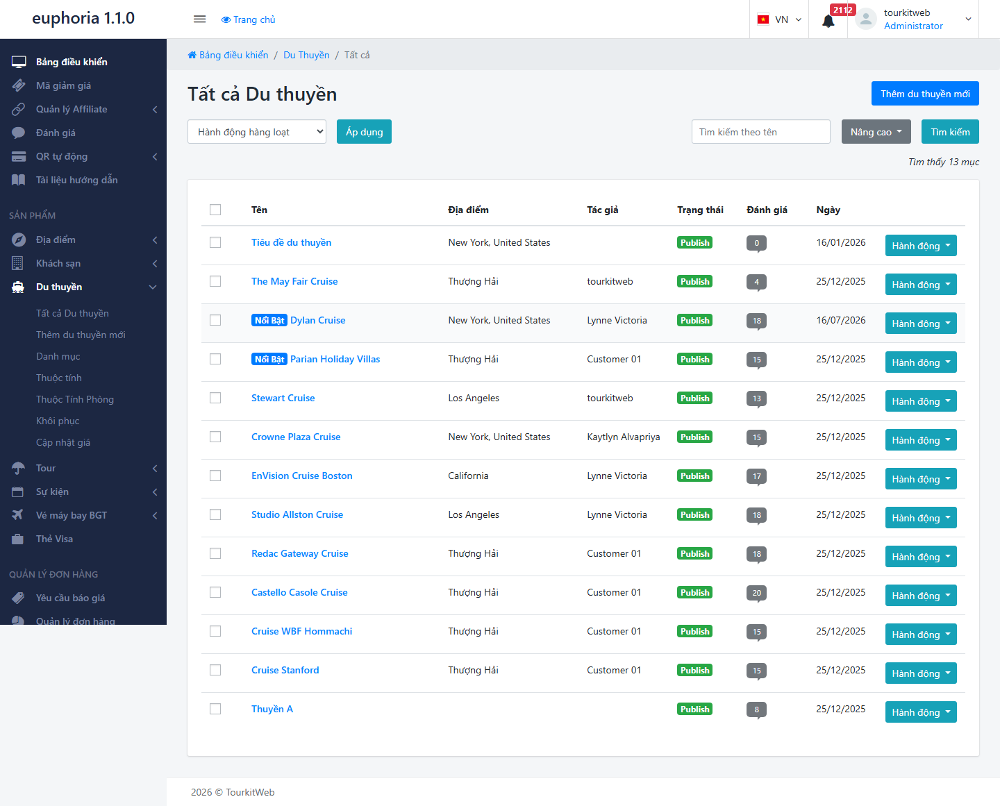
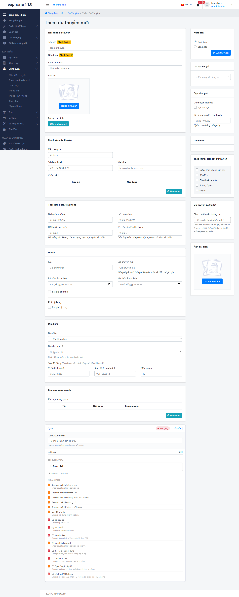
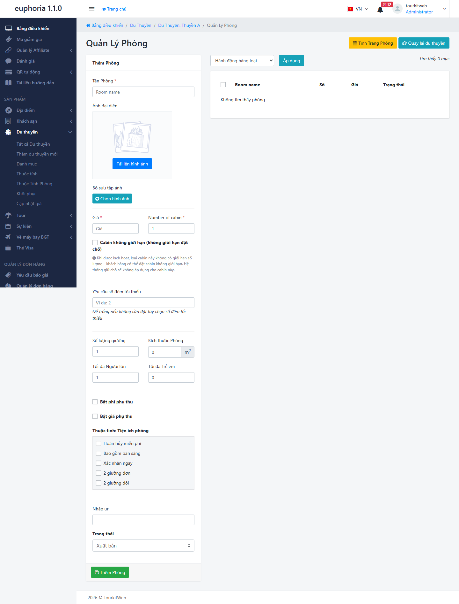
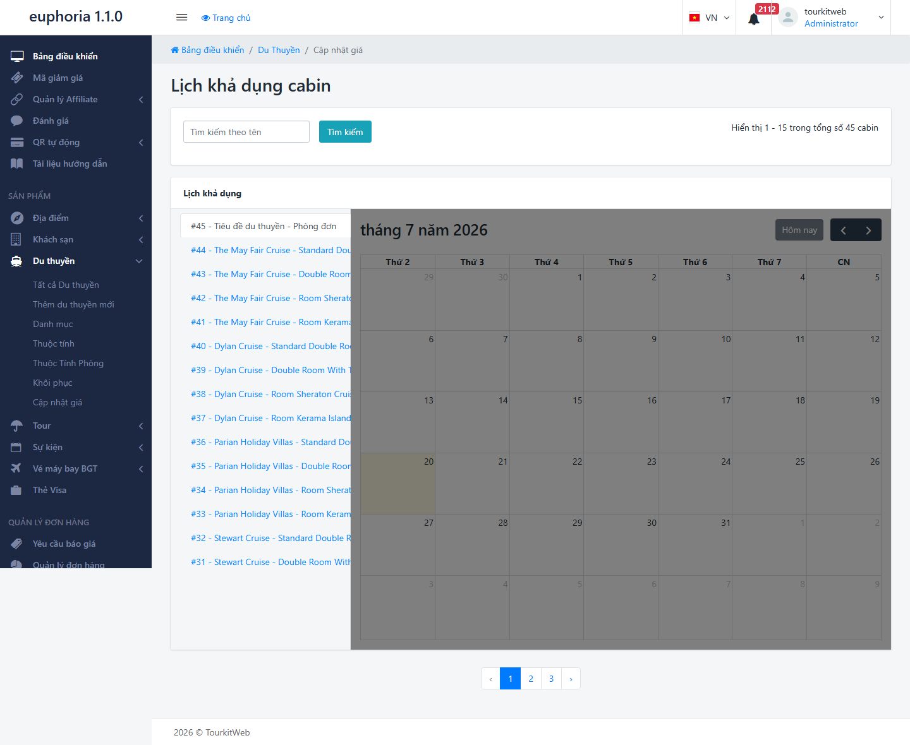
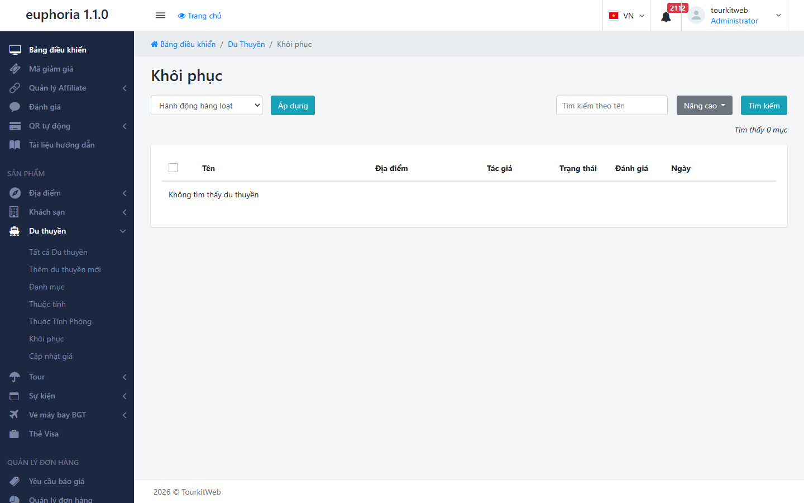

# 3.9. Du thuyền

Mục **Du thuyền** dùng để bán các chuyến nghỉ đêm trên tàu — kiểu du thuyền Hạ Long, Lan Hạ, Cát Bà: khách lên tàu, ngủ lại trong **cabin** (phòng trên tàu), ăn uống và tham quan theo hành trình có sẵn.

Cách hiểu dễ nhất: **du thuyền giống một khách sạn nổi**. Bạn không bán "cả con tàu" cho một khách, mà bán **từng phòng** trên con tàu đó — y hệt khách sạn bán từng phòng. Vì vậy nếu bạn đã quen mục **Khách sạn**, bạn sẽ thấy Du thuyền quen thuộc ngay.

> **Đường dẫn:** Menu bên trái > **Du thuyền**

> **Lưu ý:** Tính năng này có thể chưa được bật trên website của bạn. Nếu không thấy mục này trong menu, hãy liên hệ đơn vị triển khai.

> **Đừng nhầm "Du thuyền" với "Thuyền":** Hệ thống có hai mục nghe rất giống nhau nhưng dùng cho hai việc khác hẳn:
>
> - **Du thuyền** (trang này) — tàu **có phòng ngủ**, khách ở lại qua đêm. Bạn quản lý theo từng phòng.
> - **Thuyền** — tàu **cho thuê theo chuyến**, thường đi trong ngày, không có phòng ngủ để bán riêng.
>
> Nếu sản phẩm của bạn là tour ngủ đêm trên vịnh, hãy dùng **Du thuyền**.

## Trong mục này có gì?

Nhấn vào **Du thuyền** ở menu bên trái, danh sách sẽ xổ xuống 7 mục con:

- **Tất cả Du thuyền** — danh sách toàn bộ du thuyền bạn đã tạo. Vào đây để xem, sửa hoặc tạm ẩn một du thuyền.
- **Thêm du thuyền mới** — mở trang trống để khai báo một du thuyền mới từ đầu.
- **Danh mục** — các nhóm phân loại du thuyền, ví dụ: "Du thuyền 5 sao", "Vịnh Lan Hạ", "Nghỉ 2 ngày 1 đêm". Phân loại giúp khách lọc nhanh thay vì phải cuộn qua toàn bộ danh sách.
- **Thuộc tính** — các tiêu chí lọc **cho cả con tàu**, ví dụ: "có bể bơi", "có phòng gym", "tàu vỏ kim loại".
- **Thuộc Tính Phòng** — các tiêu chí lọc **cho từng phòng trên tàu**, ví dụ: "có ban công", "hướng biển", "bồn tắm".
- **Cập nhật giá** — lịch mở bán: ngày nào còn phòng, còn bao nhiêu phòng, giá bao nhiêu.
- **Khôi phục** — thùng rác: nơi chứa du thuyền đã xóa. Xóa nhầm vẫn lấy lại được ở đây.

> **Vì sao có tới hai loại "thuộc tính"?** Vì khách tìm du thuyền theo hai tầng suy nghĩ khác nhau. Đầu tiên họ chọn **con tàu** ("tôi muốn tàu có bể bơi") — đó là **Thuộc tính**. Sau đó, trên con tàu đã chọn, họ chọn **phòng** ("tôi muốn phòng có ban công") — đó là **Thuộc Tính Phòng**. Khai báo đúng chỗ thì bộ lọc trên website mới chạy đúng.

> **Nếu bạn không thấy mục nào trong danh sách trên:** tài khoản của bạn chưa được cấp quyền cho phần đó — hãy liên hệ quản trị viên.

## Tạo một du thuyền mới

### Bước 1: Mở trang tạo mới

Vào **Du thuyền** > **Thêm du thuyền mới**.

### Bước 2: Khai báo thông tin con tàu

Ở bước này bạn mô tả **cả con tàu**, chưa nói tới phòng:

- **Tên du thuyền** — tên khách nhìn thấy trên website, ví dụ: `Du thuyền Hạ Long Paradise`.
- **Địa điểm** — vịnh/khu vực tàu hoạt động.
- **Mô tả** — kể cho khách nghe hành trình đi đâu, có hoạt động gì, ăn uống ra sao. Hãy viết như bạn đang tư vấn trực tiếp cho khách.
- **Ảnh** — ảnh đại diện và bộ ảnh chi tiết. Với du thuyền, ảnh là thứ bán hàng mạnh nhất: hãy có ảnh ngoại cảnh con tàu, ảnh phòng, ảnh khu ăn uống và boong tàu.

### Bước 3: Chọn danh mục và thuộc tính

Ở **cột bên phải**, tích chọn danh mục và các thuộc tính phù hợp. Bỏ qua bước này thì du thuyền vẫn đăng được, nhưng khách sẽ không tìm ra khi họ dùng bộ lọc trên website.

### Bước 4: Khai báo các phòng trên tàu

Đây là bước quan trọng nhất và cũng là bước khác biệt so với tour.

Một con tàu có nhiều hạng phòng khác nhau (ví dụ: Deluxe, Suite, phòng gia đình). Với mỗi hạng phòng, bạn cần cho hệ thống biết:

- Tên hạng phòng.
- Số lượng phòng thuộc hạng đó trên tàu.
- Sức chứa mỗi phòng (tối đa mấy khách).
- Giá.
- Ảnh và các **Thuộc Tính Phòng** tương ứng.

> **Cẩn thận:** Nếu bạn không khai báo phòng nào, khách vào website sẽ thấy con tàu nhưng **không có gì để đặt**. Đây là lỗi hay gặp nhất khi mới làm quen mục này.

### Bước 5: Lưu và xuất bản

Nhấn **"Lưu thay đổi"**.

> **Cẩn thận:** Lưu xong, du thuyền có thể vẫn đang ở dạng **bản nháp** (lưu lại nhưng khách chưa nhìn thấy trên web). Bạn phải chuyển sang **xuất bản** (đăng lên cho khách xem được) thì nó mới hiện ra ngoài website.

## Cập nhật giá (lịch mở bán)

Vào **Du thuyền** > **Cập nhật giá**.

Đây là nơi bạn nói cho hệ thống biết: **ngày nào còn phòng trống, còn mấy phòng, và giá bao nhiêu**.

Với du thuyền, phần này đặc biệt quan trọng vì giá thay đổi liên tục: cuối tuần đắt hơn ngày thường, mùa hè đắt hơn mùa đông, lễ Tết lại một giá khác.

Cách làm chung:

1. Chọn du thuyền và hạng phòng cần cập nhật.
2. Chọn khoảng ngày.
3. Điền **giá** và **số phòng còn trống** cho khoảng ngày đó.
4. Nhấn nút lưu/áp dụng.

> **Cẩn thận:** Nếu không khai báo lịch mở bán, khách sẽ thấy du thuyền hiện trên website nhưng **không đặt được ngày nào** — hệ thống hiểu là hết chỗ.

> **Mẹo:** Hãy khai báo trước ít nhất 6 tháng đến 1 năm. Khách đặt du thuyền thường lên kế hoạch từ rất sớm; nếu lịch của bạn chỉ mở đến tháng sau, bạn đang tự từ chối những khách đặt xa.

## Khôi phục (thùng rác)

Vào **Du thuyền** > **Khôi phục** nếu bạn lỡ tay xóa mất một du thuyền. Dữ liệu đã xóa nằm ở đây và lấy lại được.

## Lưu ý & xử lý sự cố

**Du thuyền hiện trên website nhưng khách không đặt được:** đây là tình huống phổ biến nhất, thường do một trong ba nguyên nhân:

- Bạn chưa khai báo **phòng** nào cho con tàu.
- Bạn chưa khai báo **Cập nhật giá** (lịch mở bán) cho ngày khách muốn đi.
- Số phòng còn trống đang để bằng 0.

**Đã bấm Lưu mà không thấy gì thay đổi trên website:**

- Kiểm tra trạng thái — có thể vẫn đang là **bản nháp**.
- Tải lại trang bằng **Ctrl + F5** (giữ phím Ctrl rồi bấm F5). Trình duyệt hay nhớ bản cũ, cách này buộc nó tải bản mới nhất.

**Ảnh tải lên mãi không xong:** ảnh quá nặng. Ảnh chụp từ điện thoại đời mới thường nặng 5–10 MB. Hãy giảm dung lượng xuống dưới 1 MB trước khi tải lên — trang của bạn cũng sẽ mở nhanh hơn cho khách.

**Khai báo thuộc tính nhưng bộ lọc trên web không đúng:** kiểm tra xem bạn có nhầm giữa **Thuộc tính** (của cả con tàu) và **Thuộc Tính Phòng** (của từng phòng) không. Ví dụ "có ban công" là thuộc tính của **phòng**, không phải của con tàu.

**Tên du thuyền bị dính dấu cách thừa:** khi copy từ file Word hay Zalo dán vào thường bị dính dấu cách ở đầu/cuối. Hãy xóa sạch rồi gõ tay lại.

**Không thấy mục này trong menu:** hoặc tính năng chưa được bật trên website của bạn, hoặc tài khoản của bạn chưa được cấp quyền. Hãy liên hệ đơn vị triển khai hoặc quản trị viên.

## Xem thêm

- [3.2. Khách sạn](khach-san.md) — cách quản lý theo phòng rất giống, có hướng dẫn chi tiết hơn.
- [3.1. Địa điểm](dia-diem.md) — nơi khai báo các vịnh/khu vực trước khi gắn vào du thuyền.
- [3.8. Booking](booking.md) — nơi xem các đơn khách đã đặt du thuyền.
