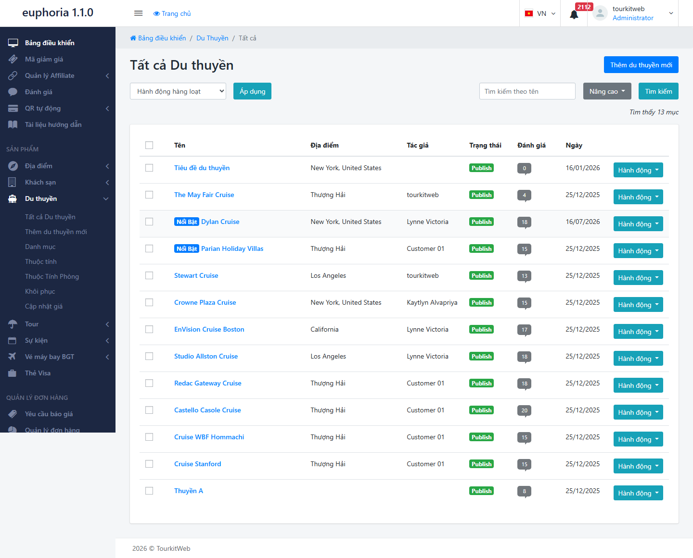

# 3.9. Du thuyền

> **Đường dẫn:** Menu bên trái > **Du thuyền**

> **Lưu ý:** Tính năng này có thể chưa được bật trên website của bạn. Nếu không thấy mục này trong menu, hãy liên hệ đơn vị triển khai.

## Trong mục này có gì?

Nhấn vào **Du thuyền** ở menu bên trái, danh sách sẽ xổ xuống 7 mục con:

* **Tất cả Du thuyền** — danh sách toàn bộ du thuyền bạn đã tạo. Vào đây để xem, sửa hoặc tạm ẩn một du thuyền.
* **Thêm du thuyền mới** — mở trang trống để khai báo một du thuyền mới từ đầu.
* **Danh mục** — các nhóm phân loại du thuyền, ví dụ: "Du thuyền 5 sao", "Vịnh Lan Hạ", "Nghỉ 2 ngày 1 đêm". Phân loại giúp khách lọc nhanh thay vì phải cuộn qua toàn bộ danh sách.
* **Thuộc tính tàu** — các tiêu chí lọc **cho cả con tàu**, ví dụ: "có bể bơi", "có phòng gym", "tàu vỏ kim loại".
* **Thuộc tính cabin** — các tiêu chí lọc **cho từng phòng trên tàu**, ví dụ: "có ban công", "hướng biển", "bồn tắm".
* **Khôi phục** — thùng rác: nơi chứa du thuyền đã xóa. Xóa nhầm vẫn lấy lại được ở đây.

> **Vì sao có tới hai loại "thuộc tính"?** Vì khách tìm du thuyền theo hai tầng suy nghĩ khác nhau. Đầu tiên họ chọn **con tàu** ("tôi muốn tàu có bể bơi") — đó là **Thuộc tính**. Sau đó, trên con tàu đã chọn, họ chọn **phòng** ("tôi muốn phòng có ban công") — đó là **Thuộc Tính Phòng**. Khai báo đúng chỗ thì bộ lọc trên website mới chạy đúng.

## Tất cả du thuyền

<figure><figcaption></figcaption></figure>

Vào **Du thuyền** > chọn **Tất cả du thuyền**.

Tại đây, bạn có thể thực hiện các thao tác như tìm kiếm, chỉnh sửa và quản lý các hạng mục thông tin (loại cabin, gói dịch vụ, bảng giá, lịch và giá theo ngày) của các phân loại du thuyền.

## Tạo một du thuyền mới

### Bước 1: Mở trang tạo mới

Vào **Du thuyền** > **Thêm du thuyền mới**.

<figure><figcaption></figcaption></figure>

## Danh mục du thuyền

Danh mục để nhóm tàu theo cách khách hay tìm: “Du thuyền 5 sao”, “Du thuyền vịnh Lan Hạ”, “Du thuyền tuần trăng mật”. Một tàu tick được nhiều danh mục. Danh mục có cấp cha – con.

Cốt lõi

* Gán tàu vào danh mục ở form tàu, không gán từ phía danh mục.
* Có cấp cha–con; xoá danh mục cha thì các con lên thành gốc, không bị xoá.

<figure><figcaption></figcaption></figure>

#### Thao tác

* Mở Du thuyền → Danh mục. Cần quyền `voyage_manage_others`.
* Tạo mới ở khung trên trang danh sách, hoặc bấm vào tên để sửa.
* Gán tàu vào danh mục ở form tàu → khối 🗂 Danh mục (không gán từ phía danh mục).

| Ô nhập          | Ý nghĩa                                                                                |
| --------------- | -------------------------------------------------------------------------------------- |
| Tên danh mục \* | Tên hiện ngoài web. Viết theo cách khách tìm, không viết theo cách nội bộ.             |
| Danh mục cha    | Để trống là danh mục gốc. Chọn cha để tạo cấp hai, ví dụ _Theo khu vực → Vịnh Lan Hạ_. |
| Mô tả           | Đoạn giới thiệu, dùng khi mở trang riêng của danh mục.                                 |
| Trạng thái      | Hiện / Ẩn. Danh mục Ẩn không còn xuất hiện trong danh sách chọn ở form tàu.            |

Khi xoá danh mục cha Các danh mục con không bị xoá — chúng được đưa lên thành danh mục gốc. Kiểm tra lại cây danh mục sau khi xoá.

### Tiện nghi — thuộc tính và nhãn

Hai khái niệm: nhóm thuộc tính (ví dụ “Phòng tắm”) và nhãn bên trong nhóm (“Bồn tắm gỗ”, “Phòng tắm đứng”). Bạn khai danh sách một lần, sau đó ở mỗi tàu hoặc mỗi cabin chỉ việc tick.

Cốt lõi

* Hai bộ tách biệt hoàn toàn: thuộc tính TÀU và thuộc tính CABIN.
* Khai danh sách một lần, sau đó ở mỗi tàu/cabin chỉ việc tick.
* Màn này lưu ngay khi bấm, không có nút Lưu chung.
* Xoá một nhãn là mất tick ở mọi tàu đang dùng nhãn đó.

| Màn hình         | Dùng cho                                                                              | Tick ở đâu                                   |
| ---------------- | ------------------------------------------------------------------------------------- | -------------------------------------------- |
| Thuộc tính tàu   | Tiện nghi của cả con tàu: hồ bơi, phòng gym, spa, nhà hàng, quầy bar, phòng hội nghị. | Form tàu → khối ✨ Tiện nghi & thuộc tính tàu |
| Thuộc tính cabin | Tiện nghi trong phòng và kiểu giường.                                                 | Form cabin → khối ✨ Tiện nghi & kiểu giường  |

Hai màn hình có giao diện giống nhau nhưng dữ liệu tách biệt hoàn toàn: nhóm khai ở màn tàu không hiện ở form cabin và ngược lại.

## Thuộc tính cabin

<figure><figcaption></figcaption></figure>

#### Thao tác

| Việc                      | Cách làm                                                                                                           |
| ------------------------- | ------------------------------------------------------------------------------------------------------------------ |
| Tạo nhóm mới              | Khung bên phải: gõ Tên nhóm, có thể dán luôn danh sách nhãn (mỗi dòng một nhãn), bấm Tạo nhóm.                     |
| Thêm nhãn vào nhóm có sẵn | Mở nhóm, gõ vào ô cuối rồi Enter. Dán nhiều dòng cùng lúc để thêm hàng loạt — dán thẳng từ Excel được.             |
| Thêm icon cho nhãn        | Gõ `Tên nhãn \| fa fa-wifi`. Lấy tên class ở fontawesome.com hoặc icofont.com. Icon hiện cạnh tiện nghi ngoài web. |
| Sửa nhãn                  | Bấm vào viên chip → khung sửa mở ra ngay dưới, có Tên nhãn, Icon và Ảnh (tuỳ chọn) → Lưu nhãn.                     |
| Đổi tên nhóm              | Bấm ✎ ở dòng tiêu đề nhóm.                                                                                         |
| Xoá nhãn / nhóm           | Nút Xoá nhãn trong khung sửa, hoặc 🗑 ở tiêu đề nhóm (xoá nhóm là xoá cả nhãn bên trong).                          |
| Tìm nhóm                  | Ô tìm ở góc trên phải, dùng khi danh sách dài.                                                                     |

Xoá nhãn là mất tick Xoá một nhãn sẽ làm nhãn đó biến khỏi mọi tàu / cabin đang tick nó. Nếu chỉ muốn ngừng dùng tạm, hãy bỏ tick ở từng tàu thay vì xoá nhãn.

#### Bộ thuộc tính cabin có sẵn

Hệ thống đã tạo trước năm nhóm dựa trên bảng loại phòng thật của du thuyền Hạ Long — dùng luôn hoặc sửa lại theo tàu của bạn:

| Nhóm                  | Nhãn có sẵn                                                                                                                                        |
| --------------------- | -------------------------------------------------------------------------------------------------------------------------------------------------- |
| Kiểu giường           | 2 giường đơn (Twin) · 1 giường đôi (Double) · King size · 3 giường đơn · Giường đôi + đơn (gia đình) · Giường sofa                                 |
| Không gian & view     | Ban công riêng · Cửa sổ kính trần · View biển toàn cảnh · Phòng khách riêng · Thông tầng (duplex) · Sân thượng riêng · Bàn ghế thư giãn ngoài trời |
| Phòng tắm             | Bồn tắm gỗ · Bồn sục (Jacuzzi) · Phòng tắm đứng · Toilet thông minh Nhật · Đồ dùng phòng tắm cao cấp · Máy sấy tóc                                 |
| Tiện nghi trong phòng | Minibar · Điều hoà · TV · Két an toàn · Ấm siêu tốc · Bàn trang điểm · Bàn uống trà · Tủ sách & ghế đọc sách · Áo choàng tắm & dép đi trong phòng  |
| Ưu đãi kèm phòng      | Hoa quả tươi · 01 chai rượu vang · Nước đóng chai miễn phí · Turndown service                                                                      |

Thuộc tính tàu thì chưa có gì sẵn — bạn tự khai. Gợi ý các nhóm hay dùng: _Tiện ích trên tàu_ (hồ bơi, jacuzzi, sun deck, phòng gym, spa, quầy bar), _Hoạt động_ (kayak, đạp xe, lớp nấu ăn, câu mực), _Dịch vụ_ (wifi, đón tiễn, hướng dẫn viên, nhà hàng), _Phù hợp với_ (gia đình, tuần trăng mật, nhóm bạn).

Tick tiện nghi thế nào cho nhanh Trên form tàu/cabin, mỗi nhóm có ô Tìm nhanh… và bộ đếm _đã chọn / tổng_. Gõ vài chữ để lọc, tick, và bấm Bỏ chọn nếu muốn xoá hết tick của nhóm đó.

Nhóm thuộc tính tàu nào có nhãn cũng đồng thời trở thành bộ lọc ở trang tìm kiếm ngoài web. Khách tick nhiều tiện nghi thì hệ thống chỉ trả về tàu có đủ tất cả tiện nghi đã tick.

### Cài đặt du thuyền

Những thiết lập áp cho toàn bộ du thuyền, ở Quản trị → Cài đặt → Cài đặt du thuyền. Cần quyền `voyage_update`. Trang chia thành tám khối theo thứ tự dưới đây.

Cốt lõi

* Đường vào: Hệ thống → Cài đặt → Cài đặt du thuyền (không nằm trong menu Du thuyền).
* Chế độ đặt mặc định toàn site đặt ở đây; từng tàu ghi đè được.
* Phí người mua, đặt cọc, đánh giá, thông tin khách, trường tìm kiếm — tất cả ở trang này.
* Đoạn URL `/voyage` đổi ở Cài đặt → SEO Settings; đặt trùng module khác là 404 không báo lỗi.

#### 1 · Trang danh sách du thuyền

| Thiết lập                                             | Tác dụng                                                                                                                       |
| ----------------------------------------------------- | ------------------------------------------------------------------------------------------------------------------------------ |
| Tiêu đề trangvoyage\_page\_search\_title              | Dòng chữ lớn trên banner trang danh sách. Nhập được theo từng ngôn ngữ. Ví dụ: _Du thuyền Hạ Long & vịnh biển_.                |
| Ảnh banner trang tìm kiếmvoyage\_page\_search\_banner | Ảnh nền phía sau tiêu đề. Bỏ trống thì hệ thống dùng tạm banner của module khác — nên đặt riêng.                               |
| Số mục trên mỗi trangvoyage\_page\_limit\_item        | Mặc định 12. Đặt 9 hoặc 12 cho bố cục lưới ba cột.                                                                             |
| Bố cục danh sách mặc địnhvoyage\_layout\_item\_search | Dạng lưới (thẻ, mặc định) hoặc Dạng danh sách (một tàu một hàng ngang, nhiều thông tin hơn). Khách vẫn tự đổi được trên trang. |

#### 2 · SEO trang danh sách

Tiêu đề SEO (thẻ title trên tab trình duyệt, bỏ trống thì lấy Tiêu đề trang), Mô tả SEO, và Ảnh chia sẻ khi dán link lên Facebook/Zalo. Hai ô chữ nhập được theo từng ngôn ngữ.

#### 3 · Chế độ đặt quan trọng

| Lựa chọn                             | Nghĩa                                                                                                                                                                               |
| ------------------------------------ | ----------------------------------------------------------------------------------------------------------------------------------------------------------------------------------- |
| Chỉ gửi yêu cầu báo giá _(mặc định)_ | Khách không thanh toán online. Mọi nút đặt trở thành form gửi yêu cầu, nhân viên nhận rồi báo giá lại. An toàn nhất khi giá còn thay đổi theo mùa.                                  |
| Cho mua thẳng + thanh toán           | Khách chọn cabin (ngủ đêm) hoặc số khách (tour ngày) rồi thanh toán online. Gói chưa có giá, giá 0, giá bị ẩn thành “Liên hệ”, và gói Thuê nguyên tàu vẫn tự chuyển về gửi yêu cầu. |

Từng con tàu có thể ghi đè thiết lập này ở form tàu → Chế độ đặt (chương 04).

#### 4 · Phí người mua

Các khoản cộng vào tổng đơn khi khách mua thẳng, áp cho mọi du thuyền. Mỗi dòng gồm:

| Ô                         | Ý nghĩa                                                                                                    |
| ------------------------- | ---------------------------------------------------------------------------------------------------------- |
| Tên · Mô tả               | Hiện trong bảng tách tiền ở bước thanh toán và trên hoá đơn. Nhập được theo từng ngôn ngữ khi site đa ngữ. |
| Giá                       | Con số của khoản phí.                                                                                      |
| Kiểu: Cố định / Phần trăm | Cố định = cộng thẳng số tiền. Phần trăm = tính theo phần trăm của tiền dịch vụ trước phí.                  |
| Tính theo khách           | Tick thì khoản phí được nhân với tổng số khách của đơn. Không tick thì thu một lần cho cả đơn.             |

#### 5 · Phí dịch vụ theo tàu

Một ô tick duy nhất: Cho phép thêm phí dịch vụ theo tàu. Bật thì mỗi form tàu xuất hiện khối 💰 Phí dịch vụ riêng tàu để khai phí riêng cho con tàu đó (ngoài phí người mua chung).

#### 6 · Đặt cọc

| Thiết lập          | Ý nghĩa                                                                                                                                                             |
| ------------------ | ------------------------------------------------------------------------------------------------------------------------------------------------------------------- |
| Bật đặt cọc        | Cho khách trả trước một phần, phần còn lại thu sau.                                                                                                                 |
| Số tiền cọc + kiểu | Số cụ thể (Cố định) hoặc theo Phần trăm giá trị đơn.                                                                                                                |
| Công thức cọc      | Mặc định — tính cọc trên tổng đơn (đã gồm phí). Tiền cọc + phí — tính cọc trên tiền dịch vụ rồi cộng đủ toàn bộ phí vào lần trả đầu, tức khách trả trước nhiều hơn. |

#### 7 · Đánh giá

| Thiết lập                  | Ý nghĩa                                                                                                                                            |
| -------------------------- | -------------------------------------------------------------------------------------------------------------------------------------------------- |
| Bật đánh giá cho du thuyền | Hiện khu đánh giá và form gửi đánh giá ở trang chi tiết.                                                                                           |
| Tự động duyệt đánh giá     | Bật thì đánh giá hiện ngay. Tắt thì phải vào Quản trị → Đánh giá duyệt tay — nên để tắt để chặn nội dung rác.                                      |
| Số đánh giá mỗi trang      | Mặc định 5.                                                                                                                                        |
| Tiêu chí chấm điểm         | Danh sách tiêu chí khách chấm sao riêng: _Dịch vụ_, _Vệ sinh_, _Ẩm thực_, _Phòng ốc_, _Đáng giá tiền_. Bỏ trống thì khách chỉ chấm một điểm chung. |

#### 8 · Thông tin khách & Trường tìm kiếm

* Bật form nhập thông tin từng khách — ở bước thanh toán, khách khai họ tên / giới tính / ngày sinh cho từng người. Cần cho tàu phải khai báo danh sách khách với cảng.
* Bắt buộc điền đủ họ tên khách trước khi thanh toán — chỉ bật khi thực sự cần, vì làm giảm tỷ lệ hoàn tất đơn.
* Trường tìm kiếm biểu mẫu — tuỳ biến các ô trên thanh tìm kiếm du thuyền. Mỗi dòng: Nhãn (đa ngôn ngữ), Loại trường, Độ rộng cột (12 là cả hàng, 6 là nửa hàng, 3 là một phần tư), Thứ tự. Bỏ trống hết thì dùng bố cục mặc định gồm từ khoá + khu vực.

| Loại trường            | Khách tìm được theo                                                                                      |
| ---------------------- | -------------------------------------------------------------------------------------------------------- |
| Tên / từ khoá          | Tên tàu (có gợi ý tự động khi khách gõ).                                                                 |
| Khu vực                | Địa điểm của tàu.                                                                                        |
| Tiện nghi (thuộc tính) | Một nhóm thuộc tính tàu — phải chọn thêm nhóm ở ô “Chọn thuộc tính” ngay dưới, nếu không ô này vô nghĩa. |
| Loại chương trình      | Ngủ đêm / Đi trong ngày / Thuê nguyên chiếc.                                                             |
| Loại phương tiện       | Du thuyền có cabin / Cano – tàu nhỏ.                                                                     |

#### Ngoài trang này: đường dẫn của module

Đoạn đứng đầu URL trang du thuyền nằm ở Cài đặt → SEO Settings → prefix\_url\_voyage, mặc định `voyage` (trang danh sách là `/voyage`, trang tàu là `/voyage/ten-tau`).

Đừng đặt trùng Không được đặt trùng đoạn đường dẫn với module khác (Du thuyền cũ – Cruise, Khách sạn, Tour, Thuyền…). Trùng thì trang du thuyền sẽ 404 mà không có thông báo lỗi nào. Sau khi đổi, nhớ xoá cache. Nếu bạn muốn dùng `du-thuyen`, phải chắc module Cruise không còn giữ đoạn đó.

## Xem thêm

* [3.2. Khách sạn](khach-san.md) — cách quản lý theo phòng rất giống, có hướng dẫn chi tiết hơn.
* [3.1. Địa điểm](dia-diem.md) — nơi khai báo các vịnh/khu vực trước khi gắn vào du thuyền.
* [3.8. Booking](booking.md) — nơi xem các đơn khách đã đặt du thuyền.
