# 3.2. Khách sạn

Mục Khách sạn là nơi quản lý toàn bộ hệ thống lưu trú mà doanh nghiệp cung cấp. Tại đây, bạn không chỉ đăng thông tin phòng mà còn có thể thiết lập các đặc tính riêng biệt để khách hàng dễ dàng lựa chọn theo nhu cầu.

## Các thành phần chính trong mục Khách sạn

Dựa trên menu điều hướng, tính năng này bao gồm các phần quan trọng sau:

- Tất cả khách sạn: Danh sách tổng hợp toàn bộ các khách sạn hiện có. Bạn có thể theo dõi nhanh tên, địa điểm (như Los Angeles, Thượng Hải), trạng thái hiển thị và điểm đánh giá của từng cơ sở.

- Thêm khách sạn mới: Giao diện để nhập liệu thông tin khách sạn mới, bao gồm tên, mô tả, hình ảnh và các chính sách đi kèm.

- Danh mục: Phân loại khách sạn theo các nhóm chủ đề (ví dụ: Khách sạn 5 sao, Resort nghỉ dưỡng, Homestay giá rẻ).

- Thuộc tính & Thuộc tính phòng: ◦ Thuộc tính phòng: Thiết lập chi tiết cho từng loại phòng (như: hướng biển, có bồn tắm, giường đôi). ◦ Thuộc tính: Thiết lập các tiện ích chung của khách sạn (như: có hồ bơi, bãi đỗ xe, phòng gym).

- Tính khả dụng: Kiểm tra và quản lý tình trạng còn phòng hoặc hết phòng theo thời gian thực để đảm bảo việc đặt chỗ chính xác.

- Khôi phục: Nơi lưu trữ các khách sạn đã xóa tạm thời, cho phép bạn phục hồi lại dữ liệu khi cần thiết.

## Tất cả khách sạn

## a, Tìm kiếm khách sạn

Công cụ này giúp bạn lọc nhanh một đối tượng cụ thể trong danh sách dài.

- Tìm kiếm cơ bản: Nhập tên (ví dụ: tên khách sạn, tiêu đề trang) vào ô Tìm kiếm theo tên và nhấn nút Tìm kiếm (hoặc nút Trang tìm kiếm).

- Tìm kiếm nâng cao: ◦ Nhấn nút Nâng cao để mở rộng các tiêu chí lọc. ◦ Lọc theo Nhà cung cấp (Vendor), Địa điểm cụ thể, hoặc theo trạng thái Nổi bật. ◦ Lọc theo Nguồn (Ví dụ: Tất cả nguồn, Địa phương) tại menu thả xuống bên cạnh nút tìm kiếm.

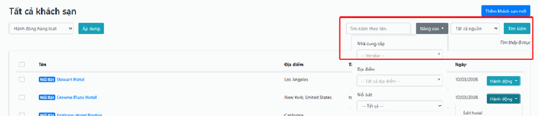

## b, Hành động hàng loạt

Sử dụng khi bạn cần xử lý cùng một lúc nhiều mục để tiết kiệm thời gian.

1. Chọn đối tượng: Đánh dấu tích vào các ô vuông ở cột đầu tiên bên trái các mục cần xử lý. Nếu muốn chọn tất cả các mục đang hiển thị, hãy tích vào ô vuông ở thanh tiêu đề trên cùng. 2. Chọn lệnh: Tại thực đơn thả xuống Hành động hàng loạt, bạn chọn thao tác mong muốn (thông thường là lệnh Xóa). 3. Thực thi: Nhấn nút Áp dụng ngay bên cạnh. Hệ thống sẽ thực hiện lệnh cho toàn bộ các mục bạn đã tích chọn.

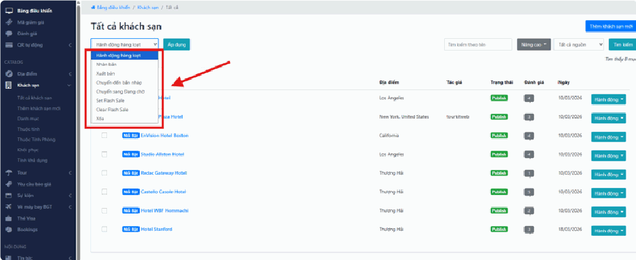

## c, Hành động (Thao tác lẻ)

## Hướng dẫn Chỉnh sửa khách sạn (Edit Hotel)

- **Bước 1:** Tại danh sách khách sạn, tìm khách sạn cần sửa, nhấn vào nút Hành động và chọn Edit hotel.

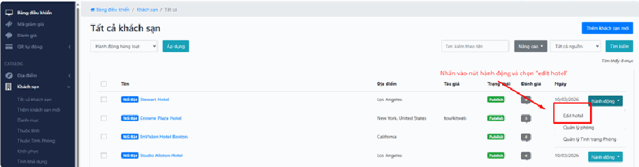

- **Bước 2:** Thực hiện thay đổi các thông tin tại giao diện hiện ra: ◦ Cập nhật tên khách sạn, nội dung mô tả và hạng sao. ◦ Chọn lại Địa điểm (quốc gia/thành phố) và định vị lại trên bản đồ nếu cần. ◦ Thay đổi Ảnh đại diện hoặc thêm ảnh vào Bộ sưu tập ảnh.

- **Bước 3:** Nhấn nút Lưu thay đổi để hoàn tất.

## d, Hướng dẫn Quản lý phòng

Giao diện này dùng để thiết lập chi tiết từng loại phòng có trong khách sạn:

- Thêm phòng mới: Nhập tên phòng, tải ảnh đại diện và bộ sưu tập ảnh riêng của phòng đó.

- Cấu hình giá và số lượng: Nhập giá cơ bản, số lượng phòng hiện có và số người tối đa (người lớn/trẻ em).

- Tiện ích phòng: Tích chọn các đặc tính cụ thể như: Hoàn hủy miễn phí, Bao gồm bữa sáng, Xác nhận ngay...

- Xác nhận: Nhấn nút Thêm phòng màu xanh lá để lưu thông tin.

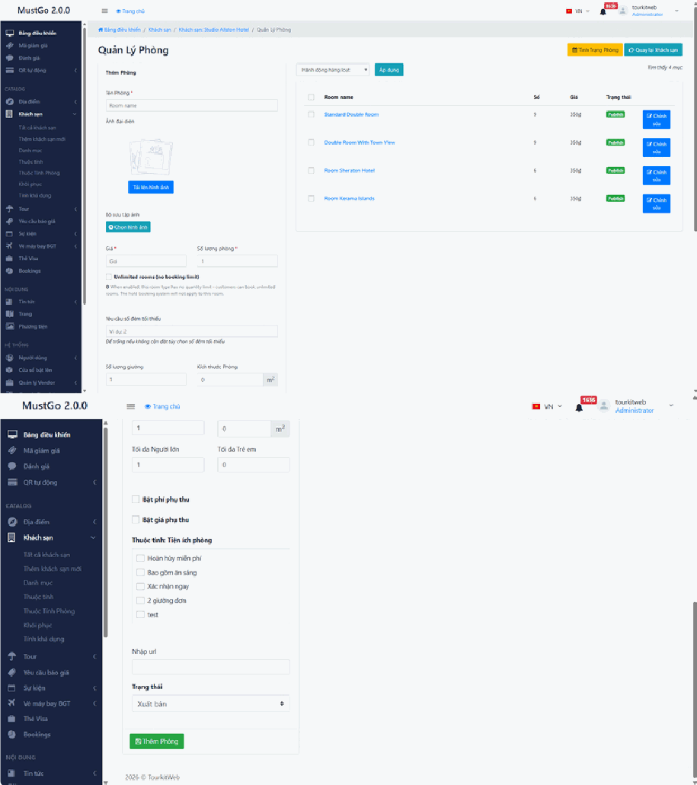

## e, Hướng dẫn Quản lý tình trạng phòng

Dùng để điều phối việc bán phòng thực tế theo thời gian:

- Lịch khả dụng: Theo dõi tình trạng trống phòng theo từng ngày trong tháng. Mỗi ô trên lịch hiển thị mức giá và số lượng phòng còn lại (Ví dụ: 350đ x 9 phòng).

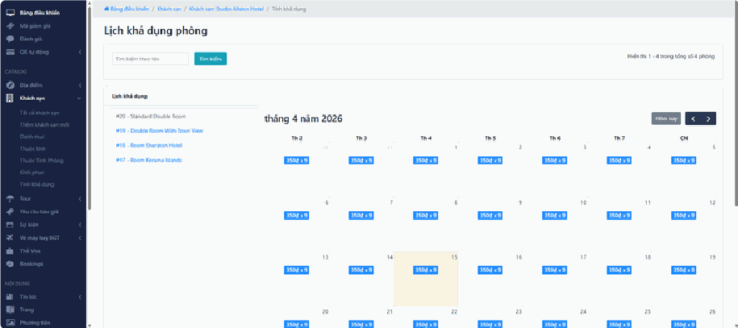

- Điều chỉnh nhanh: Bạn có thể nhấn trực tiếp vào các ngày trên lịch để: ◦ Thay đổi giá bán riêng cho ngày đó (ví dụ tăng giá ngày cuối tuần). ◦ Đóng/Mở phòng (khóa không cho khách đặt) nếu phòng đã được bán hết bên ngoài hoặc đang bảo trì.

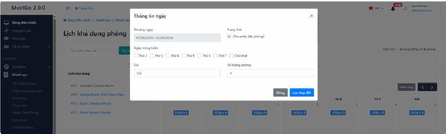

- Tìm kiếm: Sử dụng ô tìm kiếm để chuyển đổi nhanh giữa các loại phòng khác nhau trong cùng một khách sạn.

## Thêm khách sạn mới

## Quy trình Thêm khách sạn mới

*📺 Video hướng dẫn: TourkitWeb | Thêm mới KS, Danh mục, Thuộc tính*

- **Bước 1:** Truy cập vào menu Khách sạn > chọn Thêm khách sạn mới (hoặc nhấn nút xanh ở góc trên bên phải màn hình danh sách).

- **Bước 2:** Hoàn thiện các nội dung chính tại tab Nội dung: ◦ Nhập tên khách sạn, nội dung mô tả giới thiệu. ◦ Tải lên Ảnh đại diện và Bộ sưu tập ảnh (Gallery). ◦ Chọn hạng sao và các tiện ích (Wifi, hồ bơi, ăn sáng...).

- **Bước 3:** Thiết lập Vị trí: ◦ Chọn Quốc gia/Thành phố tại mục Địa điểm. ◦ Nhập địa chỉ chính xác và ghim tọa độ trên bản đồ.

- **Bước 4:** Thiết lập Giá & Chính sách: ◦ Nhập giá cơ bản, chính sách nhận/trả phòng và các quy định về trẻ em/hủy phòng.

- **Bước 5:** Nhấn Lưu thay đổi để hoàn tất tạo mới.

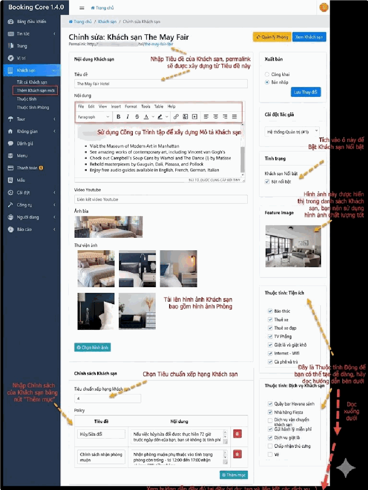

## Danh mục

*📺 Video hướng dẫn: TourkitWeb | Thêm mới KS, Danh mục, Thuộc tính*

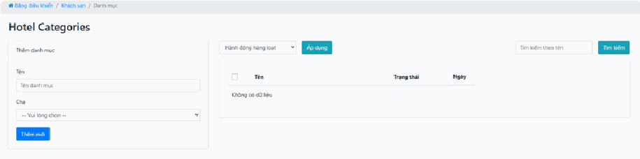

## a, Thêm danh mục mới

Thực hiện tại cột bên trái:

- Tên: Nhập tên loại hình khách sạn (ví dụ: Khách sạn cao cấp).

- Cha: Nếu là danh mục con, hãy chọn danh mục lớn hơn ở menu thả xuống. Nếu là danh mục chính, bạn có thể để trống.

- Xác nhận: Nhấn nút Thêm mới màu xanh để lưu.

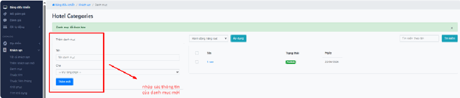

## b, Tìm kiếm và Quản lý

Thực hiện tại bảng bên phải:

- Tìm kiếm: Nhập tên danh mục vào ô Tìm kiếm theo tên và nhấn Tìm kiếm.

- Hành động hàng loạt: Tích chọn các danh mục cần xử lý > Chọn lệnh (Xóa) > Nhấn Áp dụng để thực hiện đồng loạt.

## Thuộc tính

*📺 Video hướng dẫn: TourkitWeb | Thêm mới KS, Danh mục, Thuộc tính*

## a, Thuộc tính khách sạn

Đây là nơi quản lý các nhóm thuộc tính lớn.

- Thêm thuộc tính: Bạn nhập tên nhóm (ví dụ: Tiện nghi, Dịch vụ khách sạn).

- Thứ tự vị trí: Số càng nhỏ thì nhóm này sẽ hiển thị lên đầu trong bộ lọc tìm kiếm.

- Quản lý điều khoản: Nút xanh này dùng để đi sâu vào thiết lập các mục nhỏ bên trong nhóm đó (ví dụ: trong nhóm "Tiện nghi" sẽ có "Wifi", "Điều hòa").

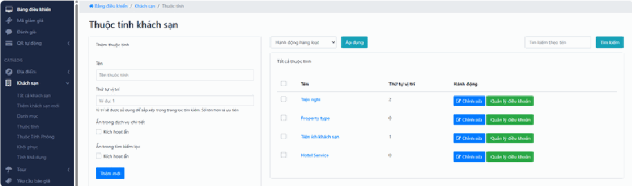

## b, Quản lý điều khoản - Ví dụ: Tiện nghi

Đây là nơi bạn thêm các dịch vụ cụ thể cho từng nhóm:

- Thêm thuật ngữ: Nhập tên tiện ích cụ thể (ví dụ: Đưa đón sân bay, Wifi miễn phí, Phòng Gym...).

- Biểu tượng: Bạn có thể nhập mã lớp biểu tượng (từ FontAwesome) hoặc tải lên hình ảnh minh họa để tiện ích hiển thị bắt mắt hơn trên website.

- SVG Code: Cho phép dán mã code hình ảnh định dạng vector để hiển thị sắc nét hơn.

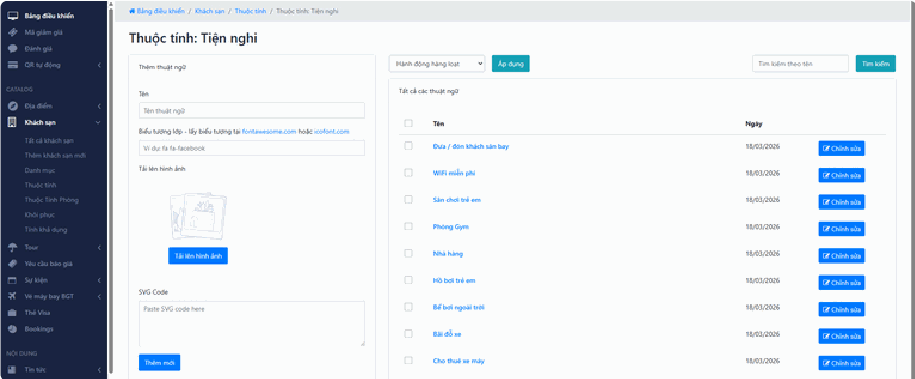

Ngoài ra có thể chỉnh sửa, tìm kiếm và hành động hàng loạt như các nghiệp vụ trước.

## Thuộc tính phòng

Tương tự như Thuộc tính

## Tính khả dụng

Tính năng Tính khả dụng cung cấp một bộ lịch trực quan giúp bạn kiểm soát toàn bộ trạng thái đóng/mở bán và biến động giá của từng loại phòng trong khách sạn theo từng ngày cụ thể.

## a, Theo dõi lịch phòng trực quan

- Lịch tháng: Hệ thống hiển thị dưới dạng lưới lịch (ví dụ: tháng 4 năm 2026). Mỗi ô ngày sẽ hiển thị thông tin quan trọng nhất: Giá bán x Số lượng phòng còn trống (Ví dụ: ). 11.800.000đ x 1

- Danh sách loại phòng: Cột bên trái liệt kê tất cả các hạng phòng bạn đang quản lý (Premium Duplex Villa, Executive Villa, Premier Valley View...). Bạn có thể nhấn vào từng loại để xem lịch riêng của phòng đó.

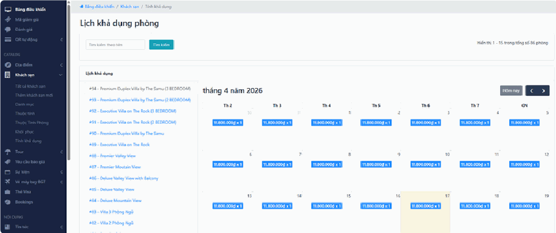

## b, Quản lý giá và trạng thái bán

Bằng cách nhấn trực tiếp vào các ô ngày trên lịch, bạn có thể thực hiện nhanh:

- Điều chỉnh giá theo ngày: Tăng giá vào ngày lễ, cuối tuần hoặc giảm giá sâu vào mùa thấp điểm mà không cần sửa giá gốc của phòng.

- Đóng/Mở bán: Khóa phòng thủ công khi có đoàn đặt riêng bên ngoài hoặc phòng đang bảo trì để tránh tình trạng khách đặt trùng (overbooking) trên website.

- Cập nhật số lượng: Thay đổi số phòng khả dụng để hệ thống tự động đồng bộ theo thực tế kinh doanh.

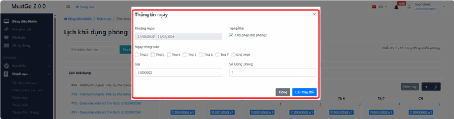

## c, Công cụ tìm kiếm nhanh

- Sử dụng ô Tìm kiếm theo tên ở phía trên lịch để lọc nhanh loại phòng cần xử lý trong trường hợp khách sạn có quá nhiều hạng phòng khác nhau.

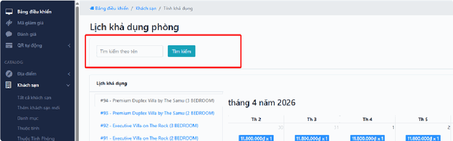
