# 3.2. Khách sạn

Mục **Khách sạn** là nơi quản lý toàn bộ các cơ sở lưu trú mà bạn bán trên website: khách sạn, resort, homestay, villa. Ở đây bạn khai báo thông tin khách sạn, tạo các loại phòng bên trong nó, rồi định giá và mở bán theo từng ngày.

Bạn hãy nhớ cấu trúc hai tầng này, vì hiểu được nó là hiểu hết mục Khách sạn:

* **Khách sạn** là cái nhà — có tên, ảnh, địa chỉ, hạng sao, hồ bơi, bãi đỗ xe.
* **Phòng** nằm bên trong cái nhà đó — mỗi loại phòng có giá riêng, số lượng riêng, sức chứa riêng.

Khách hàng đặt **phòng**, không đặt cả khách sạn. Vì vậy nếu bạn tạo khách sạn xong mà chưa tạo phòng nào bên trong, khách sẽ nhìn thấy khách sạn nhưng không đặt được gì cả.

> **Đường dẫn:** Menu bên trái > **Khách sạn** (biểu tượng tòa nhà)

## Trong mục này có gì?

Khi nhấn vào **Khách sạn** ở menu bên trái, bạn sẽ thấy các mục con sau:

* **Tất cả khách sạn** — danh sách toàn bộ khách sạn hiện có. Nhìn nhanh được tên, địa điểm, trạng thái hiển thị và điểm đánh giá.
* **Thêm khách sạn mới** — màn hình nhập một khách sạn mới từ đầu.
* **Danh mục** — nhóm phân loại khách sạn để khách dễ tìm (ví dụ: Khách sạn 5 sao, Resort nghỉ dưỡng, Homestay giá rẻ).
* **Thuộc tính** — các tiện ích chung của cả khách sạn (ví dụ: có hồ bơi, bãi đỗ xe, phòng gym).
* **Thuộc Tính Phòng** — các đặc điểm của riêng từng phòng (ví dụ: hướng biển, có bồn tắm, giường đôi).
* **Cập nhật giá** — lịch mở bán: ngày nào còn phòng, giá bao nhiêu.
* **Khôi phục** — thùng rác: nơi chứa những khách sạn đã xóa, vẫn lấy lại được.

> **Lưu ý:** Menu hiển thị theo phân quyền. Nếu bạn không thấy một mục nào đó (ví dụ **Thuộc tính**), tài khoản của bạn chưa được cấp quyền cho phần đó — hãy liên hệ quản trị viên.

> **Phân biệt "Thuộc tính" và "Thuộc Tính Phòng":** cả hai đều là các tiêu chí để khách lọc tìm, nhưng ở hai cấp khác nhau. "Hồ bơi" là của cả khách sạn → thuộc tính khách sạn. "Có ban công nhìn ra biển" là của riêng một loại phòng → thuộc tính phòng. Đặt nhầm chỗ không gây lỗi, chỉ khiến bộ lọc trên website hiển thị không đúng ý bạn.

## Tất cả khách sạn

## a, Tìm kiếm khách sạn

Khi danh sách đã dài, đây là cách nhanh nhất để tìm đúng khách sạn cần sửa.

### Tìm kiếm cơ bản

1. Gõ tên khách sạn vào ô **"Tìm kiếm theo tên"**.
2. Nhấn nút **"Tìm kiếm"**.

> **Nếu tìm không ra:** kiểm tra ô tìm kiếm có bị dính dấu cách thừa không (rất hay xảy ra khi copy-paste). Hoặc thử gõ ngắn hơn — chỉ một hai chữ đầu của tên — thay vì gõ đủ cả tên dài.

### Tìm kiếm nâng cao

Nhấn nút **"Nâng cao"** để mở thêm các tiêu chí lọc:

* Lọc theo **Nhà cung cấp** (đối tác bán dịch vụ trên website của bạn).
* Lọc theo **Địa điểm** cụ thể.
* Lọc theo trạng thái **Nổi bật**.
* Lọc theo **Nguồn** (ví dụ: Tất cả nguồn, Địa phương) tại menu thả xuống bên cạnh nút tìm kiếm.

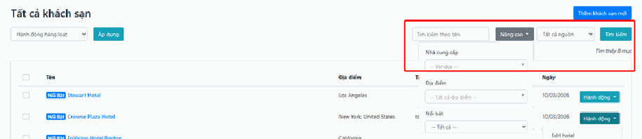

## b, Hành động hàng loạt

Dùng khi bạn cần xử lý nhiều khách sạn cùng lúc thay vì sửa từng cái một.

### Bước 1: Chọn đối tượng

Tích vào các **ô vuông nhỏ ở cột đầu tiên** bên trái của những khách sạn cần xử lý. Muốn chọn tất cả các mục đang hiển thị trên trang, hãy tích vào ô vuông nằm trên thanh tiêu đề bảng.

### Bước 2: Chọn lệnh

Mở thực đơn thả xuống **"Hành động hàng loạt"** và chọn thao tác mong muốn (thông thường là **"Xóa"**).

### Bước 3: Thực thi

Nhấn nút **"Áp dụng"** ngay bên cạnh.

> **Rất hay quên bước này:** chọn lệnh xong mà không nhấn **"Áp dụng"** thì hệ thống không làm gì hết. Nếu bạn thấy "chọn Xóa rồi mà không thấy gì xảy ra", nguyên nhân gần như chắc chắn là đây.

> **Đừng quá lo khi lỡ xóa nhầm:** khách sạn bị xóa không biến mất vĩnh viễn ngay. Nó nằm trong mục **"Khôi phục"** (thùng rác) và bạn lấy lại được.

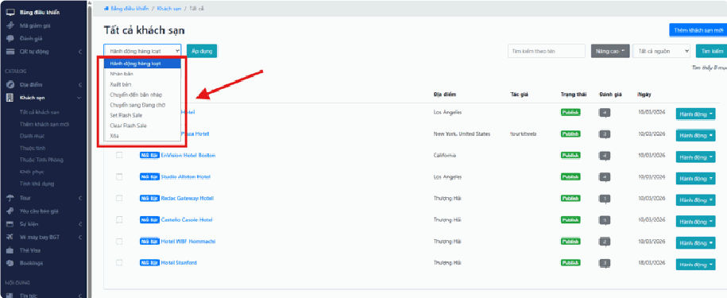

## c, Hành động (Thao tác lẻ)

### Hướng dẫn Chỉnh sửa khách sạn

**Bước 1:** Trong danh sách, tìm đến khách sạn cần sửa, nhấn nút **"Hành động"** ở dòng đó và chọn **"Edit hotel"** (Sửa khách sạn).

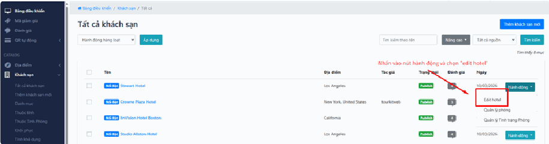

**Bước 2:** Màn hình chỉnh sửa hiện ra, chia thành **6 tab ở cột hẹp bên trái** (Chung, Địa điểm, Giá cả, Danh mục, Trạng thái, SEO). Bấm vào tab chứa thứ bạn cần sửa:

* Tên, mô tả, ảnh bìa, bộ sưu tập ảnh, hạng sao → tab **Chung**.
* Địa điểm, địa chỉ, tọa độ bản đồ → tab **Địa điểm**.
* Ảnh đại diện, tiện ích, bật/tắt hiển thị → tab **Trạng thái**.

Bảng đầy đủ tab nào chứa gì xem ở phần [Thêm khách sạn mới](#them-khach-san-moi) bên dưới.

**Bước 3:** Nhấn nút **"Lưu thay đổi"** ở **chân màn hình**. Một lần bấm lưu **tất cả các tab** — không cần lưu từng tab.

> **Lưu ý:** Sửa xong nhớ mở tab **Trạng thái** kiểm tra khung **"Xuất bản"**. Nếu đang chọn **"Bản nháp"**, khách vào website sẽ không nhìn thấy khách sạn này.

## d, Hướng dẫn Quản lý phòng

Đây là bước quan trọng nhất — nơi bạn tạo các loại phòng bên trong khách sạn. Không có phòng thì khách không đặt được.

Trong màn hình chỉnh sửa khách sạn, bạn tìm nút màu vàng **"Quản lý phòng"** ở **góc trên bên phải** — bấm vào sẽ mở danh sách phòng trong **tab trình duyệt mới**. Nút này **chỉ hiện sau khi khách sạn đã được lưu ít nhất một lần**. Tại đây bạn khai báo từng loại phòng:

* **Thêm phòng mới:** nhập tên phòng (ví dụ: Deluxe hướng biển), tải lên ảnh đại diện và bộ sưu tập ảnh riêng của loại phòng đó.
*   **Cấu hình giá và số lượng:** nhập giá cơ bản, số lượng phòng bạn có ở loại này, và số người tối đa mỗi phòng chứa được (người lớn/trẻ em).

    > **Số lượng phòng là con số bạn dễ nhập sai nhất.** Nếu bạn có 10 phòng Deluxe mà chỉ nhập 1, website sẽ chỉ cho đúng một khách đặt rồi báo hết phòng cho tất cả những người sau.
* **Tiện ích phòng:** tích chọn các đặc tính cụ thể như Hoàn hủy miễn phí, Bao gồm bữa sáng, Xác nhận ngay…
* **Xác nhận:** nhấn nút **"Thêm phòng"** màu xanh lá để lưu.

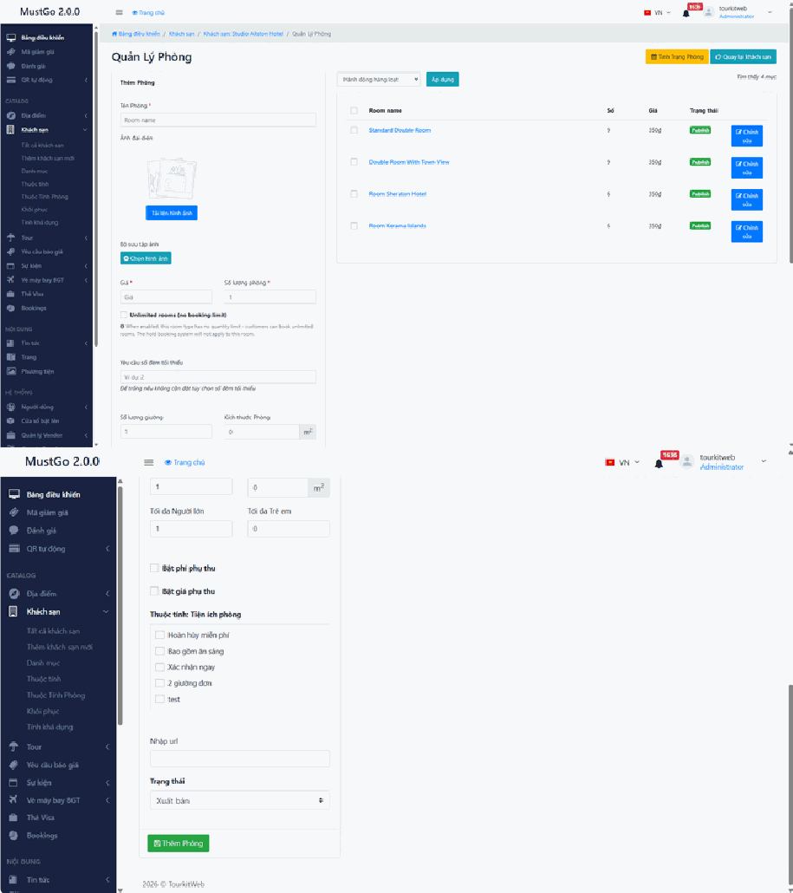

## e, Hướng dẫn Quản lý tình trạng phòng

Sau khi đã có phòng, đây là nơi bạn điều phối việc bán phòng theo từng ngày thực tế.

**Lịch khả dụng:** hệ thống hiện một bảng lịch theo tháng. Mỗi ô là một ngày, hiển thị mức giá và số phòng còn lại của ngày đó (ví dụ: `350đ x 9 phòng` nghĩa là ngày đó giá 350đ và còn 9 phòng trống).

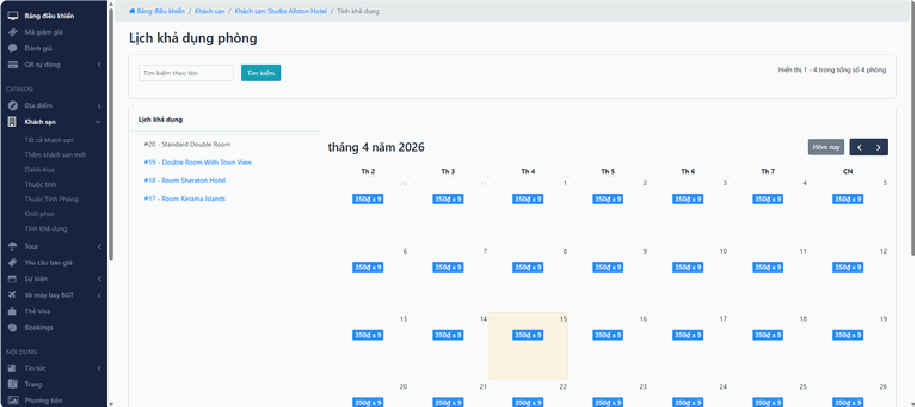

**Điều chỉnh nhanh:** nhấn trực tiếp vào một ngày trên lịch, một khung nhỏ sẽ mở ra cho bạn:

* Thay đổi giá bán riêng cho ngày đó — ví dụ tăng giá cuối tuần, lễ Tết.
* Đóng hoặc mở bán phòng cho ngày đó — dùng khi phòng đã bán hết qua kênh khác, hoặc đang bảo trì.

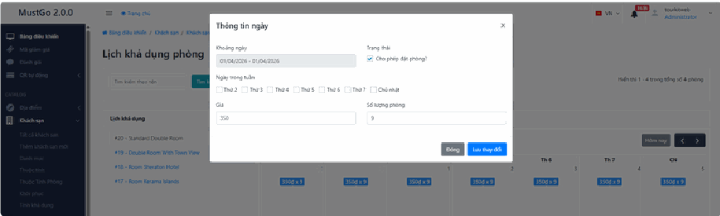

**Tìm kiếm:** dùng ô tìm kiếm phía trên để chuyển nhanh giữa các loại phòng khác nhau trong cùng một khách sạn.

## Thêm khách sạn mới



Màn hình thêm khách sạn chia thành **6 tab** nằm ở **cột hẹp bên trái**, dưới tiêu đề **"Thông tin khách sạn"** — giống hệt màn hình tour. Bấm tab nào thì nội dung tab đó hiện ra ở khoảng rộng bên phải. Nút **"Lưu thay đổi"** nằm ở **chân màn hình** và lưu **tất cả các tab cùng lúc** — bạn cứ điền lần lượt từng tab rồi bấm lưu một lần.

| Tab            | Trong tab có gì                                                                                                                                             |
| -------------- | ----------------------------------------------------------------------------------------------------------------------------------------------------------- |
| **Chung**      | Tên, mô tả, video, ảnh bìa, bộ sưu tập ảnh, thông tin nổi bật, chính sách khách sạn (hạng sao, điện thoại, email), **liên hệ của khách sạn**, câu hỏi chính sách, khách sạn tương tự, khu vực xung quanh |
| **Địa điểm**   | Địa điểm, địa chỉ thực tế, tọa độ bản đồ                                                                                                                    |
| **Giá cả**     | Giờ nhận/trả phòng, đặt trước tối thiểu, số đêm tối thiểu, giá, giá khuyến mãi, flash sale, phụ thu, phí dịch vụ, chính sách trẻ em                         |
| **Danh mục**   | Tích chọn nhóm phân loại khách sạn                                                                                                                          |
| **Trạng thái** | Xuất bản / Bản nháp, tác giả, nổi bật, tiện ích (thuộc tính), **ảnh đại diện**                                                                               |
| **SEO**        | Khung SEO — khách sạn hiện ra thế nào trên Google                                                                                                           |

> **Khác tour ở chỗ:** khách sạn không có tab nào bị khoá. Bạn điền tab nào trước cũng được. Riêng nút **"Quản lý phòng"** (tạo phòng) chỉ hiện sau lần lưu đầu tiên.

> 📷 *[Cần chụp màn hình: màn sửa khách sạn — cột tab bên trái (Chung, Địa điểm, Giá cả, Danh mục, Trạng thái, SEO) và nút "Lưu thay đổi" ở chân]*

### Bước 1: Mở màn hình thêm mới

Vào menu **Khách sạn** > chọn **"Thêm khách sạn mới"**. Hoặc từ màn hình danh sách, nhấn nút màu xanh ở **góc trên bên phải**.

### Bước 2: Tab "Chung" — nội dung chính

* **Tiêu đề** — tên khách sạn. **Bắt buộc.** Đường dẫn của khách sạn được tạo từ tên này ở lần lưu đầu, nên hãy gõ đúng tên trước khi lưu.
* **Nội dung** — bài giới thiệu khách sạn.
* **Video Youtube** — dán link video nếu có, không bắt buộc.
* **Ảnh bìa** — ảnh lớn ở đầu trang chi tiết (tuỳ giao diện có dùng hay không).
* **Bộ sưu tập ảnh** — các ảnh để khách xem chi tiết: sảnh, phòng, hồ bơi, nhà hàng.
* **Thông tin nổi bật** — vài dòng điểm mạnh (ví dụ "Cách biển 50 m", "Hồ bơi vô cực"). Bấm **"Thêm mục"** để thêm dòng.
* Khung **"Chính sách khách sạn"**:
  * **Xếp hạng sao** — gõ số, ví dụ `5`.
  * **Số điện thoại** và **Hotel Email** — tự lấy từ dòng đầu của danh sách **"Liên hệ của khách sạn"** ngay bên dưới, bạn không cần gõ.
* **Liên hệ của khách sạn** — số điện thoại, email của lễ tân, kế toán, chủ nhà… Danh sách này **chỉ dùng nội bộ** để gửi thông báo, **không hiện cho khách** trên website. Ở mỗi dòng, tích ô **"Nhận thông báo"** để chọn người đó nhận loại thông báo nào; phải nhập email thì mới tích được.
* **Chính sách** — các câu hỏi – đáp về quy định (giờ yên tĩnh, thú cưng, hút thuốc…).
* **Khách sạn tương tự** — chọn vài khách sạn để gợi ý ở cuối trang chi tiết. Để trống thì hệ thống tự gợi ý khách sạn cùng địa điểm.
* **Khu vực xung quanh** — các điểm gần đó kèm khoảng cách (bãi biển 200 m, sân bay 5 km).

> **Về ảnh:** ảnh chụp từ điện thoại đời mới thường nặng 5–10 MB, mà hệ thống **không tự thu nhỏ ảnh** — khách vào web phải tải đúng ngần ấy, trang sẽ rất chậm. Ảnh đại diện nên là **1200 × 800 px, dưới 300 KB**; ảnh trong bộ sưu tập **1920 × 1280 px, dưới 500 KB**. Cách đổi cỡ và nén ảnh xem [Kích thước ảnh chuẩn](../kich-thuoc-anh.md). Nếu bấm tải ảnh mà quay mãi không xong, gần như chắc chắn là do ảnh quá nặng.

### Bước 3: Tab "Địa điểm" — vị trí

* **Địa điểm** — bấm vào ô, **gõ vài chữ để tìm** (ví dụ `hoi an`) rồi chọn. Mỗi khách sạn chỉ chọn **một** địa điểm.
* **Địa chỉ thực tế** — số nhà, tên đường. Gõ để tìm địa chỉ đã lưu, hoặc gõ mới.
* **Tọa độ địa lý** — **Vĩ độ (Latitude)**, **Kinh độ (Longitude)**, **Mức zoom**. Không bắt buộc; có thì trang chi tiết hiện bản đồ đúng chỗ. Cách lấy: mở Google Maps, nhấp chuột phải vào đúng khách sạn — dòng số đầu tiên hiện ra là `vĩ độ, kinh độ`.

> **Chọn địa điểm càng cụ thể càng tốt.** Khách sạn ở Hội An thì chọn **Hội An**, đừng chọn **Việt Nam**. Khách sạn sẽ tự hiện cả ở trang khách sạn Hội An lẫn trang của các địa điểm cha (Đà Nẵng, Việt Nam) — chọn chung chung thì nó chỉ hiện ở trang lớn, mất cơ hội lên trang _"khách sạn Hội An"_. Xem phần [Trang khách sạn theo địa điểm](#trang-khach-san-theo-dia-diem) bên dưới.

> **Nếu không tìm thấy thành phố bạn cần trong danh sách:** nghĩa là địa điểm đó chưa được tạo. Hãy sang bài [3.1. Địa điểm](dia-diem.md) tạo nó trước, rồi quay lại đây.

### Bước 4: Tab "Giá cả" — giờ giấc, giá & chính sách trẻ em

* **Thời gian nhận/trả phòng** — **Giờ nhận phòng**, **Giờ trả phòng** (ví dụ `14:00`, `12:00`).
* **Đặt trước tối thiểu** — khách phải đặt trước ít nhất bao nhiêu ngày. Để trống nếu không cần.
* **Yêu cầu số đêm tối thiểu** — ví dụ `2` là không nhận đặt 1 đêm. Để trống nếu không cần.
* **Giá khách sạn** và **Giá khuyến mãi** — mức giá **hiển thị** ở danh sách ("từ … đ") và dùng để tính phần trăm giảm. **Tiền khách thực trả tính theo giá của từng phòng theo ngày** (xem [Quản lý phòng](#d-huong-dan-quan-ly-phong) và [Cập nhật giá](#cap-nhat-gia)), nên hãy để giá ở đây gần bằng giá phòng rẻ nhất.
* **Flash Sale** — khoảng thời gian bắt đầu/kết thúc giảm giá chớp nhoáng.
* **Giá phụ thu** (tích **"Bật giá phụ thu"**) và **Phí dịch vụ** (tích **"Bật phí dịch vụ"**) — các khoản cộng thêm vào đơn, tính một lần, theo ngày hoặc theo người.
* **Chính sách cho trẻ em** — bảng độ tuổi: trẻ dưới bao nhiêu tuổi miễn phí, từ bao nhiêu tuổi tính phí bao nhiêu.

> **Tab Giá cả của bạn ít ô hơn mô tả ở trên?** Một số website được đơn vị triển khai rút gọn tab này (chỉ còn giờ nhận/trả phòng và số đêm tối thiểu) vì toàn bộ giá nằm ở từng phòng. Đó là cấu hình có chủ ý, không phải lỗi.

### Bước 5: Tab "Danh mục" và tab "Trạng thái"

* Tab **Danh mục** — tích các nhóm phù hợp (ví dụ _Resort nghỉ dưỡng_, _Khách sạn 5 sao_).
* Tab **Trạng thái**:
  * **Xuất bản** / **Bản nháp** — khách chỉ thấy khách sạn khi chọn **Xuất bản**.
  * **Cài đặt tác giả** — người phụ trách khách sạn này.
  * **Khách sạn nổi bật** (tích **"Bật nổi bật"**) — được ưu tiên ở các khối "nổi bật" trên trang chủ.
  * **Tiện ích** (các nhóm thuộc tính: Wifi, hồ bơi, bãi đỗ xe…) — tích những gì khách sạn có. Đây là thứ khách dùng để lọc tìm.
  * **Ảnh đại diện** — ảnh khách nhìn thấy đầu tiên trong danh sách. **1200 × 800 px**, chủ thể ở giữa.
  * Khung **"Mã liên kết"** (Mã Hotelia, Trip Hotel ID) — dành cho kết nối hệ thống, **để trống** nếu đơn vị triển khai không dặn.

### Bước 6: Tab "SEO"

Điền **Tiêu đề SEO** và **Mô tả** để khách sạn hiện ra hấp dẫn trên Google. Cách điền giống hệt bài viết — xem [Đăng bài chuẩn SEO](../khoi-noi-dung/tin-tuc.md#dang-bai-chuan-seo), Bước 6.

### Bước 7: Lưu, rồi tạo phòng

1. Nhấn **"Lưu thay đổi"** ở **chân màn hình**.
2. Sau khi lưu, nút vàng **"Quản lý phòng"** hiện ra ở góc trên bên phải — bấm vào để tạo các loại phòng (xem [Hướng dẫn Quản lý phòng](#d-huong-dan-quan-ly-phong)). **Chưa có phòng thì khách không đặt được.**

> **Quan trọng — bước ai cũng quên:** mở tab **Trạng thái** nhìn khung **"Xuất bản"**. Nếu đang chọn **"Bản nháp"** thì khách hàng KHÔNG nhìn thấy khách sạn này trên website, dù bạn đã nhập đầy đủ và bấm lưu. Muốn khách xem được, phải chọn **"Xuất bản"** rồi lưu.

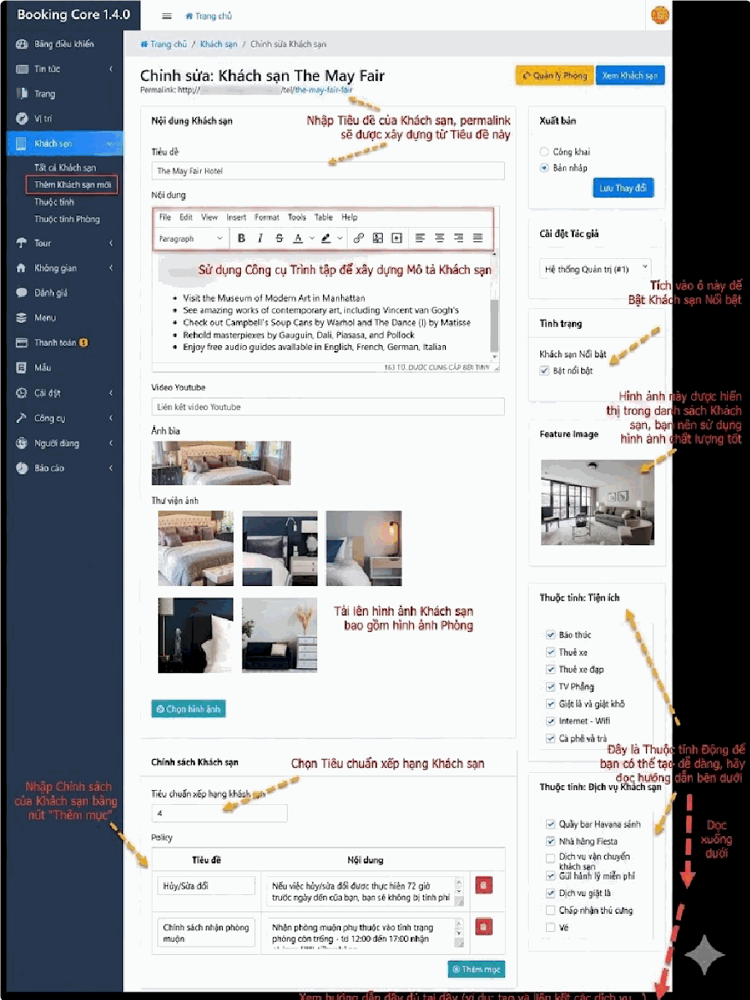

## Trang khách sạn theo địa điểm

Mỗi địa điểm có sẵn một trang liệt kê **toàn bộ khách sạn ở nơi đó**, địa chỉ dạng:

`tenmien.com/khach-san/da-nang` · `tenmien.com/khach-san/phu-quoc` · `tenmien.com/khach-san/ha-noi`

**Trang này làm ra để giúp SEO.** Khi khách gõ _"khách sạn Đà Nẵng"_ lên Google, Google thích đưa lên một trang có đúng chữ đó trong đường dẫn, trong tiêu đề, và đúng là một danh sách khách sạn Đà Nẵng. Trang `/khach-san/da-nang` đáp ứng đủ cả ba — nó là "cửa đón" khách tìm phòng theo thành phố, thay cho trang tìm kiếm có địa chỉ dài ngoằng `?location_id=39` mà Google không đánh giá cao.

Trang có sẵn: tiêu đề _"Khách sạn Đà Nẵng"_, số lượng khách sạn, ô **sắp xếp** theo giá thấp → cao, giá cao → thấp, đánh giá cao nhất, **12 khách sạn mỗi trang** có chia trang. Tiêu đề và mô tả trên Google **hệ thống tự viết** (ví dụ _"Danh sách 128 khách sạn tại Đà Nẵng: xem ảnh, giá phòng, đánh giá và đặt phòng trực tuyến."_), bạn không phải điền gì.

### Việc của bạn để trang này mạnh lên

1. **Mỗi khách sạn chọn đúng ô Địa điểm** (Bước 3 ở trên). Chưa chọn thì khách sạn không có mặt ở trang nào.
2. **Khách sạn để "Publish"** — bản nháp không được liệt kê.
3. **Ảnh đại diện đúng cỡ** (1200 × 800 px, chủ thể ở giữa): trang này là một lưới thẻ khách sạn, ảnh lệch cỡ trông rất lộn xộn. Xem [Kích thước ảnh chuẩn](../kich-thuoc-anh.md).
4. **Đưa trang lên menu**: thêm địa điểm vào menu, ở ô **"Khi bấm, mở trang"** chọn **"Khách sạn tại địa điểm"**. Xem [4.6. Menu](../khoi-he-thong/menu.md#muc-menu-la-dia-diem-khi-bam-mo-trang-nao). Link trên menu xuất hiện ở mọi trang của website — đó là tín hiệu mạnh nhất để Google biết trang này quan trọng.
5. **Gắn link trong bài viết**: bài _"Kinh nghiệm du lịch Đà Nẵng"_ nên có một câu dẫn tới `/khach-san/da-nang` (cách chèn link xem [Đăng bài chuẩn SEO](../khoi-noi-dung/tin-tuc.md#dang-bai-chuan-seo), Bước 4).

> **Đừng đặt đường dẫn khách sạn trùng đường dẫn địa điểm.** Nếu có một khách sạn mang đường dẫn `da-nang`, thì `/khach-san/da-nang` sẽ mở **khách sạn đó** chứ không phải danh sách — kể cả khi khách sạn đó đang ở bản nháp. Hệ thống sẽ tự chuyển menu sang trang tìm kiếm cho khỏi lỗi, nhưng trang SEO coi như mất. Đường dẫn khách sạn nên là tên riêng của nó, ví dụ `muong-thanh-luxury-da-nang`.

> 📷 *[Cần chụp màn hình: trang /khach-san/da-nang ngoài website — tiêu đề "Khách sạn Đà Nẵng", dòng số lượng, ô sắp xếp và lưới thẻ khách sạn]*

## Danh mục

Danh mục giúp khách hàng lọc nhanh. Nếu không phân loại, khách phải cuộn qua hàng trăm khách sạn để tìm thứ mình muốn. Có danh mục, khách bấm "Resort nghỉ dưỡng" là ra ngay.



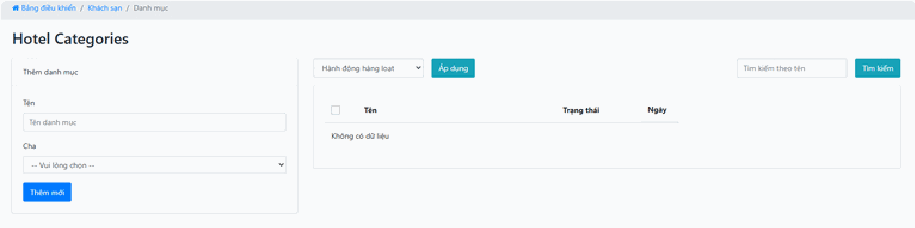

## a, Thêm danh mục mới

Bạn làm ở **cột bên trái**:

* **Ô "Tên"** — nhập tên loại hình khách sạn. Ví dụ: `Khách sạn cao cấp`, `Homestay`, `Resort ven biển`.
* **Ô "Cha"** — nếu đây là danh mục con nằm trong một nhóm lớn hơn, hãy chọn nhóm lớn đó. Nếu đây là danh mục chính, **để trống**.
* Nhấn nút **"Thêm mới"** màu xanh để lưu.

> **Mẹo:** Đừng tạo quá nhiều danh mục. Khoảng 5–8 danh mục là vừa đủ để khách dễ chọn. Hai ba chục danh mục sẽ khiến khách rối và bỏ đi.

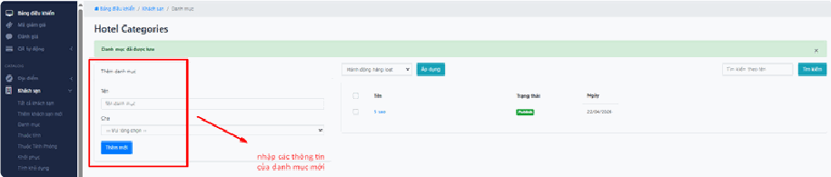

## b, Tìm kiếm và Quản lý

Bạn làm ở bảng bên phải:

* **Tìm kiếm:** gõ tên danh mục vào ô **"Tìm kiếm theo tên"** rồi nhấn **"Tìm kiếm"**.
* **Hành động hàng loạt:** tích chọn các danh mục cần xử lý → chọn lệnh (**"Xóa"**) → nhấn **"Áp dụng"**.

## Thuộc tính

**Thuộc tính** là các tiêu chí để khách lọc tìm. Chúng được tổ chức theo hai tầng, bạn hiểu được hai tầng này là làm được ngay:

* **Nhóm thuộc tính** — cái tiêu đề lớn, ví dụ "Tiện nghi".
* **Điều khoản bên trong nhóm** — các lựa chọn cụ thể, ví dụ trong "Tiện nghi" có "Wifi", "Điều hòa", "Hồ bơi".

Trên website, khách sẽ thấy đúng hai tầng này: tiêu đề "Tiện nghi", bên dưới là các ô tích Wifi, Điều hòa, Hồ bơi.



## a, Thuộc tính khách sạn

Đây là nơi quản lý các **nhóm** thuộc tính lớn.

* **Thêm thuộc tính:** nhập tên nhóm. Ví dụ: `Tiện nghi`, `Dịch vụ khách sạn`.
* **Thứ tự vị trí:** một con số. Số càng nhỏ thì nhóm này càng hiển thị lên đầu trong bộ lọc trên website. Ví dụ nhóm quan trọng nhất bạn để số 1.
* **Nút "Quản lý điều khoản"** (màu xanh): nhấn vào đây để đi vào bên trong nhóm và thêm các lựa chọn cụ thể.

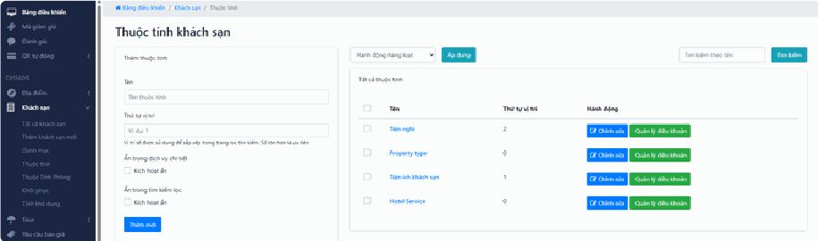

## b, Quản lý điều khoản — Ví dụ: nhóm "Tiện nghi"

Sau khi nhấn **"Quản lý điều khoản"**, bạn vào màn hình thêm các mục cụ thể cho nhóm đó:

* **Thêm thuật ngữ:** nhập tên tiện ích cụ thể. Ví dụ: `Đưa đón sân bay`, `Wifi miễn phí`, `Phòng Gym`.
* **Biểu tượng:** bạn có thể nhập mã lớp biểu tượng (lấy từ thư viện FontAwesome) hoặc tải lên một hình ảnh minh họa, để tiện ích hiển thị bắt mắt hơn trên website.
* **SVG Code:** cho phép dán mã hình ảnh dạng vector để hiển thị sắc nét ở mọi kích cỡ màn hình.

> **Hai ô "Biểu tượng" và "SVG Code" là phần kỹ thuật.** Nếu bạn không rành, cứ để trống — tiện ích vẫn hoạt động và vẫn lọc được bình thường, chỉ là hiển thị dạng chữ thay vì có hình. Muốn đẹp hơn, hãy nhờ đơn vị triển khai bổ sung sau.

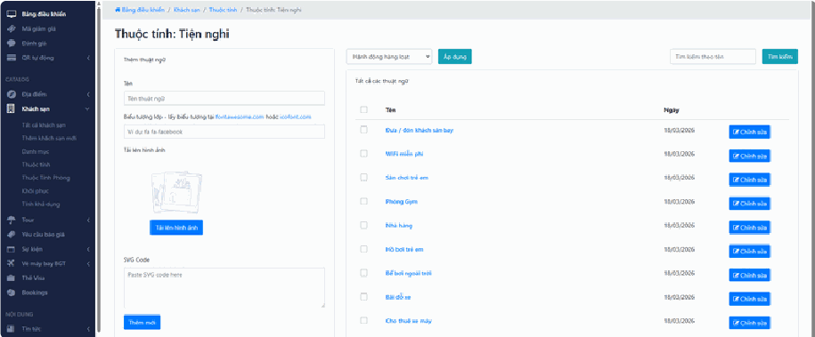

Ngoài ra, màn hình này cũng có chỉnh sửa, tìm kiếm và hành động hàng loạt giống hệt các phần trước.

## Thuộc tính phòng

Cách làm hoàn toàn giống mục **Thuộc tính** ở trên: cũng có nhóm, cũng có điều khoản bên trong, cũng thêm bằng nút **"Thêm mới"** rồi vào **"Quản lý điều khoản"**.

Khác biệt duy nhất là **nội dung**: ở đây bạn khai báo những gì thuộc về riêng một phòng — hướng phòng, loại giường, có bồn tắm, có ban công — chứ không phải tiện ích của cả tòa nhà.

## Cập nhật giá

**"Cập nhật giá"** là tên mục trên menu, nhưng thực chất nó làm hai việc cùng lúc: **lịch mở bán** (ngày nào còn phòng, ngày nào đóng) và **giá theo từng ngày**. Đây là nơi bạn kiểm soát việc bán phòng hằng ngày.

> **Đường dẫn:** Menu bên trái > **Khách sạn** > **Cập nhật giá**

## a, Theo dõi lịch phòng trực quan

**Lịch tháng:** hệ thống hiển thị dưới dạng lưới lịch (ví dụ: tháng 4 năm 2026). Mỗi ô ngày cho bạn hai thông tin quan trọng nhất: **giá bán × số phòng còn trống**. Ví dụ ô ghi `11.800.000đ x 1` nghĩa là ngày đó giá 11.800.000đ và chỉ còn 1 phòng.

**Danh sách loại phòng:** cột bên trái liệt kê tất cả các hạng phòng bạn đang quản lý (Premium Duplex Villa, Executive Villa, Premier Valley View…). Nhấn vào từng loại để xem lịch riêng của loại phòng đó.

> **Lưu ý:** Mỗi loại phòng có một lịch riêng. Sửa giá ở Deluxe không ảnh hưởng gì tới Suite. Nếu bạn muốn tăng giá dịp lễ cho tất cả các phòng, phải làm lần lượt cho từng loại.

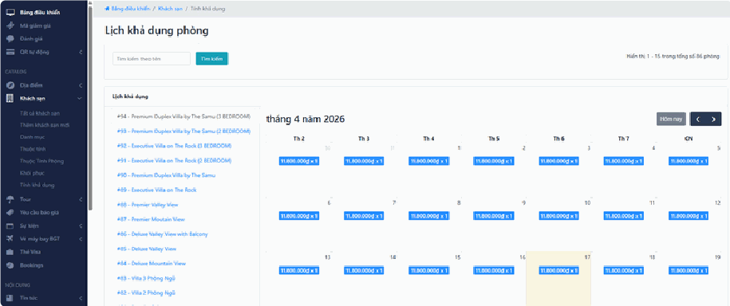

## b, Quản lý giá và trạng thái bán

Nhấn trực tiếp vào một ô ngày trên lịch, bạn có thể làm ngay các việc sau:

* **Điều chỉnh giá theo ngày:** tăng giá vào ngày lễ, cuối tuần, hoặc giảm giá mùa thấp điểm — mà **không làm thay đổi giá gốc** của phòng. Giá gốc vẫn giữ nguyên, chỉ riêng ngày đó là khác.
* **Đóng/Mở bán:** khóa phòng thủ công khi có đoàn đặt riêng bên ngoài hoặc phòng đang bảo trì. Việc này tránh tình trạng khách trên website đặt trùng vào phòng đã bán rồi.
* **Cập nhật số lượng:** thay đổi số phòng còn bán được cho ngày đó, để hệ thống khớp với thực tế kinh doanh.

> **Mẹo tiết kiệm thời gian:** thay vì bấm từng ngày một cho cả tháng, hãy làm theo đợt — ví dụ mỗi đầu tháng bạn mở bán và định giá cho cả tháng sau một lượt.

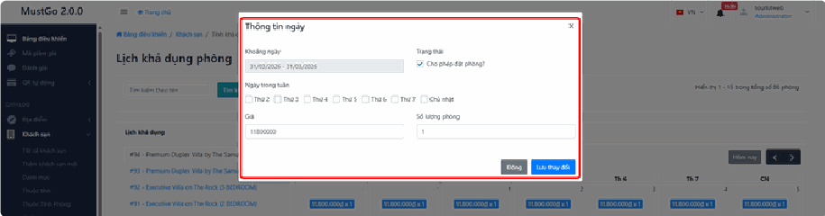

## c, Công cụ tìm kiếm nhanh

Nếu khách sạn của bạn có quá nhiều hạng phòng, cột bên trái sẽ rất dài. Hãy dùng ô **"Tìm kiếm theo tên"** ở phía trên lịch để lọc nhanh đúng loại phòng cần xử lý.

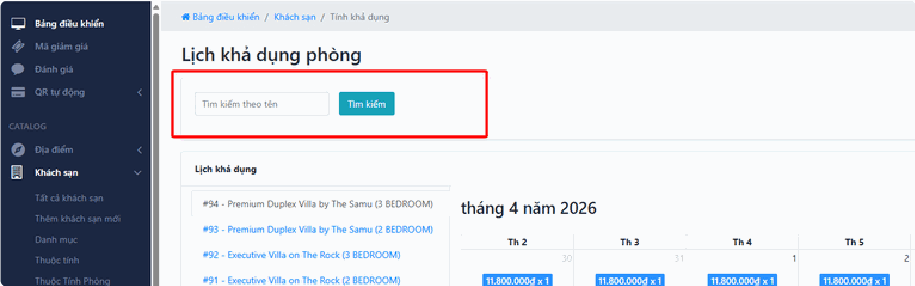

## Khôi phục

Đây là **thùng rác** của module Khách sạn: nơi chứa những khách sạn bạn đã xóa. Chúng chưa biến mất vĩnh viễn — bạn vẫn lấy lại được.

Cách dùng:

1. Vào menu **Khách sạn** > **Khôi phục**.
2. Tìm mục cần lấy lại (dùng ô **"Tìm kiếm theo tên"** nếu danh sách dài).
3. Nhấn nút **"Hành động"** ở dòng đó và chọn **"Khôi phục"** — dữ liệu sẽ trở lại danh sách hoạt động như chưa hề bị xóa.

> **Mẹo:** Trước khi hoảng vì "mất khách sạn", hãy vào đây tìm trước. Chín trên mười trường hợp là nó nằm trong này do ai đó xóa nhầm.

## Lưu ý & xử lý sự cố

**Đã thêm khách sạn nhưng ngoài website không thấy:** kiểm tra theo thứ tự này.

1. Tab **Trạng thái** đang chọn **"Xuất bản"** hay vẫn là **"Bản nháp"**?
2. Đã tạo ít nhất một loại phòng bên trong chưa? Không có phòng thì khách không đặt được.
3. Trong **"Cập nhật giá"**, đã mở bán ngày nào chưa?
4. Thử tải lại trang web bằng **Ctrl + F5**.

**Khách báo "hết phòng" trong khi bạn còn phòng:** vào **"Cập nhật giá"**, chọn đúng loại phòng, kiểm tra ngày khách muốn đặt xem số lượng có đang là 0 hoặc ngày đó có bị đóng bán không.

**Tải ảnh mãi không lên:** ảnh quá nặng. Hãy đổi cỡ và nén ảnh theo [Kích thước ảnh chuẩn](../kich-thuoc-anh.md) (ảnh đại diện dưới 300 KB) rồi tải lại.

**Trang `/khach-san/<địa điểm>` không có khách sạn mình vừa thêm.** Kiểm tra khách sạn đã chọn **Địa điểm** chưa và đang **"Publish"** chưa. Nếu địa điểm của khách sạn là con của địa điểm đang xem (ví dụ Hội An nằm trong Đà Nẵng) thì nó vẫn hiện — không hiện nghĩa là ô "Cha" của địa điểm đang chọn sai, xem [3.1. Địa điểm](dia-diem.md).

**Nhập giá bị sai số:** hãy nhập số thuần, không tự thêm dấu chấm phân cách hay chữ "đ". Ví dụ gõ `1200000` chứ đừng gõ `1.200.000đ`.

**Xóa nhầm khách sạn:** vào mục **"Khôi phục"** để lấy lại.

## Xem thêm

* [3. Khối SẢN PHẨM](./)
* [3.1. Địa điểm](dia-diem.md) — 3 trang SEO mà mỗi địa điểm tự sinh ra
* [3.3. Tour](tour.md)
* [4.6. Menu](../khoi-he-thong/menu.md) — đưa trang khách sạn theo địa điểm lên menu
* [Kích thước ảnh chuẩn](../kich-thuoc-anh.md)
