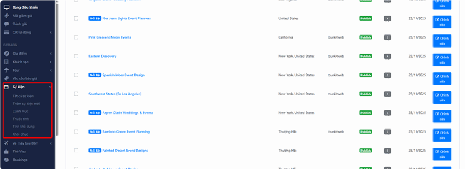

# 3.5. Sự kiện

Mục **Sự kiện** dùng để bán vé cho những hoạt động diễn ra trong một khoảng thời gian nhất định: lễ hội, đêm nhạc, hội chợ du lịch, giải chạy, workshop… Khác với tour (khách chọn ngày khởi hành), sự kiện thường đã ấn định sẵn ngày giờ, khách chỉ việc chọn số vé.

Nếu doanh nghiệp bạn có tổ chức hoặc bán vé cho các chương trình dạng này, đây là nơi bạn tạo và quản lý chúng.

> **Đường dẫn:** Menu bên trái > **Sự kiện**

> **Tin vui:** cách làm ở đây gần như giống hệt mục **Khách sạn** và **Tour**. Nếu bạn đã quen một trong hai mục đó, bạn sẽ dùng được Sự kiện ngay mà gần như không cần học lại.

## Trong mục này có gì?

Khi nhấn vào **Sự kiện** ở menu bên trái, danh sách sẽ xổ xuống các mục con sau:

- **Tất cả sự kiện** — danh sách toàn bộ sự kiện bạn đã tạo. Đây là nơi bạn vào để xem, sửa, hoặc tạm ẩn một sự kiện.
- **Thêm sự kiện mới** — mở trang trống để bạn khai báo một sự kiện mới từ đầu.
- **Danh mục** — các nhóm phân loại sự kiện, ví dụ: "Lễ hội", "Âm nhạc", "Thể thao". Phân loại giúp khách lọc nhanh trên website thay vì phải cuộn qua toàn bộ danh sách.
- **Thuộc tính** — các tiêu chí để khách lọc tìm, ví dụ: "sự kiện trong nhà", "có chỗ đỗ xe", "phù hợp trẻ em".
- **Cập nhật giá** — lịch mở bán: ngày nào còn vé, còn bao nhiêu vé, giá bao nhiêu.
- **Khôi phục** — thùng rác: nơi chứa các sự kiện đã xóa. Xóa nhầm vẫn lấy lại được ở đây.

> **Nếu bạn không thấy mục nào trong danh sách trên:** tài khoản của bạn chưa được cấp quyền cho phần đó — hãy liên hệ quản trị viên của đơn vị bạn.

## Tạo một sự kiện mới

### Bước 1: Mở trang tạo mới

Vào **Sự kiện** > **Thêm sự kiện mới**.

### Bước 2: Điền thông tin cơ bản

Bạn cần khai báo tối thiểu:

- **Tên sự kiện** — viết đúng như tên khách nhìn thấy trên vé, ví dụ: `Lễ hội Pháo hoa Đà Nẵng 2026`.
- **Địa điểm** tổ chức và **thời gian** diễn ra.
- **Giá vé** cho mỗi loại khách (người lớn, trẻ em… tùy bạn thiết lập).
- **Mô tả** — kể cho khách nghe sự kiện có gì, đi đâu, xem gì. Viết như bạn đang tư vấn trực tiếp cho khách.
- **Ảnh** — ảnh đại diện và bộ ảnh chi tiết.

### Bước 3: Chọn danh mục và thuộc tính

Ở **cột bên phải**, tích chọn danh mục và các thuộc tính phù hợp. Bỏ qua bước này thì sự kiện vẫn đăng được, nhưng khách sẽ khó tìm thấy khi họ dùng bộ lọc trên website.

### Bước 4: Lưu và xuất bản

Nhấn **"Lưu thay đổi"**.

> **Cẩn thận — lỗi hay gặp nhất:** Lưu xong nhưng sự kiện vẫn ở trạng thái **bản nháp** (lưu lại nhưng khách chưa nhìn thấy trên web). Bạn phải chuyển trạng thái sang **xuất bản** (đăng lên cho khách xem được) thì sự kiện mới hiện ra ngoài website.

## Cập nhật giá (lịch mở bán)

Vào **Sự kiện** > **Cập nhật giá**.

Đây là nơi bạn nói cho hệ thống biết: **ngày nào còn vé, còn bao nhiêu vé, và giá bao nhiêu**.

Nếu bạn không khai báo ở đây, khách vào website sẽ không đặt được vé dù sự kiện đã hiện ra — vì hệ thống hiểu là "không còn chỗ nào".

Cách làm chung:

1. Chọn sự kiện cần cập nhật.
2. Chọn khoảng ngày cần mở bán.
3. Điền **giá** và **số lượng vé** cho khoảng ngày đó.
4. Nhấn nút lưu/áp dụng để hệ thống ghi nhận.

> **Mẹo:** Sau khi cập nhật, hãy mở website ở một tab khác và thử đặt vé như một khách hàng thật. Đây là cách kiểm tra nhanh và chắc chắn nhất.

## Khôi phục (thùng rác)

Vào **Sự kiện** > **Khôi phục** nếu bạn lỡ tay xóa mất một sự kiện. Dữ liệu đã xóa nằm ở đây và lấy lại được.

## Lưu ý & xử lý sự cố

**Đã bấm Lưu mà sự kiện không hiện trên website:**

- Kiểm tra trạng thái — có thể sự kiện vẫn đang là **bản nháp**.
- Kiểm tra bạn đã khai báo **Cập nhật giá** chưa. Không có lịch mở bán thì sự kiện coi như hết chỗ.
- Thử tải lại trang bằng cách nhấn **Ctrl + F5** (giữ phím Ctrl rồi bấm F5). Trình duyệt hay nhớ bản cũ, cách này buộc nó tải bản mới nhất.

**Ảnh tải lên mãi không xong hoặc báo lỗi:** ảnh của bạn quá nặng. Ảnh chụp từ điện thoại đời mới thường nặng 5–10 MB. Hãy giảm dung lượng ảnh xuống dưới 1 MB trước khi tải lên — sự kiện sẽ hiển thị nhanh hơn cho khách và bạn cũng đỡ phải chờ.

**Tên sự kiện bị dính dấu cách thừa:** khi copy tên từ file Word hay Zalo dán vào, thường bị dính thêm dấu cách ở đầu hoặc cuối. Hãy xóa sạch rồi gõ tay lại cho chắc.

**Chọn hành động hàng loạt nhưng không thấy gì xảy ra:** làm hàng loạt (xử lý nhiều mục cùng lúc thay vì sửa từng cái) cần 2 thao tác — chọn hành động trong ô xổ xuống, rồi **phải nhấn nút "Áp dụng"**. Rất nhiều người quên bước thứ hai.

## Xem thêm

- [3.2. Khách sạn](khach-san.md) — cách làm tương tự, có hướng dẫn chi tiết hơn về ảnh và mô tả.
- [3.3. Tour](tour.md) — cách làm tương tự, tham khảo thêm phần thiết lập giá.
- [3.8. Booking](booking.md) — nơi xem các đơn khách đã đặt vé sự kiện.
