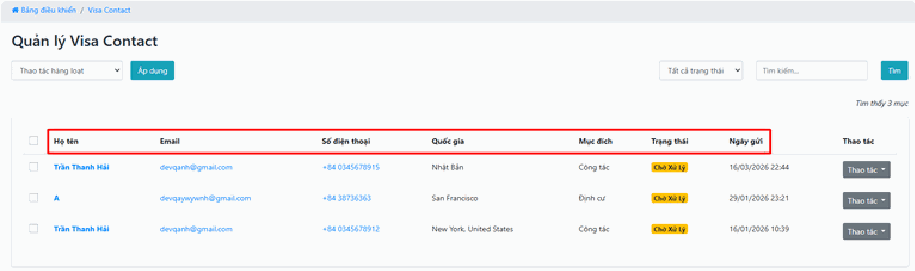
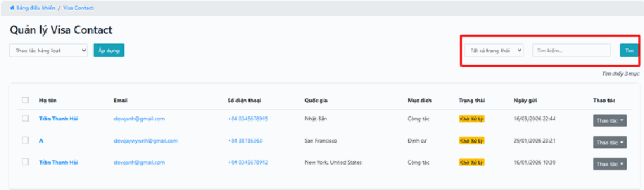
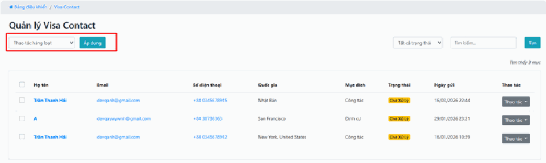

# 3.7. Thẻ visa

Mục **Thẻ Visa** là **hộp thư nhận yêu cầu tư vấn xin visa** từ website của bạn.

Khi một khách vào website và điền form đăng ký tư vấn visa — họ muốn đi Nhật, đi Mỹ, đi Hàn… — thông tin đó sẽ tự động đổ về đây. Bạn không cần canh email hay Zalo: cứ mở mục này ra là thấy đầy đủ ai đang cần bạn gọi lại.

Cách dùng gần giống mục **Yêu cầu báo giá**: tiếp nhận yêu cầu → liên hệ khách → cập nhật tiến độ.

> **Đường dẫn:** Menu bên trái > **Thẻ Visa**

Đây là một mục **đứng riêng, không có menu con**. Nhấn vào là vào thẳng danh sách yêu cầu.

> **Lưu ý:** Tính năng này có thể chưa được bật trên website của bạn. Nếu không thấy mục này trong menu, hãy liên hệ đơn vị triển khai.

> **Đừng nhầm với mục "Thị thực":** Hệ thống có thể có thêm một mục tên **Thị thực** (Visa). Hai mục này khác nhau hoàn toàn:
>
> - **Thẻ Visa** (trang này) = **danh sách khách đã liên hệ**, chờ bạn gọi tư vấn.
> - **Thị thực** = **danh mục dịch vụ visa bạn rao bán** trên website (visa Nhật, visa Hàn…), gồm "Tất cả Visa" và "Loại Visa".
>
> Nói ngắn gọn: **Thị thực** là thứ bạn bày lên kệ, **Thẻ Visa** là khách hỏi mua.

## a. Thông tin khách hàng

Bảng danh sách cho bạn đủ thông tin để gọi cho khách ngay mà không cần hỏi lại gì:

- **Họ tên & Liên hệ** — tên khách kèm Email và Số điện thoại.
- **Nhu cầu chi tiết** — khách muốn đi **quốc gia nào** (Nhật Bản, Mỹ…) và **mục đích xin visa** (công tác, định cư, du lịch…). Đọc kỹ hai thông tin này trước khi gọi, vì hồ sơ visa du lịch và visa định cư khác nhau rất xa.
- **Thời gian** — chính xác ngày giờ khách gửi yêu cầu.

> **Mẹo:** Hãy ưu tiên gọi các yêu cầu **mới nhất** trước. Khách xin visa thường hỏi nhiều nơi cùng lúc; ai gọi lại sớm nhất thường là người chốt được.

## b. Quản lý trạng thái xử lý

Khi số yêu cầu nhiều lên, bạn cần công cụ để không bỏ sót ai:

- **Bộ lọc** — lọc danh sách theo **Trạng thái**: *Chờ xử lý*, *Đang xử lý*, *Đã hoàn thành*.
- **Tìm kiếm** — gõ tên hoặc số điện thoại vào ô tìm kiếm để tìm nhanh một khách cụ thể.

> **Thói quen nên có:** Mỗi sáng, hãy lọc theo trạng thái **"Chờ xử lý"**. Đó chính xác là danh sách những người đang chờ bạn gọi. Xử lý xong ai thì đổi trạng thái người đó — hôm sau danh sách sẽ tự sạch, bạn không bao giờ gọi trùng hay bỏ sót.

## c. Thao tác nhanh

- **Nút "Thao tác"** — ở mỗi dòng có một thực đơn thả xuống. Nhấn vào để cập nhật tiến độ tư vấn hoặc ghi chú thêm thông tin.
- **Thao tác hàng loạt** — làm hàng loạt nghĩa là xử lý nhiều yêu cầu cùng lúc thay vì sửa từng cái. Bạn tích chọn nhiều dòng, chọn hành động (xóa hoặc chuyển trạng thái), rồi nhấn nút **"Áp dụng"**.

> **Cẩn thận:** Thao tác hàng loạt cần **2 bước**: chọn hành động, rồi **nhấn "Áp dụng"**. Rất nhiều người chọn xong là bỏ đi, tưởng đã xong — thực ra chưa có gì thay đổi cả.

> **Mẹo về ghi chú:** Mỗi lần gọi khách, hãy ghi lại một dòng ngắn: khách nói gì, hẹn khi nào gọi lại. Nếu hôm sau đồng nghiệp khác tiếp nhận, họ đọc ghi chú là hiểu ngay, khách không phải kể lại từ đầu.

## Lưu ý & xử lý sự cố

**Khách báo đã điền form nhưng bạn không thấy yêu cầu:**

- Kiểm tra xem bạn có đang bật **bộ lọc trạng thái** nào không. Nếu đang lọc "Đã hoàn thành" thì yêu cầu mới sẽ không hiện. Hãy xóa bộ lọc để xem toàn bộ.
- Tải lại trang bằng **Ctrl + F5** (giữ phím Ctrl rồi bấm F5) để lấy dữ liệu mới nhất.

**Tìm theo số điện thoại không ra:** khách có thể nhập số ở dạng khác với bạn đang gõ (ví dụ `0912345678` và `+84912345678`). Hãy thử tìm bằng **vài số cuối** hoặc bằng **tên khách** thay vì cả số.

**Lỡ xóa nhầm một yêu cầu:** yêu cầu tư vấn đã xóa thì **không lấy lại được** như các mục sản phẩm. Vì vậy hãy cân nhắc kỹ trước khi dùng thao tác xóa hàng loạt — thay vì xóa, bạn nên chuyển sang trạng thái **"Đã hoàn thành"** để lưu lại lịch sử.

**Không thấy mục này trong menu:** hoặc tính năng chưa được bật trên website của bạn, hoặc tài khoản của bạn chưa được cấp quyền. Hãy liên hệ đơn vị triển khai hoặc quản trị viên.

## Xem thêm

- [3.4. Yêu cầu báo giá](yeu-cau-bao-gia.md) — cách xử lý tương tự, dành cho yêu cầu báo giá tour/dịch vụ.
- [3.8. Booking](booking.md) — nơi quản lý các đơn hàng khách đã thực sự đặt.
