# 3.3. Tour

Mục **Tour** là trái tim của website du lịch. Đây là nơi bạn dựng nên các chương trình tour trọn gói mà khách hàng sẽ xem và đặt: lịch trình từng ngày, giá bao nhiêu, khởi hành ngày nào, bao gồm những gì.

Nếu bạn chỉ có thời gian học một mục duy nhất trong toàn bộ tài liệu này, hãy học mục Tour.

> **Đường dẫn:** Menu bên trái > **Tour** (biểu tượng chiếc ô)

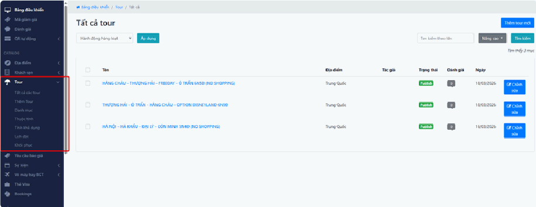

## Trong mục này có gì?

Khi nhấn vào **Tour** ở menu bên trái, bạn sẽ thấy các mục con sau:

- **Tất cả các tour** — danh sách toàn bộ tour đang có. Xem nhanh tên tour, trạng thái, và thao tác chỉnh sửa/xem/xóa.
- **Thêm Tour** — màn hình tạo một hành trình mới từ đầu.
- **Danh mục** — nhóm phân loại tour để khách dễ tìm (ví dụ: Tour nội địa, Tour quốc tế, Tour du thuyền, Tour trekking).
- **Thuộc tính** — các tiêu chí lọc chi tiết (ví dụ: Thời gian tour, Chủ đề tour, Phương tiện di chuyển).
- **Cập nhật giá** — lịch mở bán: tour chạy ngày nào, giá bao nhiêu, nhận tối đa bao nhiêu khách.
- **Lịch đặt** — bảng lịch tổng quan cho biết trong tháng này tour nào khởi hành ngày nào.
- **Khôi phục** — thùng rác: nơi chứa dữ liệu đã xóa, vẫn lấy lại được.

> **Về tên gọi "Cập nhật giá":** đừng để cái tên làm bạn hiểu nhầm là nó chỉ sửa giá. Thực chất mục này quản lý **lịch mở bán**: ngày nào tour khởi hành, ngày nào đóng, giá của riêng ngày đó là bao nhiêu, và nhận tối đa bao nhiêu khách. Đây là mục quyết định khách có đặt được tour hay không.

> **Lưu ý:** Menu hiển thị theo phân quyền. Nếu bạn không thấy một mục nào đó, tài khoản của bạn chưa được cấp quyền — hãy liên hệ quản trị viên.

## Tất cả các tour

## a, Tìm kiếm

**Tìm kiếm cơ bản:** gõ tên tour vào ô **"Tìm kiếm theo tên"** rồi nhấn nút **"Tìm kiếm"**.

**Tìm kiếm nâng cao:** nhấn nút **"Nâng cao"** để mở thêm bộ lọc, cho phép bạn lọc theo:

- **Địa điểm** (Trung Quốc, Việt Nam…)
- **Nhà cung cấp** (đối tác bán tour trên website của bạn)

> **Nếu tìm không ra tour bạn chắc chắn là có:** thử gõ ngắn hơn, chỉ vài chữ thay vì cả tên dài. Cũng nên kiểm tra ô tìm kiếm có bị dính dấu cách thừa ở đầu không — chuyện này hay xảy ra khi bạn copy tên từ file Word hay Zalo dán vào.

## b, Hành động hàng loạt

Dùng khi cần xử lý nhiều tour cùng lúc:

1. Tích vào các **ô vuông ở cột đầu tiên** bên trái của các tour cần xử lý.
2. Mở thực đơn thả xuống **"Hành động hàng loạt"** và chọn lệnh (thường là **"Xóa"**).
3. Nhấn nút **"Áp dụng"**.

> **Đừng quên bước 3.** Chọn lệnh xong mà không nhấn **"Áp dụng"** thì hệ thống không làm gì cả. Đây là lỗi phổ biến nhất khi dùng hành động hàng loạt.

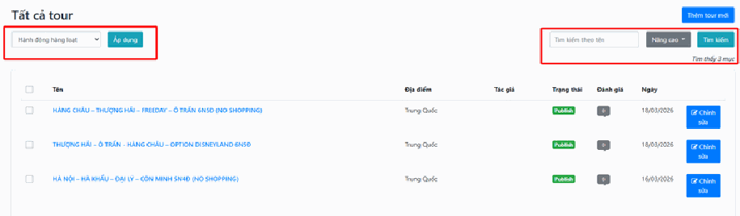

## c, Chỉnh sửa một tour

Khi cần sửa lại một tour đã có, bạn làm như sau:

### Bước 1: Mở tour

Tại dòng của tour cần sửa, nhấn nút **"Chỉnh sửa"** màu xanh.

### Bước 2: Cập nhật nội dung

Màn hình chỉnh sửa mở ra. Tại đây bạn có thể:

- Sửa tiêu đề tour.
- Sửa mô tả hành trình.
- Thay ảnh đại diện.
- Thêm hoặc bớt ảnh trong bộ sưu tập ảnh.

### Bước 3: Kiểm tra giá và địa điểm

- Xem lại thiết lập giá tour.
- Kiểm tra địa điểm khởi hành và kết thúc còn đúng không.

### Bước 4: Lưu lại

Nhấn nút **"Lưu thay đổi"**.

> **Mẹo:** Nếu tour đã đăng và đang có khách xem, hãy sửa xong toàn bộ rồi mới bấm Lưu một lần. Tránh bấm Lưu giữa chừng khi nội dung còn dở dang, vì khách sẽ nhìn thấy ngay bản dở đó trên website.

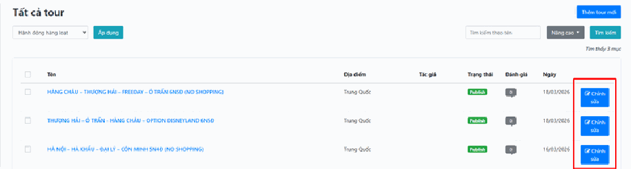

## Thêm tour

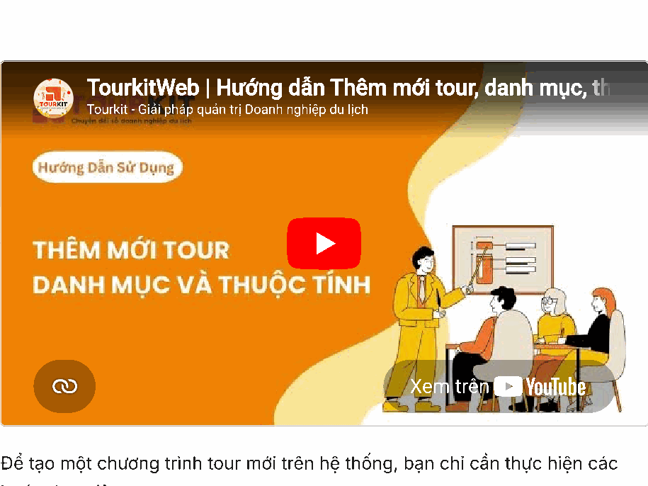

*📺 Video hướng dẫn: TourkitWeb | Hướng dẫn Thêm mới tour, danh mục, th*

Màn hình thêm tour nhìn qua thì nhiều thứ, nhưng cấu trúc rất rõ ràng. Bạn hãy để ý **cột hẹp bên trái** — đó là danh sách các tab, mỗi tab là một nhóm thông tin. Bạn bấm vào tab nào thì nội dung tab đó hiện ra ở khoảng rộng bên phải.

Các tab bạn sẽ thấy ở cột trái, dưới tiêu đề **"Tour Information"** (Thông tin tour):

- **General** (Chung) — thông tin cơ bản, lịch trình, chính sách.
- **Location** (Địa điểm) — nơi tour diễn ra.
- **Pricing** (Giá cả) — thiết lập giá.
- **Availability** (Cập nhật giá) — lịch mở bán theo ngày.
- **Danh mục** — chọn nhóm cho tour.
- **Status** (Trạng thái) — cho khách xem được hay chưa.
- **SEO** — cách tour của bạn hiện ra khi khách tìm trên Google.

> **Rất quan trọng — vì sao có tab bị mờ và có ổ khóa?** Khi bạn tạo tour lần đầu, hai tab **Pricing** (Giá cả) và **Availability** (Cập nhật giá) sẽ bị **mờ đi và có hình ổ khóa**, bấm không vào được. Đây **không phải lỗi**. Hệ thống cần biết tour này là tour nào trước đã, rồi mới cho bạn gán giá cho nó.
>
> **Cách xử lý rất đơn giản:** điền thông tin cơ bản → nhấn **"Save changes"** (Lưu thay đổi) một lần → hai tab kia sẽ mở khóa ngay. Sau đó bạn quay lại nhập giá bình thường.

Dưới đây là quy trình đầy đủ:

### Bước 1: Điền thông tin chung (tab "General")

Điền đầy đủ các thông tin bắt buộc:

- **Tiêu đề tour** — tên tour, thứ khách nhìn thấy đầu tiên. Ví dụ: `Tour Hà Nội – Sapa 3 ngày 2 đêm`.
- **Nội dung mô tả** — giới thiệu tổng quan về hành trình.
- **Video giới thiệu** — nếu bạn có, không bắt buộc.
- **Các thông số** — thời lượng tour, số lượng khách.

### Bước 2: Thiết lập các mục chi tiết

Cuộn xuống dưới trong cùng tab, bạn sẽ thấy các khung:

- **Bao gồm** — những gì đã tính trong giá tour (xe, khách sạn, ăn uống, vé tham quan).
- **Không bao gồm** — những gì khách phải trả thêm (đồ uống, chi tiêu cá nhân, tiền tip).
- **Thông tin nổi bật** — các điểm hấp dẫn nhất của tour.
- **Chính sách hủy** — quy định khi khách hủy tour.

> **Hai mục "Bao gồm" và "Không bao gồm" là nơi phát sinh khiếu nại nhiều nhất.** Hãy viết thật rõ ràng, đừng bỏ trống. Khách hiểu nhầm rằng bữa tối đã bao gồm trong khi thực tế không, là bạn mất công giải thích và có khi mất cả khách.

### Bước 3: Xây dựng lịch trình tour

Đây là phần khách đọc kỹ nhất trước khi quyết định đặt.

Bạn thêm nội dung cho **từng ngày** của hành trình:

- Ngày 1: đi những đâu, ăn ở đâu, ngủ ở đâu.
- Ngày 2: tương tự.
- …và tiếp tục cho tới ngày cuối.

Mỗi ngày bạn có thể thêm hình ảnh minh họa kèm theo phần mô tả.

> **Mẹo:** Viết lịch trình như đang kể chuyện cho khách nghe, không phải liệt kê khô khan. "Sáng: 6h30 xe đón tại điểm hẹn, khởi hành đi Sapa, dừng nghỉ ăn sáng tại Lào Cai" dễ hình dung hơn nhiều so với "Sáng: di chuyển".

### Bước 4: Kiểm tra các tab còn lại

Sau khi lưu lần đầu, hãy quay lại các tab ở cột trái để hoàn thiện:

- **Location** (Địa điểm) — chọn nơi tour diễn ra. Nếu không thấy địa điểm cần chọn, nghĩa là nó chưa được tạo — xem bài [3.1. Địa điểm](dia-diem.md).
- **Pricing** (Giá cả) — thiết lập mức giá cho tour.
- **Availability** (Cập nhật giá) — đảm bảo tour có ít nhất một ngày khởi hành được mở bán. **Bỏ qua bước này thì khách nhìn thấy tour nhưng không đặt được.**

### Bước 5: Xuất bản và lưu

- Tại tab **Status** (Trạng thái) hoặc khung **"Publish"**, chọn **"Publish"** (Xuất bản).
- Nhấn nút **"Save changes"** / **"Lưu thay đổi"** — nút màu xanh lá ở **góc dưới cùng bên phải**.

> **Đây là lỗi số một của người mới:** nhập cả tiếng đồng hồ, bấm Lưu, rồi ra website tìm mãi không thấy tour đâu. Nguyên nhân gần như luôn là trạng thái vẫn đang để **"Draft"** (Bản nháp) — nghĩa là chỉ lưu cho bạn xem, khách chưa nhìn thấy. Hãy vào sửa lại, chọn **"Publish"** rồi lưu thêm lần nữa.

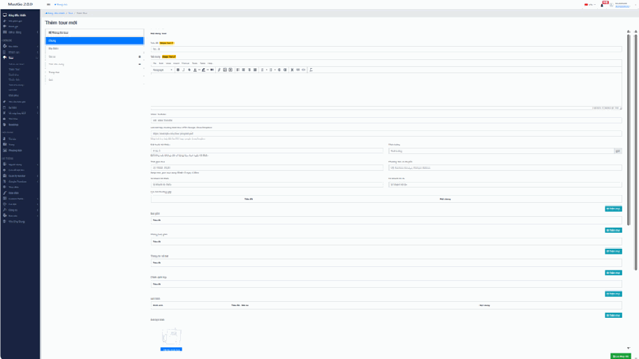

## Danh mục

Danh mục giúp khách hàng lọc tour nhanh hơn. Nếu bạn không phân loại, khách phải cuộn qua hàng trăm tour để tìm đúng thứ họ muốn — và phần lớn sẽ bỏ đi giữa chừng.

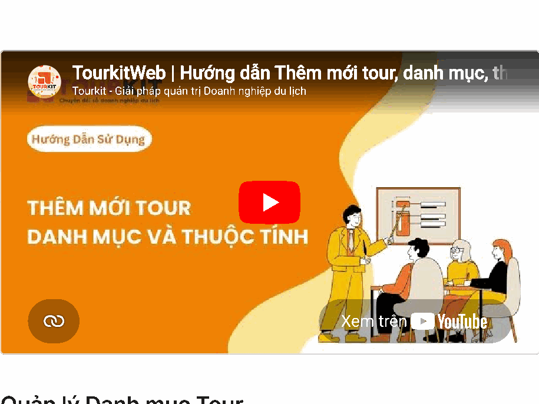

*📺 Video hướng dẫn: TourkitWeb | Hướng dẫn Thêm mới tour, danh mục, th*

Giao diện này dùng để phân loại tour theo nhóm (ví dụ: City Tour, Ecotourism, Tour nội địa, Tour quốc tế).

### Thêm danh mục mới

Làm ở **cột bên trái**:

1. Điền **Tên danh mục**.
2. Chọn danh mục **Cha** nếu đây là nhóm con nằm trong một nhóm lớn hơn. Nếu là danh mục chính, để trống.
3. Nhấn nút **"Thêm mới"**.

### Quản lý danh mục đã có

Làm ở bảng **bên phải**:

- **Tìm kiếm:** gõ vào ô **"Tìm kiếm theo tên"** rồi nhấn **"Tìm kiếm"**.
- **Hành động hàng loạt:** tích chọn nhiều mục → chọn lệnh **"Xóa"** → nhấn **"Áp dụng"**.

> **Mẹo:** Đừng tạo quá nhiều danh mục. Khoảng 5–8 nhóm rõ ràng thì khách dễ chọn; ba chục nhóm chồng chéo chỉ khiến khách rối.

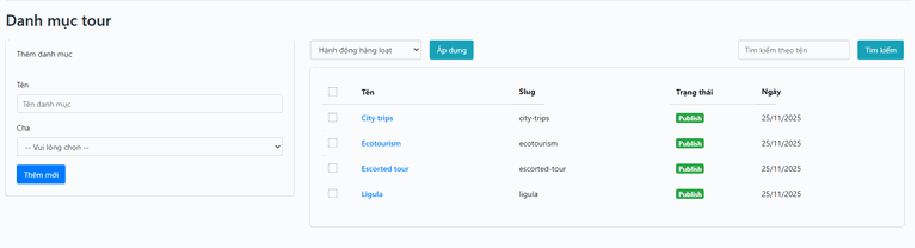

## Thuộc tính

**Thuộc tính** là các tiêu chí để khách lọc tìm chi tiết hơn danh mục. Ví dụ: khách đã chọn "Tour nội địa" rồi, nhưng vẫn muốn lọc tiếp "chỉ tour 3 ngày" và "đi bằng ô tô". Hai tiêu chí sau chính là thuộc tính.

Cấu trúc gồm hai tầng:

- **Nhóm thuộc tính** — tiêu đề lớn, ví dụ "Thời gian tour".
- **Điều khoản bên trong nhóm** — các lựa chọn cụ thể, ví dụ "1 ngày", "2–3 ngày", "trên 5 ngày".

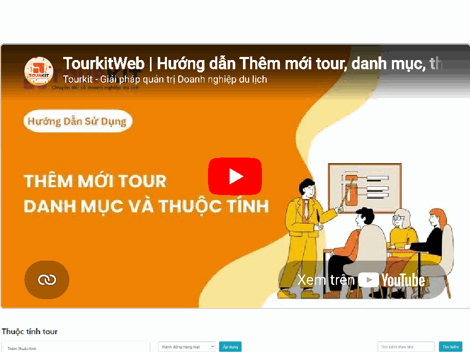

*📺 Video hướng dẫn: TourkitWeb | Hướng dẫn Thêm mới tour, danh mục, th*

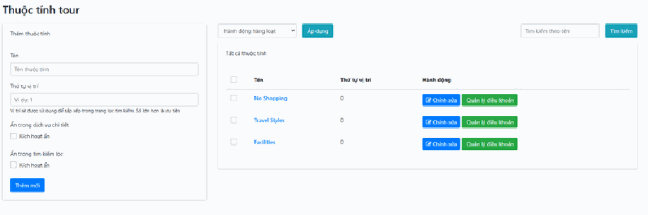

Cách thao tác **hoàn toàn giống bên Khách sạn**: bạn tạo nhóm bằng nút **"Thêm mới"**, đặt **Thứ tự vị trí** (số càng nhỏ càng hiện lên đầu bộ lọc), rồi nhấn nút **"Quản lý điều khoản"** màu xanh để vào bên trong thêm các lựa chọn cụ thể.

Nếu bạn cần xem chi tiết từng bước, hãy đọc phần **Thuộc tính** trong bài [3.2. Khách sạn](khach-san.md) — nội dung áp dụng y hệt cho Tour.

## Cập nhật giá

Đây là mục quan trọng bậc nhất, và cũng là mục hay bị bỏ sót nhất.

Tên trên menu là **"Cập nhật giá"**, nhưng công việc thực sự của nó là quản lý **lịch mở bán tour**: tour khởi hành những ngày nào, mỗi ngày giá bao nhiêu, nhận tối đa bao nhiêu khách, ngày nào đóng không nhận.

> **Đường dẫn:** Menu bên trái > **Tour** > **Cập nhật giá**

> **Vì sao quan trọng đến vậy?** Vì một tour dù đã nhập đẹp, đã Xuất bản, mà không mở bán ngày nào ở đây thì khách vẫn **không đặt được**. Họ vào xem, thích, rồi không bấm đặt được và bỏ đi. Bạn mất khách mà không hề biết.

## a, Kiểm soát ngày khởi hành

**Lịch vận hành:** hệ thống hiển thị lịch chi tiết theo tháng (ví dụ: tháng 4 năm 2026).

**Cách đọc màu các ô ngày:**

- **Ô màu xanh** — ngày này tour có khởi hành và đang mở bán. Ô hiển thị giá tour và số khách tối đa. Ví dụ: `15.990.000đ - Số khách tối đa: 0`.
- **Ô màu xám (bị chặn)** — ngày này tour không khởi hành, hoặc đã bị đóng bán. Khách không thể chọn ngày này.

> **Ô màu xám không phải lỗi.** Nó là cách bạn chủ động nói với hệ thống "ngày này chúng tôi không chạy tour". Nhờ vậy nhân viên tư vấn và khách hàng đều tránh được việc đặt nhầm ngày.

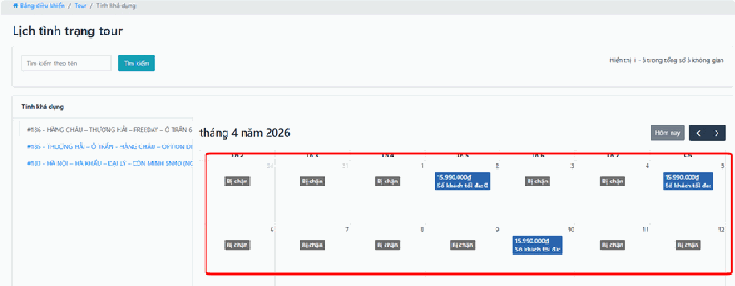

## b, Thao tác nhanh trên lịch

Nhấn trực tiếp vào một ngày trên lịch, một khung nhỏ mở ra cho bạn điều chỉnh ngay:

- **Đóng/Mở tour** — chặn các ngày không đủ điều kiện khởi hành (thiếu khách, xe bận, hướng dẫn viên nghỉ), hoặc mở thêm ngày khi có yêu cầu.
- **Cập nhật giá** — đặt mức giá riêng cho ngày đó, ví dụ tăng giá dịp lễ Tết. Việc này **không làm thay đổi giá gốc** của tour, chỉ riêng ngày đó là khác.
- **Cập nhật số lượng khách** — giới hạn số chỗ (Seat) cho chuyến khởi hành đó, ví dụ xe 45 chỗ thì đặt tối đa 40 khách.

> **Mẹo:** Đừng ngồi bấm từng ngày cho cả năm. Hãy làm theo đợt — mỗi đầu tháng bạn mở bán và định giá cho tháng kế tiếp một lượt là đủ.

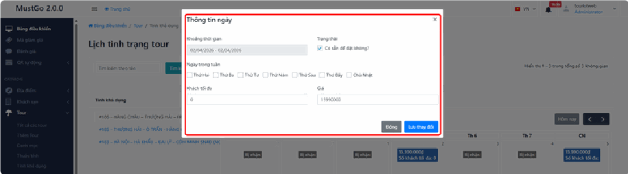

## c, Bộ lọc tiện lợi

- **Danh sách tour bên trái:** nhấn chọn từng tour cụ thể (ví dụ: Tour Hàng Châu, Tour Hà Nội – Hà Khẩu…) để xem và quản lý lịch riêng của tour đó.

  > **Mỗi tour có một lịch riêng.** Sửa lịch của tour này không ảnh hưởng gì tới tour khác. Trước khi bấm sửa ngày nào, hãy nhìn lại xem mình đang chọn đúng tour ở cột trái chưa — đây là nhầm lẫn rất hay xảy ra.

- **Tìm kiếm:** dùng ô **"Tìm kiếm theo tên"** để định vị nhanh tour cần xử lý khi danh sách bên trái quá dài.

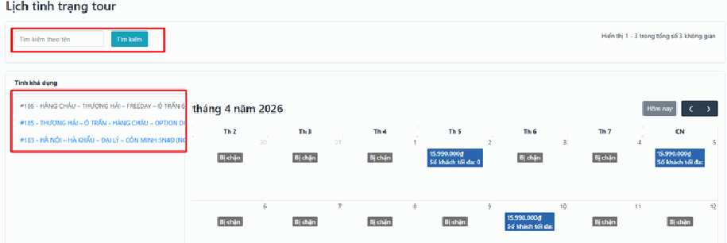

## Lịch đặt

Nếu **"Cập nhật giá"** là nơi bạn chỉnh sửa từng tour một, thì **"Lịch đặt"** là nơi bạn nhìn **toàn cảnh**: trong tháng này, tất cả các tour của bạn khởi hành vào những ngày nào.

Đây là màn hình rất hữu ích cho người điều hành, để biết ngày nào dồn nhiều đoàn, ngày nào trống.

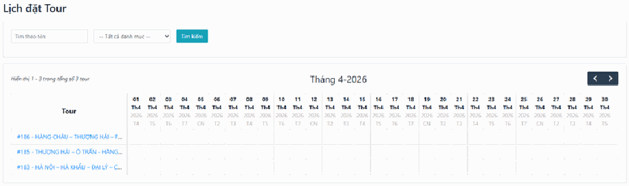

### Cách đọc màn hình này

- **Cột bên trái** — liệt kê tên và mã số các tour đang hoạt động (ví dụ: Tour Hàng Châu – Thượng Hải, Tour Hà Nội – Hà Khẩu…).
- **Các cột từ 01 đến 30 (hoặc 31)** — là các ngày trong tháng. Lịch có ghi rõ thứ trong tuần (T2, T3… CN), giúp bạn nhận ra ngay các tour khởi hành cuối tuần.
- Khi một tour có lịch khởi hành vào ngày nào, ô giao giữa dòng tour đó và cột ngày đó sẽ được đánh dấu.

### Các thao tác quản lý

**Tìm kiếm nhanh theo tên:**

- Gõ tên tour vào ô **"Tìm theo tên"** để chỉ hiển thị lịch của riêng tour đó.

**Lọc theo danh mục:**

- Dùng menu thả xuống để lọc tour theo nhóm (ví dụ: Tour quốc tế, Tour nội địa).

**Chuyển đổi thời gian:**

- Nhấn nút mũi tên **<** ở góc phải để xem lịch tháng trước.
- Nhấn nút mũi tên **>** để xem lịch tháng tiếp theo.

**Theo dõi tình trạng:**

- Nhìn vào các ô đã đánh dấu để biết chính xác ngày nào tour còn chỗ, phục vụ việc tư vấn cho khách.

> **Lưu ý:** Màn hình này chủ yếu để **xem**. Nếu muốn sửa giá hay đóng/mở một ngày cụ thể, bạn hãy vào mục **"Cập nhật giá"**.

## Khôi phục

**"Khôi phục"** chính là **thùng rác chung** của hệ thống — nơi chứa mọi dữ liệu đã bị xóa và vẫn còn lấy lại được.

> **Một điểm khiến nhiều người bất ngờ:** dù bạn vào đây từ menu **Tour**, màn hình này **không chỉ chứa tour**. Nó là thùng rác chung, nên bạn có thể thấy cả **khách sạn** và các loại dữ liệu khác đã bị xóa nằm lẫn trong danh sách. Đừng nghĩ là lỗi — hãy dùng ô tìm kiếm để lọc ra đúng thứ mình cần.

Vì là thùng rác, đây là nơi đầu tiên bạn nên vào khi có ai đó báo "mất tour", "tour biến đâu mất rồi".

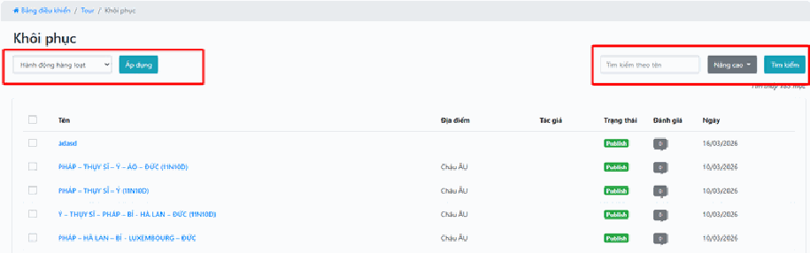

## a, Tìm kiếm dữ liệu cũ

- **Tìm kiếm nhanh:** gõ tên Tour hoặc Khách sạn vào ô **"Tìm kiếm theo tên"** để định vị dữ liệu cần khôi phục.
- **Lọc nâng cao:** nhấn nút **"Nâng cao"** để tìm chi tiết hơn theo **Địa điểm** (ví dụ: Châu Âu) hoặc theo **Tác giả** đã tạo nội dung.

> **Mẹo:** Nếu bạn biết ai là người đã xóa nhầm, lọc theo Tác giả là cách nhanh nhất để tìm ra toàn bộ những gì họ đã xóa.

## b, Thao tác Khôi phục

Bạn có hai cách xử lý.

### Cách 1: Khôi phục từng mục một

1. Tìm đến dòng dữ liệu cần lấy lại.
2. Nhấn nút **"Hành động"** ở dòng đó.
3. Chọn **"Khôi phục"**.

Dữ liệu sẽ trở lại danh sách hoạt động như chưa hề bị xóa.

### Cách 2: Khôi phục hàng loạt

1. Tích chọn vào **ô vuông đầu dòng** của những mục cần xử lý. Có thể chọn nhiều mục cùng lúc.
2. Mở thực đơn **"Hành động hàng loạt"** và chọn lệnh:
   - **"Khôi phục"** — đưa tất cả các mục đã chọn trở lại danh sách hoạt động.
   - **"Xóa vĩnh viễn"** — xóa hẳn khỏi hệ thống nếu bạn không muốn lưu trữ nữa.
3. Nhấn nút **"Áp dụng"** để thực thi.

> **Cẩn thận với "Xóa vĩnh viễn":** khác với xóa thường, lệnh này **không lấy lại được**. Dữ liệu mất là mất luôn. Chỉ dùng khi bạn thực sự chắc chắn, và hãy nhìn kỹ lại các dòng đã tích trước khi bấm **"Áp dụng"**.

> **Sau khi khôi phục, tour vẫn chưa hiện trên website?** Hãy kiểm tra trạng thái của nó — có thể tour trở lại ở dạng **"Draft"** (Bản nháp). Vào sửa, chọn **"Publish"** (Xuất bản) rồi lưu.

## Lưu ý & xử lý sự cố

**Tour đã nhập đầy đủ nhưng ngoài website không thấy:** kiểm tra lần lượt.

1. Trạng thái đang là **"Publish"** (Xuất bản) hay **"Draft"** (Bản nháp)?
2. Trong **"Cập nhật giá"**, tour đã có ngày nào được mở bán chưa?
3. Nhấn **Ctrl + F5** trên trang web để tải lại sạch, bỏ qua bản cũ trình duyệt đang giữ.

**Khách xem được tour nhưng không bấm đặt được:** gần như chắc chắn là do chưa mở bán ngày nào trong **"Cập nhật giá"**, hoặc số khách tối đa của ngày đó đang là 0.

**Tab "Pricing" và "Availability" bị mờ, có ổ khóa, bấm không vào được:** đây là tour mới, chưa được lưu lần nào. Hãy điền thông tin cơ bản rồi nhấn **"Save changes"** (Lưu thay đổi). Hai tab sẽ mở khóa ngay sau đó.

**Sửa giá một ngày nhưng cả tháng bị đổi theo:** bạn đã sửa nhầm vào giá gốc của tour ở tab **Pricing** thay vì sửa từng ngày trong **"Cập nhật giá"**. Giá gốc áp cho mọi ngày; giá trong lịch chỉ áp cho ngày đó.

**Chọn Xóa hàng loạt mà không thấy gì xảy ra:** bạn quên nhấn nút **"Áp dụng"**.

**Lỡ xóa nhầm tour:** vào mục **"Khôi phục"**, tìm và bấm **"Khôi phục"**. Đừng hoảng, dữ liệu vẫn còn.

**Ảnh lịch trình tải mãi không lên:** ảnh quá nặng. Ảnh chụp từ điện thoại thường 5–10 MB. Hãy giảm còn khoảng 1–2 MB rồi tải lại.

## Xem thêm

- [3. Khối SẢN PHẨM](README.md)
- [3.1. Địa điểm](dia-diem.md)
- [3.2. Khách sạn](khach-san.md)
- [3.4. Yêu cầu báo giá](yeu-cau-bao-gia.md)
