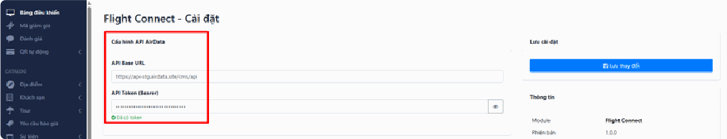
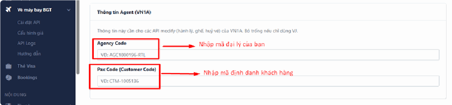
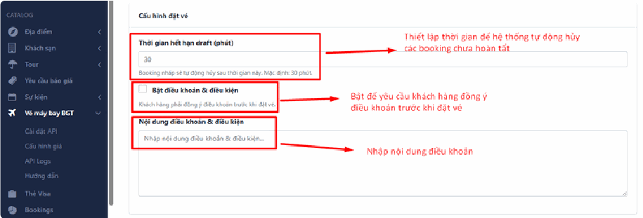
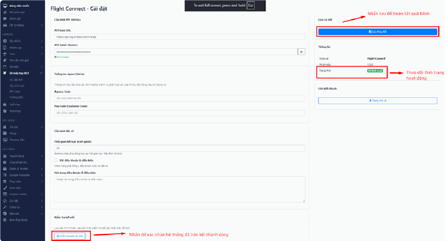
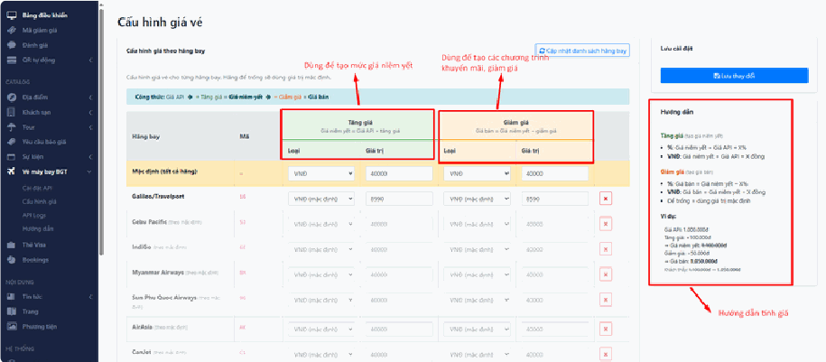
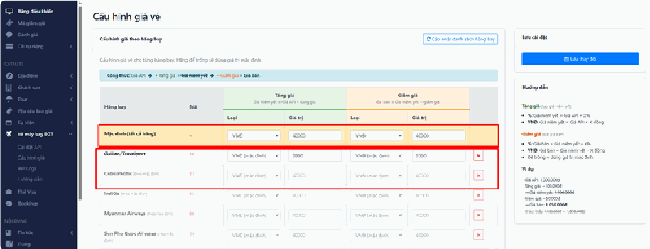
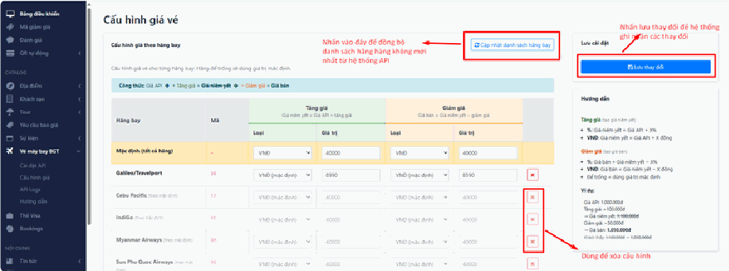
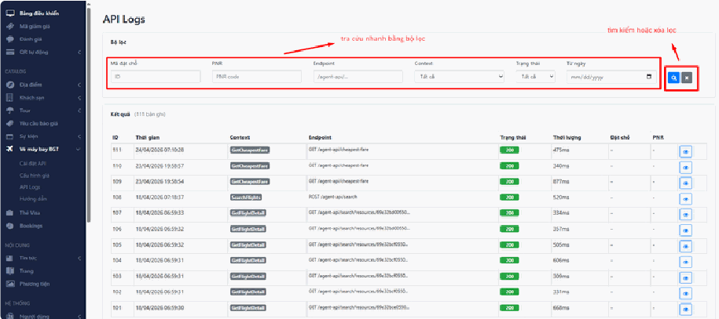
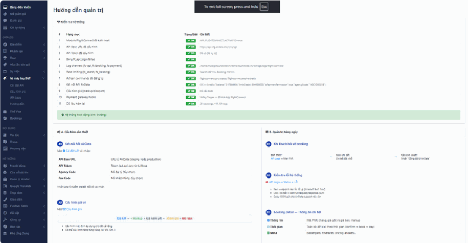
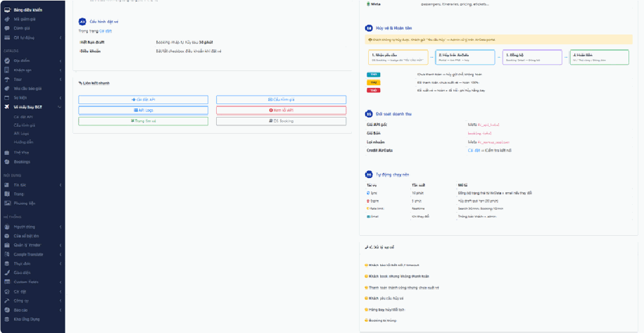

# 3.6. Vé máy bay BGT

3.6.1. Cài đặt API 3.6.2. Cấu hình giá

3.6.3. API Logs 3.6.4. Hướng dẫn

## Cài đặt API

## a. Cấu hình API AirData

Đây là phần thiết lập kết nối dữ liệu cốt lõi cho hệ thống vé máy bay.

- API Base URL: Nhập địa chỉ URL cơ sở của dịch vụ AirData.

- API Token (Bearer): Nhập mã token xác thực để hệ thống có quyền truy xuất dữ liệu. Khi cấu hình đúng, hệ thống sẽ hiển thị thông báo "Đã có token" màu xanh.

## b. Thông tin Agent (VN1A)

Các thông tin này cần thiết cho các tác vụ thay đổi hành trình, xử lý vé của hệ thống VN1A (nếu chỉ dùng Vietjet - VJ thì có thể bỏ trống):

- Agency Code: Nhập mã đại lý của bạn.

- Pax Code (Customer Code): Nhập mã định danh khách hàng tương ứng.

## c. Cấu hình đặt vé

Thiết lập các quy tắc cho quy trình khách hàng đặt vé trên website:

- Thời gian hết hạn draft (phút): Thiết lập thời gian (mặc định là 30 phút) để hệ thống tự động hủy các booking chưa hoàn tất.

- Điều khoản & điều kiện:

◦ Tích chọn Bật điều khoản & điều kiện nếu muốn bắt buộc khách hàng phải đồng ý trước khi đặt vé. ◦ Nhập văn bản nội dung chi tiết vào ô Nội dung điều khoản & điều kiện.

## d. Kiểm tra và Lưu cài đặt

- Kiểm tra kết nối: Sau khi điền các thông tin API, hãy nhấn nút Kiểm tra kết nối API ở cuối trang để xác nhận hệ thống đã liên kết thành công.

- Lưu cài đặt: Nhấn nút Lưu thay đổi ở khung bên phải để hoàn tất quá trình cấu hình.

- Trạng thái: Bạn có thể theo dõi tình trạng hoạt động tại ô Trạng thái (đang hiển thị "Đã kích hoạt" màu xanh).

## Cấu hình giá

*📺 Video hướng dẫn: TourkitWeb | Hướng dẫn sử dụng Module vé máy bay*

## a, Thiết lập Tăng giá & Giảm giá

Tại mỗi hãng bay, bạn có hai cột chính để điều chỉnh:

- Cột Tăng giá (Màu xanh): Dùng để tạo ra mức giá niêm yết (thường là giá để bạn lấy lời hoặc bao gồm phí dịch vụ). ◦ Loại %: Hệ thống lấy Giá API cộng thêm X% (Ví dụ: +10%). ◦ Loại VNĐ: Hệ thống cộng trực tiếp một số tiền cố định vào Giá API (Ví dụ: +40,000đ).

- Cột Giảm giá (Màu vàng): Dùng để tạo các chương trình khuyến mãi hoặc giảm giá so với giá niêm yết. ◦ Loại %: Giảm X% dựa trên Giá Niêm Yết. ◦ Loại VNĐ: Trừ trực tiếp số tiền X từ Giá Niêm Yết.

## b, Các cấp độ cấu hình

- Mặc định (Tất cả hãng): Dòng đầu tiên (màu vàng nhạt) dùng để áp dụng chung cho tất cả các hãng bay chưa được thiết lập riêng. Nếu bạn để trống ở các hãng phía dưới, hệ thống sẽ tự lấy giá trị ở dòng mặc định này.

- Cấu hình theo từng hãng: Bạn có thể thiết lập các con số khác nhau cho từng hãng cụ thể (như Galileo, Cebu Pacific, AirAsia...) để phù hợp với chính sách chiết khấu riêng của từng bên.

## c, Các nút chức năng quan trọng

- Cập nhật danh sách hãng bay (Nút xanh phía trên bên phải): Nhấn vào đây nếu bạn muốn đồng bộ lại danh sách các hãng hàng không mới nhất từ hệ thống API.

- Nút X (Màu đỏ cuối mỗi dòng): Dùng để xóa cấu hình riêng của hãng đó và quay về sử dụng giá trị mặc định.

- Lưu thay đổi (Nút xanh lớn ở cột phải): Cực kỳ quan trọng. Sau khi điều chỉnh bất kỳ con số nào, bạn phải nhấn nút này để hệ thống ghi nhận các thay đổi lên website.

## API Logs

## Bộ lọc tìm kiếm (Phía trên)

Phần này giúp bạn tra cứu nhanh các giao dịch hoặc lỗi cụ thể:

- Mã đặt chỗ / PNR: Nhập mã ID hệ thống hoặc mã PNR của hãng hàng không để tìm chính xác log của một đơn hàng.

- Endpoint: Lọc theo đường dẫn API (ví dụ: để xem các /cheapest-fare lượt tìm vé rẻ nhất).

- Context: Chọn loại tác vụ cụ thể như (Tìm chuyến bay), SearchFlights (Chi tiết chuyến bay), hoặc . GetFlightDetail GetCheapestFare

- Trạng thái: Lọc theo mã phản hồi (ví dụ: là thành công, các mã 200 4xx hoặc là có lỗi). 5xx

- Từ ngày: Chọn mốc thời gian bắt đầu để giới hạn phạm vi tìm kiếm.

- Nút tìm kiếm (Biểu tượng kính lúp): Nhấn để thực thi bộ lọc.

- Nút xóa lọc (Biểu tượng dấu X): Nhấn để reset các ô nhập liệu về mặc định.

## Hướng dẫn

Để xem hướng dẫn thao tác chi tiết với tính năng Vé máy bay BGT, bạn vui lòng truy cập vào mục Hướng dẫn nằm trong menu con của phần Vé máy bay BGT ở thanh điều hướng bên trái màn hình.

