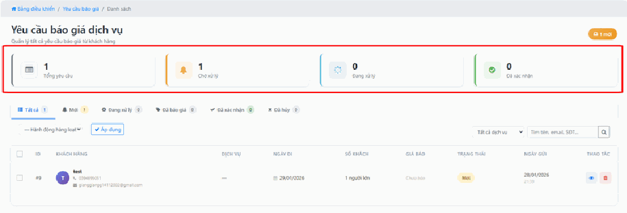
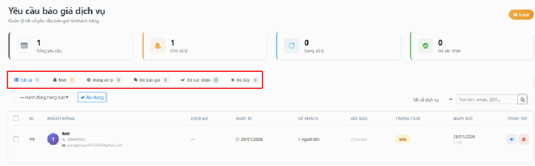
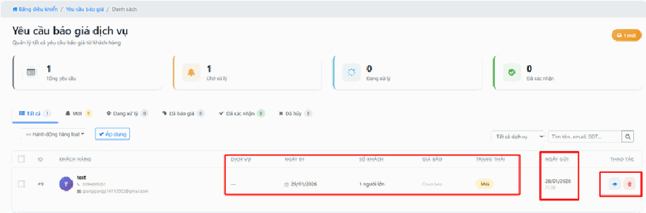

# 3.4. Yêu cầu báo giá

## Quản lý Yêu cầu báo giá dịch vụ

Tất cả các yêu cầu báo giá từ khách hàng thông qua các kênh bán hàng sẽ được hệ thống tự động đổ trực tiếp về website. Điều này giúp bạn phản hồi khách hàng kịp thời và không bỏ lỡ bất kỳ cơ hội kinh doanh nào.

## a, Hệ thống chỉ số tổng quan

Các thẻ màu phía trên giúp bạn nắm bắt nhanh tình hình xử lý yêu cầu:

- Tổng yêu cầu: Tổng số đơn báo giá nhận được.

- Chờ xử lý: Các yêu cầu mới chưa có nhân viên tiếp nhận.

- Đang xử lý & Đã xác nhận: Theo dõi tiến độ làm việc với khách hàng.

## b, Bộ lọc trạng thái thông minh

Bạn có thể phân loại nhanh danh sách yêu cầu theo các tab:

- Tất cả / Mới: Xem các yêu cầu vừa đổ về hệ thống.

- Đang xử lý / Đã báo giá: Kiểm soát những yêu cầu đang trong quá trình thương thảo.

- Đã xác nhận / Đã hủy: Theo dõi tỷ lệ chốt đơn thành công hoặc các lý do khách từ chối.

## c, Thông tin chi tiết & Thao tác

Tại bảng danh sách, hệ thống hiển thị đầy đủ các thông tin cần thiết:

- Khách hàng: Tên, số điện thoại và email để liên hệ trực tiếp.

- Chi tiết dịch vụ: Ngày đi dự kiến và số lượng khách (Người lớn/Trẻ em).

- Trạng thái & Thời gian: Biết chính xác yêu cầu được gửi vào lúc nào và hiện đang ở giai đoạn nào.

- Thao tác nhanh: Sử dụng biểu tượng Con mắt để xem chi tiết yêu cầu hoặc biểu tượng Thùng rác để xóa các yêu cầu rác/test.

