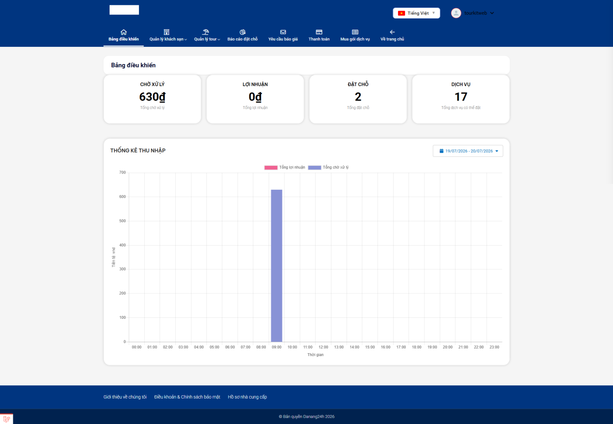

# Khu Nhà cung cấp

**Nhà cung cấp** là các đối tác tự đăng sản phẩm để bán trên website — chủ khách sạn, chủ homestay, công ty tour. Khác với quản trị viên (người vận hành cả website từ khu `/admin`), nhà cung cấp chỉ nhìn thấy và quản lý **những sản phẩm của riêng mình** qua một khu làm việc riêng, nằm ngay trên giao diện website (frontend).

Nói cách khác: nếu bạn là chủ một khách sạn ở Đà Nẵng và được cấp tài khoản nhà cung cấp, bạn tự đăng khách sạn, tạo phòng, đặt giá và theo dõi đơn — mà không cần vào trang quản trị của cả hệ thống, cũng không nhìn thấy sản phẩm của các nhà cung cấp khác.

> **Đây là khu riêng, không phải khu Quản trị.** Mọi hướng dẫn trong mục này áp dụng cho địa chỉ bắt đầu bằng `/vendor/...` (ví dụ `website-cua-ban.com/vendor/dashboard`). Nó khác hoàn toàn với khu Quản trị `/admin` mô tả ở các Khối 1–4. Nếu bạn là quản trị viên toàn hệ thống, bạn không cần đọc mục này.

## Ai đọc mục này?

- Chủ khách sạn / homestay / resort muốn tự đăng cơ sở lưu trú và quản lý phòng.
- Công ty lữ hành muốn tự đăng tour và mở bán theo ngày khởi hành.
- Nhân viên được chủ giao quản lý sản phẩm trên website.

## Ba việc chính bạn sẽ làm

Toàn bộ công việc của một nhà cung cấp gói gọn trong ba bài dưới đây. Chúng độc lập nhau — bạn bán khách sạn thì đọc hai bài đầu, bán tour thì đọc bài cuối.

| Bài | Dùng khi |
|---|---|
| [Nhập & quản lý khách sạn](khach-san.md) | Bạn bán phòng lưu trú: khách sạn, resort, homestay, villa |
| [Nhập & quản lý phòng](phong.md) | Bước tiếp theo bắt buộc sau khi tạo khách sạn — không có phòng thì khách không đặt được gì |
| [Nhập & quản lý tour](tour.md) | Bạn bán chương trình tour trọn gói |

## Trước tiên: phải có tài khoản nhà cung cấp

Một tài khoản khách thường **chưa phải** là nhà cung cấp. Bạn cần đăng ký hoặc nâng cấp thành nhà cung cấp trước, rồi mới thấy khu làm việc `/vendor`.

Có hai con đường, tùy cấu hình website:

**Cách 1 — Đăng ký mới ngay từ đầu.** Vào địa chỉ `website-cua-ban.com/vendor/register`. Form gồm 3 bước ngắn:

1. Nhập **email**.
2. Nhập **họ tên** và **số điện thoại**.
3. Đặt **mật khẩu** (tối thiểu 8 ký tự, nên có cả chữ hoa, chữ thường, số và ký tự đặc biệt).

**Cách 2 — Nâng cấp từ tài khoản đang có.** Nếu bạn đã là khách hàng thường trên website, đăng nhập rồi vào `website-cua-ban.com/user/upgrade-vendor` để xin nâng cấp.

> **Được duyệt ngay hay phải chờ?** Tùy quản trị viên bật hay tắt chế độ "tự động duyệt".
>
> - **Bật:** đăng ký xong là dùng được ngay, hệ thống tự đăng nhập bạn vào khu nhà cung cấp.
> - **Tắt:** tài khoản của bạn sẽ ở trạng thái **chờ duyệt**. Bạn thấy thông báo *"Vui lòng chờ quản trị viên phê duyệt"*. Khi nào quản trị viên bấm duyệt, bạn mới vào được. Hãy liên hệ người quản lý website nếu chờ lâu.

> **Đừng nhầm "Nhà cung cấp" với "Đại lý".** Đây là hai vai trò khác nhau, có khu làm việc khác nhau:
> - **Nhà cung cấp** *đăng sản phẩm để bán* — làm việc ở `/vendor/dashboard`. Chính là mục này.
> - **Đại lý** *bán lại sản phẩm của người khác để hưởng hoa hồng* — làm việc ở `/user/dashboard`, đăng ký ở đường dẫn riêng.
>
> Nếu sau khi đăng nhập bạn thấy màn hình không giống các ảnh trong mục này, rất có thể tài khoản của bạn đang là Đại lý chứ không phải Nhà cung cấp.

## Sau khi đăng nhập: Bảng điều khiển nhà cung cấp

Đăng nhập bằng tài khoản nhà cung cấp, bạn vào thẳng **Bảng điều khiển** tại `/vendor/dashboard`. Đây là màn hình tổng quan việc kinh doanh của riêng bạn:

- **Các thẻ thống kê** ở trên cùng — tổng quan nhanh về đơn và doanh thu của bạn.
- **Biểu đồ doanh thu** ("Earning statistics") — có bộ chọn khoảng thời gian để xem theo tuần, tháng, quý.

### Thanh menu của nhà cung cấp

Khác với khu quản trị (menu nằm dọc bên trái), khu nhà cung cấp có **thanh menu ngang** ở đầu trang. Các mục thường gặp (nhãn hiện tiếng Anh):

| Mục | Đưa bạn tới |
|---|---|
| **Bảng điều khiển** | Màn hình tổng quan vừa nói ở trên |
| **Hotel** | [Quản lý khách sạn](khach-san.md) của bạn |
| **Tour** | [Quản lý tour](tour.md) của bạn |
| **Booking Report** | Báo cáo các lượt khách đã đặt |
| **Enquiry Report** | Các yêu cầu hỏi/báo giá khách gửi tới |
| **Payouts** | Đối soát và nhận tiền thanh toán |
| **Teams** | Thêm nhân viên cùng quản lý gian hàng |
| **Gói dịch vụ** | Xem/mua gói để được đăng bán |
| **Về trang chủ** | Quay lại website như một khách bình thường |

> **Rất quan trọng — vì sao menu của bạn chỉ có 3 mục?** Nếu bạn mới đăng ký và **chưa mua gói dịch vụ**, thanh menu chỉ hiện đúng **Bảng điều khiển**, **Gói dịch vụ** và **Về trang chủ**. Các mục **Hotel**, **Tour**… sẽ **bị ẩn** cho tới khi bạn có một gói dịch vụ còn hiệu lực. Đây không phải lỗi. Hãy vào **Gói dịch vụ** để đăng ký gói trước, sau đó các mục quản lý sản phẩm mới hiện ra.

> **Không thấy một mục dù đã mua gói?** Một số mục (Payouts, Teams…) phụ thuộc phân quyền và cấu hình website. Nếu thiếu, hãy liên hệ quản trị viên — có thể tài khoản của bạn chưa được cấp quyền đó, hoặc website chưa bật tính năng đó.

## Một khái niệm phải nắm: Trạng thái hiển thị

Đây là điều gây bối rối nhất cho người mới, nên bạn hãy đọc kỹ một lần. Mỗi sản phẩm (khách sạn, phòng, tour) luôn mang một **trạng thái**, quyết định khách ngoài website có nhìn thấy nó hay không:

| Nhãn bạn thấy | Ý nghĩa | Khách có thấy? |
|---|---|---|
| **Đang xuất bản** | Đã đăng bán bình thường | ✅ Có |
| **Chờ duyệt** | Đã gửi đăng, đang đợi quản trị viên phê duyệt | ❌ Chưa |
| **Chưa hiển thị** | Bạn đã nhập đủ nhưng chủ động tạm ẩn | ❌ Không |
| **Bản nháp** | Đang làm dở, chưa nhập đủ thông tin bắt buộc | ❌ Không |

> **Nút "Ẩn khỏi website" thực chất đưa sản phẩm về dạng nháp.** Hệ thống không có một trạng thái "ẩn" tách riêng. Khi bạn bấm "Ẩn khỏi website", sản phẩm chuyển sang trạng thái nháp (hiện badge **"Chưa hiển thị"**) và **biến mất khỏi website công khai**. Muốn bán lại, bạn mở sản phẩm ra và đăng lại.

> **Website có thể bắt quản trị viên duyệt trước.** Nếu cấu hình bật chế độ này, lần đầu bạn đăng một khách sạn hoặc tour, nó không lên bán ngay mà chuyển sang **"Chờ duyệt"**. Khi quản trị viên duyệt, nó mới thành "Đang xuất bản". (Riêng **phòng** thì đăng là hiển thị ngay, không qua bước duyệt.)

## Lưu ý & xử lý sự cố

**Đăng nhập xong không thấy khu nhà cung cấp / bị đưa về trang chủ:** tài khoản của bạn có thể chưa được duyệt làm nhà cung cấp, hoặc đang là vai trò Đại lý. Xem lại phần "Trước tiên: phải có tài khoản nhà cung cấp" ở trên.

**Menu chỉ có 3 mục, không thấy Hotel/Tour:** bạn chưa mua gói dịch vụ. Vào mục **Gói dịch vụ** để đăng ký.

**Đã đăng sản phẩm mà ngoài website không thấy:** kiểm tra trạng thái sản phẩm (xem bảng trạng thái ở trên). Phải là **"Đang xuất bản"** khách mới thấy. Nếu đang "Chờ duyệt" thì đợi quản trị viên; nếu "Bản nháp" thì bạn chưa nhập đủ thông tin bắt buộc.

**Sản phẩm cũ tôi từng nhập không thấy trong danh sách:** khu này chỉ hiển thị sản phẩm **do chính bạn tạo qua khu nhà cung cấp**. Những sản phẩm nhập từ nguồn khác (kênh bên ngoài, hoặc do quản trị viên tạo hộ) có thể không hiện ở đây — hãy liên hệ quản trị viên.

## Xem thêm

- [Hướng dẫn đăng nhập tài khoản](../huong-dan-dang-nhap-tai-khoan.md)
- [Nhập & quản lý khách sạn](khach-san.md)
- [Nhập & quản lý phòng](phong.md)
- [Nhập & quản lý tour](tour.md)
