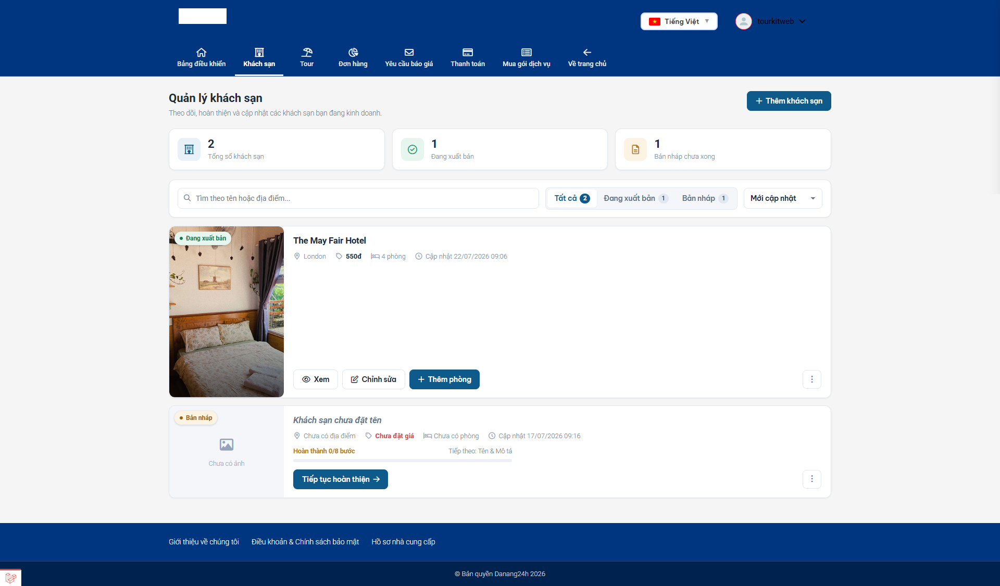
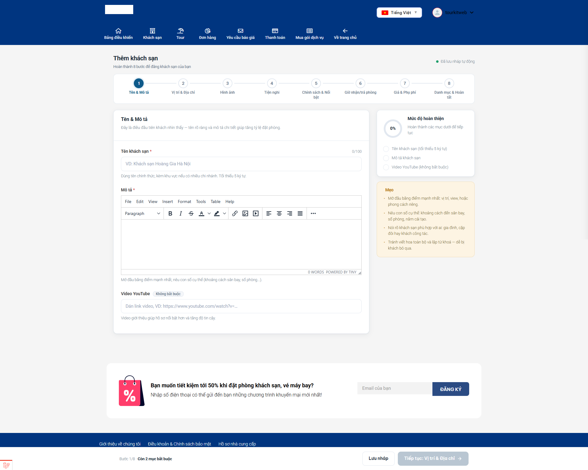

# Nhập & quản lý khách sạn

## Màn hình danh sách khách sạn

Đây là màn hình đầu tiên khi bấm **Hotel**.&#x20;

Trên cùng là **ba thẻ thống kê** cho bạn nhìn nhanh tình hình:

* **Tổng số khách sạn**
* **Đang xuất bản** — số đang bán được trên website
* **Bản nháp chưa xong** — số bạn còn làm dở

Bên dưới là các công cụ lọc danh sách:

* **Ô tìm kiếm** — gõ tên hoặc địa điểm để lọc nhanh ngay tại chỗ (không cần bấm nút, danh sách tự lọc).
* **Tab trạng thái** — _Tất cả_ / _Đang xuất bản_ / _Bản nháp_, mỗi tab kèm con số đếm.
* **Sắp xếp** — _Mới cập nhật_, _Tên A → Z_, _Giá cao → thấp_, _Giá thấp → cao_.

### Mỗi thẻ khách sạn có gì?

Mỗi khách sạn hiện ra dưới dạng một **thẻ** (card), trên đó có:

* **Badge trạng thái** ở góc — _Đang xuất bản_, _Chờ duyệt_, _Chưa hiển thị_ hoặc _Bản nháp_ (ý nghĩa xem mục "Trạng thái hiển thị" ở [trang tổng quan](./)).
* Thông tin nhanh: địa điểm, giá, số phòng, thời gian cập nhật gần nhất. Chỗ nào chưa nhập sẽ ghi "Chưa có địa điểm", "Chưa đặt giá", "Chưa có phòng".
* Với khách sạn **còn dở**, thẻ hiện thêm **thanh tiến độ** kiểu "Hoàn thành 4/8 bước" và gợi ý bước tiếp theo.
* **Các nút thao tác:**
  * Với bản nháp: **"Tiếp tục hoàn thiện"** (hoặc **"Xem lại & đăng"** nếu bạn đã nhập đủ các mục bắt buộc).
  * Với khách sạn đã đăng: **"Xem"**, **"Chỉnh sửa"**, **"Thêm phòng"**.
  * **Nút ba chấm (⋮)** mở thêm: _Danh sách phòng_, _Nhân bản_, _Ẩn khỏi website_, _Xoá_.

## Thêm khách sạn mới — Trình nhập theo từng bước

Bấm nút **"Thêm khách sạn"** ở đầu trang. Hệ thống **tạo ngay một bản nháp** và đưa bạn vào **trình nhập theo bước** (wizard) — một dạng điền thông tin chia nhỏ thành 8 bước, làm xong bước này bấm sang bước kia, thay vì phải điền một trang dài.

### 8 bước nhập khách sạn

**Bước 1 — Tên & Mô tả**

* ⭐ **Tên khách sạn** và ⭐ **Nội dung mô tả** giới thiệu.
* **Video** giới thiệu (dán link YouTube, không bắt buộc).

**Bước 2 — Vị trí & Địa chỉ**

* ⭐ Chọn **Địa điểm** (tỉnh/thành phố) và ⭐ nhập **Địa chỉ** cụ thể.
* Ghim vị trí trên **bản đồ** và mô tả khu vực xung quanh (không bắt buộc).

**Bước 3 — Hình ảnh**

* ⭐ **Ảnh đại diện** — ảnh khách nhìn thấy đầu tiên, hãy chọn ảnh đẹp nhất.
* **Ảnh bìa (banner)** và **Thư viện ảnh** (nhiều ảnh phụ để khách xem chi tiết).

**Bước 4 — Tiện nghi**

* Tích chọn các tiện nghi **của cả khách sạn**: hồ bơi, bãi đỗ xe, phòng gym, wifi… Đây là các tiêu chí để khách lọc tìm trên website.

**Bước 5 — Chính sách & Nổi bật**

* **Hạng sao**, **số điện thoại**, **website** của khách sạn.
* **Điểm nổi bật** và **Chính sách** (nội quy, quy định chung).

**Bước 6 — Giờ nhận/trả phòng**

* **Giờ nhận phòng (check-in)** và **giờ trả phòng (check-out)**.
* Cho phép đặt theo ngày, số ngày báo trước tối thiểu, số đêm ở tối thiểu.

**Bước 7 — Giá & Phụ phí**

* ⭐ **Giá** cơ bản của khách sạn.
* **Giá khuyến mãi**, thời gian flash sale.
* Bật/tắt **phụ phí thêm người** và **phí dịch vụ**.

**Bước 8 — Danh mục & Hoàn tất**

* Chọn **Danh mục** (loại hình: 5 sao, resort, homestay…) để khách dễ lọc.
* Chọn các khách sạn **tương tự** để gợi ý chéo, và điền thông tin **SEO** (tiêu đề, mô tả hiển thị trên Google).
* Bấm **"Hoàn tất & Đăng"** để đăng bán.

> **Điều gì xảy ra khi bấm "Hoàn tất & Đăng"?**
>
> * Nếu website **không** bắt duyệt: khách sạn chuyển sang **"Đang xuất bản"** ngay.
> * Nếu website **có** bắt quản trị viên duyệt: khách sạn chuyển sang **"Chờ duyệt"** — bạn phải đợi quản trị viên phê duyệt thì khách mới thấy.

> **Bấm "Hoàn tất" mà bị đưa sang trang Gói dịch vụ?** Nghĩa là gói dịch vụ của bạn đã hết hạn hoặc hết lượt đăng. Chỉ những sản phẩm **đang xuất bản** mới tính vào hạn mức gói. Hãy gia hạn/nâng gói rồi đăng lại.

## Bước tiếp theo bắt buộc: Tạo phòng

Đăng xong khách sạn, việc **chưa hề kết thúc**. Khách đặt phòng chứ không đặt khách sạn, nên bạn phải tạo ít nhất một loại phòng. Từ thẻ khách sạn, bấm **"Thêm phòng"** (hoặc mở nút ⋮ > _Danh sách phòng_).

👉 Xem chi tiết ở bài [Nhập & quản lý phòng](phong.md).

## Sửa khách sạn đã đăng

Bấm **"Chỉnh sửa"** trên thẻ khách sạn. Hệ thống mở lại đúng trình nhập 8 bước ở trên, bạn nhảy tới bước cần sửa, chỉnh rồi bấm **"Lưu thay đổi"**.

## Tạm ẩn & Xoá khách sạn

Mở nút **ba chấm (⋮)** trên thẻ khách sạn:

* **"Ẩn khỏi website"** — tạm gỡ khách sạn khỏi website mà không xoá. Nó chuyển về dạng nháp, hiện badge **"Chưa hiển thị"**. Muốn bán lại thì mở ra và đăng lại.
* **"Nhân bản"** — tạo một bản sao để đỡ phải nhập lại từ đầu khi bạn có nhiều khách sạn giống nhau.
* **"Xoá"**:
  * Xoá một **bản nháp** = xoá **vĩnh viễn**, không lấy lại được.
  * Xoá một khách sạn **đã đăng** = đưa vào **thùng rác**, vẫn khôi phục được.

> **Lỡ xoá khách sạn đã đăng?** Nó nằm trong mục **Khôi phục** (thùng rác) của khu nhà cung cấp, bạn lấy lại được. Nhưng **bản nháp thì xoá là mất luôn** — hãy cân nhắc trước khi xoá nháp.

## Lưu ý & xử lý sự cố

**Bấm "Thêm khách sạn" nhưng không vào được / không thấy nút:** kiểm tra thanh menu có mục **Hotel** không. Không có nghĩa là bạn chưa mua gói dịch vụ.

**Đăng xong mà ngoài website không thấy khách sạn:** kiểm tra lần lượt:

1. Trạng thái có phải **"Đang xuất bản"** không? Nếu "Chờ duyệt" thì đợi quản trị viên; nếu "Bản nháp" thì bạn chưa nhập đủ mục bắt buộc (các mục có dấu ⭐).
2. Đã tạo **ít nhất một loại phòng** chưa? Không có phòng, khách không đặt được.
3. Đã **mở bán ngày nào** cho phòng chưa (xem bài Phòng)?
4. Thử tải lại trang bằng **Ctrl + F5**.

**Nhập giá bị sai số:** gõ số thuần, không thêm dấu chấm phân cách hay chữ "đ". Ví dụ gõ `1200000` chứ đừng gõ `1.200.000đ`.

**Tải ảnh mãi không lên:** ảnh quá nặng, hãy giảm còn khoảng 1–2 MB rồi tải lại.

**Bị đá sang trang Gói dịch vụ khi đăng:** gói của bạn hết hạn hoặc hết lượt. Vào mục **Gói dịch vụ** để gia hạn/nâng gói.

## Có nhiều khách sạn? Nhập hàng loạt bằng Excel

Nếu bạn cần đăng nhiều khách sạn cùng lúc, thay vì điền từng cái qua 8 bước, hãy dùng nút **"Tải file mẫu"** và **"Import Excel"** ở đầu màn danh sách để khai báo hàng loạt trong một file bảng tính rồi tải lên một lần.

👉 Xem chi tiết ở bài [Nhập hàng loạt bằng Excel](import-excel.md).

## Xem thêm

* [Khu Nhà cung cấp (tổng quan)](./)
* [Nhập & quản lý phòng](phong.md)
* [Nhập & quản lý tour](tour.md)
* [Nhập hàng loạt bằng Excel](import-excel.md)
