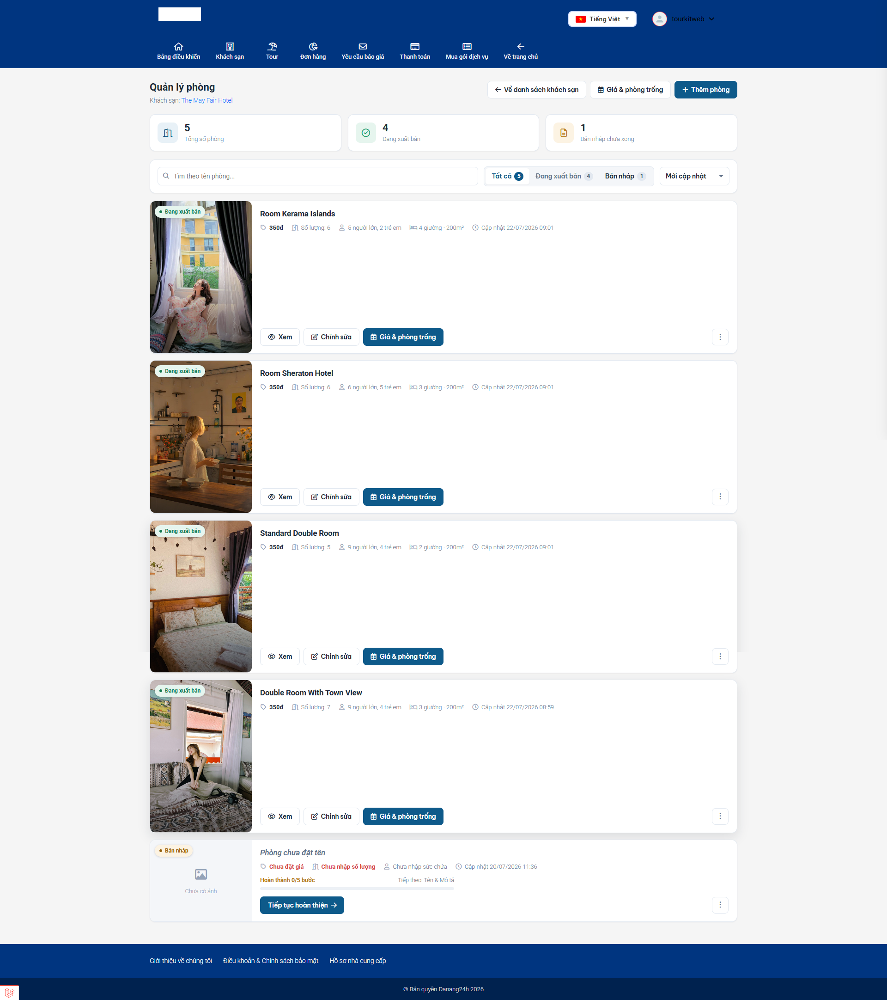
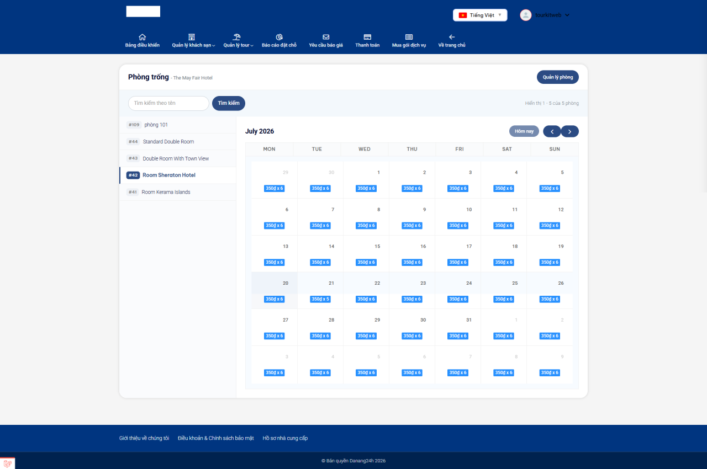

# Nhập & quản lý phòng

**Phòng** là thứ khách hàng thực sự đặt và trả tiền. Một khách sạn dù nhập đẹp đến đâu, nếu chưa có phòng bên trong thì khách nhìn thấy mà **không đặt được gì**. Vì vậy đây là bước quan trọng nhất, làm ngay sau khi tạo khách sạn.

Mỗi khách sạn có thể có nhiều **loại phòng** khác nhau (Deluxe, Suite, Phòng gia đình…). Mỗi loại phòng có giá riêng, số lượng riêng, sức chứa riêng và lịch bán riêng.

> **Đường dẫn:** Từ danh sách khách sạn, bấm **"Thêm phòng"** trên thẻ khách sạn, hoặc mở nút ⋮ > **"Danh sách phòng"**. Bạn cũng có thể vào từ trong màn hình sửa khách sạn.

## Màn hình danh sách phòng

Màn hình này gắn với **một khách sạn cụ thể** — tên khách sạn hiện ở tiêu đề. Nó liệt kê mọi loại phòng của khách sạn đó.

Trên cùng có **ba thẻ thống kê**: Tổng số phòng / Đang xuất bản / Bản nháp chưa xong — cùng ô tìm kiếm, tab trạng thái và sắp xếp giống hệt màn hình khách sạn.

Các nút quan trọng ở đầu trang:

- **"Về danh sách khách sạn"** — quay lại danh sách các khách sạn.
- **"Giá & phòng trống"** — mở lịch để đặt giá và số phòng theo từng ngày (xem phần cuối bài).
- **"Thêm phòng"** — tạo một loại phòng mới.

## Thêm phòng mới — Trình nhập 5 bước

Bấm **"Thêm phòng"**. Giống như khi thêm khách sạn, hệ thống **tạo ngay một phòng nháp** rồi đưa bạn vào trình nhập theo bước — lần này gồm **5 bước**. Bạn có thể dừng giữa chừng, thông tin vẫn được lưu ngầm.

Cuối mỗi bước vẫn là ba nút quen thuộc: **"Quay lại"**, **"Lưu nháp"**, **"Tiếp tục"** (bước cuối là **"Hoàn tất"**).

### 5 bước nhập phòng

Dấu ⭐ là mục **bắt buộc**.

**Bước 1 — Tên & Mô tả**
- ⭐ **Tên phòng** (ví dụ: *Deluxe hướng biển*, *Phòng gia đình 4 người*).
- **Mô tả phòng** — điểm đặc trưng của loại phòng này.

**Bước 2 — Chi tiết phòng**

Đây là bước dễ nhập sai nhất, hãy làm cẩn thận:

- **Số lượng phòng** — bạn có **bao nhiêu** phòng thuộc loại này. Đây là con số quyết định hệ thống cho bao nhiêu khách đặt trước khi báo hết phòng.
- **Không giới hạn số phòng** — tích nếu loại phòng này luôn còn (hiếm dùng).
- **Số giường** và **Diện tích phòng** (m²).
- **Số người lớn tối đa** và **Số trẻ em tối đa** mỗi phòng chứa được.
- **Số đêm ở tối thiểu**.

> **"Số lượng phòng" là con số hay bị nhập sai nhất.** Nếu bạn có 10 phòng Deluxe mà chỉ điền 1, website sẽ chỉ cho **đúng một khách** đặt rồi báo "hết phòng" cho tất cả những người sau. Hãy điền đúng số phòng thực có.

**Bước 3 — Tiện nghi**
- Tích các đặc điểm **của riêng loại phòng này**: hướng biển, có ban công, có bồn tắm, bao gồm bữa sáng, hoàn hủy miễn phí…
- Khác với tiện nghi ở bước khách sạn (áp cho cả tòa nhà), đây là tiện nghi của **từng phòng**.

**Bước 4 — Hình ảnh**
- **Ảnh đại diện** và **Thư viện ảnh** của riêng loại phòng này. Khách rất coi trọng ảnh phòng thật, nên hãy chụp rõ giường, cửa sổ, nhà tắm.

**Bước 5 — Giá & Hoàn tất**
- ⭐ **Giá / đêm** — giá cơ bản một đêm của loại phòng này. Đây là giá khách thực sự trả.
- Bật **phụ thu khi thêm người** nếu khách ở đông hơn tiêu chuẩn:
  - **Giá phụ thu / người lớn** và **Giá phụ thu / trẻ em**.
  - **Số người lớn / trẻ em tối đa có thể thêm**.
- Cuối bước có thêm phần **đặt giá theo ngày** (xem ngay dưới đây).
- Bấm **"Hoàn tất"** để lưu.

> **Phòng đăng là hiển thị ngay.** Khác với khách sạn và tour, phòng **không** qua bước "Chờ duyệt". Bấm Hoàn tất là phòng vào trạng thái **"Đang xuất bản"** luôn (miễn là khách sạn mẹ cũng đang xuất bản).

## Đặt giá theo từng ngày (Giá & phòng trống)

Giá bạn nhập ở Bước 5 là **giá gốc**, áp dụng cho mọi ngày. Nhưng thực tế bạn thường muốn:

- Tăng giá cuối tuần, lễ Tết.
- Giảm giá mùa thấp điểm.
- Đóng bán những ngày phòng đã kín qua kênh khác, hoặc đang sửa chữa.

Đó là việc của mục **giá theo ngày**. Có hai chỗ để làm:

1. **Ngay trong Bước 5** của trình nhập phòng — có sẵn một tấm **lịch** nhỏ "Giá theo ngày (tuỳ chọn)".
2. Hoặc nút **"Giá & phòng trống"** ở đầu màn hình danh sách phòng.

**Cách dùng lịch:**

1. **Bôi (kéo chọn) một khoảng ngày** trên lịch, hoặc bấm vào một ngày.
2. Một khung nhỏ mở ra, nhập:
   - **Giá / đêm** riêng cho những ngày đó.
   - **Số lượng phòng** mở bán cho những ngày đó.
3. Bấm **"Áp dụng"**.

> **Sửa giá theo ngày KHÔNG làm mất giá gốc.** Giá gốc ở Bước 5 vẫn giữ nguyên; bạn chỉ ghi đè riêng cho những ngày bạn chọn. Những ngày không đụng tới vẫn dùng giá gốc.

> **Mẹo tiết kiệm thời gian:** thay vì bấm từng ngày, hãy làm theo đợt — ví dụ đầu mỗi tháng bôi cả tháng sau một lượt để mở bán và định giá.

## Lưu ý & xử lý sự cố

**Khách sạn đã đăng mà khách vẫn không đặt được:** gần như chắc chắn do **chưa có phòng nào**, hoặc phòng đang ở trạng thái "Bản nháp". Mỗi khách sạn cần ít nhất một loại phòng "Đang xuất bản".

**Khách báo "hết phòng" trong khi bạn còn phòng:** vào **"Giá & phòng trống"**, chọn đúng loại phòng, kiểm tra ngày khách muốn đặt xem **Số lượng phòng** có đang là 0, hoặc ngày đó có bị đóng bán không.

**Nhập 10 phòng mà chỉ bán được 1:** bạn đã điền **Số lượng phòng = 1** ở Bước 2. Vào sửa phòng, chỉnh lại đúng số.

**Giá hiển thị ngoài web khác giá tôi nhập:** kiểm tra mục **giá theo ngày** — có thể ngày đó bạn (hoặc đồng nghiệp) đã đặt một mức giá riêng đè lên giá gốc.

**Nhập giá bị sai số:** gõ số thuần, không thêm dấu chấm hay chữ "đ". Ví dụ `850000` chứ không phải `850.000đ`.

## Xem thêm

- [Nhập & quản lý khách sạn](khach-san.md)
- [Khu Nhà cung cấp (tổng quan)](README.md)
- [Nhập & quản lý tour](tour.md)
