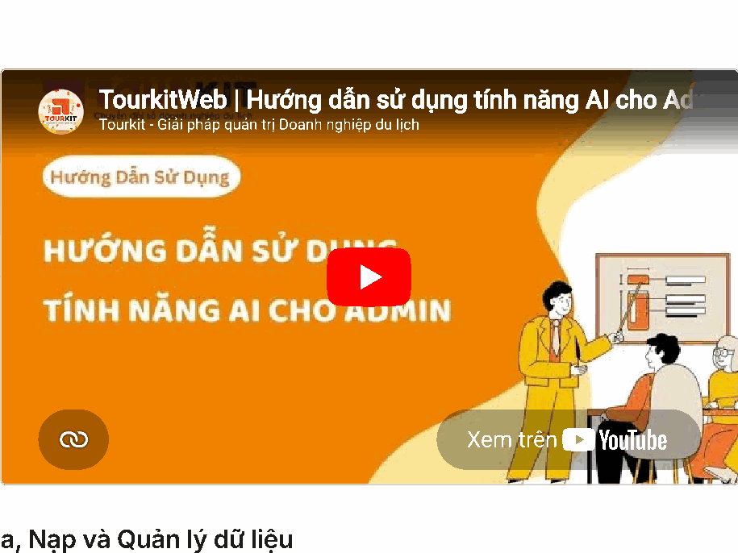

# Tính năng AI cho Admin

*📺 Video hướng dẫn: TourkitWeb | Hướng dẫn sử dụng tính năng AI cho Ad*

## a, Nạp và Quản lý dữ liệu

Đây là bước kết nối dữ liệu từ website của bạn vào chatbot AI.

- Kết nối API: Nhập tên miền website của bạn vào ô Tên miền API (ví dụ: ). [https://vnexpresstour.com](https://vnexpresstour.com)

- Kiểm tra & Lưu: Nhấn nút Kiểm tra để hệ thống xác nhận trạng thái hoạt động của các mục (Tour, Khách sạn, Sự kiện, Du thuyền). Sau đó nhấn Lưu.

- Nạp dữ liệu: Bạn có thể bấm vào từng ô (Tour, Khách sạn...) để nạp lẻ hoặc nhấn nút Nạp tất cả màu xanh để đưa toàn bộ dữ liệu vào AI.

- Quản lý AI: Tại phần Quản lý dữ liệu TourkitWeb AI, nhấn Tải lại để xem danh sách dữ liệu đã nạp. Bạn có thể chọn xóa từng mục hoặc Xóa tất cả nếu muốn làm mới.

## b, Chỉnh sửa cấu hình Widget chat

Thiết lập Giao diện Cơ bản

- Tên hiển thị (header): Nhập tên thương hiệu hoặc tên trợ lý ảo (ví dụ: VIETNAM EXPRESSTOUR) sẽ xuất hiện ở thanh tiêu đề trên cùng của khung chat.

- Màu chủ đạo: Chọn màu sắc phù hợp với nhận diện thương hiệu của bạn bằng cách chọn mã màu (ví dụ: ). #ff6b35

- Placeholder ô nhập tin nhắn: Nội dung gợi ý mờ hiển thị trong ô nhập liệu trước khi khách hàng gõ chữ (ví dụ: "Nhập câu hỏi của anh/chị...").

Kiểm tra và Hoàn tất

- Xem trước (Demo): Bạn có thể quan sát trực tiếp sự thay đổi tại phần khung chat mô phỏng ở góc dưới bên trái hình ảnh để điều chỉnh cho ưng ý.

- Lưu cấu hình Widget: Nhấn nút màu cam này để áp dụng toàn bộ các thay đổi lên website thực tế.

- Khôi phục mặc định: Nhấn nút này nếu bạn muốn xóa các tùy chỉnh và quay về thiết lập ban đầu của hệ thống.

## c, Cấu hình AI Trip Planner

Công cụ này cho phép AI tự động tạo lịch trình chi tiết, gợi ý tour và thu thập số điện thoại khách hàng dựa trên điểm đến, ngày đi và sở thích của họ.

- Màu chủ đạo widget: Nhập mã màu (ví dụ: ) để thay đổi màu sắc #f7931e hiển thị của widget sao cho phù hợp với tông màu website của bạn.

- Thiết lập Điểm đến: ◦ Điểm đến trong nước: Nhập danh sách các điểm đến tại Việt Nam.

◦ Điểm đến nước ngoài: Nhập danh sách các điểm đến quốc tế. ◦ Định dạng: Mỗi dòng nhập theo cấu trúc (Ví dụ: icon Tên điểm đến 🏝 Đà Nẵng ). Nếu để trống, hệ thống sẽ sử dụng danh sách mặc định.

- Hoàn tất: ◦ Nhấn Lưu cấu hình Trip Planner để áp dụng các thay đổi. ◦ Nhấn Xem Demo để kiểm tra giao diện và hoạt động của công cụ trước khi công khai.

## d, Quản lý Quota (Hạn mức lượt chat)

Phần này giúp bạn theo dõi mức độ sử dụng AI của tài khoản:

- Theo dõi lượt dùng: ◦ Hệ thống hiển thị trực quan số lượt đã dùng (ví dụ: 97 / 100 lượt). ◦ Khi hết lượt, bạn cần liên hệ quản trị viên (admin) để được nạp thêm.

- Thông tin Quota chi tiết: ◦ Đã dùng: Tổng số lượt chat đã thực hiện (ví dụ: 272). ◦ Còn lại: Số lượt chat bạn có thể tiếp tục sử dụng (ví dụ: 728). ◦ Tổng: Tổng hạn mức được cấp cho tài khoản (ví dụ: 1000).

- API Key: Dãy ký tự dùng để xác thực và kết nối widget với hệ thống chatbot của bạn.

## e, Thiết lập System Prompt

Đây là nơi bạn định hình "tính cách" và phạm vi kiến thức để điều chỉnh cách bot giao tiếp với khách hàng.

- Nội dung prompt: Nhập văn bản mô tả vai trò, nhiệm vụ và các quy tắc ứng xử của chatbot. Ví dụ: Thiết lập bot đóng vai nhân viên tư vấn của VN EXPRESS TOUR để hỗ trợ đặt tour, khách sạn, vé máy bay và tư vấn visa.

- Hỗ trợ định dạng: Bạn có thể sử dụng định dạng Markdown để làm nội dung rõ ràng hơn. Nếu để trống, hệ thống sẽ sử dụng prompt mặc định.

- Lưu Prompt: Nhấn nút Lưu Prompt màu cam để áp dụng các thay đổi.

- Khôi phục mặc định: Nhấn nút này nếu bạn muốn xóa các tùy chỉnh và quay về nội dung gốc của hệ thống.

## f, Cấu hình Chống lạm dụng

Tính năng này bảo vệ chatbot khỏi bị spam bằng cách tự động chặn các địa chỉ IP gửi quá nhiều tin nhắn trong thời gian ngắn.

- Chế độ bảo vệ: ◦ Tắt (Mặc định): Không giới hạn lượt chat theo địa chỉ IP. ◦ Bật: Gạt công tắc sang phải để giới hạn mỗi người (theo IP) chỉ được gửi một số lượng tin nhắn nhất định.

- Khi nào cần bật?: ◦ Khi bạn nghi ngờ có hành vi cố tình spam để làm tiêu tốn lượt chat (quota) của tài khoản. ◦ Khi thấy hạn mức (quota) hết nhanh bất thường mà không rõ nguyên nhân.

- Lưu cấu hình: Sau khi thay đổi trạng thái công tắc, nhấn nút Lưu cấu hình để kích hoạt tính năng bảo vệ.

## g, Mẫu trả lời số điện thoại

- Thiết lập Hotline: Nhập số điện thoại vào ô Số hotline để hiển thị khi hệ thống hết lượt chat hoặc khi khách cần liên hệ trực tiếp.

- Cấu hình Phản hồi SĐT: Tùy chỉnh câu trả lời khi khách để lại thông tin bằng cách sử dụng biến để hệ thống tự động chèn số điện {phone} thoại của khách vào nội dung chat.

- Xử lý khi không tìm thấy dịch vụ: Biên soạn mẫu trả lời khi chatbot không tìm thấy tour hoặc khách sạn phù hợp, sử dụng biến để {hotline} hướng dẫn khách gọi điện hỗ trợ.

- Lưu hoặc Khôi phục: Nhấn Lưu mẫu trả lời để áp dụng các thay đổi hoặc Khôi phục mặc định để quay về thiết lập gốc của hệ thống.

## h, Lưu ý về TourKit Agent API Key

- Lưu ý về API Key: ❌ Tuyệt đối không tự ý thay đổi hoặc nhấn nút Xóa API Key nếu chatbot đang hoạt động ổn định, vì điều này sẽ làm bot ngừng phản hồi ngay lập tức.

## i, Lưu ý về Cấu hình TourkitWeb AI

- Lưu ý về cấu hình JSON: ❌ Phần mã trong ô Cấu hình JSON chứa thông tin xác thực tài khoản dịch vụ ( ); việc can thiệp sai lệch service_account vào đoạn mã này sẽ khiến tính năng AI Search bị lỗi.

