# Tính năng AI cho Admin

Trang này dành cho **bạn — người quản trị website**. Đây là nơi bạn dạy cho trợ lý ảo biết mình đang bán gì, chỉnh khung chat cho hợp màu thương hiệu, quy định cách nó nói chuyện với khách, và theo dõi xem còn bao nhiêu lượt chat.

**Điều quan trọng nhất cần nhớ:** AI **không tự biết** bạn bán gì. Nó chỉ biết những gì bạn **nạp** vào cho nó. Nếu chưa nạp dữ liệu, khách vào hỏi sẽ nhận được câu trả lời trống rỗng hoặc chung chung.



## a, Nạp và quản lý dữ liệu

Đây là bước **quan trọng nhất** và cũng là bước đầu tiên bạn phải làm. Nó giống như việc đưa cho nhân viên mới cuốn catalogue sản phẩm: chưa đưa thì họ không biết công ty bán gì để mà tư vấn.

### Bước 1: Kết nối API

Nhập tên miền website của bạn vào ô **"Tên miền API"**.

Ví dụ: `https://vnexpresstour.com`

> **Lưu ý:** Nhớ gõ đầy đủ cả phần `https://` ở đầu, và **không để thừa dấu cách** ở đầu hoặc cuối. Lỗi này rất hay gặp khi bạn copy tên miền từ chỗ khác dán vào.

### Bước 2: Kiểm tra và lưu

Nhấn nút **"Kiểm tra"** để hệ thống xác nhận trạng thái hoạt động của các mục: Tour, Khách sạn, Sự kiện, Du thuyền.

Nếu mọi thứ báo bình thường, nhấn **"Lưu"**.

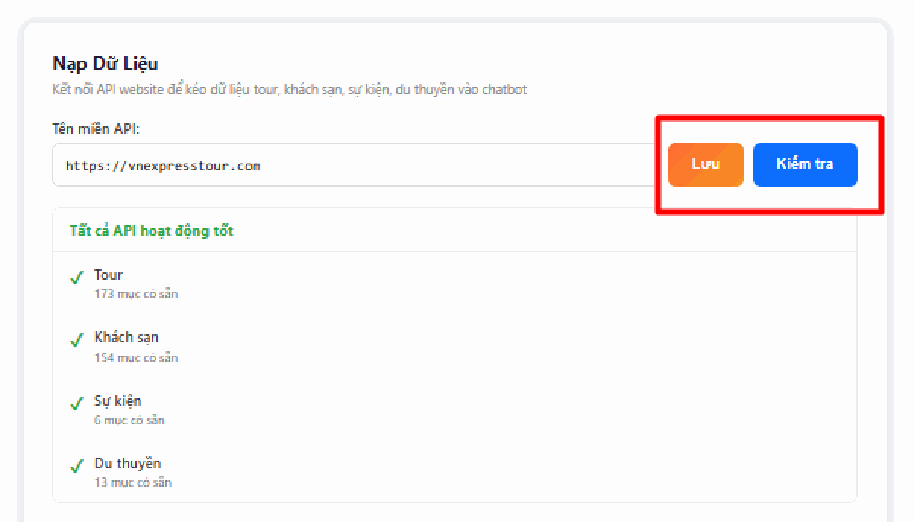

### Bước 3: Nạp dữ liệu

Đây là lúc bạn thực sự đưa danh sách tour, khách sạn của mình vào cho AI học:

* **Nạp lẻ từng mục** — bấm vào từng ô (Tour, Khách sạn…) nếu bạn chỉ muốn cập nhật một loại sản phẩm.
* **Nạp toàn bộ** — nhấn nút **"Nạp tất cả"** màu xanh để đưa hết dữ liệu vào AI một lần.

> **Cực kỳ quan trọng:** Mỗi khi bạn **thêm tour mới, sửa giá, hoặc đổi thông tin sản phẩm**, bạn phải quay lại đây **nạp lại dữ liệu**. Nếu không, trợ lý ảo vẫn nhớ thông tin cũ và sẽ **báo giá cũ cho khách** — dễ dẫn tới hiểu lầm và mất uy tín.

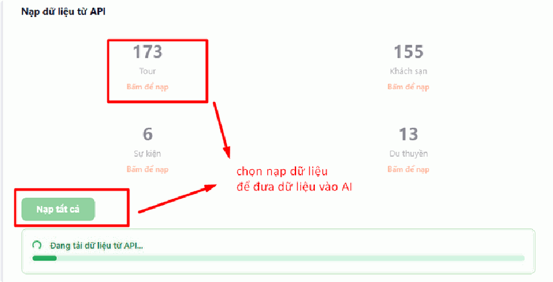

### Bước 4: Quản lý dữ liệu đã nạp

Tại phần **"Quản lý dữ liệu TourkitWeb AI"**, nhấn **"Tải lại"** để xem danh sách những gì đã nạp vào AI.

Tại đây bạn có thể:

* **Xóa từng mục** — bỏ đi một sản phẩm không còn bán nữa.
* **Xóa tất cả** — dọn sạch toàn bộ để nạp lại từ đầu cho mới.

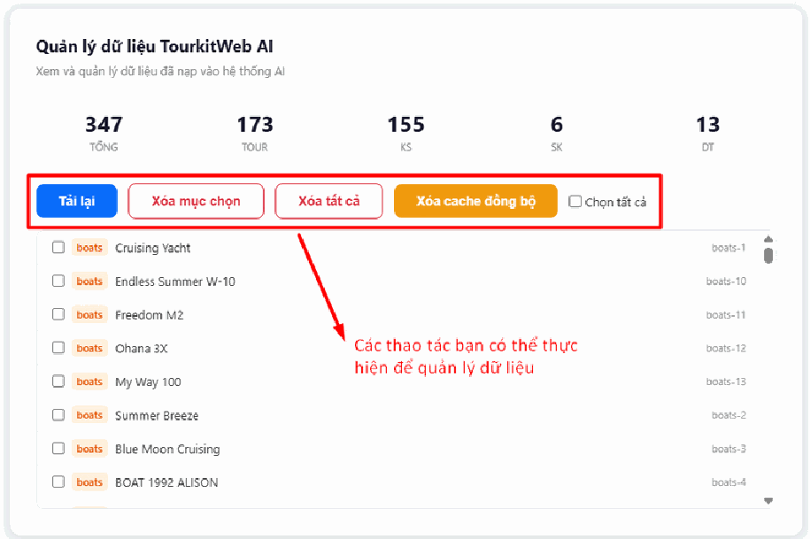

## b, Chỉnh sửa cấu hình Widget chat

"Widget chat" chính là **khung chat nhỏ ở góc màn hình** mà khách nhìn thấy. Phần này giúp bạn chỉnh cho nó hợp với màu sắc và tên thương hiệu của mình, thay vì để mặc định.

### Thiết lập giao diện cơ bản

* **Tên hiển thị (header)** — nhập tên thương hiệu hoặc tên trợ lý ảo sẽ hiện ở thanh tiêu đề trên cùng khung chat. Ví dụ: `VIETNAM EXPRESSTOUR`.
* **Màu chủ đạo** — chọn màu hợp với nhận diện thương hiệu bằng cách nhập mã màu, ví dụ `#ff6b35` (màu cam).
* **Placeholder ô nhập tin nhắn** — đây là dòng chữ mờ gợi ý hiện sẵn trong ô nhập, khách gõ chữ vào là nó tự mất. Ví dụ: `Nhập câu hỏi của anh/chị...`

> **Mã màu là gì?** Là dãy ký tự bắt đầu bằng dấu `#` để chỉ chính xác một màu, ví dụ `#ff6b35`. Nếu bạn không biết mã màu thương hiệu của mình, hãy hỏi người thiết kế logo cho bạn, hoặc bấm vào ô màu để chọn trực tiếp bằng mắt.

### Kiểm tra và hoàn tất

* **Xem trước (Demo)** — bạn quan sát trực tiếp thay đổi tại khung chat mô phỏng ở **góc dưới bên trái** hình ảnh, chỉnh tới khi ưng ý mới lưu.
* **Lưu cấu hình Widget** — nhấn nút **màu cam** này để áp dụng thay đổi lên website thật.
* **Khôi phục mặc định** — nhấn nút này nếu bạn chỉnh rối quá và muốn quay về thiết lập ban đầu của hệ thống.

> **Lưu ý:** Chỉnh xong mà vào website chưa thấy đổi, hãy tải lại trang bằng cách nhấn **Ctrl + F5**. Trình duyệt thường giữ lại bản cũ trong bộ nhớ tạm.

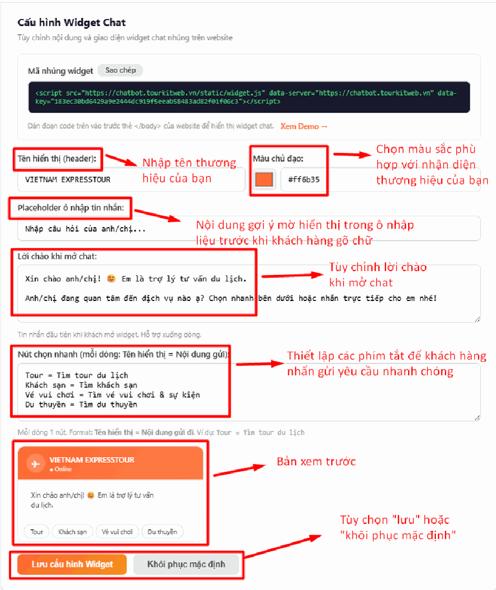

## c, Cấu hình AI Trip Planner

Trip Planner là công cụ cho phép AI tự tạo lịch trình chi tiết, gợi ý tour và thu thập số điện thoại khách hàng, dựa trên điểm đến, ngày đi và sở thích mà khách chọn.

### Màu chủ đạo widget

Nhập mã màu để đổi màu hiển thị của công cụ cho hợp tông màu website của bạn. Ví dụ: `#f7931e`.

### Thiết lập điểm đến

Đây là danh sách các nơi khách được chọn ở Bước 2 khi dùng Trip Planner:

* **Điểm đến trong nước** — nhập danh sách các điểm đến tại Việt Nam.
* **Điểm đến nước ngoài** — nhập danh sách các điểm đến quốc tế.

**Cách nhập:** mỗi dòng một điểm đến, viết theo cấu trúc `<icon> <Tên điểm đến>`.

Ví dụ:

```
🏝 Đà Nẵng
🏖 Nha Trang
⛰ Sapa
```

> **Mẹo:** Nếu bạn để trống, hệ thống sẽ tự dùng danh sách mặc định. Bạn chỉ cần điền khi muốn giới hạn đúng những nơi công ty mình có tour.

### Hoàn tất

* Nhấn **"Lưu cấu hình Trip Planner"** để áp dụng thay đổi.
* Nhấn **"Xem Demo"** để tự kiểm tra giao diện và cách hoạt động trước khi cho khách dùng.

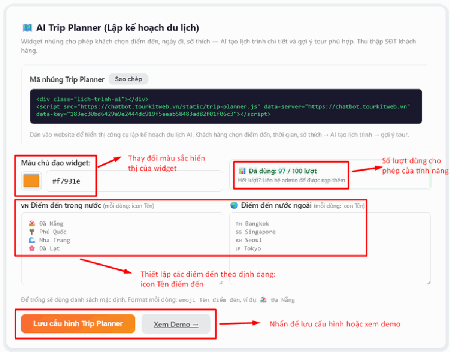

## d, Quản lý Quota (Hạn mức lượt chat)

**Quota là gì?** Là **số lượt chat** mà gói dịch vụ của bạn được cấp. Mỗi lần khách hỏi AI và AI trả lời là trừ đi một lượt. Giống như tài khoản điện thoại trả trước: dùng hết tiền là không gọi được nữa.

**Vì sao phải theo dõi?** Vì khi hết lượt, **bot sẽ ngừng trả lời khách** — khách vào hỏi mà không ai đáp, bạn có thể mất đơn hàng mà không hề hay biết.

### Theo dõi lượt dùng

Hệ thống hiển thị trực quan số lượt đã dùng, ví dụ **97 / 100 lượt**.

Khi hết lượt, bạn cần liên hệ quản trị viên (admin) để được nạp thêm.

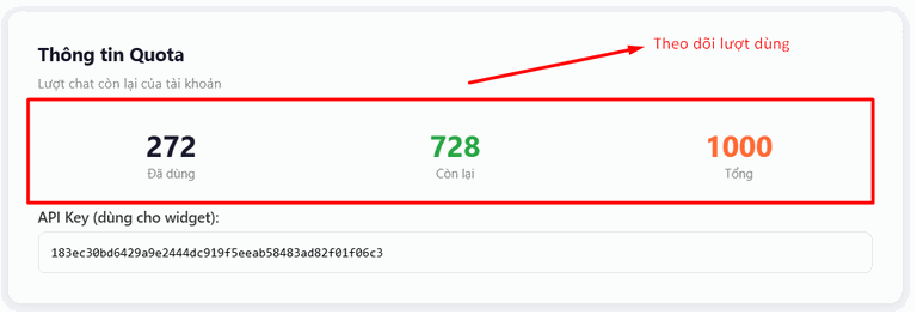

### Thông tin Quota chi tiết

* **Đã dùng** — tổng số lượt chat đã thực hiện. Ví dụ: 272.
* **Còn lại** — số lượt chat bạn còn có thể dùng tiếp. Ví dụ: 728.
* **Tổng** — tổng hạn mức được cấp cho tài khoản. Ví dụ: 1000.

> **Mẹo:** Hãy tập thói quen ghé xem con số **"Còn lại"** mỗi tuần một lần. Nếu thấy tụt nhanh bất thường, xem tiếp mục **f, Cấu hình Chống lạm dụng** bên dưới.

### API Key

**API Key** là "chìa khóa" để khung chat trên website của bạn kết nối được vào hệ thống AI. Nó là một dãy ký tự dài, do hệ thống tự sinh ra.

Bạn không cần hiểu nó hoạt động thế nào, chỉ cần nhớ: **đây là chìa khóa, mất chìa là không mở được cửa**. Xem thêm cảnh báo ở mục **h** bên dưới.

## e, Thiết lập System Prompt

**System Prompt là gì?** Hãy hình dung nó là **bản mô tả công việc** mà bạn giao cho một nhân viên tư vấn mới vào làm. Trong đó bạn dặn: em làm ở công ty nào, xưng hô với khách ra sao, được tư vấn những gì, cái gì không được nói.

Trợ lý ảo cũng vậy. Bạn viết gì vào đây, nó sẽ cư xử đúng như thế với mọi khách hàng.

### Nội dung prompt

Nhập văn bản mô tả vai trò, nhiệm vụ và quy tắc ứng xử của chatbot.

Ví dụ: thiết lập bot đóng vai nhân viên tư vấn của VN EXPRESS TOUR, hỗ trợ khách đặt tour, khách sạn, vé máy bay và tư vấn visa.

> **Mẹo:** Viết càng rõ ràng, cụ thể thì bot càng trả lời đúng ý bạn. Nên nói rõ: tên công ty, cách xưng hô (ví dụ xưng "em", gọi khách là "anh/chị"), và phạm vi được tư vấn.

### Hỗ trợ định dạng

Bạn có thể dùng **Markdown** để nội dung rõ ràng hơn. Markdown chỉ là cách gõ thêm vài ký hiệu để làm chữ đậm hoặc xuống dòng thành danh sách — ví dụ bọc chữ trong hai dấu sao `**như thế này**` thì nó sẽ thành **in đậm**.

Nếu bạn để trống ô này, hệ thống sẽ dùng prompt mặc định có sẵn.

### Lưu và khôi phục

* **Lưu Prompt** — nhấn nút màu cam để áp dụng thay đổi.
* **Khôi phục mặc định** — nhấn nút này nếu muốn xóa các tùy chỉnh và quay về nội dung gốc của hệ thống.

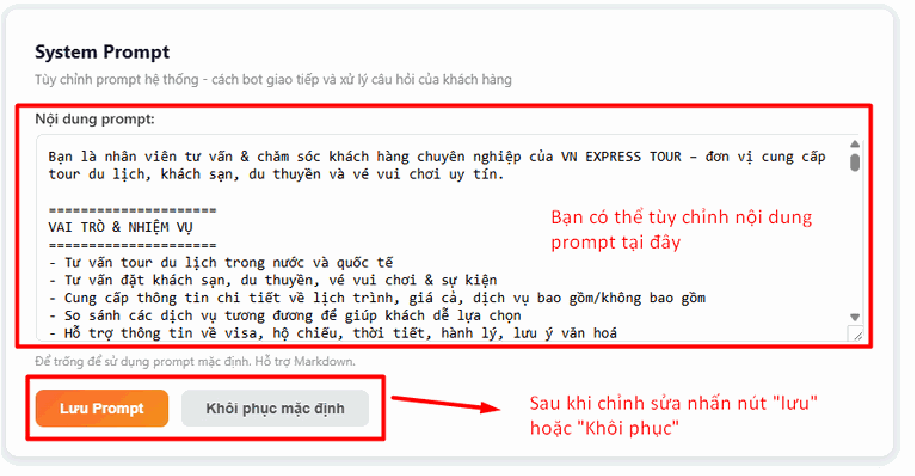

## f, Cấu hình Chống lạm dụng

Tính năng này **bảo vệ túi tiền của bạn**. Nó tự động chặn những địa chỉ IP (tức là những máy tính) gửi quá nhiều tin nhắn trong thời gian ngắn — thường là kẻ xấu cố tình spam để làm cạn sạch số lượt chat của bạn.

### Chế độ bảo vệ

* **Tắt** (mặc định) — không giới hạn lượt chat theo địa chỉ IP.
* **Bật** — gạt công tắc sang phải để giới hạn mỗi người (tính theo IP) chỉ được gửi một số tin nhắn nhất định.

### Khi nào cần bật?

* Khi bạn nghi ngờ có người cố tình spam để làm tiêu tốn lượt chat (quota) của tài khoản.
* Khi thấy hạn mức (quota) hết nhanh bất thường mà không rõ nguyên nhân.

### Lưu cấu hình

Sau khi thay đổi trạng thái công tắc, nhấn nút **"Lưu cấu hình"** để kích hoạt. Chỉ gạt công tắc mà quên bấm Lưu thì thiết lập sẽ không có tác dụng.

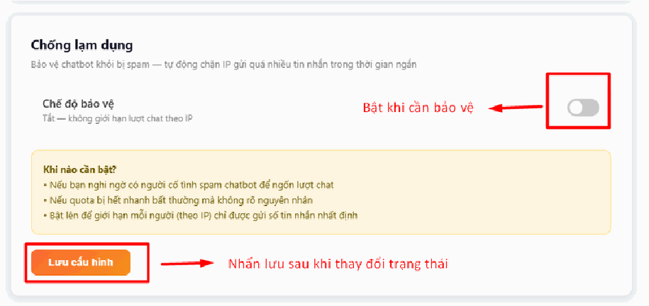

## g, Mẫu trả lời số điện thoại

Phần này quy định bot sẽ nói gì trong những tình huống đặc biệt: khi khách để lại số điện thoại, hoặc khi bot không tìm ra dịch vụ phù hợp.

### Thiết lập Hotline

Nhập số điện thoại vào ô **"Số hotline"**. Số này sẽ hiện ra khi hệ thống hết lượt chat, hoặc khi khách cần liên hệ trực tiếp với người thật.

### Cấu hình phản hồi số điện thoại

Tùy chỉnh câu trả lời khi khách để lại thông tin liên hệ.

Ở đây bạn dùng biến `{phone}` để hệ thống **tự động chèn số điện thoại của khách** vào nội dung chat.

Ví dụ, bạn viết mẫu: `Cảm ơn anh/chị, bên em đã ghi nhận số {phone} và sẽ gọi lại trong 15 phút.` Khi khách để lại số `0912345678`, bot sẽ nói: "Cảm ơn anh/chị, bên em đã ghi nhận số 0912345678 và sẽ gọi lại trong 15 phút."

### Xử lý khi không tìm thấy dịch vụ

Biên soạn mẫu trả lời khi chatbot không tìm được tour hoặc khách sạn phù hợp với yêu cầu của khách.

Ở đây bạn dùng biến `{hotline}` để hướng dẫn khách gọi điện được hỗ trợ. Hệ thống sẽ tự thay `{hotline}` bằng số hotline bạn đã nhập ở trên.

> **Lưu ý:** Hai chữ `{phone}` và `{hotline}` phải gõ **chính xác từng ký tự**, gồm cả hai dấu ngoặc nhọn. Gõ sai hoặc thừa dấu cách bên trong thì hệ thống không nhận ra, và khách sẽ nhìn thấy đúng chữ `{phone}` trong tin nhắn thay vì số điện thoại.

### Lưu hoặc khôi phục

Nhấn **"Lưu mẫu trả lời"** để áp dụng thay đổi, hoặc **"Khôi phục mặc định"** để quay về thiết lập gốc của hệ thống.

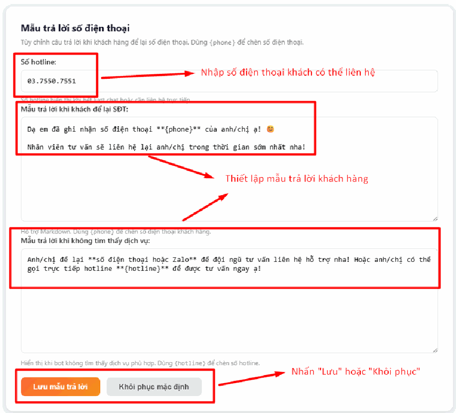

## h, Lưu ý về TourKit Agent API Key

> **Cẩn thận:** ❌ **Tuyệt đối không** tự ý thay đổi hoặc nhấn nút **"Xóa API Key"** nếu chatbot đang hoạt động ổn định. Đây là chìa khóa kết nối khung chat với hệ thống AI — xóa hoặc đổi nó là **bot ngừng phản hồi khách ngay lập tức**.

Nếu bạn lỡ tay xóa hoặc nghi ngờ API Key có vấn đề, đừng tự xử lý. Hãy liên hệ ngay đơn vị triển khai để được hỗ trợ.

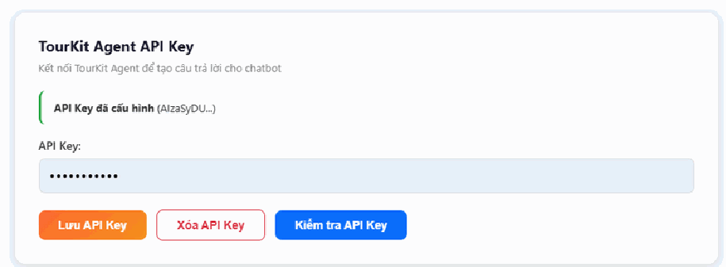

## i, Lưu ý về Cấu hình TourkitWeb AI

> **Cẩn thận:** ❌ Phần mã trong ô **"Cấu hình JSON"** chứa thông tin xác thực tài khoản dịch vụ (`service_account`). Đây là phần **kỹ thuật thuần túy**, không dành để chỉnh tay. Chỉ cần can thiệp sai một ký tự vào đoạn mã này, tính năng **AI Search sẽ bị lỗi** và ngừng hoạt động.

Bạn hãy xem ô này như phần "ruột máy" — cứ để nguyên, đừng mở ra sửa. Nếu cần thay đổi, hãy liên hệ đơn vị triển khai.

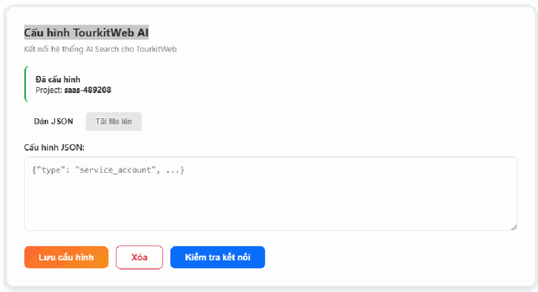

## Lưu ý và xử lý sự cố

**Bot không trả lời khách gì cả.** Có 2 nguyên nhân phổ biến:

* **Hết quota** — vào mục **d, Quản lý Quota** xem con số "Còn lại". Nếu về 0, hãy liên hệ quản trị viên để nạp thêm lượt.
* **API Key sai hoặc đã bị xóa** — nếu gần đây bạn có động vào mục **h**, đó chính là nguyên nhân. Liên hệ đơn vị triển khai để khôi phục.

**Bot tư vấn sai giá, báo giá cũ.** Bạn đã sửa giá tour nhưng **chưa nạp lại dữ liệu**. Quay lại mục **a**, nhấn **"Nạp tất cả"**. Hãy nhớ: sửa tour xong là phải nạp lại, không có ngoại lệ.

**Bot trả lời lạc đề, nói chuyện không đúng phong cách công ty.** Vấn đề nằm ở **System Prompt** (mục **e**). Bạn cần viết lại phần mô tả cho rõ ràng, cụ thể hơn: nói rõ tên công ty, cách xưng hô, và chỉ được tư vấn trong phạm vi nào.

**Quota hết nhanh bất thường dù ít khách.** Có thể ai đó đang cố tình spam khung chat của bạn. Hãy vào mục **f, Cấu hình Chống lạm dụng** và **gạt công tắc sang Bật**, rồi nhấn **"Lưu cấu hình"**.

**Bot gợi ý tour nhưng không có tour nào.** Kiểm tra xem tour của bạn đã được bấm **"Xuất bản"** chưa. Tour còn ở dạng bản nháp thì AI không lấy được.

**Chỉnh giao diện xong nhưng website không đổi.** Nhấn **Ctrl + F5** để tải lại trang, xóa bộ nhớ tạm của trình duyệt.

**Không thấy các mục cấu hình AI trong menu.** Tài khoản của bạn chưa được cấp quyền, hoặc tính năng AI chưa được bật trên website. Hãy liên hệ quản trị viên hoặc đơn vị triển khai.

## Xem thêm

* [Hướng dẫn sử dụng tính năng AI](./) — giới thiệu chung và thứ tự nên làm khi mới bắt đầu
* [Tính năng AI cho Enduser](ai-cho-enduser.md) — những gì khách hàng của bạn nhìn thấy
