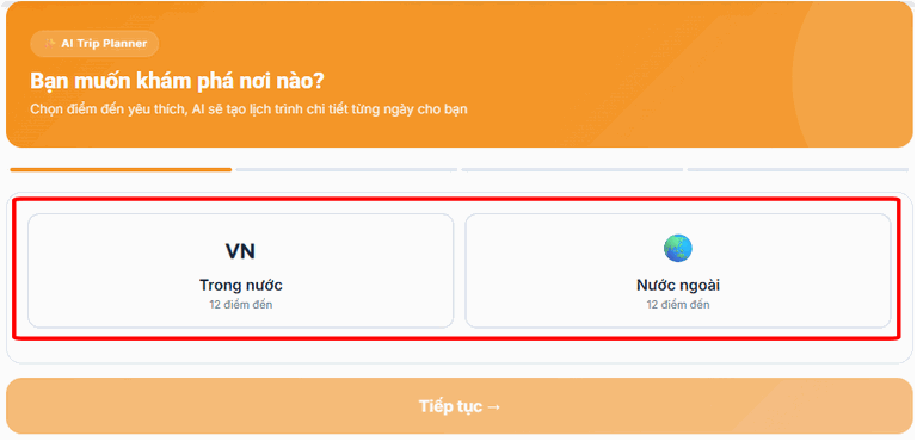
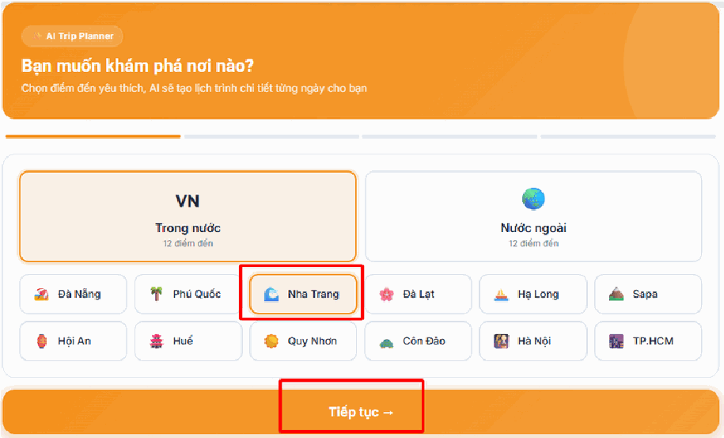
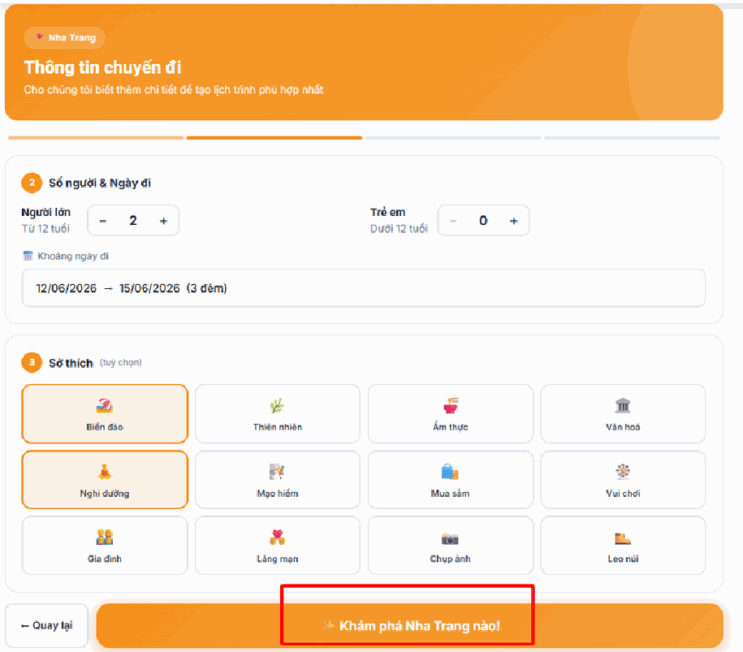
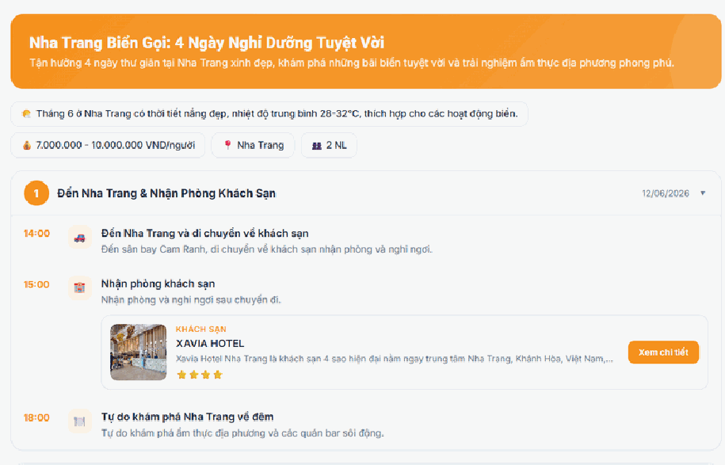
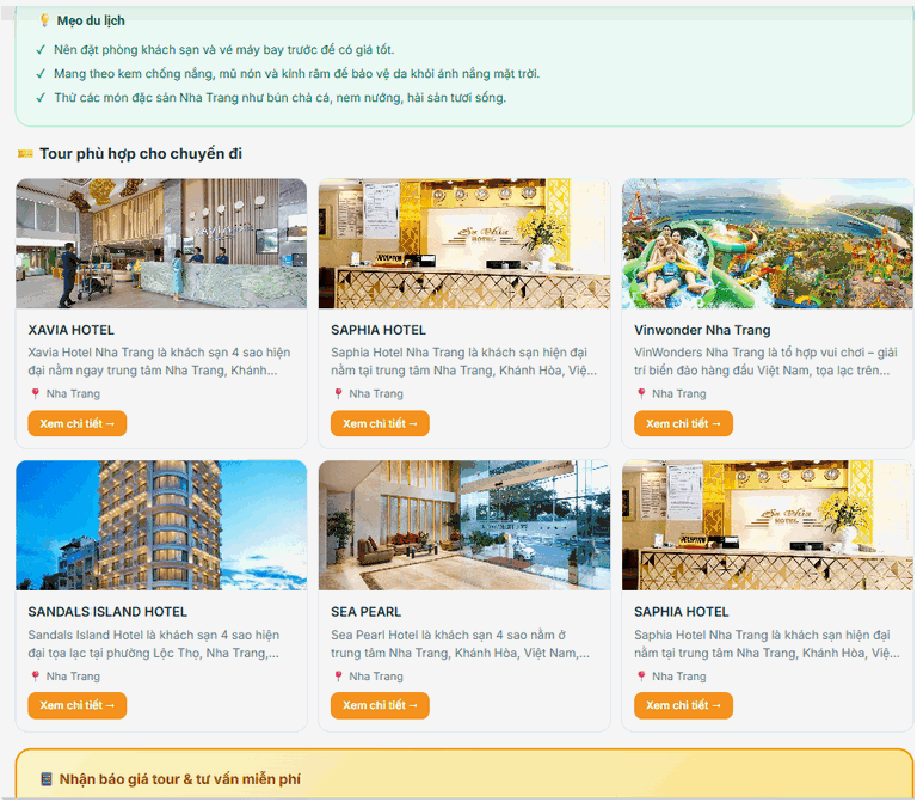
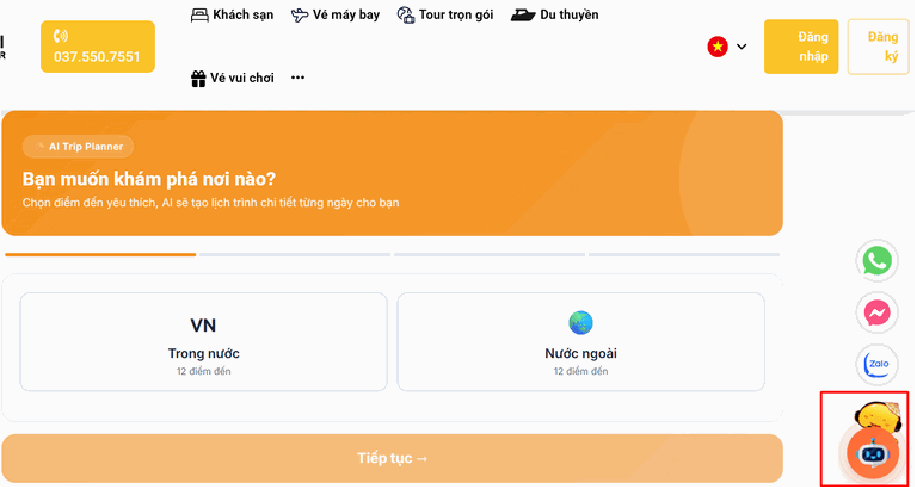
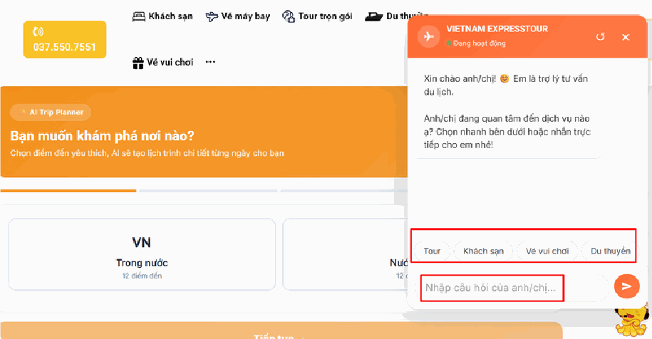
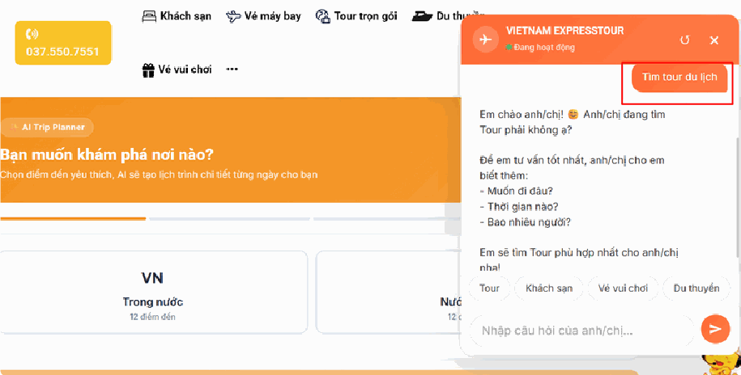

# Tính năng AI cho Enduser

*📺 Video hướng dẫn: TourkitWeb | Hướng dẫn sử dụng tính năng AI cho End*

## Trip Planner AI

## Bước 1: Chọn khu vực khám phá

Tại giao diện bắt đầu, bạn hãy chọn khu vực mình muốn đến:

- Trong nước (VN): Khám phá những danh thắng tuyệt đẹp của Việt Nam.

- Nước ngoài: Trải nghiệm những vùng đất mới lạ trên thế giới.

## Bước 2: Lựa chọn điểm đến cụ thể

Hệ thống sẽ hiển thị danh sách các thành phố/địa danh nổi tiếng. Bạn chỉ cần click chọn điểm đến yêu thích của mình (Ví dụ: Nha Trang, Đà Nẵng, Phú Quốc, Sapa, Nhật bản, Hàn Quốc...).

## Bước 3: Thiết lập nhu cầu cá nhân

Để AI hiểu rõ mong muốn của bạn nhất, hãy điền các thông tin sau:

- Số lượng thành viên: Chọn số lượng người lớn (từ 12 tuổi) và trẻ em đi cùng.

- Thời gian: Chọn ngày khởi hành và ngày kết thúc chuyến đi.

- Sở thích (Tùy chọn): Bạn có thể chọn các phong cách du lịch như: Biển đảo, Nghỉ dưỡng, Ẩm thực, Mạo hiểm, Văn hóa...

sau đó nhấn chọn "khám phá ngay"

## Bước 4: Nhận lịch trình tối ưu & Khám phá

Sau khi nhấn "Khám phá ngay", hệ thống AI sẽ tự động tính toán và truy xuất từ kho dữ liệu tour khổng lồ để mang đến cho bạn:

- Lịch trình chi tiết theo từng ngày: Thời gian cụ thể cho từng hoạt động tham quan, ăn uống.

- Gợi ý lưu trú & dịch vụ: Đề xuất các khách sạn (như Xavia Hotel, Saphia Hotel...) và các điểm vui chơi phù hợp nhất.

- Mẹo du lịch hữu ích: Thông tin về thời tiết, trang phục và những món đặc sản không nên bỏ lỡ.

## Chat Bot AI

## Bước 1: Kết nối với Trợ lý ảo

Tại giao diện trang chủ, bạn nhấn vào biểu tượng Chatbot nằm ở góc dưới cùng bên phải màn hình. Trợ lý ảo sẽ ngay lập tức xuất hiện để chào đón bạn.

## Bước 2: Lựa chọn dịch vụ hoặc Đặt câu hỏi

Sau khi cửa sổ chat mở ra, bạn có hai cách để bắt đầu:

- Chọn nhanh dịch vụ: Nhấn vào các nút gợi ý sẵn có như Tour, Khách sạn, Vé vui chơi, Du thuyền.

- Hỏi đáp trực tiếp: Nhập yêu cầu cụ thể của bạn vào khung "Nhập câu hỏi của anh/chị..." để được hỗ trợ riêng biệt.

## Bước 3: Cung cấp thông tin theo gợi ý

Khi bạn chọn một dịch vụ cụ thể (ví dụ: chọn "Tour"), AI sẽ đóng vai trò người tư vấn chuyên nghiệp bằng cách đưa ra các câu hỏi để hiểu rõ nhu cầu của bạn:

- Bạn muốn đi đâu?

- Thời gian dự kiến khi nào?

- Đoàn đi bao nhiêu người?

- **Lưu ý:** Bạn chỉ cần nhập câu trả lời ngay tại khung chat.

## Bước 4: Nhận lịch trình và đề xuất tối ưu

Dựa trên những thông tin bạn vừa cung cấp, AI sẽ tự động sàng lọc và gửi đến bạn các gợi ý lịch trình phù hợp nhất từ hệ thống dữ liệu. Bạn có thể xem chi tiết, so sánh và đưa ra quyết định đặt dịch vụ ngay lập tức.
